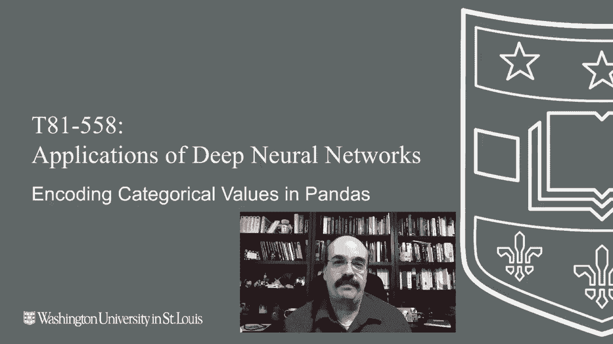
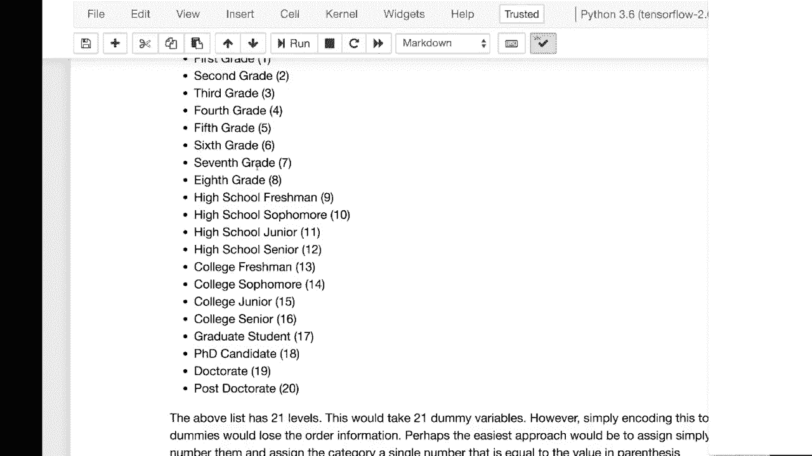

# 【双语字幕+资料下载】T81-558 ｜ 深度神经网络应用-全案例实操系列(2021最新·完整版) - P13：L2.2- 使用Pandas为 Keras 编码类别型数据 - ShowMeAI - BV15f4y1w7b8

嗨，我是杰夫·伊顿。欢迎来到华盛顿大学的深度神经网络应用课程。在这段视频中，我们将看看如何处理分类值。分类值是指文本型而非数值型的内容。这些需要特别处理才能输入到神经网络中。

有许多经典的方法来处理这些，比如虚拟变量。然而，我们将查看一些不同的方法来实际编码这种类型的值，以便用于神经网络。有关我的AI课程和项目的最新信息，请点击订阅及旁边的铃铛，以便在每个新视频发布时收到通知。分类值和连续值是你会频繁遇到的两种数据类型，尤其在表格数据集中。

我们实际上可以将你会遇到的数据类型分为四类：名义型、序数型、区间型和比率型。字符数据。所以字符串你可以看作是名义型或序数型。名义型只是纯粹的分类值，比如红色、绿色、蓝色、橙色、靛蓝。

像颜色这样的东西。现在，颜色，你可能会将其编码为RGB值或其他值，而不是虚拟变量。但通常情况下，名义值只是没有特定顺序的东西。你应该尽量想出一个排序，如果可以的话。

然后，这使得名义值变成了序数型。序数型也是你数据集中的文本数据，但它们是可以排序的。现在你可能偶尔会有一些没有界限的文本，比如备注列或产品名称。这些既不是名义型也不是序数型，我想它们会是名义型，但你会有太多虚拟变量。因此，当我们处理自然语言处理时，会看到其他处理自由文本的方法。

还有区间型和比率型。这两种类型在处理上很少有所不同。但区间型基本上是没有定义起点的数值，你可以想象成温度。在我下面的例子中，你不会说昨天的温度是今天的两倍，因为其实没有，除非是开尔文。

对于数值数据而言，温度的最低值并没有明确的起点。华氏度最初假设零是绝对零度，而这显然是错误的，但这本可以是一个很好的比率的例子。所以比率是一个有明确起点的数值。

你可以说一辆车的速度是另一辆车的两倍，因为是以英里每小时来计。车速，最低可以是0。因此它有一个明确的起始点。我是说，从技术上讲，负10可以倒退10英里每小时，但我们不考虑这个例子。所以首先我们来看如何对连续值进行编码。

对于连续值，有时你需要对它们进行标准化。现在，为什么你可能需要标准化值呢？想象一下，你在校园里遇到一个朋友，他们说：“哦，我昨天参加了这场考试，得了60分。”那么，这个分数是好是坏？完全没有标准化。他们告诉你他们得了多少分。

整个考试可用的分数有多少。如果总分是100，那么60分并不算好；如果那场考试只有60分，那么60分就是满分。Z分数让你可以这样做。因此，Z分数对数据进行标准化，Z分数为0意味着你恰好在均值，-1的Z分数意味着你低于均值一个标准差。同样，+1的Z分数意味着你高于均值一个标准差。这就像将某种东西以百分比的形式表达，但它让你知道是否包含了标准差，使其在标准化时更具适用性。现在让我们看看如何在每加仑英里数据库中进行标准化。

低于平均每加仑英里数的偏差。这让你很快知道哪些高于和低于均值。这样做的另一个好处是，当我们想要屏蔽数据，使其变得困难以保护隐私时，你仍然可以在其上构建模型，Z分数可以很好地实现这一点，比如人的年龄，如果你把年龄转化为Z分数。

看你数据的人可能不会猜到这实际上是某人的年龄，因为他们会看到类似的值，如每加仑英里数。然而，如果你看到的值在18到21和85之间，你可能会猜测这是某人的年龄，隐匿私人信息（例如年龄）是有用的。因此，Z分数在某些情况下被用于此。但好的一点是，如果我们将这些列的每一个都转化为Z分数，它们在某种程度上会变得不那么可读，因为你看不到这些实际的权重。

类似的事情，但你会很快发现哪些值高于或低于均值。此外，这些值往往会在零附近均匀分布，这在某些情况下会帮助神经网络预测功率。同时，你会发现所有这些值的范围相似，因此汽车的重量可能会大大超过气缸的数量，这个数字要小得多，所以使用Z分数对连续值进行编码有一些优势。现在来看看分类值。

你经常会听到的经典方法是虚拟变量，如果我们加载之前看到的示例数据集。这个数据集包含工作代码、区域和收入，用于预测一个人将要购买的几种产品。如果我们查看这个数据集，可以创建虚拟变量，之前在课程中也见过，我们基本上可以查看区域的数量，总共有四个，可以创建虚拟变量。

对于虚拟变量，这实际上是为这些变量展示查找表。所以对于第一个区域，如果它是一个虚拟变量，第一个虚拟变量将为真，其余为假。同样地，对于第二个，以此类推。如果我们想使用这种查找表对数据进行编码，就这样做。

这些是创建的虚拟变量。因此前几行可能全是值C。然后我们有一个值D。我们可以通过运行这些数据看到，所有这些第一行的值都是C。同样，C填充了D，区域也为C。现在我们已将虚拟变量实际添加到其中。

我们的**最终目标**是将数据完全转化为数字格式。因此，我们需要从中去掉区域一。我们这样做后，可以看到区域已被移除。这是我们将数据转化为可以呈现给神经网络的一步。我们仍然需要对工作类别进行类似的编码。

对于虚拟变量，还有其他编码方式。除了虚拟变量，还有其他分类方法。你可以使用称为目标编码的方式。目标编码是一种更高级的技术，常用于Kaggle竞赛。因此，它可能非常强大，但也可能非常危险，因为你很容易导致过拟合。

容易导致过拟合，因此要非常小心。你应该始终使用某种留出法或交叉验证技术，以确保结果的准确率不是人为提高的，因为你可能会过拟合。让我们快速创建一个示例数据集。我们查看这个数据集，有一个连续值，我们实际上不会使用，然后是两个类别变量。

类别变量0和类别变量1，然后是目标变量y，我们试图预测的变量。我们可以为狗、猫、狼和虎创建虚拟变量。再次提醒，每个类别都有两个类。因此，猫1是虎和狼，猫0是狗和猫。如果我们在这里运行这一行，将按猫0进行分组。

在y上查看均值。所以它会告诉你狗和猫的目标y的平均值是多少。我们运行这个，猫是0.2，狗是0.8。当你评估这些目标编码时，这是你希望看到的情况。幸运的是，这两个是可以区分的。这告诉你一些事情。这一输出，猫或狗非常具有预测性，如果这个值更接近两个目标之间的中点。

所以目标是0和1，如果这个值更接近0.5，目标编码可能不会对这个特定类别有帮助。类似地，狗是0.8。所以这些目标的总和应该等于目标值。因此，基本上你可以认为目标编码做的就是非常简单的总和。

我们将猫保持为cat 0作为一个单列。我们不会像用虚拟变量那样拆分成两列。我们基本上会给所有的猫赋值0.2，给所有的狗赋值0.8。我们现在已经将其转化为一个数字，这个数字将有助于预测y。

这违反了数据科学的绝对基本规则。你现在在实际训练之前就使用了目标进行预测。这是潜在的危险，所以在使用这个技术时要非常小心，我会向你展示如何降低这种风险，而这种风险的出现是在你有非常小数量的一个类别时。我们只有一只老虎，而老虎的值是零。所以老虎的平均值将是零。

所以在任何地方我们用零替换老虎时，这一行将绝对正确。仅仅基于这一列，所以它与目标的相关性将达到100%。当你有低基数或特定类别的数量很少时，这种情况就更加危险。我们处理这个问题的方法是统计每个类别的数量，并指定一个权重，表明在这些低案例中我们将有多大程度上趋向于y的整体平均值。

我们计算y的整体平均值，这可以在这里计算出0.5。因此每个类别的数量正好是一半。对于像ti这样的情况，我们会更倾向于0.5而不是0。所以你有这两个因素作为这一部分。你有Wolffer的ti的平均值，但你也有y的整体平均值。

所以我们计算一个平滑的均值，尝试将其平滑化，平滑因子在这里传递。你将传递两个需要修改的数据框。之所以有两个数据框，是因为你可能会有一个训练集和一个测试集。你甚至可能需要更多。你可以修改这个函数。

这是我从Max Halford复制的原始函数所做的更改，我在这里提供了他的原始链接。我修复了一些问题，并进行了修改。你需要传入将要修改的分类变量的名称、目标的名称以及权重，如果权重为零。

然后，过拟合的风险将会显著增加，因为它更接近于每个单独类别的平均值。如果没有第二个数据框DF2，可以传入空值。

所以在设置权重时，重要的是要记住，传入的权重值越强，值较少的类别会更倾向于y的整体平均值，这意味着过拟合的机会更小。较弱的权重则有更大的过拟合潜力。现在，将分类值编码为序数是一种非常强大的技术。

没有真正的过拟合机会。假设你有所有这些教育水平，从幼儿园到博士后。你可以为这些创建虚拟变量，但你实际上是在失去一些信息，因为这些是有序的。你不会在博士后之前上五年级，因此可以为每个级别分配一个0到20的数字，并用该数字代替虚拟变量，这样你就只会有一个值而不是21个。

另外，你可能还想改变权重，因为例如研究生的情况。你可能在研究生阶段的时间比在六年级的时间更长，一年与谁知道多少年的研究生经历。感谢观看这段关于分类值的视频。

在下一个视频中，我们将学习如何使用pandas进行其他预处理，如数据集的分组、排序和打乱。该内容经常变化，因此请订阅频道，以便及时了解本课程及其他人工智能主题。
