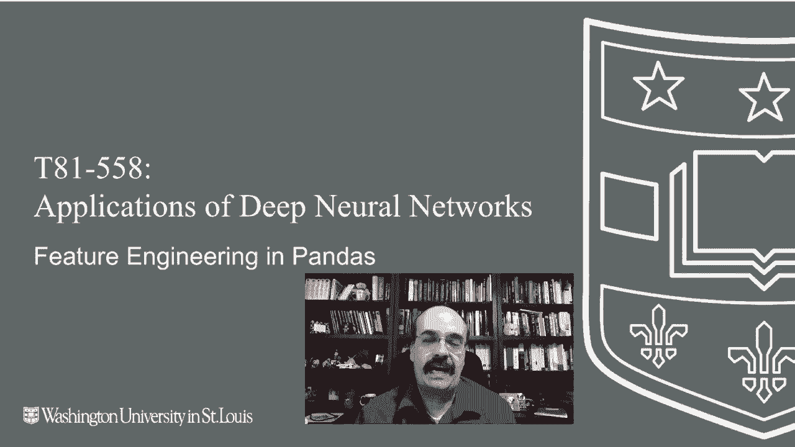
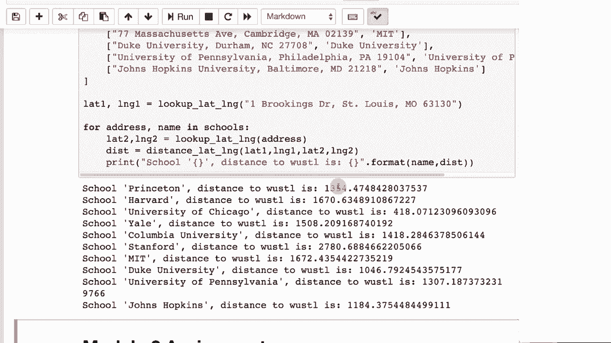

# 【双语字幕+资料下载】T81-558 ｜ 深度神经网络应用-全案例实操系列(2021最新·完整版) - P16：L2.5- 使用Pandas进行Keras深度学习的特征工程 - ShowMeAI - BV15f4y1w7b8

Hi， this is Jeff Hean。 Wele to applications of Deep neural networks with Washington University。 In this video， we're going to talk about how to do feature engineering with pandas in Python。 This allows you to prepare the data set， especially when you have tabular data。 Now。 this is not dealing with feature engineering for images， audio or natural language processing。

 But how to get column type data in a format that the neural network might be more predictive。 There's many different ways that you can do feature engineering。 and this is often cited as one of the top ways to get highly accurate models and competitions such as Cale for the latest on my AI course and projects。 click subscribe in the bell next to it to be notified of every new video。 Now。

 we're gonna to look at some more advanced feature engineering and other ways that you can engineer features using pandas。 You can do calculated fields。 We've seen a little bit of this before but say you wanted to have the weight and kilograms or just some other calculation based on one of these。

😊。

You can run this for the autompG and now you have the weight in kilograms。 this would probably not be too useful of an engineered feature because it would be extremely highly correlated to the weight。In pounds like the data set originally had。 but nonetheless you could。 you could engineer something like that， Usually you'd want something where you're dividing weight by something else or in some way normalizing。

A very common way for feature engineering and I do this a lot in my day job。 but it's something called augmentation， so we're going to take additional data that we might get from an API externally。 and we're going to augment our data with that because that additional data will likely give us additional predictive power in our neural network。Now usually you have to pay for this additional data。

 sometimes you can find it for free Google API Keys has all sorts of such data and I am going to use this data to deal with addresses。 so I'm going to give you an example here of how I might augment a data set for addresses。Now to do this， you're going to need a Google key。And the last time I put one of these in here。 I got several requests of can you give me your Google key， you're basically asking。

 can you give me a conduit into your credit card that I can charge and sadly the answer is no。But I am going to。Put my Google key in here。Burrrring it out， obviously。And run that。And now we have my Google key in there， I'm going to remove it。Just so that I don't accidentally save it。With it in there。By the way， that's a catastrophe。

 you check something into GitHub with a API key for something like AWS。 Bitcoin miners and other unscrupulous people， not that all Bitcoin miners are unscrupulous。Well basically find your credentials and you'll have like a $20，000 bill within a day， so that's bad。Don't do that。 Don't ever check private keys into GitHub。 It's done all the time， though。

So what we're going to do is deal with addresses you might have an address like one Brookings Drive。 St。 Louis Missouri Oh by the way， if you want to get your own Google key to do this。 go to Google API keys and get one for something called Gecode。So here what we're going to do is I'm going to put in the address of Washington University on Brookings Drive。

 and I am going to ping Google， putting my key into there。Get my response back and then parse it out。 and I will actually be able to get the location。In latitude and longitude of Washington University。Latitude， this longitude that， so that's pretty cool。I now can get a latitude and longitude。 now you could use those as features。It's going to show you how east and west versus how north and south something is I've built data sets where I've used those two as features and they're quite useful。

In the insurance industry where I work， we're always interested in unhealthy habits like smoking。 so we very often will build models that will tell us the probability of somebody smoking。Latitude and longitude， are they predictive of smoking well here's the CDC's chart of the United States and which states smoke a lot versus don't。 so yes， locations very predictive of if you smoke or not。You'll want other features in that model。

 but you can see location means a lot what we're going to do is use that latitude and longitude to calculate distances between cities。This might let you calculate how far somebody is from say a metropolitan center or something such as this this is a formula in triometry that calculates the great circle distance between any two points on a sphere I'm not going to go into why that works or how that works。

But this basically then gives you a calculation of the distance between between two latitudes and longitudes。So I'll go ahead and run this。And it tells me the distance between say St Louis。 Missouri and Fort Lauderdale， Florida。Is 1684 kilometers， if youd prefer that in impmperial。 then you can convert to miles。But you might want to look at the distance between， say。

 a person's address and major metropolitan area， the distance between one company and a nearby competitor。 a distribution center， retail outlet。This code calculates how far Washington University is from a bunch of other universities。In the United States。This would work internationally as well。Google Gecode does that。And this is how far away we are to other universities， I just pick these guys at random。

So this is yet another way that you can make use of something that's very， I mean think about it。 how would you normalize and address to put it into the feature vector that would be very difficult。This gives you a way that you might be able to do that。

Thank you for watching this video。 The first two modules of this course。 which you have now concluded watching， all cover some of the Python preliminaries。 and the next video will start to actually get into Tensorflowlow and Kes。 This content changes often。 so subscribe to the channel to stay up to date on this course and other topics and artificial intelligence。

😊。