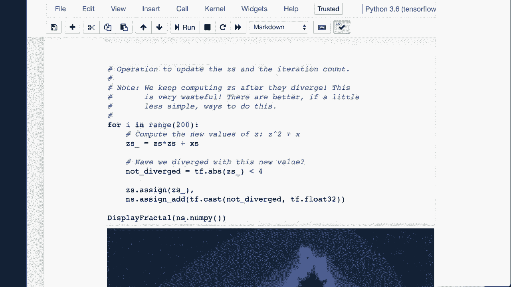
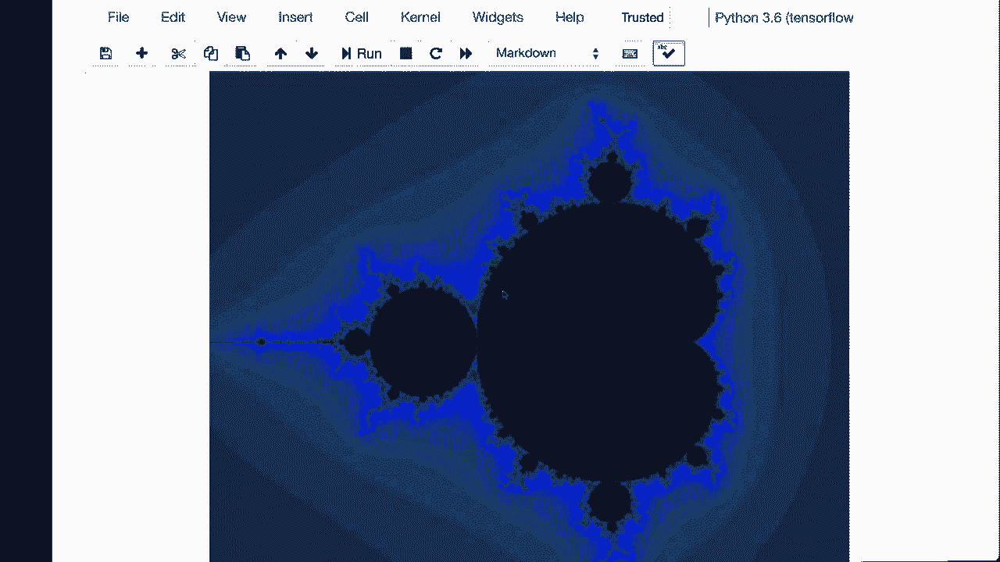

# 【双语字幕+资料下载】T81-558 ｜ 深度神经网络应用-全案例实操系列(2021最新·完整版) - P18：L3.2- 深度学习工具库Tensorflow和Keras 简介 - ShowMeAI - BV15f4y1w7b8

Hi， this is Jeff Heaton， Welcome to applications of Deep neural Network with Washington University In this video。 we're going to have an introduction to Tensorflowlow and Kes。 and we're going to see how Tensorflowlow can be used directly to perform mathematical calculations and Alkis becomes the neural network layer on top of the low levelvel Tensorflowlow compute engine for the latest on my AI course and projects。 click subscribe in the bell next to it to be notified of every new video TensorFlow and Kes。😊。

So TensorFlow is the low level mathematical library that gives you access to CPU， GPU and grid。 computing capabilities， and CAs is the high level abstraction that lets you think of these mathematical constructs as neural networks。I give you some links here that point to the various locations that are useful for dealing with Tensor Flow and Kas。One of the first things that you need to deal with is there's a lot of different versions of Tensorflow。

 and Google is very good or bad， as the case may be at breaking changes。 There's a lot of very smart people working on Tensorflow who are very opinionated about how the API should be。And as different factions of them win and lose their respective battles。 breaking changes happen to the API。 A breaking change means that a new version will basically cause previous code written for previous versions to not work。

 They change the names of things。 They change the capitalizations of things。Lots of lots of little。 sometimes just little annoying things， sometimes big structural changes。So it's important that you're running the version of Ten flow that is specified for this class。This video was recorded with TensorFlow 2。0。Which was in its dev stages as this video was recorded。

 but as long as you have a version that is 20 or later， I will be updating the course。Videos for the different parts， if something gets broken as a result of newer tensorflow。 So you can simply run this and it will show you the version that you， that you have。Now installing TensorFlow。I have an entire video just on how to install Tensorflow on Windows and another video for Mac。

 Those deal with installing Tensorflow with CPU to get really good performance。 you need to use your GPU and your GPU needs to be the right kind of GPU。 Some of the assignments and examples that will run in class will require a G run on a CPU。 but it's going to be slow。And installing a GPU is is not the easiest thing in the world。

 I'll probably do a video on that。 I mostly personally run。GPU deep learning in the cloud。 where I don't have to install all the hardware and drivers and and other things。 but it can certainly be done。What I recommend for this class。 especially on the assignments and parts of this class， that require a GPU is Google Coab。

 Google Collabab is cloud based， You don't have to install Python or anything。 It comes completely ready to go。 I have a video that is linked on the first module on how to use Google Coab with this class。 and we probably talked about it in the first class meeting。So this is。 this is probably the recommended way to actually run all of the examples and to complete your assignments is Google Coab。

 It's a powerful instance。 It is a dual core with。I believe 12 gig of Ram and a GPU。 you can't beat it。 So that's that's my recommended route for， for working on this class。 And why did I choose Tensorflowlow for this class， Well。 Tensorflowlow is supported by Google has excellent support in Google Google Cloud。

It has great CPU and GPU support， and it's in Python。 Python is very quickly becoming sort of the the high level language for machine learning and AI。 So you're well served in learning Python and learning。Learning deep learning through Ks and and through Python。 Now， you can use Tensorflow directly。

 And if you're writing very custom sort of machine learning models， that might be the way to go。 But by and large， the way to the way to access this is through Ks。 It makes it makes the deep learning quite a bit easier to。To set up and there's really not much of a downside unless you truly do need complete control over the computation of the underlying neural networks。

 and then you would need Tensorflow。And there's other deep learning tools。 I have a number of them listed here。If you're particularly the end of Java。 deep learning for J is definitely one to look at as is H2O。Tensorflow is。At least in previous versions， it was very graph oriented so that it would compute later。🤢。

A big thing about Tensorflow 2。0 is eager execution。 Now， they made a lot of changes。 So this is very much。 if you haven't worked with Tensorflow before， don't worry。 it's completely changed anyway。 So this。This will get you ready for the latest version。And this is just showing tensor board， which helps you visualize the neural networks that you that you create。

 We're going to look at how to use Tensorflow directly。 and we're only going to go through that in in this in this video。 the rest of the videos will be completely in Kira。 So what this is going to do is do something called a mandlebro plot。 you can see it here。

 If you've ever worked with Mandlebrots before you definitely recognize that that very classic looking plot that you have there。 Essential， this is a set of equations， very simple equations that give a。

You can keep zooming in on regions of this， and it's almost infinite in the complexity of the very cool sort of landscapes that you could zoom into。

Here I've written the code to basically do a mandlebro plot。 Now you can sees it's very simple。 that's the code to produce the manelbro。 And the the functions。 the display fractal that's actually used after it's completely rendered what we're doing actually in Tensorflow is we're defining。Essentially。It's like it's a complex number， it's a complex plane and you plot out the Mandlebrot across the entire plane and this。

 I'm not going to go into the actual math in the Mandlebrot， but there's plenty of tutorials on that。

And we're essentially sweeping across this entire， this entire plane。 We're doing 200 iterations of it。 So this gets drawn 200 times each time it gets drawn a little bit better。 And it's very much an iterative iterative process。 So each time through this。 It's being sent off to tensorflow for processing。 It could use the G P or if you wanted to。

 It's so fast that you really， you really don't need the。You don't need the actual GP for this。 The CPU alone can do it。 And this is essentially the equation here that is that has been calculated to actually plot the the mandlebrot as it goes through。

And if you run this， you can see that it actually goes。Very quickly。 Now to see a little more exactly what's going on， this is also using Tensorflow directly。 I'm creating two matrices here。So these are actually vectors。A yeah。 I guess youd call this a row matrix， this is a column matrix。Because this goes straight across。

 this is two values that are on top of each other， and we're going to do a matrix multiply of matrix 1 by matrix 2。 and we print it out。And as you can see， the results here。It does the matrix multiply and results in 12。Now I convert it to a float so that you don't see all the tensor。Decorations around it。These were two constants， so that was constant times constant。

And you can tell this is all very linear algebra oriented。 Now we're doing two variables and we're going to subtract well we're subtracting a variable from a constant。And we do that， and we can basically see that we get the negative 2， negative 1 row。Matrix。We can now reassign X because x is a variable so we reassign it and we're able to basically recalculate that calculation from up there and get a different value。

 so this this is the building blocks upon which the neural networks are built in TensorF Now Kis lets us start to think about the layers of the neural networks like we had before。So we're going to use a classic data set， the miles per gallon data set。This lets us。

That data set gives us statistics or calculations on various cars and the miles per gallon。 so the idea is to build a model that uses cylinder count and displacement and other stats on cars to actually come up with the miles per gallon to produce a model that does that。

So here we are going to basically read in。The auto miles per gallon。We're going to keep the names of the cars， the cars themselves。 the names of the cars aren't predictive。 they're just the car names。Horse power。 we do have some missing value。 so we're going to fill in the media。

 and just we' we've seen this before， so I'm going through this pretty， pretty quickly。And then we create our x and R Y x is the predictors。 so we're predicting on cylinders displayplacement in horsepower， weight， acceleration。 year and origin， what country is produced in。And we're calculating this on。

Or we're trying to predict the miles per gallon， so this is your x。 which is your values used to predict and y is what you're actually predicting。And then this is what。Kas actually looks like we create a sequentialial， so that's just layers that go in sequence。We create our first dense layer， a dense layer， simply a layer where every neuron in the first layer is connected to the next layer。

 Ands that's very common。 That's usually how layers actually work。 especially for tabular data like we have now。 This will be different when we get into images。The input dimensions are going to be the x shape 1。 So that is the number of columns that we have。 because X is the input value。 Sha 0 would be how many rows。 Shape 1 is how many columns。

 Activ is the rectified linear unit， and we have 25 neurons。 We have 10 in the next hidden layer。 We don't have to tell it how many inputs we have as its。 it's basically the 25 from the previous layer。 and also， activation is re。Output is just one for a regression neural network， the output is always one。

It's also important that for a regression neural network that you always have the mean squared error as your as your loss optimizer willll usually use atom in this class。 there's other ones you can use that we'll see。Soon。And then we fit it。 We're going to fit it for 100 epochs。Epoex is just how long the neural network trains for。 That may or may not be enough。 We'll later see how we can determine how many epochs is actually enough。

 Verbose means to print out data as we go。 And if we run this。 we can see you see the loss shrinks as it continues。 So it gets better and better and more effective as it goes。 This is what the verbose value up there says to do。 So this lets you。That that lets you control how much data is being dumped to the screen on you。 Now。 it's not doing particularly good here this is。The hundred is probably not enough for it。 We'll later see that we get more advanced， and this actually gets quite a bit。Better predictions。And we calculate our root mean square error。24， believe me。

 is not particularly good on miles per gallon because that's the range。So you can。 in cases like that， this is not that uncommon。 You can retrain it。 It might give you a better result。 Yeah， that's that's a much better result。 So it just took a retrain in that case。 But we'll see later how we can control automatically the number of epochs that's needed。

 And you can see here this should drop。 Yeah， that's much better。 That' that's about as good as it gets。 You'll see it sometimes get as low as3。 And then we can print out the various cars and therere miles per gallon or predicted miles per gallon。And yeah， you can see now there much。Much closer。You can also do classification。

 we'll use the classic IIS data set for that， that's where you have four measurements that give you any of three different types of iris flour。You're using sepple length， Sppple width， pedal length and pedal width。This is what a curas classification neural network looks like。 It's very similar。 You have the inputs。 That would be four inputs。 You have the。Hidden one or more hidden layers。

 however， with a classification， especially a multi class classification。 which means you have more than two classes。 you'll do softm and categorical cross entropy。If this was a binary classification， which we'll see。In the next module。That would。 that would be a little different。 You would have a binary。ALo function here。

But we'll see that when we get to that。Training this one， it trains and decreases the loss。You can also print out the species， Those are the types of iris that we're trying to classify。 And this is what the output from it looks like。 It's in scientific notation。 which makes that a little bit difficult to read。 You can tell it not to use。

You can suppress the scientific notation， but essentially。These three values are the three irisees in whichever ones the biggest， which is this one。 It was classified to be that first iris， which was Satosa。 You can also suppress the scientific notation， And then you see the values that are one。

 or at least very close to one。That means it's all that first class。 Now the Iis file is sorted by by the individual irises， so that's why at the top of the file。 they're all the same and you can also turn these predictions into just numeric value so0 means the first Iis1 is the second and two is is the third。 So that's if you just want literally a number that tells you which of the classes was actually predicted。

You can also print out using this array notation， you can print out the actual textual name of the irisees the classes that were chosen。 and you can see the accuracy is 98%， so it's it's very。Very good。You can also feed in just ad hoc values and have a prediction。 so this is how you'd feed in one value and it predicts Iis Vi Jenica for these measurements。

And you can feed a bunch of them at once。 This is how you'd feed too。Thank you for watching this video。 In the next video。 we're going to see how to load and save Kira's neural networks。 This content changes often。 so subscribe to the channel to stay up to date on this course and other topics in artificial intelligence。

😊。