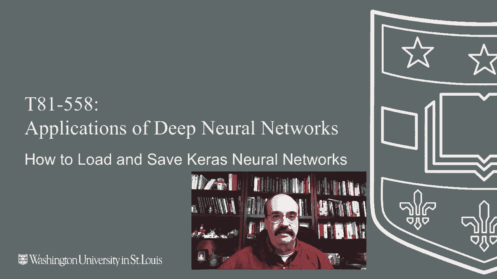
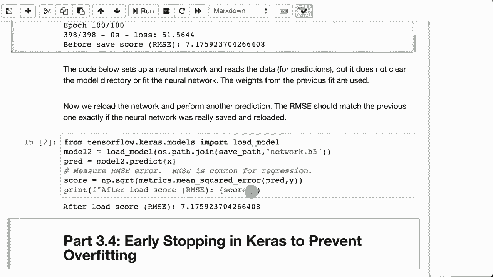

# 【双语字幕+资料下载】T81-558 ｜ 深度神经网络应用-全案例实操系列(2021最新·完整版) - P19：L3.3- 保存和加载Keras神经网络模型 - ShowMeAI - BV15f4y1w7b8

Hi this is Jeff Heaton， welcome to applications of Deep neural Networks with Washington University In this video we're going to see how to load and save Kara's neural networks from disk。Once you spent all this time training a neural network， you want to actually be able to save a copy。

 This is also useful for when you save a copy of a trained neural network that you're going to deploy to a web application or web service。 like we'll see later in this semester。

For the latest on my AI course and projects， click subscribe and the bell next to it to be notified of every new video Now when you save and load to Kira's neural network。 you have several different file types that you can choose from。And two of these are textuals。

 so you can actually open up the file and look at it in a text editor and see the components of the neural network。I usually don't do that， but you can if you wanted to so you could。Like in JSON。 there's plenty of tools that will read and write JSON。 so you could actually access the save state of the neural network directly。

So Yaml is a format that only stores the structure of the neural network， it does not store weights。Similarly， JO does not store the weights either。That's why I don't use those first two that often。 unfortunately， those are the textual formats that are easiest to read。 HD F 5 not to be confusedfuse with HDFS， which is a spark and Hadoop format。

That is the usual format that I will store these to。The first two。 you can use if you don't need to store the actual weights。This demonstrates how you would do this。So here we're opening the auto MPG data set that we had before。 we're going to build almost exactly the same neural network that we built before。We're going to。

Do the predictions and calculate the root mean square error。And print that out。We're going to save that neural network to network Json file。 which will go to the same directory as your， as your work book。 We'll save it as Json willll save it as Yaml and we'll save it as H 5。

 and we can go ahead and run that。And it's complete now notice the RMSE 7。17。Every time you run this。 you're going to get a slightly different RMSC。 that's actually a slightly bad one。 you can definitely do better than that， but it's good enough to test this feature。Now we're going to load it。And notice the values are exactly the same。

That shows that this was really saved to a disk file and brought back。 because if you re ran it and retrained it， those would be completely different values。 and that that would not work very well。Now this technique is going to be used throughout this class。 in fact， in the next section that's coming up， early stopping we'll see that we can program the neural network to use only as many epoes it actually needs。

 and it will actually stop and save the neural network at the optimal point then you can reload the optimal weights later。We're also later in this class going to see how we can deploy a neural network to a web application or similar。And being able to save your train neural network is very useful。So that you can deploy it into into the cloud or into something else。

 Now that you've seen how to save and load Car's neural networks。 we're going to look in the next video about how to use early stopping to stop the neural network before it overfits saving and loading comes into play here because the neural network saved。

When it reaches the optimal values and you need to reload it later。 Thank you for watching this video。 This content changes often。 So subscribe to the channel to stay up to date on this course and other topics in artificial intelligence。