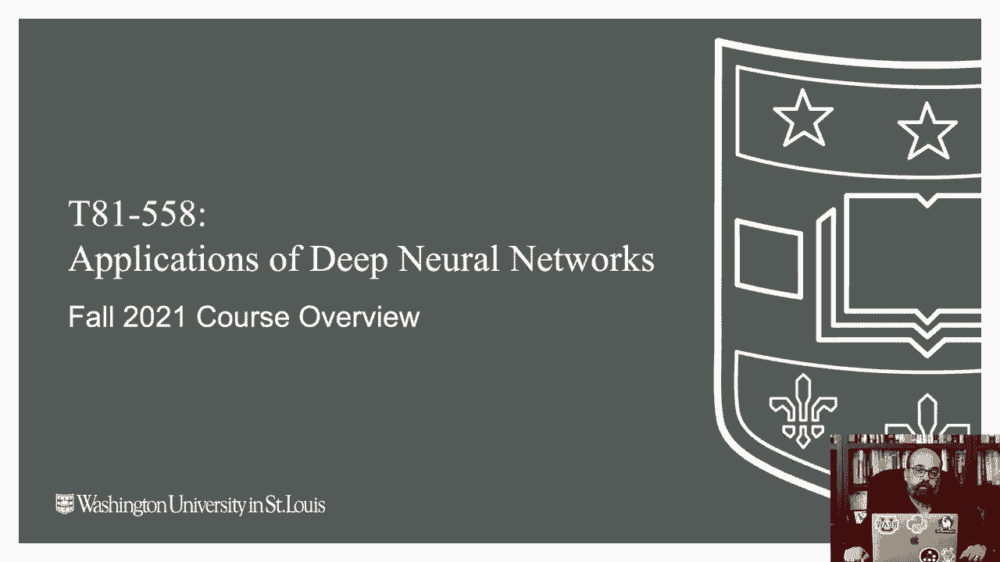
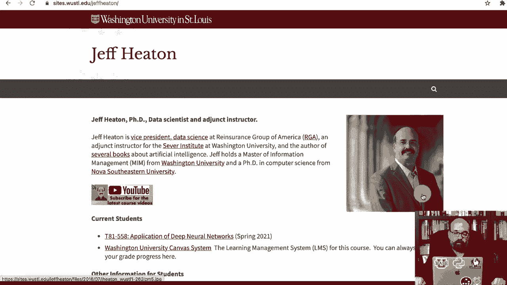
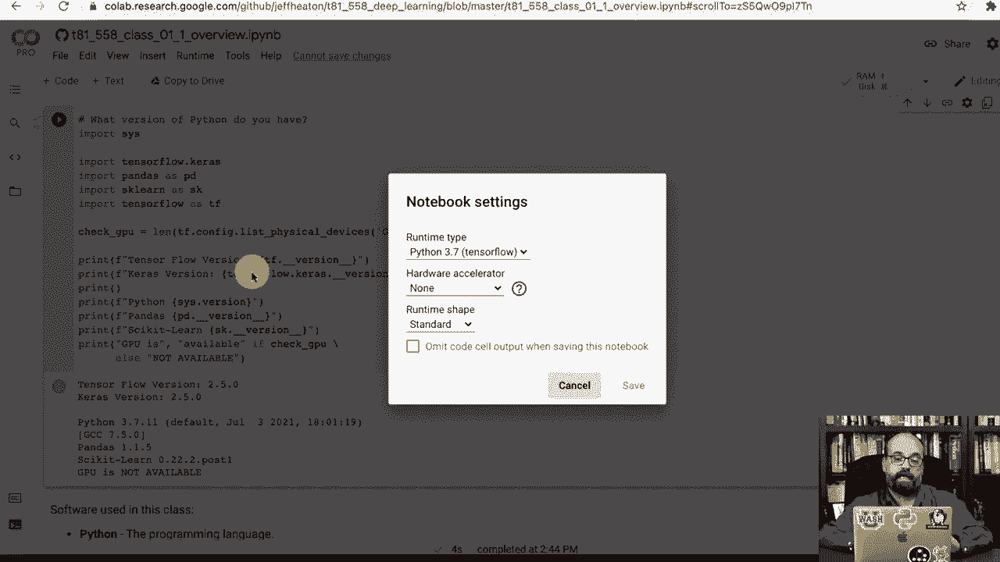
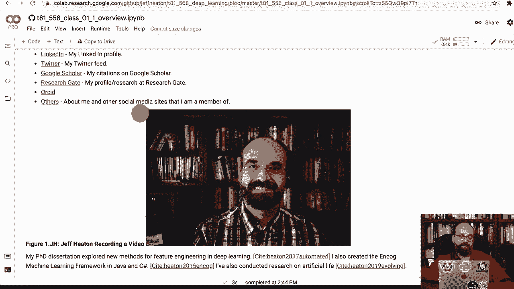
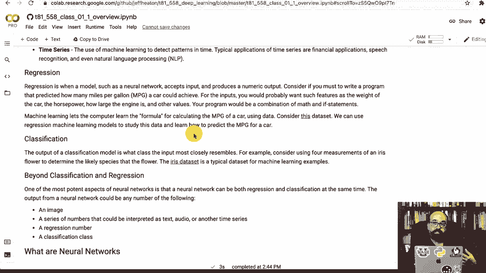
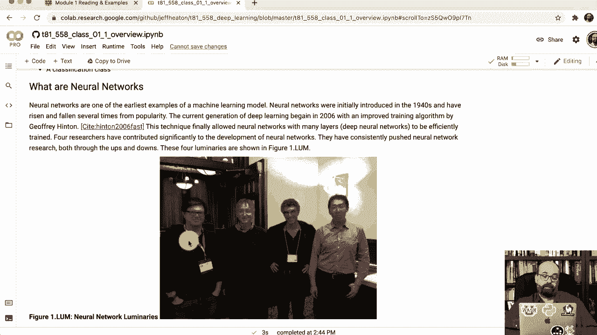
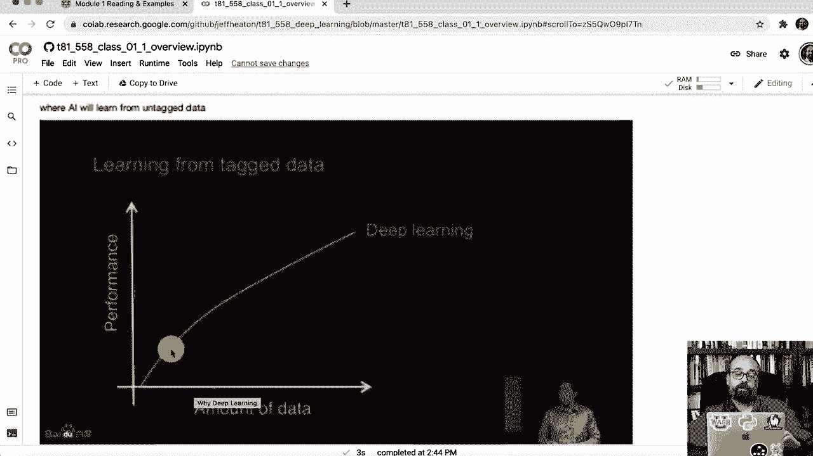
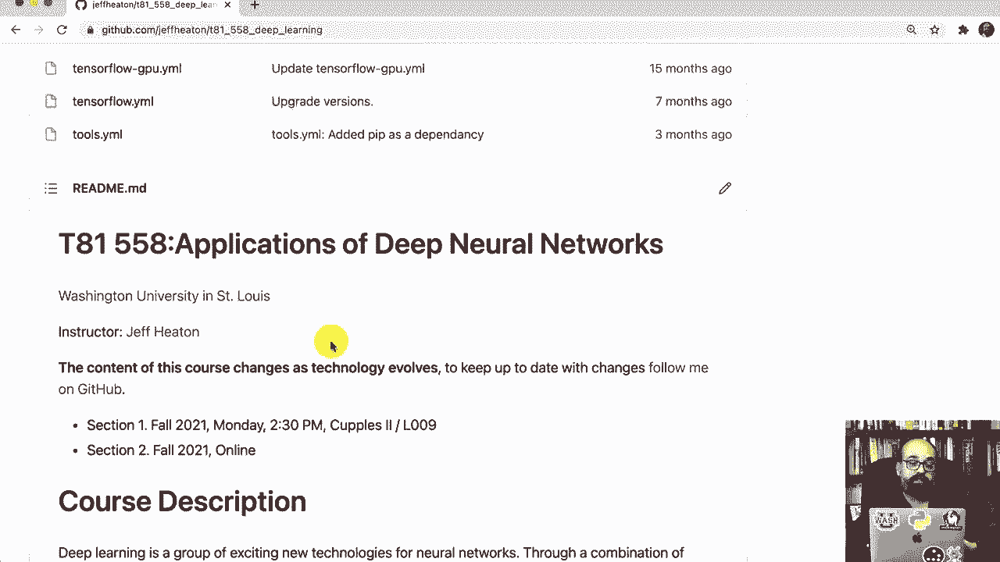

# 【双语字幕+资料下载】T81-558 ｜ 深度神经网络应用-全案例实操系列(2021最新·完整版) - P2：L1.1- 深度神经网络课程概述的应用 - ShowMeAI - BV15f4y1w7b8

Hi this is Jeff Han， welcome to applications of deep neural Network with Washington University this is the beginning of the fall 2021 semester。

🎼The。So in this video I'm just going to kick off the class。 introduce it if you're taking this class through Washington University。 I'm going to talk about obviously how you submit assignments and all that sort of thing is currently being offered online and in a hybrid format in the hybrid format you show a for time at the campus and the rest is remote if you're in the purely online version everything's the same except you watch the videos pre-recorded or you can join in live if you so desired Now if you're just tuning into this from the internet through YouTube everything is available to you except you really can't submit assignments or get individual help and guidance from me like the actual students at Washington University so the previous semester we taught this class in a completely online format I've been doing this throughout COVID this semester were actually。

We'll play this day by day via such as the world of COVID。 but at this point the plan is that this course will meet at the Danfor University campus。At WashU four times during the semester Now I'm going to broadcast that through Zoom and it will be available recorded as well。 so I'm not making class attendance mandatory。 this semester for those four in session meetings We'll talk more about that at the first meeting and in the zoom So all of the information about this course you can get to through the WashU Canva system。

 The links take you primarily to my Github repository， which is where all of this stuff is stored。 This is my page at WashU I probably need to update my picture is I think the I think the CoVID beard is probably going to be a keeper but the link to the site is here and this has some general information about it you'll want to go right to the course sessions on Github。

If you are accessing this course through the Washington University Canvas system。 it's going to look basically like this All of the videos are available either through YouTube or through Calaltura。They're exactly the same videos you can watch it through whichever one you desire。 One thing that's neat about these is the transcripts are available so you can search and find topics across the videos that's available in Kaltura you can also speed up the playback and watch me at twice to the normal speed。

 I do on videos all the time。 very very useful Each one of these will have something on the videos so that's links to the videos in Calaltura on canvas and then they'll be the the reading and then the program that is due for each class。 if you click on the readings。 It's going to take you outside of canvas and go to Github and this is what you see if you access it just straight through the internet really everything in this course is available on Jupiter notebooks and Jupiter notebooks are a great way to go about this course when you're doing deep learning you need to have a。

😊，GPU available Well， you don't need to， but some of the stuff in that I'll show you in this course actually will not work only with a CPU。 Now the computer I have behind me has a fairly highend GPU on it。 I use that the Mac that I'm actually using right now， it's kind of an exciting time for Mac。 you can now use the M1 if you have one of the newer Mac to be able to use a GPU or an accelerator to make use of the highs speed mathematical computations that you need really for deep learning。

 I have a video showing you how to set up an M1 Mac exactly like you need for this course and then also if you're using Linux or Windows。 you can also use the GPU in either of those you do need an Nvidia type GPU because Kuta is required for Tensorflow Kis。

 which is what we're making use of in this class Now if you don't have a GPU。On your system。What I very much recommend。And really， if you don't want to go through the steps of setting up a GPU on your system because it does take a lot of software configuration。

 drivers and that kind of fun stuff， I do recommend Google Collab and all of the Jupiter notebooks that I have on this course have a link here at the top that says open in Collab so you can simply click on that and it will actually launch it in collab now we're in collab。

 I am using Google Collab Pro， It's about $10 a month not needed for this course when we get into the Cagel competition。 it will give you an unfair advantage and not unfair in the sense of it's not fair allowed you're allowed to use it and some of the students do use Google Coab Pro during the Cale competition to have access to a faster GPU you'll also have a really good GPU available to you inside of CaGgle but we'll get more to the Caaggle as we go through the first class session。

So you can see that all of it is available here。 you can run these various parts。 Most of the first course module is just introductory material there's not too much code until you get to the very end So if you run this portion of the code this is what checks to see that your GPU is actually available for you and you see the little spinning thing there it's spinning and it will tell you if the GPU is available or not available it'll tell you the version of Tensorflow that you're dealing with so here it is Tensorflow of 2。

5 which is what I tested all the code on for this semester since the GPU is not available what that means you need to do and collab is go down to change runtime type turn on your GPU it's going restart your virtual machine which is fine Now we go ahead and run it and your GPU should be available Yep GPU is available that will considerably increase the processing speed on all of this。

If you want to use CPU only， you can probably get through about 90% of the course。 I will say the Mac M1 support is quite new。 I've only had this Mac M1 myself for about a month but I'm running through all of the course material on M1 and fixing any incompatibilities as I run into those just about everything probably 95% of the course would work with a Mac M1。

 there's one small area that's just not going to work and that's where we get into stylegan。 which is where you use Gs to generate computer generated faces because that code was specifically created for NviDdia couda So have a look at the videos on getting started with coabab getting started if you want to actually run it on your Mac。

 I've got videos showing how to do all of that pick your path if you're not a nuts and bolts configure drivers kind of person and that's fine machinech learning engineers sometimes are not you can。Just use coab that usually probably about 70 to 80% of the students use coab so I give you instructions here。

 these are the links just how to use coab how to set it up on a Mac and so on I also have a video on how to set it up on a Intel Mac Intel Mac you won't have the acceleration but you'll at least be able to run things so these are the assignments for the course we'll have an icebreaker that is where you post something about yourself to the rest of the students I'll read every one of these because I'm very curious about what your background is。

 what you've done if you're interested in I don't know career directions on AI machine learning whatever I'll reply to every single one of the icebreakers if you ask me something or give me something to comment on you'll definitely hear back from me when I go through all of those class assignments are 50% those are due each week。

For the first part， the first 1 sessions of the course。 these are small programs that test your understanding of the material Each one of these will take you maybe half hour to an hour to two hours to complete maybe longer everybody does different parts of the course at different speeds some of them are more complex than others The first one is really easy it is just run it and you don't even have to make any changes it's just proving that you can run Python code because this course is completely in Python and submit a result I use a auto greater auto feedback program so when you submit it automatically using an API key that I will send you。

And that's you have to be a student of you to get access to that because I have no way to grade you without canvas and I have no time to grade to grade people who are not my students so this is a program that sits that I wrote it it's completely my own creation I actually use a neural network and regular expressions and other things to to grade these it won't always be able to give you exactly a grade but it will give you feedback and tell you and you can submit this as many times as you want before So if you want to just keep submitting you should be able to get 100% on all of these class assignments It'll tell you what's wrong and it's gonna check your output let you know how it matches how it doesn't if you don't understand why your output is not matching mine send me a question in either teams or through Can or through email those are really the primary ways to contact me There'll be a。

Pro you will have teams on this。 you will pick your own teams and the teams can cross the two sections。 there's a completely online section and there's a meet at the university four times section so you can you can join with other other people you can also join with people who are not even in the class and typically this is on Kaagle in class So you'll have other people from the Internet even pop in and compete with you。

 I'll do a ranking of who the top submissions are the top I would say five entries。 I will have them do a the teams do a presentation at close to the final class so that you don't have to hear from me every every single time that we meet it'll be on the fourth class session that we would meet in class the purely online students we won't do that you're certainly welcome to present。

On Zoom if you're one of those top five so I'll contact each of you when we reach that real kggs have serious prize money available to them it's no prize money for these kggs but what I will tell you is those the top three I would say I would be completely willing to write you a really nice LinkedIn recommendation talking about how well you did getting into the top position of the kgel competition the students in previous semesters have really enjoyed the kgggel's I think it's the most fun part of this class it lets you compete against the other students and really see how good of a model you can actually produce then there's the final project if you're one of those top five you don't have to do the final project but the final project is basically is your presentation will be your final project for the rest of you the final project is looking at and analyzing a paper an advanced paper that was submitted。

One of one of the premier conferences for deep learning like ICLR or NIps or something like that。 basically writing a summary of it， some of the papers that I choose that you can select from because I give you around 10 are actually written by scholars here at Washington University so thats that's kind of fun these are all of your assignments the first time that we meet at the university。

 I will go through how to actually submit an assignment and if you want to follow along with me。 you will have submitted your first assignment and again if you're connecting through the Internet。 you can certainly see the assignments but you can't really submit them or get them graded or anything like that So this is me your instructor Jeff Heaton I have a masters of Information management from here at Washington University I was a PhD in Comp science from Nova Southeastern University I did that a little later in my life I finish that in 2。

17So I'm not exactly a traditional PhD student。 I am a senior member of IEE。 My email address is JT Heaton at the domain of this university。 I've got some other certifications as well you can see some of the links to my social media I never really plan to be a YouTubeber but I started putting these videos online before what you had Calaltura and next thing I know I have over 50000 subscribers so YouTube's fun and I continue to put other videos on YouTube so as a student I very much encourage you to subscribe to my channel I don't know smash the like button like YouTubers always tell you to do but if you subscribe to the channel you'll get other more advanced topics that go beyond the course as I release additional videos I typically release about a video a week sometimes just refreshes of the course material I probably reboot 5 to 10% of this course every semester I have a Discord server that you can discuss。

That's fully open to the internet inside of Canva I have a link to Teams there's a team inside of the Washoe Teams system for students。 I highly recommend you to try that out I often chat with students if I'm available and it's a great place to ask for help you can see some of my papers on Google Scholar back when I was more in research mode I haven't written a paper in a number of years my profile on researchgate and ORCID as well when I was doing more papers and that is me sitting right here actually current resources Google coabab。

We will use Python Ananaconda if you're going to install it on your own computer。 actually I recommend Minnaconda， which is the slim down version of Anaconda， we will use TensorFlow。The two big competitors right now that are fighting it out are Tensorflowlow and Pytorch。 I really like Pytorch as well。 This course started in 2017 when Tensorflowlow was really just the one available Pytorch Pytorch is good but its this is by no means I mean they're fighting it out right now and I wouldn't say any either is particularly a clear leader。

 I'm seeing a lot more from Pytorch as far as support from academia on new papers coming out。 especially papers with code Tensorflowlow， I see a lot of support for it in some of the utilities that I use in my day job as a vice president of a data science group at a large company So what is machine learning Mach learning is learning from data。

 So you have traditional software development you would take input data and you would write。

Program code， you would run these on the computer and you would get the output machine learning。 you get the output from cases in the past where you know， so you've got labeled data。 perhaps maybe you've got a bunch of images a cats and dogs and you have them labeled cat and dog you put that into the computer and it gives you the program code。 The program code is the neural network。 So this is called datadriven development。

 and this alleviates you from having to write a lot of the code to tell the difference between a cat and a dog because that would be very very difficult for traditional programming。 these are the three areas that I really see deep learning used a lot predictive modeling。

 This is very much you have some inputs。 you have an output in something like a spreadsheet but now you've got new cases where you don't have that labeled。 It's unlabeled data and you want to form those predictions Comp vision as well think self-driving cars。

Telling the difference between a cat and a dog the assignment that I'm going to give you for Caggle is going to be a computer vision problem and it'll be a decently challenging one this semester I always generate all the data for the kle competition so it's brand new it's something you can't just Google and find potential solutions for on the internet and then also time series predicting things over over time think stock market。

 think Bitcoin think whatever Obviously I haven't cracked how to predict Bitcoin since I still have my day job and my night job。Regression， classification， these are all just ways regression is are you predicting a number。 classification， are you predicting a class？

Deep neural networks are just your classical neural networks。 but they have been extended in so many different ways with convolution layers， recurrent layers。 transformers， attention， all these sorts of things that allow them to do well beyond what they were ever capable of the four individuals who are really behind this Jann LeCn。 Jeffrey Henton， Yahua Bennjiio and Andrew Ning， Why deep learning。

 compared to other machine learning things like support vector machines。 randomand forest gradient and boosted machines， neural networks for one。 they really excel at computer vision they really excel at computer vision because the neural networks are able to create their own features。

The way you would handle a computer vision before is you would simply bring in additional images and you would engineer features out of them。 you'd look at like the maximum color you'd scan you'd try to find individual details。 also why deep learning， Andrew Ning described this really pretty well older algorithms and if you're an academic researcher。 older algorithms are the things you're not working on。

 deep learning is what he and most most machine learning researchers are focused on right now。

If you have not that much data， so small data， the older algorithms will outperform deep learning typically so Python we're going use Python。 we're going to use Tensorflowkis， we will use Pytorrch a little bit in this course we'll use it particularly for GNs because that's just the software that Staian2 AD which is what we make use of is available for the entire course is written in Jupyter notebooks If you want the course textbook for this that's available as well。

 I wrote it it's based on all of the material that you have here the textbook just click here and it will open the textbook it's a PDF it is over 500 pages and it is basically the same material that is on the gett repository except it's very much in printable textbook form Eventually I'm going to publish this is an actual book that you can get on Kendall and by paperback through。

onI just have not gotten to that yet。 I updated each semester。 So when you download it。 I will have put the final changes in and it will say fall 2021。 So that's it。 That's the course。 This was a quick overview of this。 We'll talk more specifically about how to install this how to submit assignments when we have the zoom meeting and the in personson meeting this semester at the actual campus。 Thank you for watching this video。 And if you found this useful please subscribe to my YouTube channel and considering clicking the like button。

 if you're watching this through YouTube。