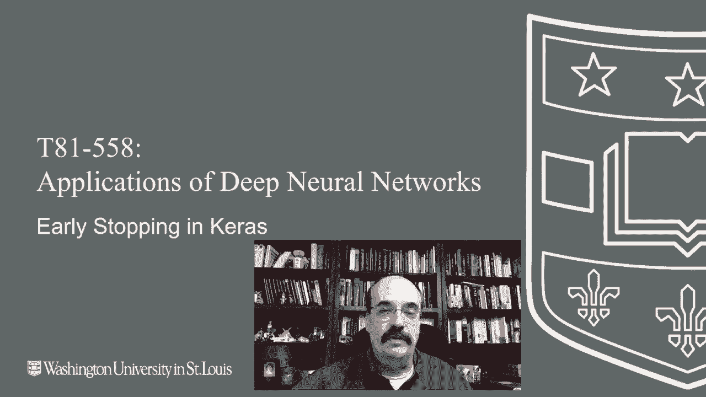

# 【双语字幕+资料下载】T81-558 ｜ 深度神经网络应用-全案例实操系列(2021最新·完整版) - P20：L3.4- 在Keras中提前停止以防止过拟合 - ShowMeAI - BV15f4y1w7b8

Hi， this is Jeff Hayton， welcome to App of Deep neuralural Networks with Washington University。In this video， we're going to see our first technique for fighting against the constant enemy of the neural network programmer。 And that's overfitting。 We're going to see how to use early stopping。 rather than trying to decide how many epochs。 you want to train your neural network 4。

 you can set aside a validation set and train the neural network until that validation set No longer the error on it no longer improves for the latest or among AI course and projects。 Click subscribe in the bell next to it to be notified of every new video。

 Earl stopping is a method that helps to prevent overfitting。 We'll see other methods to help prevent overfitting as well as we progressed this class。😊。

But what early stopping really tries to do is keep you from training the neural network too far。 This is a common visualization to show what ill effects overfitting can have as you train more and more。 X axis shows you the error。 The Y axis shows you the training time。 The dashed line is the validation set and the black line is the training set。

 So what is happening to the error。 of your training values versus your validation values as you train longer and longer and longer。 General， the validation and training will be pretty similar。 The validation might be a little bit worse as you begin to train because。The training set is going to be somewhat overfit because the neural network has those values available。

 It's memorizing some of them。 It's fitting very well to the training set。 So the validation set will usually be a little bit worse。 as you're progressing。 Then as the training set gets better and better and better at some point。 the validation set will start to almost converge away from this to a higher error value。

 And you'll get worse and worse values on your validation。 you'll get better and better values on your training。 This is result of overfitting。 at this point here， overfitting really started to occur。 Now。 you may not recognize it till somewhere out here。 because you have to think， okay， it's。

 it's getting worse。 Maybe it'll get better。 Maybe it'll get better。 Now it's probably not getting not getting better。 Now， there are cases where you'll go out this far。 And then itll it'll come back down here。 This is a value you will see in this class called patience。 How patient are you。To see these values start to move towards convergence again。

 rather than diverge away into validation， just overfitting and， and not getting a better value。 This is what early stopping is。 You stop early。 You stop at this point。 and we'll see that it's important that we capture the weights here where we had。Essentially。 the best or the lowest validation error， which is probably right in here where we had the lowest validation error。

And then we save those weights so that we have them so that even when we decided to stop。 maybe here or here， depending how patient we were， we go back to here。So that's an important thing to remember， too， about patients。 patients will really not hurt you on the overall best score that you'll get at the end。

 you can be as patient as you want。 It's just going to take a lot longer。To train because you're going to have to go much further out if you set a gigantic patience number of epochs that you're willing to wait。 Now， to do this， we need to segment the original data set into several data sets。 Now。 Often we'll just have the first two， but sometimes we'll have a holdout set as well。

 You may even split it up into more than just these three， depending really on what you're doing。 It also depends on how much how much data you have。 If you have a lot of data。 then you may split this into many training sets and really ensure that you're not overfitting that you're not ever evaluating based on anything that you are trained on。You can make this very pure， and you may even split out a separate validation set just to be used for nothing other than early stop。

 but every time you split these， you lose some of your training data。 So it's it's a trade off between how purest do you want to be in terms of your。Never crossing training and validation， never validating on anything that the neural network is trained on。 how much of your training set you want to train on because your neural network will typically perform better。

 at least up to a point， the bigger the training set that you give it。In kle competitions。 for example。I will usually accept some small cross contamination of training and validation。 meaning I might use a validation set for early stopping。Just because I know that I have that holdout set that Kaggle will eventually give me。

I can't do that too much or I overfit to even Kaggles's holdout set to some degree。So it's really just a trade off and we'll talk more about this as we get into hyperparameter tuning and other things where you do need to create additional set。 The ultimate insurance policy， though， is you set that final holdout set that you keep until the very end and you don't you don't use this for anything during the training process until you say。 okay， I am I'm very happy with my model， let me see what happens when I。Try the final。

 final holdout set。 And that's， that's the error rate that you usually decide to commit to as far as how。How well trained your model actually is。So this is what it really looks like。In terms of something like an early stopping。What you're going to do is take your data set。Break it into maybe 80% and 20% this 20% up here becomes the validation。

 the 80% becomes the training。And you're going to fit or train your model on this 80%。 and then you're going to validate it on this 20%。So you'll get a training error here。 That is how well it was fit to your training set， but then you take what you trained on that 80% and validate it with that remaining 20%。 and that gives you greater confidence that this is truly the error that your neural network is going to experience when it sees new data。

 Now we're going to look at early stopping and early stopping does require a sort of validation set。Now that causes your validation set to now be used for early stopping so now it's part of the training set。 so this is where it's good to have that final holdout set that you might want to ultimately evaluate on just be aware of that if you're truly using your validation set as your early stopping。 then you probably need another validation set to actually commit to an error on or you can accept that maybe you've got some inflation in your validation set and you can truly use whatever score you stopped on as an estimate of what the final neural network might do。

 but be aware that you have crossed at that point， your early stopping validation set to your training。Is what we're going to do is just monitor this。 And as soon as that validation set， no longer。Is decreasing and our patience expires。 We're going to stop。 We're going to early stop。 I'm going to show you two examples of how you will do this。

We'll do early stopping with classification and early stopping with regression。 The code's mostly the same， but this gives you some good starting point code to look at for this。 So for this one， we're going to use the iris data set。 So we the supple linked width。And pal length and width。Let's go ahead and run this so that we load the data in。

Since as the star goes away， it's loaded， okay， the data is loaded。And we we ran it。 And you can see the results here。 We'll look at the results first。 And then I'll show you kind of what happened。 We trained and trained and trained。 You can see the training of validation loss。 And then it says that right around 101。

 we decided to early stop， and we restore the model weights of that last best epoch。 And we set up our neural network， largely just like we did before。It is going to have its classification， so we're using the Y shape。 we're using the number of classes and soft Mac and categorical cross entropy。

 those three together tell you that this is a classification neural network。 make sure you set it up like that。We're creating a monitor now this is the part that does the early stopping。We are telling it that we have a patience of five。 so we're going to only wait  five epochs for to quit improving。 verbose is one。 So that'll give us that little notice that we saw down there。

 and we're telling it truly， restore the best weights。 And now we're going to fit it。 But notice we're giving it X train Y train。 and we're passing in validation data。 We haven't done this before。 So the validation data。 The X test Y test versus the X train Y train。 that came from up here。 We're splitting into validation and training sets。

 So we're splitting 25% is going to the test set。 The remaining 75% is going to validation。 So you have X train， X test Y train。 Those are the expected values， the Y's。And why test。 So now you have the four measurements split into a train and a test。 and you have the expected class， the type of ir that it actually was split into。Train and test。

The random state 42， that just gives us a way to consistently split it。 and then the only other thing we do un fit down here is we pass a call back， monitor。 so that's how this early stopping object that we created actually plugs into the training。Or the fit process when we call fit as we train。 So this is how you implement early stopping for classification。

 It's pretty much the same exact process for regression。 You create a monitor。 you pass it into the callbacks。 and you need to provide validation data。 I just give you the exact code for this so that you can quickly make use of it。 By the way。 if we do want to see the accuracy with that we got for early stopping。

 notice the accuracy is very good。😊，So we didn't have to guess at the number of epochs。 It trained until it saw that。We had trained enough。 so this is a way that you can estimate and not have to guess at how many epochs you want to give your neural network。This is a way to have one fewer hyperparameter， hyperparameters。

 all these things you have to pick about your neural network that will influence behavior like the number of epochs。 how many layers you have， we'll see how to pick layers and other things automatically later in this class。 but this is one way that you can at least。Use mathematical accuracy to some degree to pick your number of epochs to train and a simple example of early stopping with regression。 we use the auto miles per gallon。 This is the same setup that we've done before。

 We're splitting it into x and Y so that y is the miles per gallon。 That's what we're trying to predict X is all these other values that we're using to predict miles per gallon。And then we use exactly the same code that we used in the previous one for classification。 We split it into train and test， 25% split。Now we're doing regression though。

 so notice we have one output in neuron。We have mean squared error that tells you that this is a regression neural network。 and this is all the same we're giving we're passing the monitor in。And we're giving it X and Y。Both for validation and for training。 So you're giving it that two sides， the training。And the validation。 And now we can run it。And it trains， trains trains。 You can see the testing。

The the train。Loss and the validation loss both are decreasing。And at some point， it decides to stop。It restores the final weights， so it only made it to 31 epochs before it lost patients here。Then you can measure the final root mean square。Not a particularly good root mean square。12 now。 remember， neural networks start with random weights。

 So this gives me a chance to quickly illustrate something interesting。 Remember Ro mean square was 12。 Let's retrain the whole thing。 Now， let's recalculate this。4our。Notice that huge variance， this is really annoying about neural networks。 but since they start with random weights， they will get sometimes different error values。

 This makes it very hard to try to tune something。 Imagine if you had thrown in an extra hidden layer。When you did have 12， but then you throw in a hidden layer oh my gosh I went down to four。 that's great， no it was just the normal variance you have in neural networks。We'll see in the next module that something called bootstrapping will use。

 you're just literally going to have to run this a few times an average together。Is how you handle that and things like。Drop out， help mitigate this at least a little bit。This is just one of the facts of life dealing with neural networks。 They give a great deal of variance in in the score that you get from the output。

Thank you for watching this video On early stopping。 In the next part。 we're going to see how to actually extract the weights from a saved Kara's neural network and put those weights into a mathematical equation and actually calculate the values。 This removes all the magic from the process， And you can see that it's simply mathematical calculations。 This content changes often。 So subscribe to the channel to stay up to date on this course and other topics and artificial intelligence。

😊。