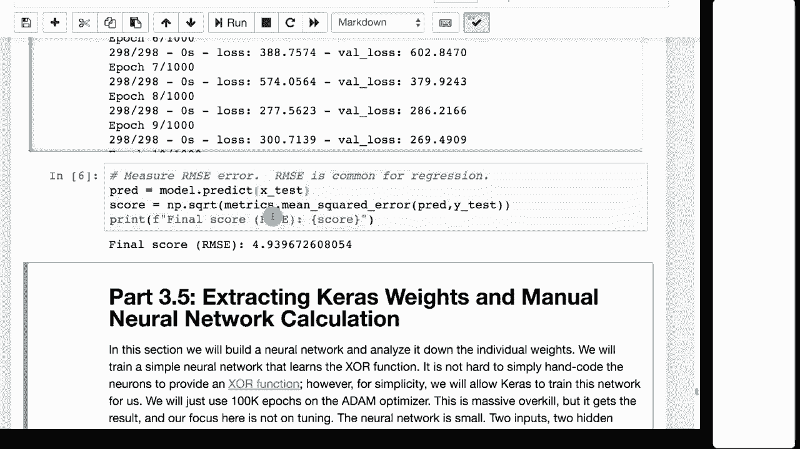

# 【双语字幕+资料下载】T81-558 ｜ 深度神经网络应用-全案例实操系列(2021最新·完整版) - P20：L3.4- 在Keras中提前停止以防止过拟合 - ShowMeAI - BV15f4y1w7b8

嗨，我是杰夫·海顿，欢迎来到华盛顿大学的深度神经网络应用课程。在这个视频中，我们将看到对抗神经网络程序员的常见敌人——过拟合的第一个技巧。我们将学习如何使用早期停止，而不是决定训练神经网络的轮数。

你可以预留一个验证集，并训练神经网络，直到验证集上的错误不再改善。点击旁边的铃铛订阅，以便收到每个新视频的通知。

早期停止是一种防止过拟合的方法。在我们课程的进展中，我们还将看到其他防止过拟合的方法。😊！

但早期停止实际上试图避免你过度训练神经网络。这是一个常见的可视化，展示了随着训练越来越多，过拟合会产生的负面影响。X轴显示错误，Y轴显示训练时间。虚线是验证集，黑线是训练集。

那么，随着你不断训练，训练值与验证值的错误发生了什么？通常，验证和训练会相似。随着训练开始，验证可能会稍微差一些，因为训练集会有些过拟合，因为神经网络有这些值可用。

它正在记住其中的一些。它对训练集的拟合非常好。因此，随着你的进展，验证集通常会稍微差一点。然后，当训练集越来越好时，验证集在某个时刻会开始几乎从这个点趋向一个更高的错误值。

你的验证值会越来越差，而训练值会越来越好。这就是过拟合的结果。在这一点上，过拟合真的开始发生。现在，你可能不会在外面某个地方意识到这一点，因为你必须想，好的，情况在变差，或许会变好，或许会变好。现在可能不再变好了。

现在，有些情况下你会到达这个程度，然后又会回落到这里。在这门课中你会看到一个值叫耐心。你有多耐心，来观察这些值再次趋向收敛。

而不是在验证上发散，只是过拟合，而没有得到更好的值。这就是早期停止的意义。你提前停止，在这个点上停止。我们将看到捕捉到最佳或最低验证错误的权重是多么重要，这可能正是在这里我们有最低的验证错误。

然后我们保存这些权重，这样即使我们决定在这里或这里停止，取决于我们的耐心，我们也能返回到这里。因此，这也是一个重要的事情，关于耐心。耐心实际上不会影响你最终获得的整体最佳得分。

你可以根据自己的意愿保持耐心。这只会让训练时间变得更长，因为如果你设置一个巨大的耐心周期，你就需要走得更远。现在，要做到这一点，我们需要将原始数据集分成几个数据集。现在，通常我们只会有前两个，但有时也会有一个保留集。

你甚至可以将其拆分为不止这三组，具体取决于你在做什么。它还取决于你有多少数据。如果你有很多数据，那么你可以将其拆分为多个训练集，真正确保你没有过拟合，确保你不会基于你训练过的任何东西进行评估。你可以让这个过程非常纯净，甚至可以拆分出一个单独的验证集，仅用于早期停止。

但每次你进行拆分时，你都会失去一些训练数据。因此，这是一个权衡，涉及到你希望在训练和验证之间保持多纯净，从不在神经网络训练过的任何东西上进行验证。你希望在训练集上训练多少，因为神经网络通常会表现得更好。

至少到某种程度，你提供的训练集越大。在Kaggle比赛中，例如，我通常会接受一些小的训练和验证的交叉污染。这意味着我可能会使用一个验证集进行早期停止。只是因为我知道我有那个Kaggle最终会给我的保留集。

我不能做太多，否则我会在一定程度上过拟合到Kaggle的保留集。因此，这实际上是一个权衡，我们将在进入超参数调优和其他需要创建附加集的内容时进一步讨论。然而，*终极*保险策略是，你设定一个最终的保留集，直到最后才使用，并且在训练过程中不使用它，直到你说，好的，我对我的模型很满意，让我看看当我尝试最终时会发生什么。

最终保留集。这就是你通常决定承诺的错误率，关于你的模型实际训练得多好。这实际上是什么样子。在早期停止方面，你要做的是将数据集分为80%和20%，这个20%成为验证集。

80%成为训练集。你将根据这80%来拟合或训练你的模型。然后你将在这20%上进行验证。因此，你会得到一个训练误差。这是它与训练集拟合的程度，但之后你将用那80%训练出来的模型与剩余的20%进行验证。这让你更有信心，这是你的神经网络在看到新数据时真正会经历的误差。

现在我们要讨论早停法，早停法确实需要一种验证集。这会导致你的验证集现在被用作早停法，所以它现在是训练集的一部分。因此，这时候有一个最终的保留集是很好的，你可能希望最终在这个保留集上进行评估，如果你真的将验证集用作早停法，请注意这一点。那么，你可能需要另一个验证集来真正承认一个错误，或者你可以接受你在验证集中可能有一些膨胀，并且你可以真实地使用你停止时的得分作为最终神经网络可能表现的估计。

但请注意，你在此时已经将早停法的验证集转换为训练集。我们要做的是监控这一点。当验证集不再减少并且我们的耐心用尽时，我们将停止。我们将提前停止。我将给你展示两个示例，告诉你如何做到这一点。

我们将使用分类和回归进行早停法。代码大体上是相同的，但这为你提供了一些良好的起始代码来参考。因此，对于这个示例，我们将使用鸢尾花数据集。我们有花萼的长度和宽度，以及花瓣的长度和宽度。现在我们来运行这个，以便加载数据。

当星号消失时，数据已经加载好了。我们运行了它，你可以在这里看到结果。我们先查看结果，然后我会告诉你发生了什么。我们不断训练。你可以看到训练和验证的损失，然后在大约101的时候。

我们决定提前停止，并恢复了最后一个最佳周期的模型权重。我们设置神经网络的方式大体上和之前一样。它将进行分类，因此我们使用Y形状。我们使用类别的数量以及softmax和分类交叉熵。

这三者合在一起告诉你这是一个分类神经网络。确保你像这样设置它。我们现在正在创建一个监控器，这是执行早停法的部分。我们告诉它我们有五个周期的耐心。因此，我们只等待五个周期以停止改进。详细程度设置为1，这样我们就能看到下面那个小通知。

我们真正告诉它，恢复最佳权重。现在我们将进行拟合。但注意我们给了它X训练Y训练，并且传入了验证数据。我们以前没有这样做。所以验证数据，X测试Y测试与X训练Y训练来自上面的拆分。我们将其拆分为验证和训练集。

所以我们将25%分配给测试集。剩下的75%分配给验证集。所以你有X训练，X测试Y训练。这些是期望值，Y的值。现在你有四个测量拆分为训练和测试。并且你有期望类别，实际上被拆分的IR类型。训练和测试。

随机状态42，这只是给我们一个一致拆分的方法。然后我们在这里做的唯一其他事情是传递一个回调，监控。因此这就是我们创建的早期停止对象如何实际插入到训练过程中的方式。当我们调用fit时，它在训练时工作。所以这就是如何为分类实现早期停止。

对于回归来说，过程几乎完全相同。你创建一个监控。你将其传递到回调中。你需要提供验证数据。我给你确切的代码，以便你可以快速使用。顺便说一下，如果我们想查看早期停止的准确性。

注意，准确率非常好。😊因此我们不必猜测训练的轮数。它训练到看到这一点为止。我们训练得足够多。所以这是一种你可以估算而不必猜测给你的神经网络多少轮次的方法。这是一种减少超参数的方法。

关于你的神经网络，你必须选择所有这些会影响行为的因素，比如轮数、层数。我们稍后会看到如何自动选择层和其他内容。但这是一种你至少可以使用数学准确度在某种程度上选择训练轮数的方法，以及回归的早期停止的简单示例。我们使用自动每加仑英里数。这与我们之前做的设置相同。

我们将其拆分为x和Y，使得y为每加仑的英里数。这就是我们试图预测的，X是我们用来预测每加仑英里数的所有其他值。然后我们使用与之前分类时完全相同的代码。我们将其拆分为训练集和测试集，25%的拆分。现在我们进行回归。

注意我们在神经元中有一个输出。我们有均方误差，这表明这是一个回归神经网络。其他部分都是相同的，我们传递了监控。我们提供了X和Y，既用于验证也用于训练。所以你提供了训练和验证的两个方面。现在我们可以运行它。它训练、训练、训练。你可以看到测试结果。

训练损失和验证损失都在减少。在某个时刻，它决定停止。它恢复了最终权重，所以它在这里只训练到了 31 个周期，就失去了耐心。然后你可以测量最终的均方根。这不是一个特别好的均方根，现在是 12。请记住，神经网络是从随机权重开始的。

这让我有机会快速说明一些有趣的事情。记得均方根是 12。现在，让我们重新训练整个模型。现在，重新计算这个值。注意到巨大的方差，这真让人烦恼，但由于它们从随机权重开始，有时会得到不同的误差值。

这使得调优变得非常困难。想象一下，如果你再添加一个隐藏层。当你有 12 个时，但你再加一个隐藏层，天哪，我的结果下降到了 4。这很不错，不，其实只是神经网络中正常的方差。我们将在下一个模块中看到一种叫做自举的方法将会使用。

你实际上只需要多运行几次，取个平均。你如何处理这些事情，比如说，Drop out，有助于至少减轻一点。这只是处理神经网络时的生活事实之一。它们在输出结果中提供了很大的方差。

感谢你观看这段关于早停的视频。在下一部分，我们将看看如何从保存的Keras神经网络中提取权重，并将这些权重放入数学方程中，实际计算出数值。这消除了过程中的所有魔法，你可以看到这仅仅是数学计算。这些内容经常变化。所以请订阅频道，以便及时了解本课程及其他人工智能主题。

😊
