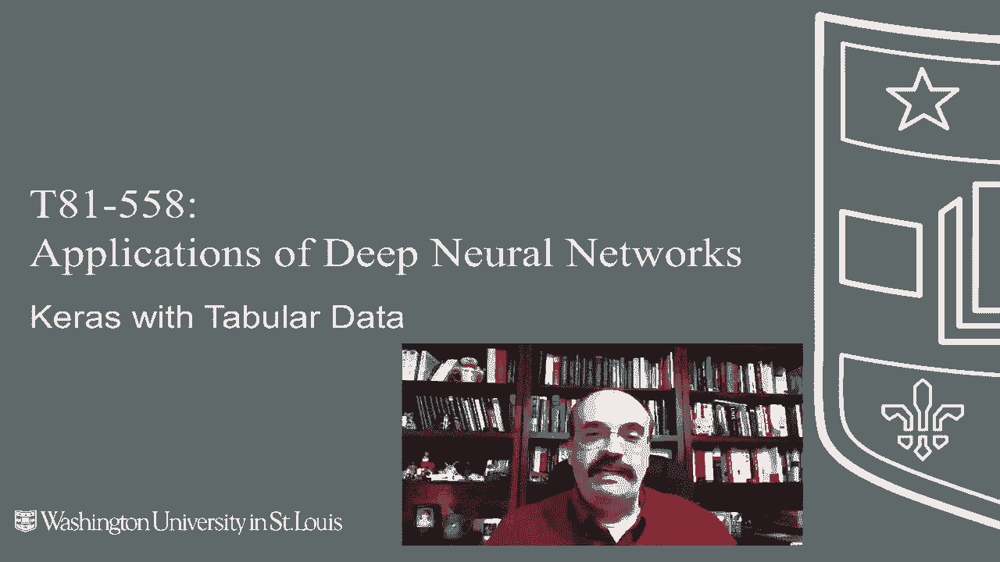
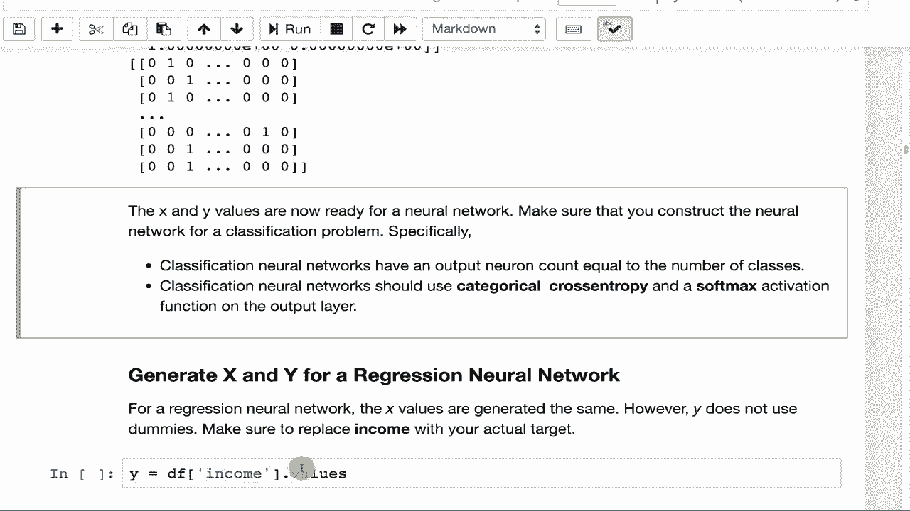

# 【双语字幕+资料下载】T81-558 ｜ 深度神经网络应用-全案例实操系列(2021最新·完整版) - P22：L4.1- 为Keras深度学习编码特征向量 - ShowMeAI - BV15f4y1w7b8

嗨，我是杰夫·希顿，欢迎来到华盛顿大学的深度神经网络应用课程。在这个视频中，我们将开始查看表格数据。这是数据，不是计算机图像或音频，也不是深度神经网络特别擅长的复杂数据输入，而是看起来像来自Microsoft Excel的数据，其中有列和行，你将尝试根据其他列预测其中一列。

将这样的数据输入深度神经网络时，通常每一行是一个输入或一组输入，输入到该神经网络的输入神经元中。所有进入神经网络的数字集合，其中一行被称为特征向量。所有进入神经网络的数据都需要是数字形式。在这个视频中，我们将看到如何为我最新的AI课程和项目构建该特征向量。

点击订阅并按旁边的铃铛，以便在每个新视频发布时收到通知。对于这个例子，我们将看到如何编码一个特征向量。我们将使用之前见过的简单数据集。😊。

我将运行这个程序，它基本上向你展示了这个数据集的构成。我们之前已经讨论过这个数据集，但我会快速回顾一下。它有一些分类变量，比如职业和地区。因此，这些需要转化为虚拟变量，而你试图预测的值是对于每个个体，他们购买了哪个产品，A、B、C或D。记得产品的范围是到D的。现在。

使用这个数据集为神经网络准备数据时，有一些需要考虑的事项。因此，如果你进行分类，所需的列是产品。这里有一个ID列，这对你没有用，所以你将去掉这一列。许多字段是数字的，可能不需要进一步处理。

但我们会看到这并不完全正确，神经网络。有两件事可以对数字值进行处理，这将非常有助于神经网络。第一是将它们放在一致的范围内。收入的范围要大得多，达到数万，而年龄则在100以下，这会削弱神经网络的预测能力。

因此，将这些数据调整到一致的范围肯定会有所帮助。我会在以后的一个视频中给你展示一个例子，我们就调整这一点，预测能力会显著提升。你还可以做的另一件事是将这些数据中心化到零附近。现在，中心化到零虽然没有范围调整那么有效，但对神经网络是有用的。

在这里，你希望有一些负值和一些正值，最好负值和正值的数量大致相同，因此数据中心围绕0。快速实现这两个目标的方法是使用Z分数，并将其编码为Z分数，因为Z分数是距离均值的标准差的正负值。

所以我们将继续计算例如工作职位的虚拟变量。当我们运行这个时，可以看到所有的虚拟变量都在这里，每一行是一个虚拟变量集，因此你在原始数据集中有2000行，而有33个虚拟变量，因为每个工作职位有33种不同的职位类型。接下来你需要做的是将其合并到数据集中，这样你就会有一个包含这些虚拟变量的数据集。

我们还会删除工作职位这一列。因为在这两个部分中我们都在处理列。你可以看到虚拟变量已添加到此处，前面有工作下划线作为前缀，正是这个前缀在这里指定的。如果没有这个，我们将仅仅得到PQ，PE，直接合并到数据集中。

而且，很难跟踪这些实际上来自工作职位的信息。我们用类似的方法引入区域，现在我们同时拥有工作和区域。这是很好的，因为我们有了前缀区域和工作。否则，这两者会有点混合在一起。关于收入，我们确实有一些缺失值。

所以我们将从收入中提取中位数，并将其放入缺失值中。现在我们拥有了完整的收入值。理想情况下，你可能不会。你可能希望在这方面做得更复杂一些，拥有多个中位数，也许你会将年龄划分，这样收入可能与年龄相关。你会这样做。

将年龄划分为多个区间。你需要计算每个区间的中位数，然后智能地选择一个中间值来填补缺失值。使用该区间来进行选择，这样可以得到更有意义的缺失值。我们可以看到数据框中包含了所有的列，现在可以获取我们的X列。

我们通过获取与之前相同的列来处理这个问题。但是我们将删除产品，因为产品是我们试图预测的对象。包含产品存在两个问题。如果这确实是你想预测的内容，那么这就是目标泄露，神经网络预测它将是微不足道的。

你可能会在神经网络上获得完美的分数，来自神经网络的完美分数。但对我来说并不是完美的分数，因为你会生成一个无用的神经网络。如果你试图预测一个人购买了哪个产品，同时也告诉神经网络这个人购买了哪个产品。这就是目标泄露。神经网络可以完美地做到这一点，因为你已经提前告诉了它答案。

你要删除ID，因为ID只是数值递增的值，并不是很有用。这里是最终的特征向量x中各个值的名称集合。现在我们需要将其转换为numpy数组，因为神经网络喜欢数值输入。我们只需将之前的x列计算放入其中。

我们得到了实际的numpy矩阵x，使得行数等于数据集的大小，列数等于特征向量的大小。我们将产品转换为虚拟变量，这将成为Y。我们保留实际文本值的列表，产品为ABC。由于只有一组分类，我们不在其上添加前缀。

因此，我们不会做产品A、产品B等。然后我们得到y值的矩阵。所以行数等于数据集的大小，列数等于我们正在分类的产品。我们运行这个。以便查看X和Y。X是非常数值的，这正是神经网络所喜欢的，而Y则明显是虚拟变量。

这就是如何为分类神经网络计算x和Y。确保在分类神经网络中使用分类交叉熵和softmax函数。现在，只有两个类别。这算是一种特殊情况，我们将在该模块的后续视频中看到。你将使用二元类型损失函数。

如果你处理的是回归，X和Y，那么你将使Y成为收入值，而X则与之前一样。所以你需要确保计算的是收入的实际值，而不是虚拟变量。因此，它不是真正的矩阵，而是一个大型列矩阵，每个数据集中的每个值都有一列和一行。

现在，如果收入是目标，请小心，因为某些收入值是缺失的。通常，如果列是你的目标并且在目标中有缺失值，通常会在训练时删除这些行，因为你不一定想在这些中位数收入上进行训练。感谢观看此视频关于特征向量创建。

现在我们有了特征向量。接下来的部分将向你展示如何实际围绕它形成一个神经网络，训练它并生成预测。此内容经常更改。因此，请订阅频道以保持更新，了解本课程及其他人工智能主题。😊

