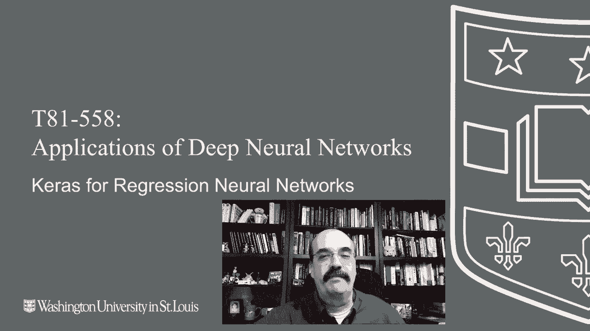

# 【双语字幕+资料下载】T81-558 ｜ 深度神经网络应用-全案例实操系列(2021最新·完整版) - P24：L4.3- Keras深度神经网络回归建模与RMSE评估 - ShowMeAI - BV15f4y1w7b8

Hi， this is Jeff Heaton， Wee to applications of Deep neural networks with Washington University In this video。 I am going to show you how to construct a regression neural network in Kias。 a regression neural network is a neural network that is capable of predicting numbers as opposed to classes or nonnumeric values in the case of a classification neural network that we just saw for the latest or my AI course and projects。 click subscribe in the bell next to it to be notified of every new video。😊。

So if you're dealing with regression， we're going to take a look at that sample data set that we've used a number of times that predicts individual people which product they're going to buy in this case though we want to make it a regression problem。 so what we're going to do is try to predict their age based on what product they bought and the other aspects about them。

So this code is very similar to the feature engineering that we've done before。 we're filling and missing values， we're standardizing various ranges。 disease scores to make it more predictive for neural network， but Y is coming from age。We're also going to split into a training and test data set。Next。

 we're going to build and train the neural network。Again。 fe attention to how we are setting up the loss， this is regression， so out one output neuron。Mean square error is our loss function。We run it， it trains us really pretty good。 the validation loss quickly falls off。And we're left with a pretty good。Result。

 we're going to calculate the mean square error， the mean square error。Is essentially the difference between every predicted value and every expected value squared。And sunned。So if we look at the mean square error of this， it's 0。45。 The problem with the mean squared error is that the units， it's a lot like variance in statistics。

 the units are not meaningful。The only thing I can really say about a mean square error is lower is better。If you take the square root of it， it becomes the root means square RMSE。 which you've probably heard of before， it's a common ametric RE。We take the square root of the whole thing， and now the units are in the same as。The the data。

 so we can see it's 0。67， so we're about a year， a little bit less than a year。Off when we try to calculate how close we are to the actual values for age that we're predicting。A visualization that is very useful for RMSC is something called a Ly chart。So the way that I generate a Ly chart， there's very different ways。

 there's a couple of different ways floating about。 I definitely did not invent this。 but this is the most common way that I've done this。 So we're going to sort the data by the expected output。 These are your y values。 So the actual ages。 So the data will be in in that order。 So this will be monotonically increasing， the line will go up。

 up， up， but not ever back down as as the ages are sorted that way。And then for every。X。 for every output value along the， along the X， we are going to。Essentially plot where the actual predicted value was so these two lines。 if it's perfect will overlap exactly， but you you'll see some of the noise there the x axis is just 0 to 100% of the data and the Y axis is ranged according to the values predicted so zero to the age Now to read this chart。

 the expected and predicted line should be close notice where one is above or below the other because maybe for higher ages you're less accurate and for lower ages you're better。The below chart is。Generally more accurate on lower ages， butll we'll see that's not always the case。

 It depends on how the。How the training actually went from the random values。Here this is actually a really， really good one， we've got some outliers on higher ages up there but。In general， that's why I say that it is typically more accurate on the lower ages。So this shows you it's somewhat noisy as it's going through the expected values。

 you can barely see the expected because the predicted line is right on top of them。 so this is actually quite good。And the numbers on the bottom zero to 500。 there's 500 elements in our test set， so that's where that is coming from。

Thank you for watching this video and the next part we're going to look inside of the back propagation algorithms and see how they work This content changes often so subscribe to the channel to stay up to date on this course and other topics in artificial intelligence。

