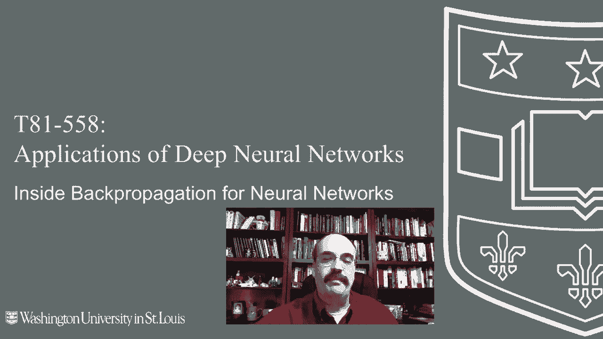
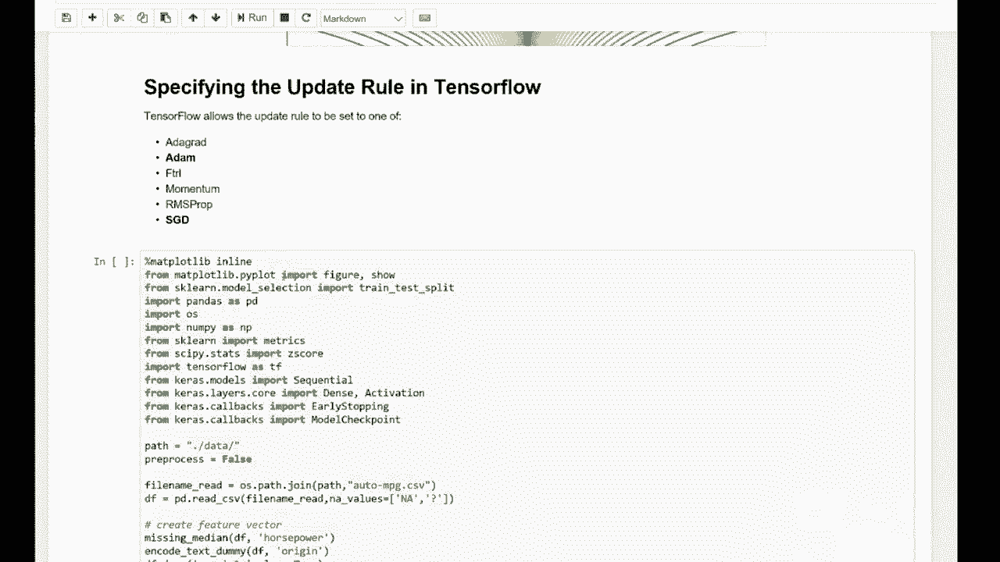

# 【双语字幕+资料下载】T81-558 ｜ 深度神经网络应用-全案例实操系列(2021最新·完整版) - P25：L4.4- 反向传播、Nesterov动量和ADAM训练 - ShowMeAI - BV15f4y1w7b8

嗨，我是Jeff Heaton。欢迎来到华盛顿大学深度神经网络应用课程。在这个视频中，我将向你展示内部工作的反向传播算法。我们将看看经典的反向传播，还有原子，Netroov动量和其他常用的训练深度神经网络的技术，这是AI课程和项目中最新的内容。

点击旁边的铃铛订阅，以接收每个新视频的通知。如此经典的反向传播。反向传播已经存在了一段时间。Jeffrey Henton对此做出了相当大的贡献。以及werebo也是如此。因此，许多人介绍了反向传播的各个方面。

并且多年来一直在继续建立。你在这里看到的这个方程是你非常一般的训练方程。这只是说T。现在T是当前的时期或时间。这是在说权重。这些是theta的权重。当前时间的权重等于前一时间的权重减去当前时间的V。

V。😊。

当前时间只是一个向量。所有这些都是向量，它们保持了我们将改变每个权重的数量。所以单独的这个并不能告诉我们太多。它只是说我们将改变权重。每次都是通过这个变化量的向量。现在，变化量的向量。V子T将会看到一系列的函数，显示我们如何计算V子T。

首先是经典的反向传播。所以如果我们看这个，这是梯度下降。所以你有Eta乘以现在，Eta乘以其余的部分。这本质上是一个单元。这不是。这个东西乘以J函数。这是Nabla或倒置的Delta或者像竖琴形的运算符。

这意味着用损失函数的梯度对先前时间步或先前时期的权重进行梯度下降。所以这基本上给出了所有的梯度。乘以学习率，学习率的常见值是0.10.01。很少你会想要使那一个，这样你就完全将梯度添加到权重中，那将会是太混乱的。

现在，让我们看看梯度到底是什么，以及它是如何实际使用的。这是一个导数。这是一个偏导数，所以你总是取一个多元微积分的偏导数。你用所有其他权重保持不变的情况下取一个单一变量的导数和一个多变量表达式。因此，一个单一的权重与所有其他权重保持不变。

所以这基本上展示了特定权重的误差函数。当你调整权重时，这个权重的误差。所以如果你使权重0，误差就会在这里，然后上升，然后急剧下降。这在你仅改变神经网络中的一个权重时可能是真实的。

错误函数会上下变化其值。通常，我们正在做梯度。所以我们想要把权重完全移到这里的最低点。现在，我们不想要绘制这个整个图表并且在每一个点上对神经网络进行抽样。因为整个神经网络中每一个权重都有不同的图表，这会非常昂贵。

当你改变一个权重时，所有其他的权重也可能改变。这就是你必须进行偏导数的地方。我们只为一个权重做偏导数。假设权重目前为1.5。所以我们只知道误差在这里。我们不知道图表的其余部分或继续。

我们只有这一个点，那个点不告诉我们太多，直到我们对损失函数取导数。然后那告诉我们瞬时变化率。所以你得到了斜率。这个错误函数曲线上的这个点。注意这条线有一个负斜率。但是如果我们只是把梯度加上去，这个负值，无论那个负斜率是多少。

那将减小权重。它会朝错误的方向走。所以如果你真的想要走这个方向，因为我们已经过了那个山丘的顶部一点点。如果你想朝这个方向走，你需要取斜率的反方向。这就是为什么在这里我们进行了子T，因为如果这样，我是说，假设我们就在这里。

那么这条线的方向会非常类似这个方向。并且那将是一条非常负斜率的线。你会想要一个正数。所以你继续走下去。如果我们就在这里，那么斜率将是正的。但我们希望从权重中减去一个来继续沿着这个方向。

这就是经典的反向传播。它由学习率控制。如果你的学习率设置得太大，而不是设置一个梯度降下来，你可能完全跳到它的另一侧。你永远找不到通向这个更低值的路。

学习率描述了我们尝试将权重推向最优值的速度。这个链接非常有用。它展示了一个我写的JavaScript应用程序，带你经历经典反向传播的所有步骤。

因此，你可以看到整个神经网络是如何为XOR计算的。接下来是动量传播。反向传播。所以动量是添加到反向传播中的东西，以防止陷入局部最小值。局部最小值可能在这里。可能在这边更进一步会有更优的值。但一旦权重定居到这里。

它真的很难完全推出那个山谷并继续前行。

这里有一种情况。权重，也就是球当前的位置，实际上卡在了一个局部最小值。这里可能有一个全局最小值。很难知道全局最小值在哪里。这通常几乎是不可能的。因此，这个权重本应该一直下降，但可能会卡在这里。

如果不是动量推动它越过这个山峰并让它继续。动量正如其名。你可以把这些权重想象成在高维空间中移动。动量只是给权重一个推动，并在它保持动量的同时持续这种推动。这是动量的公式。现在我们有两个超参数。我们有Eta。

学习率是**学习率**。但我们还有lambda，它是**动量率**。这一部分与经典的反向传播完全相同。你只需计算梯度。乘以学习率。但这里有一个额外的项。这就是动量项。它是lambda乘以V t -1。

所以无论我们之前的delta或更新是什么，我们都在用lambda进行缩放并添加它。你只需将最后的更新缩放后直接加到方程中与其他内容一起。这就是动量的全部。因此，当你向下移动时，你会积累很多动量，因为你可能会比较快地向下移动。

然后，这个变化很大程度上是一个正的权重，应该不断添加到权重上，希望能把它推过山峰，可能从局部最小值中走出来，进入更好的状态。顺便提一下，动量的一个非常常见的值是0.9。

他们通常偏向于较大的动量。学习率通常要小得多。通常是0.10、0.01或其他负的10的幂。接下来，我们将关注在线批量传播，这是传播训练的重要概念。稍后我们会看到，我们可以在TensorF中配置这些值，并确定批量大小。批量大小就是你需要处理多少个训练集元素，因此我们计算的每一个梯度都是针对单个训练集元素的。

所以你可能在训练集中有1000个元素。在你计算每一行训练数据并得到权重的deltas时，不需要每次都更新权重。你可以将它们批量处理，方法是简单地将梯度相加。因此，你处理训练数据的第一行，然后得到一个梯度向量，它等于权重的大小，你可以计算下一行训练数据，并将这些梯度添加到之前的值上。

你不断地向梯度中添加向量，直到达到批量大小。所以批量大小，如果你有一个批量大小为10，这意味着在处理训练集时，它将处理10个元素，然后在这10个元素结束时，它的梯度基本上是整次运行的总和。

然后它会将更改应用到权重上。在线训练仅在计算梯度时，将更改尽快应用到权重上，你一次只计算一个梯度，为一个训练样本计算梯度。将其应用到权重中，继续下一个训练样本，计算它的梯度。

将其添加到权重中并继续进行。拥有批量大小可以显著提高神经网络的训练效率，这也是非常符合大数据的，因为如果你有一个非常、非常大的数据集，你只需从中随机抽取许多批次。因此，许多批量训练是训练神经网络的另一种非常常见的技术，许多批量的大小通常在32到64之间，因此它们相对较小。步长和迭代就是神经网络经历了多少训练周期，步长迭代甚至是现在我们来看看随机梯度下降，它通常与许多批量训练结合使用，随机梯度下降用于提供非常随机的结果。

发生的事情是，与使用整个数据集计算梯度相比，你只选择小组，并且不断处理这些随机样本，带有替换。随着你一个接一个地处理这些神经网络训练数据，每次误差都会减少，有时会增加，有时你会选择特别糟糕的训练数据集，有时你会选择特别好的集合。这几乎完全取决于情况。因此，随机梯度下降通常单独使用或作为其他训练的一部分。

这种方法在计算上是高效的，并通过只关注少量相对较好的权重来减少过拟合。此外，还有许多其他技术，比如我说的反向传播和梯度下降，这只是一些主要的基础技术。

它们试图解决的是学习率和动量。这两个都是超参数。这些是你需要与其他所有参数一起调整的数字。你以为仅仅需要选择隐藏层的神经元数量就已经够糟糕了，现在你还得考虑学习率和动量。

你需要弄清楚最佳学习率和最佳动量，以便能够有效地训练这个神经网络。问题是学习率，如果你调整得太小，它永远无法准确地训练你的神经网络，它只是没有承担足够的风险。如果你把它调得太大，你的神经网络将会非常不稳定。

非常不稳定和动量，如果你把它做得太大，事情会变得不稳定。如果你把它做得太小，它实际上没有什么效果。另外，如果你仔细想想，这个学习率是应用于整个神经网络中的每一个权重的。也许一个单一的学习率是不够的，也许一些神经元学习得比其他的快。

所以他们喜欢把多个学习率的概念放在一起，或者有时你会看到他们会随着训练的进行自动减少学习率。所以我们试图摆脱每个权重都有一个全局学习率和动量的情况，然后也。

转向使这些值非常敏感，非常不敏感，或者非常适应那些选择得不好的值。这些是我过去使用过的一些其他训练技术。有弹性传播。它效果不错。它基本上承认梯度的符号可能是最重要的事情。

它告诉你权重应该朝着哪个方向移动以更好地优化。它也不需要学习率和动量。所以它在早些时候很流行。在深度学习加速的梯度中并不常见。它做的是使用随机梯度下降。

它有助于减少只选择一个非常糟糕的小批量数据的风险，然后损害你已经进行的其余训练。有添加梯度和阿纳德尔塔。这两者都是。在梯度中，基本上它保持一个按权重衰减的学习率。

但它是单调递减的，它永远不会再增加。所以这就是为什么创建了添加Delta来解决在梯度问题中的那个学习率可能朝一个方向去，并减少到几乎为零的问题。还有一些非梯度方法。如果你不能对你的最后函数进行导数操作，这些可能会有用。这包括模拟退火、遗传算法、粒子群。

Nedermeed和许多其他。因此，原子更新规则之前谈论的经典反向传播。这只是我们之前将V计算到这个权重更新算法中的另一种方式。现在原子更新规则。它之所以很好的一个原因是你不需要过多地关注学习率。虽然存在一个学习率，但是你拥有的那些值。

原始论文的作者King Muba，他们对超参数给出了一些好的建议。而且我很少，甚至是最后那个学习率也倾向于负8。他们通常不必改变那些。这是一个相对较新的训练算法。它是在2014年引入的。它是一个流行的算法。

它处理稀疏数据的训练。我们有很多缺失值，还有随机误差函数，误差函数是随机的，因为我们在进行随机梯度下降，因此我们不断随机抽样一个批量大小并基于此更新神经网络。因此，你从一次迭代到另一迭代的改变可能没有帮助，因为你在每次抽取的都是不同的训练数据。关于这个的论文在康奈尔大学的档案里，如果你之前没有接触过档案，那是希腊字母χ，所以是档案档案和矩的矩的矩估计方法，你在这里看到的，这是估计一组值的每个矩的方法，所以就是均值、方差等。我们来看看。

这篇论文实际上与我们看到的其他代码非常相似。所以这只是t等于t加1，表示我们在时间上移动，我们正在初始化第一和第二矩，第一矩是均值。

所以你试图估计的梯度的均值。V是方差。第二矩是第三和附加矩。但我们处理的仅是这两个，第一个和第二个矩。顺便提一下，这就是“加”的名字来源，自适应矩估计，然后我们将时间设置初始化为零。

所以这两个初始估计值为零。我们将计算G，梯度。所以这个梯度，就像我们之前所做的，非常类似于经典反向传播。术语稍有不同，我用的J改成了F，因此这是损失函数，包含权重，正是前一个模块中的符号。我们将获取那个梯度。这两个值处理偏差。

由于这些值初始化为0，因此早期会产生巨大的偏差，因此这只是两个。嗯，抱歉，这里的帽子实际上是在计算，它们处理的是最初的事实，即这些值从零开始。因此M帽和V帽M和VT本身，基本上是在更新每一个。你会注意到这是基于上一个T的M。

它们在执行过程中不断更新，实际上正在逐渐创建对第一和第二矩的估计。这些都是向量，显然它们与权重相关。因此，这基本上是在为每个权重创建一个几乎是学习率的东西。第一个是一次幂，然后是二次幂，所以这是平方的。

我们计算这些调整值只是为了处理这些值最开始为0的事实，然后我们将更新权重。所以权重t，这个非常简单。这部分与我们尝试突出底行时完全相同。但到这里正是我们在经典算法中所用的。我们在减去梯度。

但不是减去梯度，而是使用这个公式来更新参数或权重。Alpha 是学习率，所以通常称为学习率或步长。你在这个基础上进行乘法来进行缩放。然后你放入两个帽值，这些帽值是基于这些数据，以便调整它们，使它们最初不会过于偏向零。

本质上这是 Adam，它比经典的反向传播稍微复杂一些，但并不是特别复杂。我是说，实施起来并不难。在 Java 或其他编程语言中，他们讨论了算法。他们谈到了初始偏差校正，为什么需要，以及如何计算这两个帽值，这是非常必要的。

我承认我没有仔细阅读这部分，觉得它有些复杂。他们在分析收敛，这本质上是为什么它有效的证明。然后他们引用相关工作和实验，通过实验实证证明为什么它有效，并用 E 定理试图谈论它为何有效的证明。相关工作，R Pro 和 Agrad，那是两种在 Adam 之前存在的非常相似的训练技术，这部分是直接来自论文。

但我更喜欢看伪代码。如果你对此感兴趣，我在这里复现了它。这是一个非常好的图表。我没有创建它，我有链接到我找到的地方。是的。所以，无论如何，然后他引用了原作者，确实要给予应有的信用。

这是一个非常非常好的图表。这是一个动态图。这本质上是一个搜索空间。你可以把它想象成一个崎岖的二维平面。星星是最低点。那是你想要到达的地方。这就像😊。就像弹珠沿着山脊滚落。这就是随机梯度下降。

这是最慢的一种。所以这是你经典的反向传播。最终它是可以到达的。最早到达的那个是加 Delta，它看起来像绿色的。动量开始时很慢，但如你所见，确实会积累动量，然后快速超越。因此，这就是你不同的训练方法。

Adam 在这里出现是因为在创建这个时，Adam 还不存在，或者至少不常见。但你可以看到其中一些，比如动量。显然它开始真的在积累动量，小绿球迅速超过。

SGD 只是慢慢有条不紊地在工作，甚至都没能完成。他们放弃并重置，因为其他人都完成了。Kras 和 Tensorflowlow 提供了多种这些技术。你可以看到那些被突出显示的，它们有随机梯度下降和 Adam。

我相信还有其他方法可以达到这些目标。我很抱歉，这些都是 Tensorflowlow 提供的。我老实说不知道 FTRL 是什么，或者我不熟悉其他的选项。我所强调的这些可能是你最感兴趣的。我也会想强调 RMSs Pro。你可以尝试这些，可能会得到更好的结果，你可以在这里和优化器一起指定。

如果你指定了其中一个，这意味着你将在这里传递一个学习率的类，并且实际上也传递参数。你可以查看 Tensorflow 的文档，他们会向你展示如何使用，并给出实际的类名。

但你可以通过将其名称放在这里直接使用任何一个，如果你想指定更多的参数，你需要放一个对象。这是我尝试这些时得到的一些结果，因此你可以看到在每加仑英里数据集上，我们得到了不同的结果，而像单位动量则需要比说的要多得多的训练。

显示最后一次成功或最后几次迭代。因此，Adam 收敛得很快。我对这种训练技术很有好感，并且经常使用它。At agrad 也相当不错。因此在 agrad 上，我非常喜欢 RMS Pro，确实，我已经看到它的用途。我会。😊我会在训练神经网络时在这些之间进行尝试，并且我通常从 Adam 开始。

但我们将尝试 agrad 或者我们的 MSP。可能有更好、更科学的方法来选择这些，但对我来说，这种方法通常效果不错。好的，这个模块到此结束。

感谢观看这个关于如何训练神经网络的视频。在下一个视频中，我们将从头开始实际计算一个神经网络。我们将看到如何从 Keras 导出权重，并使用这些权重实际计算神经网络的输出。这消除了过程中的所有魔法。这个内容经常变化。

所以请订阅频道，以便及时了解本课程和其他人工智能主题。😊
