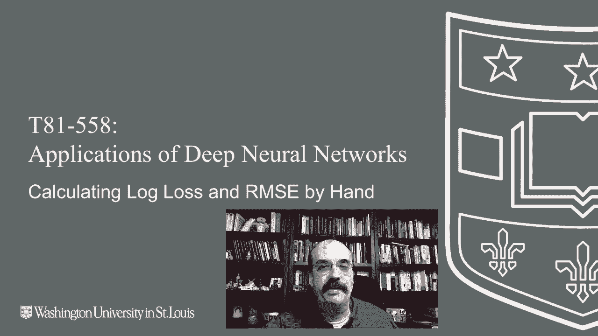
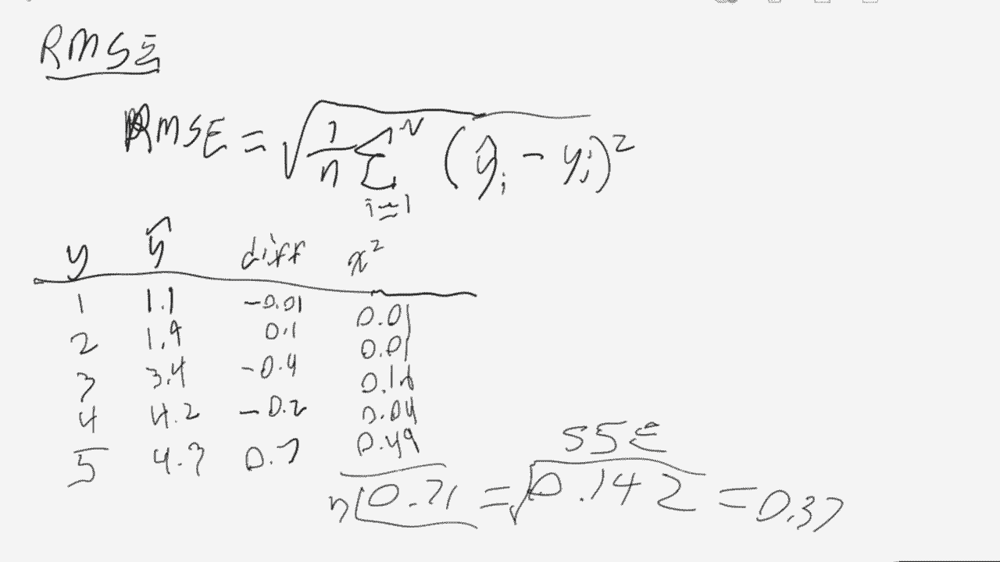

# 【双语字幕+资料下载】T81-558 ｜ 深度神经网络应用-全案例实操系列(2021最新·完整版) - P26：L4.5- 从头开始计算神经网络RMSE和对数损失 - ShowMeAI - BV15f4y1w7b8

Hi this is Jeff Heaton， welcome to App of Deep neural Networks with Washington University。In this video， we're going to see how to calculate some of the error metrics by hand so that you can literally see how these numeric values actually come about。 We'll look in particular， at log loss and root mean square error for the latest on my AI course and projects。 Click subscribe in the bell next to it to be notified of every new video。 Now。

 we'll see how to calculate R S E and log loss。 completely from scratch。 We'll start with regression。😊。

You can see the code here， the code near the top is demonstrating how you would calculate mean square error and then root mean square error using the built in functions normally this is how you want to do and this is what we saw earlier however。 if you want to see how to actually calculate this，You can see that we get the exact same results。

 we're basically taking a sum of squares。Here you can see the predicted minus the expected。 and we sum those the squares， and then finally we divide that by the length of the predicted。 so it's kind of like an average where the squares are being used to negate the signs for one thing。 and it's also it can be easier to take the derivative of those square terms than the absolute values for training purposes。

For classification， we're doing a similar sort of thing。Except we're using the log loss。 You can see at the top how you have the expected and the predicted and how you can literally calculate each。 each piece of the of the log loss and sum of them together。 getting the exact same value as you would have gotten from the built in function。 Now。

 we'll see how to work through all of these。 Now， let's go through and calculate both of those by hand。We're going to start with log loss。Here's the equation for it。 Okay。 this equation might look somewhat complicated， but there's actually several parts to it。 and let me kind of take this piece by piece and show you really what is going on there。First of all。

 let's look at the graph of what a logarith actually looks like because that helps to explain some of this。So for the log rhythm， there's a couple of very important points log of zero is。Essentially undefined or asymptote to negative infinity。 log of1 is 0 of is as you plot the logarithm。It crosses here at 0。 Now。

 I am really bad at drawing equations， but you'll get the general idea。 bit of infinity kind of asymptotically there。And then， it grows really relatively。Small as it。 as it continues in that direction。Logar， I in my studies。 it's come up really twice where we care about what it actually looks like。

 It comes up a lot more than that。 but just in the areas that I particularly dealt with。 if you're dealing with computer science。It is this region that is particularly interesting。 because when you're doing algorithm analysis， order， order N type stuff， a logarithmic。Scale is actually pretty good。 It's not really increasing all that fast compared to something like exponential。

 which is just going to go up very， very， very fast。But that's that part of the of the logar graph is not what we're interested here in the realm of data science or machine learning。 Data science and machine learning is more interested in this segment of it。That is where we use to analyze error。So this is the data science region。

It's probably not strictly mathematically corrective， computer science and data science。 I'm sure the two cross over into these other two realms。 but this is just a good way to think of this in a very simplified view。So in data science。Or in this machine learning log loss function that we're calculating this region。

 if you think of one is being。Is being completely correct， or you've guessed it correct。 So you're trying to classify something。 It was true。 You've chosen true。 That means that the error that is contributed to， to your to your error equation is going to be 0。 which is good。You guessed it completely correct。What you don't want to be is confidently incorrect。

 So in these machine learning algorithms， if you want to say true。 you don't just usually say true or false。 you will say， I think with 0。9% probability， it is true。Don't you wish you could have done that back on true false questions in in school if youre。 if you're just really not sure you could put 0。5 probability。

 meaning I don't know it could be true it could be false。 You'd mostly lose half a point。Well。 or you could do 0。75 probability。 You would get you'd get three quarters of your point if you're correct。 but only lose 。25 if you were not。 So that's， that's how these are evaluated。 What you don't want to be， is confidently incorrect。 So if you say it's true with 100% probability。

 And then it's false。 then you're down here at a infinitely bad score。 I'm glad school isn't like that。 You can't get an infinitely bad score。 You can just get a 0。 But。Here you can be so bad that it's infinitely bad， that's why usually when you look at these sort of predictions。 you'll very rarely see predictions at zero or1， they're going to be very close to it because they want the optimizer algorithms will usually clamp it at that。

So notice two， for that region， for the data science part of it， everything is negative。You could talk about negative errors。 You could say I have a negative 025 log loss or something like that。 But just to get it， we're used to errors being reported as positive。 So that's why you have this negative up front。 That essentially just shifts it entirely to the。

To the positive range， that's all that negative is accomplishing there。The one over n。That part of it is essentially， that's the average。So n is the number of elements in your training set。 You don't want to have extremely large error for extremely large training sets。

 you need you want to normalize that just like the percent on your exam paper。That's why you divide it by the number， the number of questions。 If you just deal in points。 if you say， hey， I scored 30 points on my exam。 Well， if it's out of 30， that's pretty good。 If it's out of 3000， that's really bad。 So that is that is what the negative and the one over n is。

 is accomplishing。 Then we need to sumit sum all of those， all of those log loss errors。 And that is going to， that is basically going to。Give you the summation of all your log losses。And then you divide them by n。All of your log losses， zero。 ones near zero are not particularly bad you are close and either true or false。

Or the higher ones you are。You were largely incorrect。 You try to prevent。You usually clamp this so that you don't have Y hat values， Y hat， by the way， are your predictions。So the two y hats that you see here and here， those are your predictions。Why is the truth。 That is the value you're comparing it against。 And we have the subscript eye on each of these just so that we can calculate。

Or just because that's the individual number or the individual training set element and your prediction。The first part of it， which is right here。That's dealing with true cases。And then the other part of it is dealing with false cases。So you're classifying， is it true or false？

The way that these are controlled is sort of a mathematical if statement。 Mathematicians like to use coefficients， often for if statements。And the two F statements that you are dealing with are basically here。And。And there。If y sub I。 that is the absolute truth， that is the value from the training set that you're comparing against。

 If it's true， then this is going to be one。 The green y sub I is going to be one。 If it's false。 then it's going to be 0。 So this， the first coefficient， the green arrow is going to be one。 In all cases where we are dealing with true values。 and the red arrow is going to be false in all cases where we're dealing with false values。

Because of the1 minus。 So that essentially turns off these two sides。 So one of those two sides is going to cancel out each time。 depending on if it's true or if it's false。So if this really is true。 then sub1 y sub i is going to be one。So it won't cancel out。 and then the log ideally。

 if the real answer is true， you would like why hat to also be true or one。 if that is the case and you nail this right on the nose， then log of one0。 so that term will then cancel out。But that's good because you had。 you had a perfectly correct answer。 And it now， you don't want any error to be contributed。

 If you had guess 。9， then the log 。9 will be added to your， to your error。 But that's not so bad because you're still。Basically， the closer you get to zero。 the worse your score is going to be。Look at the at the。At the curve on the Cartesian plane that I have drawn。 Now， on the other side of the coin。

 if it's false， So if the correct answer y sub I is is is false or 0， then that first。 the true term is going to cancel out。And then the false is going to be one。 So it's going to have a coefficient of 1，1-0 is 1 multiplied by the log of 1。1 minus y sub I。 We're basically now doing that in reverse。So doing that in reverse。

 we are now basically going to deal with。If you had a one now in this case。 So it was false。 but you guessed true， you're now infinitely wrong because 1-1 is 0。 and that takes you to。 to infinity on the on the log。 Now， if you had guessed close like 0。1， Well，1-0。1 is 。9。 and that's not quite as bad。 you're kind of in the same in the same location that I just described。

 So you're closer up that closer to 0 on that log calculation。Now when you actually implement this。This approach has a couple of errors when I mean issues when you're dealing with this in computer science or implementing this as a program for one。Your depending on how smart your， your programming language is to cancel out things that are 0。 You're potentially calculating the log rather twice。 You really don't need to。

 because it's going to cancel out。 The other issue that I have been burned by at least a couple of times is that if either of these sides go to negative infinity。You're now effectively multiplying， even though。You even though you would like that to cancel out in most programming languages。

 zero times infinity is in fact， zero or is in fact， infinity。Mathematically。 you can make the case that it is0 if you use， I believe it's Haital's rule。 looking at basically the rates at which get of infinity on one side or the other。 you multiply it by the good half。 And even though you may have answered this completely correctly。

 and it shouldn't cause the equation to blow up， it does cause the equation to blow up because you've got infinity on one side or the other of a multiplication。 and the whole thing then goes to infinity。Or NA， depending on the implementation。So now let's look at how we will actually calculate this。 So the way that I'll show you to calculate it， we're not going to actually。

 we're going to do it more like the computer would do it。 We're not going to literally take the log two logs for every single line on this。 So let's go ahead and look at a couple of cases。 We're going to look at the cases just like we had。In the code that I showed you earlier， so that's how I know my math is correct。

 I'm largely regurgitating what I already did in Python。So we're going to have the data set where we're going to have why。And then why hat？

So this is the why is the correct answer， why hat is what we predicted？

We're not really calculating the differences。Up in the top part， there。 the only difference really is the the one minuses。 but largely， that's what we're getting to。 Essentially， we are， we are calculating the。We're calculating how far off。You are from and and adding the log of that。 So the difference is that I am calculating here。

By the way， this is the absolute value of the difference， not a square like we would do in R R C。 but just the absolute differences。 Now we need to take the logs of those mentioned。 let's go ahead and sun these， and then we will divide those by n。 the absolute value of that。 That is。 That is the value that we had for in the Python。

 So this is how you calculate the log loss just completely from hand。L R on a sea。Pencil battery is low。 I need to hurry。Everything needs to be recharged these days， even pencils on。 you have the one over n。 just like before。 You don't need a negative because these these are inherently going to stay positive。 And it's a sum of squares。 You're essentially taking y hat minus Y for each of these doesn't really matter the order that those are even taken in。

 because you're going to square those differences。 But numbers。 But these are the ones that I used in Python。 And that lets me check my math to know that I'm actually doing these correctly。Now we take the difference。Go'ming to go ahead and square each of those。And sum that going to divide them by n。This value is actually called the sum of squared errors。

This number， if you're， if you're just writing an algorithm and you're trying to optimize。 meaning you're trying to push a number to zero， stop here， use this on squared errors because。Doing the square root on top of it is just to get it into the same units as the training data。 If you're just optimizing， just use some of square， that's， that's plenty good。

 But if you're trying to report this to。To somebody to actually see how off you are。 then you need to take the square root to get RNSC。

So that is the Romen square error。 Thank you for watching this video。 In the next video。 we're going to begin to look at regularization， which is yet another way that you can combat overfitting for a neural network。 This content changes often。 So subscribe to the channel to stay up to date on this course and other topics in artificial intelligence。😊。