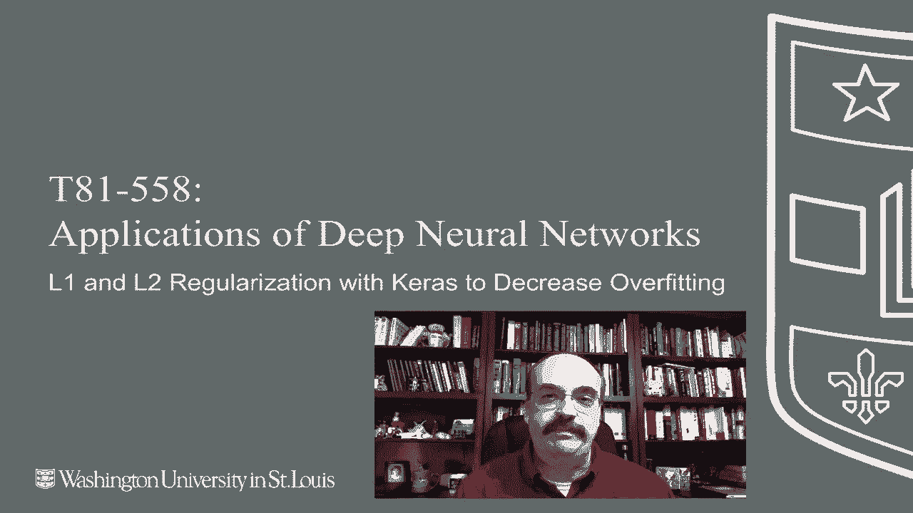

# 【双语字幕+资料下载】T81-558 ｜ 深度神经网络应用-全案例实操系列(2021最新·完整版) - P29：L5.3- 在Keras中使用L1和L2正则化来减少过拟合 - ShowMeAI - BV15f4y1w7b8

Hi， this is Jeff Heaton welcome to applications of Deep neural networks with Washington University In this video。

 we're going to see how to apply L1 and L2 regularization to Kira's deep neural networks for the latest on my AI course and projects click subscribe and the bell next to it to be notified of every new video we can use L1 into regularization with Kira just to review L1 and L2 we show their graphs here just so that you can see the effect of the absolute value versus the squing you can see that L1 more resembles the laplace is a lot sharper and that is why it will cause coefficients to go to zero or weights now that we're dealing with a neural network to go to zero whereas L2 iser and it will not necessarily push them to zero like the L1 does we'll see that we can use both of these either independently or together for a neural network I have a link here that shows you the actual instructions from Kis on how to do but we'll look at some exam。

That show you how to actually put this into your neural network。

 We're going to use the sample data set for this one。 We're going to be predicting the product。

 So we are doing classification let's go ahead and run this so that it gets loaded into let's go ahead and run this section so that it gets loaded。

 Okay， the data is available so this is where we will do L1 and or L2 regularization。

 It's done on a per level basis So you can see here we have an active activity。

Regizer and that uses O1。 We can also use a kernel regularizer and usually use the activity more than the kernel。

 The activity is dealing with the actual activations of the。😊，Of the regularizer。

 but I have tried back and forth with with both ones to see really which gives me the best result I do tend to get better results with L2 particularly L2 activity regulars than L1 I'm typically not trying to actually eliminate features altogether using using it on the neural network this can be a useful way to do that。

 you can read up in the Kira's documentation too a little on the difference between activity and kernel it really has to do with at what point in the calculation before after the activation function is applied that that regularizer is being applied and that's really all there is to it simply placing this as part of the first hidden layer causes the regularizer to be applied you can also decide to apply a second one here you can do L2 simply by。

Changing that from L1 to L2。Feel free to adjust that how however you like again this is another hyperparameter so it just requires some some optimization and trial and error we'll see when we get to the module that discusses CAle competitions。

 how we can optimize this automatically using using Bayesian optimization or at least get it pushed in a good direction as far as。

What we want to do with all of these hyperparameter。 This is the alpha that we saw earlier。

 This is just the degree to which this is being applied。 If you were to put a zero in here。

 it would simply cancel the one out and it would not be applied at all one would be full power You probably do not want to do that that would make the the training very unstable You can go ahead and run this one It will go through the crossval and generate the out of sample predictions we are simply training this for 500 epochs。

 we're not doing any sort of early stopping because we really want to get a good estimation of how well say 500 epochs would do so that we could run this a couple of times。

With different L1 and L2 values and get an idea of really what what each of these is going to do Now as it goes through。

 you're going to see the accuracy on each fold。 This is classification。

 so we're showing you the percentage。That this was able to predict correctly。 so on this first one。

 it was about 66%。And I'll let this go ahead and fast forward to get through the other ones。 Okay。

 and now it's completed。 the final accuracy was， as we can see here，65，95。

 And I want to show you something else that's somewhat of an annoying feature of。Of neural networks。

 we'll see that when you rerun them， the scores can vary quite a bit。 So remember 65，95。

 and also remember that full2 was the best one。 We will go ahead and fast forward this so that you don't have to wait for it。

 Okay， we're done。 So notice now it is not 65，95 anymore。 It's changed。

 So it looks like it got a little bit worse。 If we had tried adjusting things up here。

 we might falsely think that what we did up there it caused a problem and。

Just was not as good of a adjustment you also can see that full2。

 though not the best this time was still pretty good。

 that tends to stay the same because we did the seed value for the cross validation so up here where we set the random state to 42。

That certain folds will definitely be easier than others。

 and you like that to stay consistent so you can really compare apples to apples at least on the folds。

So we'll see later in this module that there's something called bootstrapping we can do where we run this whole bunch of times and we get the results back that are then average together。

 so we get a better idea of if if our adjustments to the hyperparameters are actually making a difference or not Thank you for watching this video and the next video we're going to look at dropout which is a type of regularization that was specifically created for neural networks。

This content changes often， so subscribe to the channel to stay up to date on this course and other topics in artificial intelligence。

