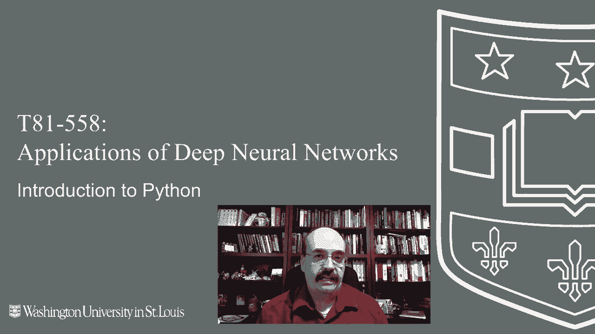
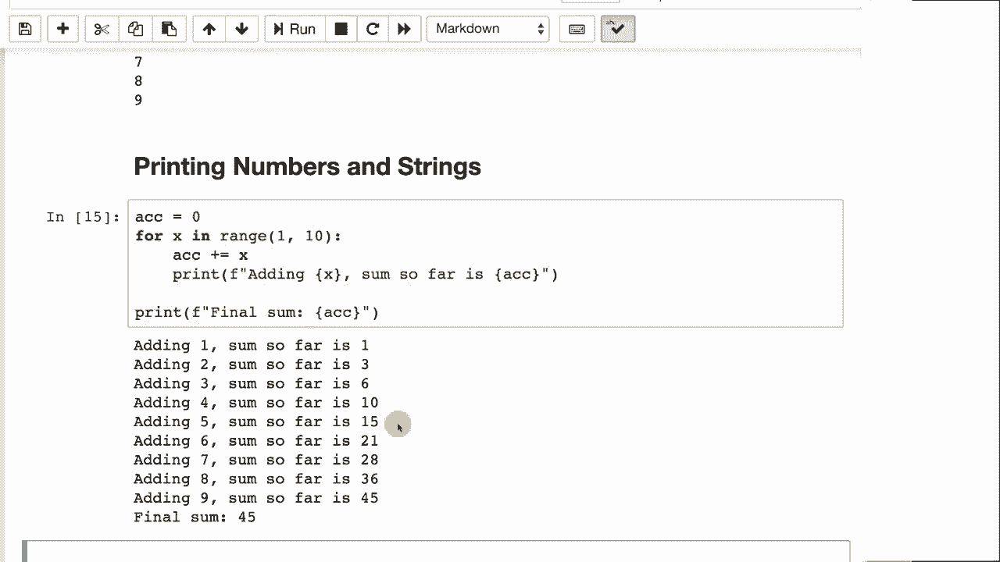

# 【双语字幕+资料下载】T81-558 ｜ 深度神经网络应用-全案例实操系列(2021最新·完整版) - P3：L1.2- 深度学习 Python 简介 - ShowMeAI - BV15f4y1w7b8

Hi， this is Jeff Heaton， welcome to applications of Deep neural Network with Washington University。In this video， we're going to look at an introduction to Python and see some of the preliminaries that will help you make use of the Python programming language as you work through this course this semester。

For this course we use Python 3， TensorFlow and Kes for the latest on my AI course and projects。 click subscribe and the bell next to it to be notified of every new video in this part。 we will take a look at the Python programming language。 This part starts at the very beginning with Python so we look at how to print out strings， numbers。

 looping and if statements。

The next part will get into lists and maps and how to deal with those so if you're already very familiar with just the introduction to Python。 you may well want to skip this part and proceed with with the next one all of module1 deals with an introduction to the Python programming languages。

 but we do get into more advanced topics such as pandas and mapRuce in the later parts of moduleule1。We are using the Python3 programming language。So it's important that you're using that Python 2。While is still a very viable Python version， simply has differences in syntax that will give you issues with some of the programming code in this class。Like most programming language tutorials， I'm going to start with Hello World。

And in Python you have functions， so print open parenthesesis close parenthesesis and you pass a string to it Now in older versions of Python。 you didn't always have to put the parentheses around this， you could just do print space。 hello world and quotes that was deemed to be not consistent with function handling in Python and eventually went away。So you'll want to have the parentheses。If you ever deal with print where there's not parentheses。

 that's older Python 2 stuff。You can also have comments in Python comments are great because they let me know what you're doing。 they let you know what you were doing later on when you might have forgotten when you submit assignments to me。Comments will always help if your code is not working correctly。 but I see in the comment that you had a general idea of what was supposed to have been happening。

 that's a real encouragement for me to give you at least partial credit。So running this with the comment in there。It works just the same as the first one， but。The comments simply ignored。The triple quote， so three double quotes in a row is pretty cool in Python。 this will allow you to have a multiple line string。 So if you run this。

It's like having three print statements and all the line breaking is handled for you。So you'll frequently see these in Python Now if you're putting in a large， large block of text。 you might really want to think about storing that text in a file rather than hard coding it right into your source code。But this is a good way if you are going to truly have carriage returns and line breaks in your code to encode it all into one string。

Now these are also sometimes used as comments because if you just have a string by itself。 so say I got rid of the print， open parenthesesis， got rid of the closed parenthesesis。 now that would be almost a multiline comment because you the string is not going to really do anything for you。Now in Python， like a lot of languages， you can have single quotes or apostropphes or straight line quotes。

 whatever you want want to call those。They work exactly the same as the double quote。 so you can choose interchangeably between this， this is just going to print out hellello world just like the other one。As far as picking which to use， sometimes the single quote is suggested for more symbolic type of strings。Characters， but not text。 if it's truly human readable text。

 then you probably want to use the double quote。 Now。 another technique that I will use that I find kind of useful is say I wanted to put a double quote right in the middle of this。 This would be perfectly valid， and I wouldn't have to do the normal escapes that you that you put around them。 Now， this is valid too。 This would put the W in quotes。

But since we have the string wrapped around single quotes， this also works。Numbers do not need quotes， and you can use variables。Variables in Python do not have types。 so it's simply a equals 10， b equals 10 in quotes。And Python figures out that the first one is an integer and the second one is a string。

 so you don't need to define those types ahead of time， it's a dynamic Now if you run this。 it prints out 10 and 10 so you can see that both of those two variable types are being accounted for。What's nice about variables is they can vary， so you can change the variable as you go here we started out with a is equal to 10。 and then we added one to 10。Now in Python 2， you will sometimes see a plus equals one。

 this does exactly the same thing as that first one It's just a difference in。In syntax。You've probably seen things like this too that does not exist in Python。So if you haven't seen that。 don't worry， doesn't exist in Python Now when you want to print out a string and a variable together。 there's a variety of ways to do this in Python， but the recommended way for this course is to use something called an F string。

An F string is just the letter F with either a single or double quote next。 And then you start out just having a normal string。 but then you can put anything you want to between curly braces。 And whatever you put between curly braces are basically expressions that would be printed out。

 They can be single variables like this。 This will print out the value of a is 10。You can also put expression type values in here， so a plus5 this will evaluate that expression。And put that put out that value for you。 Python has many ways to to print numbers。 These are all correct。 However， for this course we will。Use F strings。

 If you submit something to me in one of these other formats， that's perfectly fine。 Python has a lot of ways to print out numbers and strings together because Python's been around for a while。 So it's picked up quite a few different ways。 If we run this。We're going to see that they all print out a is equal to5 so we've got the S strings。

 we' talked about that this is a method that I used a lot until I started using S strings。A is equal to。Open close， curly brace。 and then you pass in all the values for So if you had another curly brace in there。 you would do something like a kind of B。 You can also simply concatenate strings together。 This is the somewhat more primitive way of doing this。 It's okay。 This can get you into trouble。

 sometimes。You have to usually put the STR around A if a is not a string。 otherwise you'll get an error。If you've ever worked in the C programming language。 you've got used to a function called S printf or Printf。This does basically that。 that percent D means print out a decimbel number。And then you do a parent percent sign。

And you pass in as many values as you made use of。Here we just have one。 so we print that out if statements。Python has， if statements， these are。These are quite useful to you， this also brings up one of the most hated features of Python for some people。 I used to be one of the haters， but now I somewhat like it。This is the fact that in Python。

 whitespace is syntax， whitespace affects how the programs run。So blockss， this if statement here。 everything that is indented。After that colon is part of that if statement。 so we could put in a second print statement if we wanted to， so long as we indented it properly。 it would be part of that if statement， the else works the same way if the if is not true then the else is executed。

And this program will run and since five is not greater than five。 it's going to print out the second one Now you can use tabs。 you can use spaces you can use any white space you want for these blocks but be careful if you're using tabs and spaces boths because that's a recipe for frustration for both you and Python Python won't really be frustrated it'll just give you an error It's going to make your code very hard to manage if you're if you're using both of those if you're using tabs。

 use tabs， if you're use spaces， use a consistent amount。 pick maybe two spaces or four spaces to represent that tab I typically use tabs。It's another great programming debate as far as should use tabs or spaces。And not likely to be solved anytime soon。 Different programmers prefer different ones for this class。

 I don't care。 Use spaces， use tabs， use whatever you want so long as your code works。 Now。 we can also get into multiple levels。If a equals 5， then it's going to execute that block。 but notice the elf Elsive。That basically means almost as if。You had that。 but it's shorter to type that。 so else if a equals 6。

 this is kind of like a case statement in Python。So if a equals five and notice two。 you have those double equals in Python the programming language。 the double equal basically means that it is。Equal to single equal means an assignment。So here we'll count to nine in Python looks like we're counting to 10。

 that's a common source of confusion， we're using something called range。 this essentially means that we're looping from one up to but not including 10。By the way。 if you ever see X range。That's old Python 2。Thing for efficiencies。 Don't， don't worry about that。 We are using range。 If you see code with X range， you're dealing with an earlier version of Python and this will just print out the loop。

 we're looping from one。Up to nine， you can also print numbers and strings together in these loops。 so here I'm creating an accumulator starting it out as zero。And we're going to loop for x in range1 to 10。The accumulator plus equals x， so we're accumulating。 we're adding x to it each time， and then we print out what we're adding and what the sum is so far。

If you run this program， it'll say adding one， so of course the sum is one。 then two gets added so it gets。To three and six，  one， 10， 15， and so the series continues。

It finally stops at 45。 Thank you for watching this video on the introduction to the Python programming language In the next video we will take a closer look at how lists and other data structures in Python are used。 This content changes often so subscribe to the channel to stay up to date on this course and other topics in artificial intelligence。

