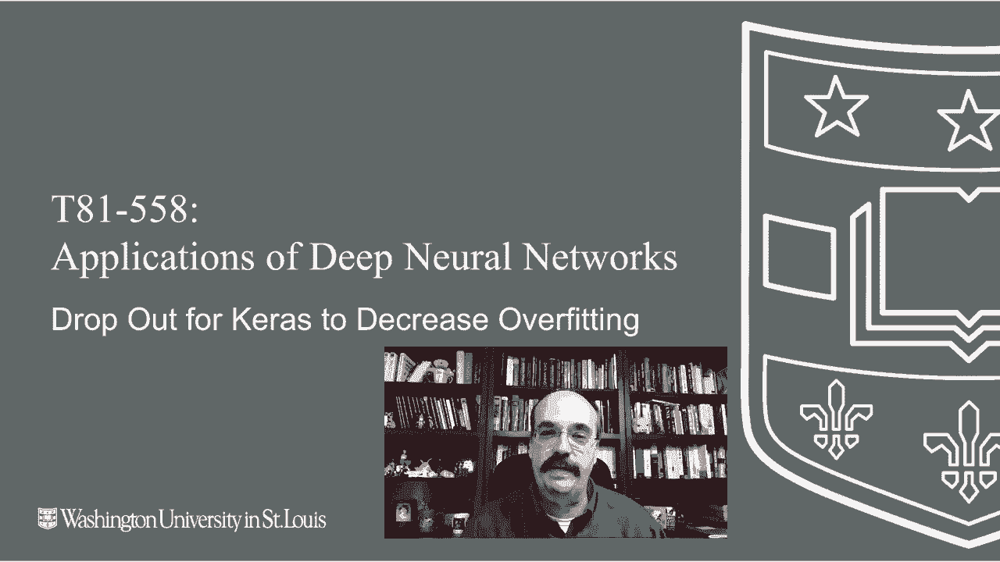
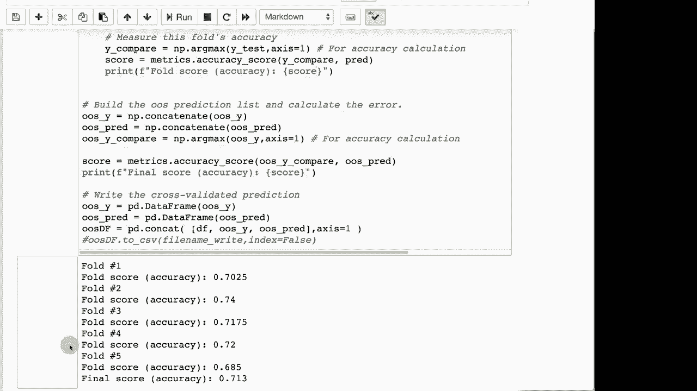

# 【双语字幕+资料下载】T81-558 ｜ 深度神经网络应用-全案例实操系列(2021最新·完整版) - P30：L5.4- Keras使用Dropout以减少过拟合 - ShowMeAI - BV15f4y1w7b8

嗨，我是杰夫·赫顿，欢迎来到华盛顿大学的深度神经网络应用。在这个视频中，我将向您展示如何使用dropout，这是一种您可以在Keras的神经网络中使用的另一种正则化技术，与L1和L2一起使用。要了解我的AI课程和项目的最新信息，请点击旁边的铃铛订阅，以便在每个新视频发布时收到通知。现在，让我们看看dropout实际上在神经网络中做了什么。dropout是逐层添加的，正如您在这里看到的。

dropout，您可以为该层指定一个神经元的百分比，在这种情况下，这个神经元、这个神经元和这个神经元会被丢弃。这样在每个周期的步骤中都会改变，您不断地改变这些神经元的可用性，即哪些神经元被丢弃，哪些神经元是可用的。

它们保持权重，但不再通过这些虚线对下一层贡献任何值。所以这是我经常听到的比较之一。

就像如果您去上班，每天公司CEO随机告诉一半的人回家，这实际上会很酷。但这样做会确保没有工人特别专注于自己的任务。

它们在这方面非常灵活，且不容易过拟合特定任务。因此，这种方式保持了神经网络的活力。这也试图模拟一堆神经网络，每个都有不同的神经元配置，以帮助减轻我们在上一个部分看到的随机性，您可以多次训练它们，并获得完全不同的结果。

因此，这在一定程度上可以降低神经网络输出的变异性。这几乎就像是内置的集成，您为每一层创建了许多虚拟神经网络，因为dropout是随机应用的。现在，dropout是重要的，当这些缺失的神经元都变化时，所有的神经元都会回归。因此，每一个神经元。

这些子网络在返回后，您就得到了完整的神经网络，以供您在拟合完成后使用。因此，dropout只在训练期间影响神经网络。它是另一个我们需要优化的超参数，可能会影响我们神经网络的有效性。

这是一个相当不错的动画，我很喜欢，它展示了dropout是如何在某种程度上工作的。基本上，在训练迭代过程中，它会随机选择一些dropout神经元来丢弃。白色神经元是仍然存在的，而黑色神经元是被丢弃的。

你可以看到输入和输出神经元仍然保留在神经网络中。还有偏置。你不会丢弃偏置。那么我们来看一下该怎么做。我们将进行分类。我会继续运行这个，以便加载分类数据。我们将从样本中预测产品。😊，就是我之前给你的简单数据集。

这就是如何进行丢弃法。非常简单。你几乎添加了一个层，一个丢弃层，它影响着之前的层。所以这导致前面的层50丢弃50%的神经元。你也可以再添加一个额外的层，通常我见过的大多数文献建议不要从最终的隐藏层中丢弃。

这是在输出之前的层。因此我们会遵循这个。但如果你想把它也加到那个层上，这就是你该怎么做。继续运行这个。它基本上是在为Kfold交叉验证做准备。现在我们可以看到它已经完成了，我们的最终准确率是70%，这实际上是相当不错的。

如果我们重新运行这个，我们可能会得到不同的准确率。但这确实有助于稳定随机权重的一些影响。我们来试一下。让我们再运行一次。可以看到结果是71%。所以实际上，我们可以看到总体上，在我们两个样本的情况下。

这个丢弃法似乎相较于我们之前在其他视频中使用L1和L2时帮助更大。现在它并没有完全消除方差，我们的准确率从70%提高到了71%，仅仅是通过重新运行。

在下一个视频中，我们将看看如何使用自助法，这样我们可以通过多次运行并将结果平均来获得更好的基准。感谢你观看这个视频，在下一个视频中我们将一起看看L1、L2和丢弃法，了解你应该使用哪一种以及原因。这些内容经常变化，所以请订阅频道，以便及时了解这个课程和其他人工智能主题。

