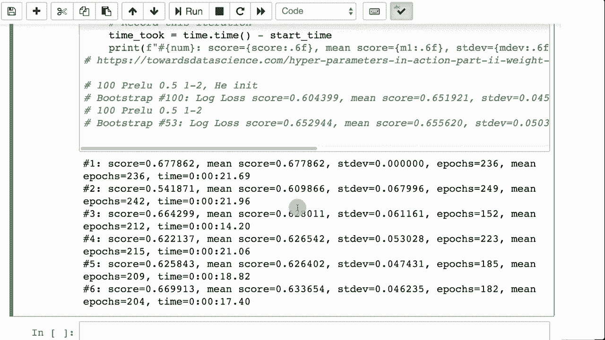

# 【双语字幕+资料下载】T81-558 ｜ 深度神经网络应用-全案例实操系列(2021最新·完整版) - P31：L5.5- boostrapping与基准超参数 - ShowMeAI - BV15f4y1w7b8

Hi， this is Jeff Heaton。 welcomel to applications of deep neural networks with Washington University。 In this video， we're going to talk about L1 L2 and dropout together。 You might be thinking great。 I had to figure out how many layers to have in a neural network。 how many neurons to put in each of those layers。 Now。

 I've got all these regularization techniques to figure out as well。 It's getting complicated to architect and neural network。 Later in this course we'll see that we can use Bayesian optimization to help us figure this out。 But for now， I'm going to give you some practical tips in this video for the latest on my AI course and projects。

 click subscribe in the bell next to it to be notified of every new video。 So we've vet on quite a few hyperpara as we've made our way through this course up to this point。😊。

There's the number of layers in a neural network， adjusting these hyperparameters can definitely have an impact on the performance of your neural network。There's also how many neurons you have in each layer。 there's what activation functions you're using on each layer。Now we've added dropout percent per layer and the L1 and L2 regularization values per layer。

And you know what we're not done yet。 We're going to add even more on as we make our way through the rest of the course。 These are a lot of hyperparameters， and it can be difficult to determine exactly how you should set these。In this video， I'm not going to show you any techniques for particularly optimizing any of these hyperparameter。 but I am going to show you a way that you can evaluate what effect your changes are actually having。

As you saw in previous parts of this module leading up to this point。 if you rerun the neural network a couple of times， even with a fivefold cross validation。 you're going to get various results from your final accuracy RMSE。 depending on if your classification or regression。

 this can make it very difficult since your accuracy or your predictive power of the neural network somewhat bounces around naturally before you even change anything。 it can be very difficult to know if the change that you just made to one of these hyperparameters has actually had an effect or if you're just seeing normal variation in the neural network as a result of the random weights that that neural network starts with in this section。

 we're going to look at something called bootstping Now。 bootstping is similar to cross validationation in that it is a technique that you can use to get training。はい。And validation sets to work with your neural network on。 But it's different because it's not a set number of folds。

 You simply keep re grabbing a training and validation set from your initial data set over and over and over again。 and you do this with replacement。 Now， when you say with replacement。 that means that the first time you pull these elements out of the data set。 you put them all right back in and the next time you pull from the same group。

So you could end up with exactly the same training and validation set on multiple polls from。From your dataset， But that's fine。 we are going to average all of the accuracy or rooting square errors together to get an average performance for the neural network and will simply keep pulling more and more and more runs from the data set as we keep going and we'll look at how many runs。

 how many splits of your data it takes before your average error starts to really converge to a consistent value。 We're also going to use early stopping so we will stop training the neural network when the validation set no longer improves。 This will also allow us to report on an average number of epochs that is needed for this particular data and neural network so that you can start to get an idea of how many epochs you should really train with Now。 since we are using this for benchmarking。We are going to want to report the time that certain things took because we might want to run this on Google CoLab or some other cloud based resource that will let us have more compute power。

I'm just going to define that function。 It's easy enough。 Let's look at how we'll bootstrap for regression。 So I'm going to show you a regression and a classification example of bootstrapping first。 and then we'll look at the actual benchmarking program for this， since its regression。 we are attempting to predict the age。This is the simple dataset set that we've used a number of times throughout this course。

 I'll go ahead and run that。 It'll simply load it， and it's done loading。 Now I'm going to bootstrap it。 So let me just go ahead and tick this off because it takes it a little while to run。 and start to explain it Here， we're defining the number of splits。 This is how many runs through this。 We're going to go。 So I chose 50。

50 would be a bit big for a cross validation because you would end up with a validation set。 There's one 50th of the data set and on smaller data that that would potentially be problem。 But here we're doing， So we're doing a shuffle split。Just like with cross validation。 we will use a stratified split when we get to classification because we don't want to accidentally change the class balances because that would introduce bias that would give us potentially an incorrectly trained model。

 at least it would be slightly off because it would have been trained on the wrong balances。 portions of the classes that is to be classified。The 0。1 tells me that I am taking 10% of the data set for a validation set。 and we're using 42 so that we have consistently random results from sampling them。

 It's not as important to do a random state for bootstrapping because each time you run through it。 I don't know that you necessarily care that split one is going to be the same as split one again when you run it。 but in cross validation， it can be nice to have those consistent folds。 We're going to split it。 Run through with each of these train and tests。And we're going to construct the neural network。

 So these are your hyperparameters that you'd want to be experimenting with。 You will want to change these to different values and run it and try to get an idea of how effective this particular set of hyperparameters are。 We'll look at this later in this video。 we'll see how we actually construct a benchmark。 we are going to use early stopping。 So since we're using early stopping and our validation data are also from the early stop。

 we can't use that validation set as a true indicator of the actual effectiveness of the neural network because we're using that same validation set both to stop the neural network and evaluate。 but it doesn't matter。 we're more looking just for relative values of those from run to run。

 not the true predictive power of this neural network。 We're simply trying to optimize hyperparameters， really at this。So we will fit it on how remaining many steps is needed， then we will do our prediction。And we'll track the average error and also the average number of epochs needed。Apoox epoch， however。

You want to pronounce that word。 and we also track the standard deviation of the error because the standard deviation gives us an idea of how much variance the particular set of hyperparameters is giving us。 how， how much the neural network accuracy or R messy varies from one particular run to another。

 Now you can see here， we've done quite a few splits。 So at the beginning。We got a score of 0。688。 And obviously， that's still the mean score because there's only one of them。 No standard deviation on the first one because it didn't deviate from anything。 And we continue to get our scores。 You'll notice there is quite a bit of jumping around Sc equals 0。

88 score equals 0。56 and so on and so forth。 We continue this process。 And by the time we get to 36。 which is how far it made it。 We can see the standard deviation is is decent for for this one。 So it's jumping around by about plus or minus 0。18。 And we can see that the mean score。 it has somewhat converge。 It's right around 74。 I mean， it it's still jumping around in in the 10s。

 but you can see really how how many of these you want to average together before these start to get pretty。 pretty convergent。 The epoch。 It looks like somewhere around now 113 to 130。2。 these are jumping around quite a bit。 but the mean epochs really has converged1，1，8，11，7。 So mean epoch， it looks like 117 to 118。 That's the number of epochs to really be training this thing on。

 And then the mean， the mean score。 It said there， it's， it's not converged a whole lot。 it's。 it's in around 0。75 to 0。74。 So we're in the pretty high7。4s， low 7。5。 So it's。 it's somewhere around 0。75。 But you can see if you look just at the the mean scores here。 There's a lot of variance in the mean as it's， as it's going through。 That was regression。 Now。

 if you want to do classification。 it's pretty similar， really except。Well you'll load in the data set we'll be predicting on product because it's the classification form。Here， though， we'll use a stratified shuffle split。 That is going to make sure that those classes stay balanced for classification。 We're using 10%。

 just like before and also a random state of 42。 Then we're going to split it。 But notice we have to pass in in addition to X the products so that we know what the classes are so we can。Evenly split that， then we we do the same splitting just like before。 the rest of this is really pretty， pretty much the same thing。

We have categorical cross entropy and we set the final output neuron count to the number of classes。 so it's the typical classification sort of thing。And we print out the same results that we had before。 So we're tracking the mean epochs and the mean score so that we can get an idea of how long we should train this and also。Let us know relative to another setting of hyperparameters。

 how effective the current set of hyperparameters are。 Now， to use this the benchmark。 we'll do a regression problem。 So here I'm setting up the data set to。 So for benchmarking。 we're going to do a classification problem So I am setting this up basically so that it creates the dummies on the product column。 We'll evaluate it with log loss。 I'll go ahead run that so that we have it。

 I am going to start the benchmarking and explain it as go。 So you'll notice this is pretty similar。 we're doing the stratified shuffle split just like before。 number of splits。 This time is 100 because that gives me。😊，Gives me a more converged score to actually evaluate this with using a test set size of 10%。 So we loop through just like before。 The big difference here， though。

 is I did spend some time trying to tune these。You'll notice I'm using a different activation function。 We'll see more about this Prelu。 It's like a leaky relu。 except the amount of leakiness is a parameter that is optimized by the neural network as well。 We'll see some more modern activation functions when we get into the kagle module and talk about how to really automatically tune these hyperparameter。

 So I'm using that type of activation function。 I do have 50% dropout on the first two hidden layers。 but not the third。 And that is mostly what I had tried。 I had tried a couple of different ones。 And this was truly giving me the lowest or the best best results for log loss。 because usually want a low log loss。 These are some of the other attempts that I got and the various mean scores that I got。

 So I was getting this right around it about 0。65， which is somewhat what the the mean score is converging to。Standard deviation is a little bit lower。 I attribute that to using dropout and you can let this run。 It takes it a little while。So this can be a very lengthy procedure I will often have my regular computer going and my Google Coab account both working on different sides of a particular problem so this will go on。 you'll see this score converge to somewhere about 0。65。

 Thank you for watching this video up to this point in this course we've dealt primarily with tabular data and neural networks work fine with this。 However， now we're going to start to get into the things that make neural networks really a model type that has gained a lot of attention。

Specifically， we're going to start with images， but we'll also get into time series。How to actually have images be the output of neural network and other things as well？

This content changes often， so subscribe to the channel to stay up to date on this course and other topics in artificial intelligence。 This content changes often。 so subscribe to the channel to stay up to date on this course and other topics in artificial intelligence。

