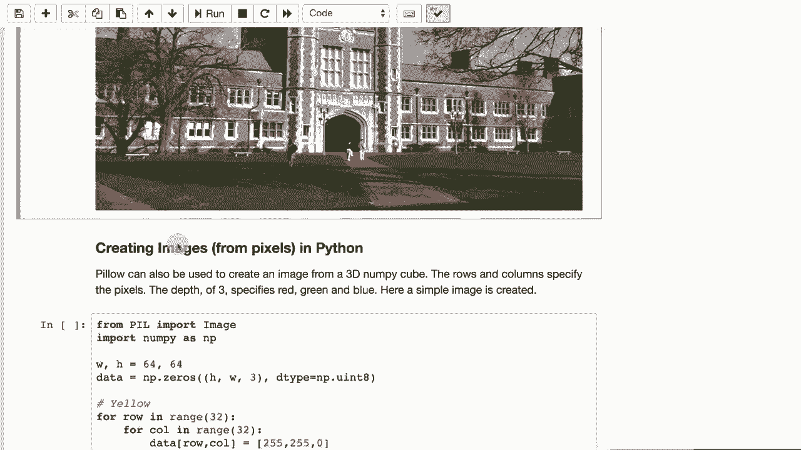

# 【双语字幕+资料下载】T81-558 ｜ 深度神经网络应用-全案例实操系列(2021最新·完整版) - P32：L6.1- 基于Keras神经网络建模需要的图像处理 - ShowMeAI - BV15f4y1w7b8

Hi， this is Jeff Heaan， welcome to App of Deep neural Network with Washington University。

In this video， we're going to start looking at images for computer vision。

 we're going to start by looking at some basic Python image handling capabilities。

If we're going to look at images， we need to know how to load JPEGs and PNGs into Python so that we can adjust the resolution。

Control if they're in color or clip them to specific boundaries for the latest on my AI course and projects。

 click subscribe and the bell next to it to be notified of every new video there's a number of packages available in Python to deal with images We're going to use the pillow package。

It's relatively easy to install。 You just do Pip install pillow。

 This was included in the list of packages to install when we first started the class。

 So you probably already have this installed。 It's also included with Google Co Lab。

There are other image processing packages available in Python。

 one that you'll often see is something called open CV。

It's a little more difficult to install and we don't really need some of its advanced video features for this class。

 so we're sticking with pillow Now what pillow lets you do is load images directly into your Python environment。

It comes from the package PIL， that's how you actually access it。

And we can use Maplotlib in line to actually see the results of some of the transformations that we'll do on these images。

We're going to load an image from a URL， that's where we'll get most of the images。

In the next module when we get into GNs， we'll need a large number of images and we'll get those directly from Cale。

 so I'll show you how to do that that's a little bit different of a process。

 but we'll still use some of the same commands to work with these Here we're using the requests package and Python this lets us read data directly from a URL we're basically getting this image loading it and we can display it。

So when we load this image， it takes a moment since it is coming live from the internet。

You can see the numeric form of the image and you can see the visual form of the image。

In the new Eric form。You'll notice that these numbers come in。 The pixels come in in three。

3 Bte groups like this。 That's because of red， green and blue。 So RGB。

 you can see a lot of these colors are really in pretty similar ranges of each other。

 You can also create images in Python。 rather than just simply loading them。

 You can literally create an image completely from scratch。

 You can generate the pixels and Python will actually turn that into an image for you。

First， let's just go ahead and run this so you can see what it's really trying to do。

It's creating basically a red green blue， almost a Microsoft Windows looking logo。

 And the way this is working is we are creating the height and the width。

 So this is 64 pixels by 64 pixels。 not not very large。 We're creating a data。

Set or matrix in nuumpy to hold this， the height width。 And then 3。 So it's 3D。s。

 it's more of a tenser than the matrix。 This cube will hold the height in the width。

 And then the three depth is the three colors， red， green and blue。And the data type。

 this is important we need to make these unsigned intes of eight bits， so bytes basically。

Because the three components of a pixel are bys now sometimes you'll have a fourth。

Color are not really color， but alpha channel that goes along with the red， green and blue values。

 but we're not using alpha channels at this point now since this is 64 by 64。

 we're going to want to draw each of these squares。

That makes up the kind of checkered red green blue yellow。 So for yellow。

 we're going to do row in 32 column in 32。 Now we're doing all of these because each of these sub boxeses is 32 by 32。

 So 432 by 32s create a 64 by 64 and we're looping through all of these and setting data at that location to 2552550。

 which is the RGB code for yellow。So since we're just specifying rowow column and not adding anything to it。

 this is the upper left hand square that we're dealing with。Because 32。

32 across 32 down and we simply fill in that entire square for the red square。

 we start off the loop the same。 We start off the loop the same in all of these。

 So the row is now being offset by 32。 So we're effectively moving down。 The column is still here。

 So we're not moving over and that draws red。 If we move over both on the row and the column That's where green goes。

 And if we move over just in the columns。 That's where blue goes。

 So you can see we basically loop through and assigned literally every pixel for this entire image。

 And then we create the image from the array saying that it's red green blue。

 There's other encodings other than RGB。 But we're going to primarily work with RGB。

 So this shows you we literally created an image from scratch。

 we will do this when we look at thegans in the next module because we're going to literally build faces from the pixel up。

 you can also。ransform images。 This is a common procedure。

 You'll sometimes want to crop images or change them to grayscale or other things just to get them ready to go into the neural network。

 This does a transformation at a pixel by pixel level。

So I will go ahead and run this just so you can see the final output before we look at how we do it。

It tells you how many rows and columns。 and there's the image。

 Now did take a moment to generate that。 That's because we're literally looping over every pixel of a relatively high resolution image。

 That's the same picture that we had before。 but we converted it to grayscale and to convert it to grayscale。

 we basically we loaded the image just like before。This is all the same as the previous example。

 we get the rows and columns print those out。Now we're going to create a second image that is very similar to when we created that small checkerboard in the previous example。

We're going to basically render into that image， so we're going to loop over every row， every column。

 we are going to calculate the mean of each pixel， so each of those three three by pixels。

We're going to add those three the red green and blue values together and then average them。

 This is a very primitive gray scaling。 There are more advanced ways of doing gray scale that uses a weighted sum。

 but this is a good enough example for just showing how to transform each pixel one by one。

These two loops， that's what's taking some of the time。

 the couple of seconds delay that you'll notice when you run this。

Then we get the image back by basically using image up from array。

 and we are now ready to display our modified image。 You'll often want to standardize images as well。

 This is where you take images that are in a bunch of different sizes and you'll shrink them all to the same size。

😊，This is a very common procedure。 Often， this will be done for you on the image data set。

 But if you're truly collecting raw images， you will need to do some of your own standardization Here。

 I'm giving it a list of images all from Wikipedia。

 These are just different buildings at Washington University and Wikipedia has images of all of them。

I'm creating a function here called make square， so we get the images， we get the rows and columns。

And we check to see if we have more rows than columns。

 This deals with the fact that images are not all going to have the same aspect ratio。

 Let me actually show you what that looks like。 that'll make it a little bit more clear so it's essentially cropping these so that they all become this perfect Instagram sort of square and one by one as we so as we make the image square by essentially just cropping it。

 We then can load these images one by one using similar code to before we make each one square。

We resize them。 So once they've been made square， then we can resize them to 128 by 128。

 That may be an increase。 That may be a decrease。 Most of these， it's a decrease。

 We're also taking these image arrays and we're flattening them so that we can have a list of。

Just values that make up that array is that is the form that you'll usually put the data into a neural network in。

 you'll often see this command here where we're doing。

We're essentially turning it into a range between between negative 1 and 1 centered about0 because the image is has 256 possible values。

 halflf of that is 128。 we're subtracting 128 from that， which effectively centers it about 0。

 Then we divide it by 128 so that it's between negative 1 and 1 approximately。

 and there you see all the images completely loaded and standardized。To 128 by 128。

 we also will sometimes want to add noise to an image。

 We'll see this when we get into the auto encoders because we'll create denoising auto encoders。

 or basically teaching。The neural network to remove noise from images。

 let's go ahead and run this so you can see what it looks like。 Okay。

 and there is the same image with a bunch of random squares added in there which are basically noise。

Adding the noise we're essentially creating a copy of the image， we're taking the rows and columns。

And we're going to loop through and put 100 of those boxes in。

 We're generating random locations within that range。 This is kind of neat。 we're using a nuy。

 This looks like we're assigning just one value to0， but we're actually assigning over a range。

 a matrix range between y and y plus S。 So S is the size of。Each of those boxes and x plus that size。

 So that size what S is really doing is these these boxes are relative to the size of the picture。

 So they're essentially120th X and 120th Y of whatever the men of the rows and columns。

 So if row is the smaller one or the columns whichever those two is the small as we take 120th of that and that becomes the height and width of those squares。

 Thank you for watching this video in the next video we're going to look at convolution neural networks for two very famous data sets that we introduced for deep learning This content changes often so subscribe to the channel to stay up to date on this course and other topics and artificial intelligence。

