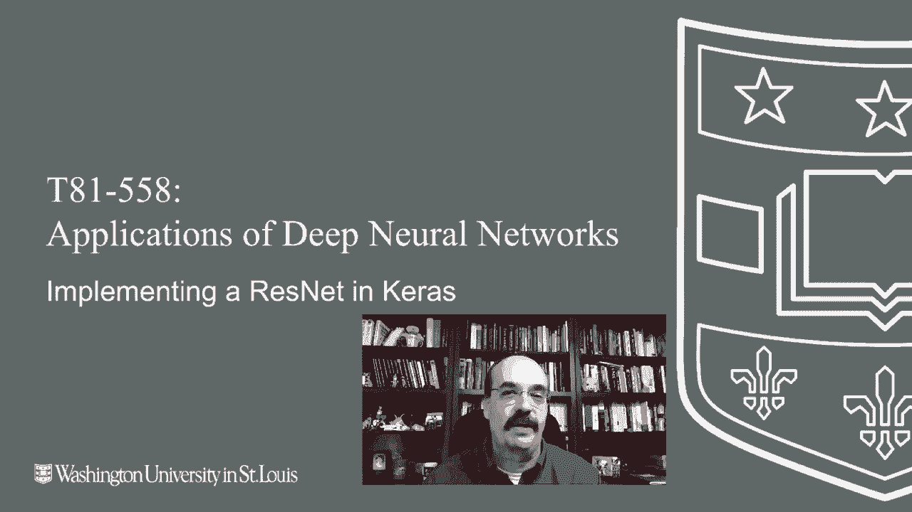

# 【双语字幕+资料下载】T81-558 ｜ 深度神经网络应用-全案例实操系列(2021最新·完整版) - P34：L6.3- 在Keras中实现ResNet - ShowMeAI - BV15f4y1w7b8

Hi， this is Jeff Heaton。 Welcome to applications of Deep neural networks with Washington University。 In this video， we're going to look at Resnet， which is a type of neural network that can be implemented in Carras that makes use of residual or what really makes this neural network unique is that it has skip connections that don't simply go to the next layer for the latest on my AI course and projects。

 Click subscribe and the bell next to it to be notified of every new video。 Resnet demonstrates really how flexible Keras is。 Carras does not have a Resnet layer。 at least at this point。 So we're going to literally construct our own Resnet layer。 and it's not terribly difficult。 There's a function that I found on the Carras website that implements that。

 We'll see how Kas can do。 This This made a big， big splash at the I SVC classification challenge。 This。😊。

Use the C far 10 data set and dot just took first place， beat everything else that that was there。 This is the paper describing the process。 And I took some of these images from the paper。 First of all， let's just talk about what is a residual。 So what is a residual neural network。 or resnet， residual。 If you look at Miriam Webster。

 It's a internal artifact of experience or activity that influences later behavior。 And that's exactly what it is in these these neural networks。 It's a skip layer。 That's another。 I like skip layer better than residual， but nonetheless， either works equally well to describe it。 Now， it's also important to note that it's skipping two layers。 too normal weighted。😊，RellU layers。

 Now， the re comes in like activation functions are typically applied after the weighted layer。 So this is pretty normal。 It's almost like we take note of what the input into this layer was。We fire this other weighted layer。But we don't apply the value yet or whatever the nonlinearity is。But we add that X input right into here。 So whatever was output here gets added to there。

 and we have the。The value in some ways， this is a little bit like a。 this is almost the reverse of a recurrent neural network。 And we'll see recurrent neural networks very soon。 instead of going backwards。 like the recurrent neural networks does， this goes， this goes forward。

 Why would you want to do such a thing？ Well， the short answer is。 it gives a greater predictive power。 and it lets you go much， much， much deeper。 the paper gets into this more。 But it shows that as you train deeper and deeper neural networks before this。You would get better and better predictive results， Then you'd just hit a wall。

 and your results would start to get worse and worse and worse as you added deeper and deeper and deeper layers。 This has been experimented with for 100 layer，100 hidden layers。 and beyond。 I think there's even been a few of 1 thousand00。 that has not necessarily shown。Completely promising results， but this research changes quite rapidly。

 This is what one of these looks like don't worry about the VGG。Neural network， that is， I mean。 that's more the traditional convolution， neural network and some other。Kind of tweaks added。 added to that。 That's basically the competition that they were trying to beat for this。 this competition。 And this is a 34。Plain， so like we just learned about convolution neural network。

 this is all based on convolutions。And this is the 34 layer residual。 so this is really what this looks like。You can see all these skip layers， skip layer， skip layer。 and so on， and so forth。The different colors， 64 filters， 128 filters， 256 filters。 so on and so forth， and then they finally get into a averaging pool SC is fully connected。This。

 the VGG is using several layers of fully connected and the convolutions similar to。With pooling。 this uses an average pool rather than a max pool kind of towards the end。 Let's go ahead and look at the code to run this。 This is using the Cf data set。 It needs to download it Now in Google。 when you're using Google Coab。

 often you're going to find yourself having to re downloadload this。 You want to be careful because Google only keeps the stuff that you keep in Google Drive。 My introductory video on how to use Google Coab explains all of that done with that。 Now。 we're going to grab the data。😊，That data was stored as a pickle。 so we're going to。

Extract that data that we just downloaded and prepare it to be trained so now that we've downloaded it。 let's just go ahead and display it so that we can see this is what this code does here。 it displays it so that you can see some of the samples from this from this data set。Cars， dogs。 again， predominantly animals， but this is， this is that data set。

 These are some parameters that describe。What we're doing as far as the implementation of this。 we're going to use 200 epochs that takes a while to train， even with a GPU。 this runs for a couple of hours。Btch size of 32 number of classes we pull right from the data。 it's 10 colors we pull right from the data set， it's three channels red， green and blue。

Subtract pixel meaning is that's getting us basically to centering this about 0。 and that helps for predictive accuracy。 There are two versions of this of resnet Ressonnet version 1 is the original and Resnet version 2 had some improvements。'll talk about that later in this video。 We are choosing。The depth。Calculated on on the size of the image and the number of colors。

 We're choosing the depth based on the version and colors。 This is a useful function。 This is following along with the paper。 This is the learning rate scheduler。This is essentially going to bring the learning rate down as we cross a number of epochs。 so whenever we change the learning rate， it's reported here。This can be very effective。

 We're using this with the atom training and。Typically。 you want to decrease the learning rate as you go forward。 so this demonstrates this technique。 you might want to make use of this in the Cagle competition or other things。 you have to experiment with it to see how well it particularly works。By the way。

 all of this data or this code I got from the Kiras website。So this is just examples。 I've updated it to the latest。Versions of Tensorflow and Cars and also reworked it a little bit to。 I think， make it a little more readable and segment it into a Jupiter notebook。 This essentially creates a resonant layer。 So that includes the two normal layers and the skip connection。

 It's essentially creating the convolution，2D layer。 It does put a batch normalization in there。 the batch normalization。😊，Is a good layer that you that you might want to use that basically helps to really helps to keep the vanisheding gradient problem from being too much。

 too much of an issue。 It's normalizing on each batch， each of your mini batches。 We are also using a special weight initializer called the he normal。This is， again。 following what the original paper did。 We are also using a kernel regularizer of L2。 also following the paper。 This implements a resnet version 1。

 which is primarily what we're dealing with here， but I included both of those。Both the resnet version 1 and 2。 this specifies the the input parameter， specify the shape。 and it is essentially stacking up those layers and culminating with the final dense output。 It's building those individual resnet blocks。 A resnet blocks is those two convolution layers stacked between。

 So it creates。It creates the two resonnet layers Now。 the resonant layers that it's talking about above are essentially the two parts of the resonnet block。 we're keeping track of。So we have Y here。 X feeds in。 So X is the input。 Then the second one is feeding to here。 This portion here is caught is implementing the skip layer。

 Finally， we do an averaging pool。And the final dense layer， we do also。 I'm going to go ahead and run this so that we have it in memory。We do also have a second version of Resnet， the primary difference of the full the V2 variant compared to V1 is the use of the batch normalization before every layer that。Cause some improvements to it overall。 We're dealing mainly with the version one。

 but both of them there， you can， you can try out the two。 see the differences between the the normalization。At each point or just at the at the end of those resnet blocks。 Here is where we actually run this。 So I get the input shape， I get the train and test。If we want to subtract the pixel mean。

 this is doing that。 that centers it about 0 more effectively， Typ a good idea。 We run the ressonnet V1 or V2 depending on what we have， and we compile it and reproduce a summary。So this just builds the neural network。 doesn't actually run。 And it's ready to go。 It shows you the entire structure of the network again， trying to match the original paper。

 This is where we actually execute and train it。 I'm going to run it just so that it can be going because this is going to go for a long time。 We get the learning rate scheduler so this causes it to reduce the learning rate until we plateau。 So this causes it to reduce the learning rate when we do plateau。 If we're not using image augmentation， which by the way we are， we do just a normal fit。

Image augmentation can be very useful to letting it learn to not overfit the data that it has。 This allows it to shift and move about the image somewhat。 do each of these is just various random sort of transformations that you can do to the image to。Basically。Distord it in various ways as it trains。 So it's like it gets brand new images each time。

 but they're all based on the train set images。 It's like you can randomly horizontally and vertically flip it。 We're not we are flipping it horizontally， but not vertically again。 I'm following basically what the Kira's example had set up。 So you could try some of these other values。 It might give you better results。

 And you might want to also use the image data generator。 which is doing these transformations on your own neural networks when you are dealing with image data。 Then we basically fit it run it。 And we re report the lapse time。 takes a couple of hours。 typicallyy， you probably don't even want to try this with a CPU other than a GP。

 I have not tried running it could be a day。 I really have not tried it on CPU。 Thank you for watching this video in the next video。 We're going to look at openC。 This content changes often。 So subscribe to the channel to stay up to date on this course and other topics。

And artificial intelligence。