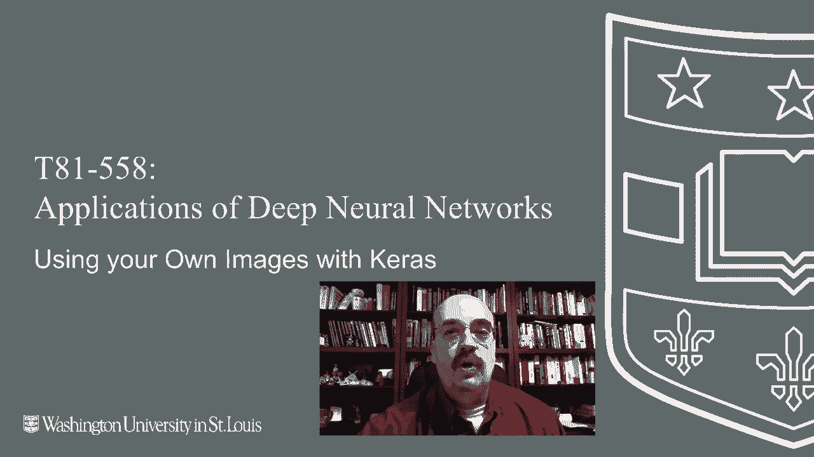
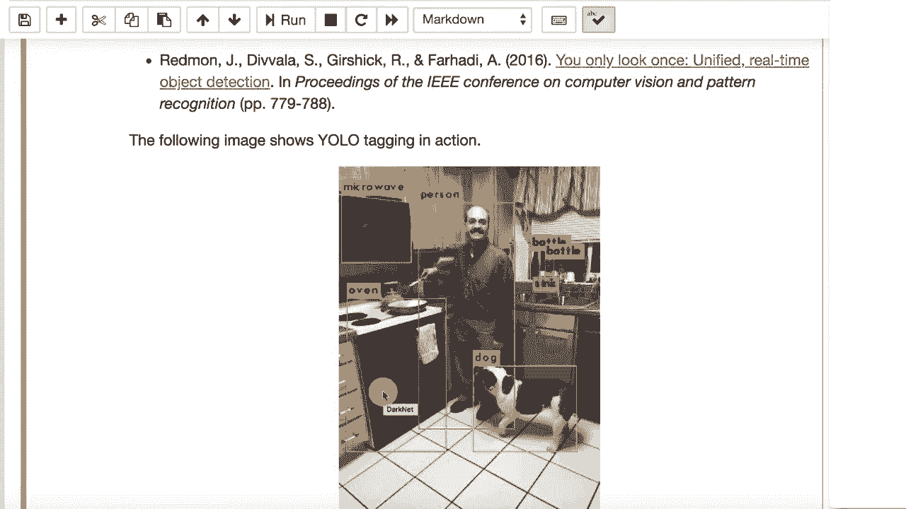

# 【双语字幕+资料下载】T81-558 ｜ 深度神经网络应用-全案例实操系列(2021最新·完整版) - P35：L6.4- 在 Keras 中使用自己的图像数据 - ShowMeAI - BV15f4y1w7b8

嗨，我是杰夫·希顿，欢迎来到华盛顿大学的深度神经网络应用课程。所以到目前为止，我们看到的大多数图像示例，比如 Menst 和 CFFAR，是在使用 CAs 提供的便捷方法加载数字。这确实使得代码变短，并且免去了自己加载这些图像的繁琐工作，但了解如何处理原始图像是很重要的。

原始的 JpeEgs 和 PGs 实际上可以导入到你自己的项目中。我们将在这个视频中学习如何做到这一点，了解我最新的 AI 课程和项目。点击旁边的铃铛订阅，以便接收到每个新视频的通知。现在，为了使用你自己的图像，我们首先来看一下使用便捷方法时的情况。

所以，如果你查看 Tensorflow Carra 的数据集，这基本上让你可以访问已经内置于 Cars 的大量数据集。这些数据集很容易获取，只需谷歌搜索 Tensorflowlow Carras 数据集，你将看到一整份列表，我认为不到 10 个，但接近 10 个不同的数据集已内置于 Cars 供你使用。我们将使用 C4R 10，并且我们也会使用 nuumpy 来帮助我们查看，但让我们先看看实际加载时的样子。

所以我们运行这个，如果你之前没有使用过这些数据，你可能会看到一个小下载条，它正在访问这些数据，因为这些数据并非全部内置于 Cars。它会下载到一个临时目录，但基本上你得到了这个低数据命令，它隐藏了所有正在发生的事情，在许多数据集中，Cars 实际上会为你拆分训练和测试，正如我们在这门课程之前的视频中所见，拆分训练和测试的原因是为了获得一致的训练和测试结果，因为这些数据集通常用于学术论文，你确实想将你的结果与前人进行比较。现在，CFR 10 方面并没有很多活跃的研究了，它几乎被用到了极致，并且他们在上面得到了非常好的结果，现代论文中你可能想看看更高级的东西。

当前的数据集及其内容。关于图像的有趣事情正在发生。我们将在下一部分讨论这个。所以如果我们现在查看这些数据的形状。X train，我们得到了 X train 和 Y train。这是你的预测变量。这是期望的输出 Y，测试数据也是类似的形状。

你需要将图像转化为的格式，以便实际使用。在Keras中，是一个不规则的张量。我称之为张量，因为它比矩阵更复杂。训练集中有50000行，每张图像为32乘32。这就是经典Windows和Mac系统上图标的大小，仅供你参考。

然后颜色深度为三。所以这些都是非常小的低分辨率图像，我们在前面的部分看过Resnet，这就是你需要将图像转化为的形式。所以你会将你的JPEG和PNG加载到内存中处理它们。

你会希望将它们调整到相同的大小，因为你需要有某种方式来重塑图像，以便它们都是相同的大小。在计算机视觉领域，这种情况非常常见。如果你想处理不同大小的图像，如果你要将它们提供给神经网络进行预测，你需要在预处理时将其调整为适当的形状。考虑到许多自动驾驶汽车和其他计算机视觉机器人，你将始终处理一致尺寸的图像。

因为你的视频流将通过某种摄像头传输，该摄像头将具有一致的分辨率。现在，如果你在编写一个网络应用程序，就像我们在课程后面看到的那样，并且你会接收到各种上传的图片。比如微软有一个相当著名的应用程序，可以告诉你你养的是什么品种的狗。

你需要将这些图像缩放到一致的大小，处理各种宽高比以及不同的尺寸。我们将看到，特别是在我们从Kaggle竞赛和其他图像数据库下载PNG和JPEG文件时，我们将如何做到这一点。

它们都是不同的大小。所以这是目标。你想将所有图像转换为基本上是X乘Y乘3乘颜色深度。这3，通常是3或1。有时你会看到4，但那是一个掩码，用来显示图像中需要剪切的部分。

但通常你不会将掩码或 alpha 通道发送给计算机视觉。让我们看看单个元素的样子。这有50000个。如果你查看其中的第一张图像，它将是32乘32乘3。但这就是它的样子。我不是很漂亮，不是形状。我可以查看它的形状。

它的值将是32323。你可以看到基本上这是很多行和列。所以这是单独的一行。然后在这一行里面。你有单独的颜色。这些是RGB值。这就是你拥有的三个颜色通道。这是红色、绿色和蓝色。它们的范围是0到255。这是你经常会看到的，将0到255的缩放应用于神经网络。

他们可以处理这个，但如果你将其缩放到0和1之间，你会得到更好的结果。这是相当流行的。更受欢迎的是负1到1，因为现在它围绕0居中。所以我们将看到如何做到这一点。现在这些数字，这里并不是所有的50000个元素，这只是其中一个。而且它没有显示M并不是be。那种情况发生在太多的时候。

这只是一个图像。我们需要做的是看看如何利用我们已有的一堆图像进行训练。我把这些放到了网上。其实我并没有把它们放在这里，它们之前就已经在维基百科上，所以基本上我们可以从 Google Coabab 或本地运行这些，如果你想使用自己的本地图像，始终会找到那些图像，通常你会这样做。我们将看到相关的例子。

在下一个模块中，当我们进入 GNs 时，目前我们将直接使用它们从互联网获取，这样方便，我们不必担心这些图像实际存放在哪里。所以我们会获取所有这些图像，我们最终会努力将它们转化为我们在上面看到的格式，即50000 x 32 x 32 x 3，因为这样就可以准备好输入到 Cars。Carass 已经准备好处理这个了。所以现在让我们看看我们这里有的东西。我有一个名为 make square 的函数。

就制作正方形而言，这几乎是你能做到的最原始的方法。看看任何图像。如果你想把它变成正方形，有几种方法可以做到。最简单的方法就是裁掉长的一边。所以如果某个东西不是正方形，意味着它要么更宽，要么更高，不管是更高的那一边。

如果它更宽，你就从右边裁剪掉一些。这几乎是你能做到的最原始的方式，但这给你提供了一个很好的起点。这是我在一些作业中比较喜欢的做法。所以你可能会看到这一点。我可能会要求你做一个更高级的正方形制作。

作业会准确描述这一点。但我们在这里要做的就是找出，是更高还是更宽。是有更多的行还是更多的列，然后我基本上会裁剪掉多余的部分，返回你需要处理的图像，这两个部分必须分开处理。更多的行。所以我基本上就是在调整这个数量。

我们有的额外空间，我正试图中心对齐抓取的部分，以免只从右边裁剪掉。我试图从两边裁剪。这是一种可以使用的技术。所以我们继续运行这个，但我们在这里下载这些 URL 的部分，其中我们有响应等于请求 URL，这样就能通过互联网获取它们。如果这些文件已经在你的硬盘上，你就不需要这个了。

你也不需要这个字节 I/O 部分，你需要的是这个。这将是一个通过互联网的流，将为你提取并实际加载它。如果你使用磁盘，仍然会有这个。首先，我们使其变成正方形，改变它的纵横比。

改变了最长的尺寸。接着我们会将其调整为我们指定的图像高度和宽度，并使用抗锯齿技术，这是一种图像大小调整技术，用于填充额外的值，平均边缘附近的值，使图像整体看起来更美观。然后我们将图像添加到训练数据列表中。现在。

重要的是，这个列表只是一个普通的 Python 列表。所以我们将所有这些不规则数组添加到 Python 列表中。这是不可行的。这几乎是 Python 列表和 nuy 张量的混合体。所以你想要。你想要这样做，以实际重新塑形，使其成为我们之前定义的图像高度和宽度，并且通道数将是三。

我们还这样做是为了将所有内容置于负一到一的范围内，并围绕零进行中心化。所以我们会运行这个。现在如果我们查看训练数据，它确实全部是 nuy。现在看起来非常像这样。不同的是，这里仅包含一个方括号。在这里的数组表示 nuy。请注意，这些值在零到 255 之间。

它都是不规则的。它是一个一、二、三、四维的张量。目前，这些值在负一到一之间。你有一个不规则的张量，一个 4D 数组，本质上准备好了。你可以在这个基础上进行训练。这就是你的 X，标签则包含在你的 Y 中，具体取决于你对图像的处理。我们会看到，涉及图像时。

你并不总是仅仅进行经典的分类和回归。而在下一个部分，当我们看到叫做 Yo 的东西时，你会发现我们会同时进行回归和分类的混合，这正是神经网络相比传统模型的美妙之处。现在，一旦你设置好这一切，并且有了你漂亮的 4D 矩阵。

你可能想要保存这个，因为处理所有这些图像并进行处理需要一些时间。相信我，当我们进入下一部分，处理 ganNs，并处理成千上万的图像时，你会将它们导入你的 Google Drive。

你希望一次性完成这些操作，而不是每次都要重复。这通常是你对某个内容进行序列化时所做的，序列化是将 Python 对象以二进制形式存储的标准方法，以便你能轻松回忆起来。然而，我们将以 nuy 的自定义格式保存它。因为这些。😊。这文件并不大，仅仅是几张图片，但相信我。

当我们进入GN和更大的训练数据时，你将会有一个多吉字节的文件，有时甚至更大。所以你会想把它保存在可以处理这么大文件的格式中。既然你在处理nuumpy，我们就将其存储为nuumpy文件和MPy。这很像pickle，只不过它是专门用于nuumpy。我们运行这个，看看它现在已被保存。

你在没有扩展名的情况下传递文件，它会把点My放上去。如果你放了一个MPy B，就不要使用nuy nuumpy。所以不要，你不想要两个这样的。现在我们可以处理自己的图像。这一点很重要，因为使用细分数字和C即使以细分方式也很无聊。你想在自己的图像上做这些事情。那时这东西真的会变得有趣。

只是为了提前窥视下一部分，你可以看到我在使用自己的图像。我们将在下一部分讨论这个。感谢观看这个视频。现在你已经看到如何加载Kiras包之外的图像。我们将在接下来的几个视频中使用这个进行更多示例。这个内容经常会改变。

所以订阅频道以保持对本课程和其他人工智能主题的最新信息。😊。
