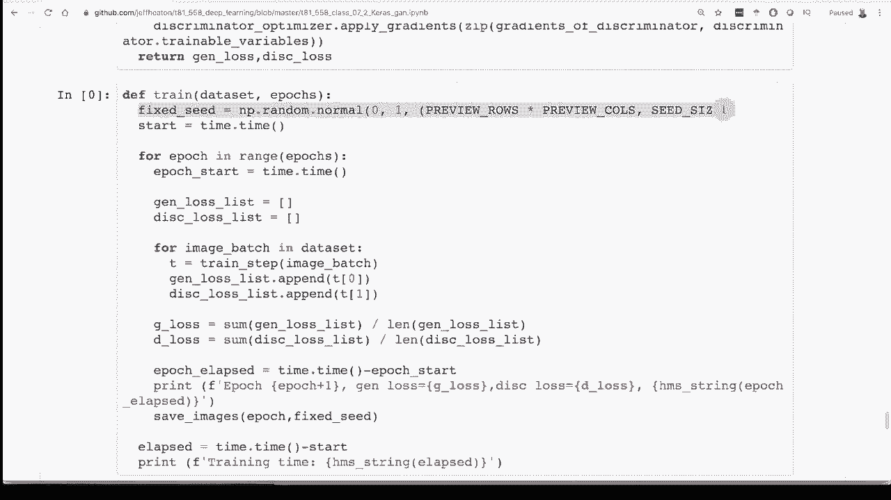

# 【双语字幕+资料下载】T81-558 ｜ 深度神经网络应用-全案例实操系列(2021最新·完整版) - P38：L7.2- 在Keras／Tensorflow2.0中使用生成对抗网络(GAN)生成人脸 - ShowMeAI - BV15f4y1w7b8

Generative adversarial neural networks， these faces you see here are not real。 They were created by a G。This type of neural network can be used to create data that is not real。 Now， I am real， or at least I think。But these neural networks can be used to create this kind of face。 Now， I'm going to start by not showing you how to create these very high resolution faces that you see that were created with software that Nvidia makes for you。

 This is stylegan， which we'll see in the next video。 But in this video we're gonna to see how to actually build this sort of thing from scratch。 You'll create faces that look more like this， but this is something。 this is the beginning。 This is the stepping stone for you to get code up and running that can create this kind of data。Hi。

 my name is Jeff Heaton。 Welcome to applications of deep neural networks with Washington University to see all my videos about Cagel neural networks and other AI topics。 click the subscribe button and the bell next to it and select al to be notified of every new video。

 I do provide complete source code for this。 I recommend that you open it in Google coab like I have up here in my Github link。 I have a link to this Github repository with all my code here。 I just upgraded all of my G code to Tensorflow 2。0。 So this should work fully well with that latest version of Tensorflow through Ks。

 before we get into the code， let's just conceptually look at what we're trying to do。 So for a G。 you have two neural networks。 and you're training each of these two neural networks completely differently。 And it's important to understand this distinction。 if you really want to understand how this code works。

 That is really the goal of this video to show you literally how you can create your own GN from。😊。

2 neural networks。 It's really not that complicated。 If you take it piece by piece。 So you have two neural networks。 you have a discriminator and you have a generator。 The inputs and outputs to these two neural networks are completely different。 This is how I always think about learning a new technology when I see a neural network。

 I want to know what the input is。 I want to know what the output is so that I can really see what this thing is actually doing for the discriminator。 this neural network has only one job in the world。 It is used to tell if the input to it is real or not real Here we have a image coming into it。 I'm using this as though it's a real image， but this is actually something I created with style ga just so that I'm not using anybody's random face in my video。

 So image comes into the neural network。 Now this is what is awesome about neural networks compared to other types of models。 the input can be almost anything。 the output can be almost anything。 So here the input is。Image this is a 3D tensor。 So it's the height and the width and then the color gap。 The output is a single number。 This is a prediction。 So 0。

97 means that the discriminator is saying that there is a 97% probability that this is， in fact。 a real face。 Just think of him as a real face and not something that came from my own personal matrix。 All right， now the generator， this is the part that is going to be really useful when you build a face generating neural network or some other sort of generating neural network。 Often you throw the discriminator away once you once you've trained it。

 but the discriminator does have use and we'll see this later in later videos when you deal a semi superervised learning where maybe you don't have labels for everything。 So both of these two can be useful， But if you just want a face generator or car generator or a cat or an avocado generator。

 this is all you really needing and generate anything Here we basically。😊，in random seeds。 So the random seeds。 you might have seen these in video games like Minecraft， I know does this。 You put in a random seed。 and essentially a whole world is created for you。 That is what this is。 So in Minecraft， it's not like some seeds are bad and some seeds are good。

 They all give you random worlds。 Each of these random seeds gives you a random face Since the neural network was trained to。 Now what you have to keep in mind is this is not just a single number。 This is a vector。 So it is a array of number。 often it will be100 or some higher dimension array of these numbers。 You can also do really interesting experiments and very just one number of the vector and try to see what different parts of the vector are actually for in stylegan you can do some of that you can make hair longer。

 you can change the color of the eyes and leave everything else alone。 but that's more for the next video when we talk about stylegan。 This is creating your own from scratch。 So you give it this random seed that you generate。😊。Then you give it。 It gives you an output image。 Now。

 a question I got in some of the other videos was what ranges should these numbers be in。 Well。 it doesn't matter。 but they have to be the same range that you trained it on。 So when you are training it， you were giving it some random range and distribution。 Make sure that stays the same。 Don't train it on numbers that are in the range is 0 to say，100。

 And then all of a sudden throw a million in there。 That's not going to work well。 So this is what these two neural networks look like just in their general usage。 The trick is how do we train these。 It's an adversarial neural networks。 So they're working against each other。 It's a generative neural network。

 That just means it's generating things。 It's generating faces。 First。 let's look at how we train the generator。 because it's a little bit more simple than the discriminator。 What is important about training both of these is notice。I show weights trained weights static。 Both of the neural networks need to be in place to train either one。

 but you cannot update the weights on both that that would not work well at all here we are training the generator。 So if we were to allow the weights on the discriminator to be modified while we're training the generator that would be cheating。 That's the generator is basically trying to get its weights better and better and better so that we can fool the discriminator。 the whole overall objective is to fool the generator while we're training this。

 So if we allow the weights to be trained on both of these it happen is back propagation would say。 okay let' let's move the weights so the generator is better。 Oh let's affect the discriminator so that the weights are also better at producing this result of fooling the discriminator you don't want to modify the discriminator to fool。SoThats that's like training one runner on the track and letting him get better and better。

 but then seeing the other runner that he's gonna train against someday and tripping that guy。 So only one of these guys needs to be trained at a time Otherwise you're going to end up with weaker result。 You need that competition going。 So when you're dealing with training。 Like every other neural network that we've seen in this course， you have your X and you have your Y。

 The X is what goes into the neural network to produce the Y that you expected。 What your neural network actually gives you is called Y hat。 It's the Y with a little triangle type thing above it。 So the X in this case is random seeds。 We're going to create a bunch of random seeds。 In this case， I'm just showing three。

 but we're going to send those into the generator。 The generator is going to create three random faces。 Now the generator may not be very good at first and it's going to get better and better。the discriminator is going to get better and better at saying， aha these faces。 they're not real。 The discriminator is going to take these in， and it's going to give predictions。 It's going to say。

 okay， that face 45%。 This face 55%。 The last one， that looks a little better，65%。 These are the y hats。 These were the actual predictions at this point in training for the discriminator。 Now， the why is what we really wanted it to be。 This is the expected output。 This is what normally comes from your training data。 But look at the interesting thing here。

 This is training the generator。 We're not using any of our training data。 Our training data is a bunch of real faces that you download。 I give you some sample places that you can go to get these actual faces。 But when we're training the generator。 We're not using any real faces at all。

 The generator never gets to see the real faces。 It is just learning slowly。 slowly slowly to generate faces that are better and。Or at fooling the discriminator。 So that that might seem a little bit strange。 And the Ys。 these y's normally come from the training data。 The Ys are always one。

 This is completely unbalanced data。 This is the worst of unbalanced data。 You don't have any zeros。 So you're not training the generator on any false cases。 But it has this discriminator in the way that it has to fool。 If you didn't have this。 The generator just learn， oh， you always want a1。 Okay， that's fine， I'll always give you a one。

 But the generator's output is being fed right into the discriminator for the training loop。 This is a little more complicated of a neural network。 than we than we've had before。 You can almost think of this whole region that I'm drawing my mouse circle around over here as the objective function。 The objective is to fool the discriminator。 So it doesn't matter that this is unbalanced。

 It's not really unbalanced。 It's just because we want this to always。Give as close to a one as as we can。 And the only way the generator can do that is by getting better and better images to actually fool that discriminator。 So you'll see in the code when we look at that in a moment。 We are literally creating for the loss function for the objective function。

 data sets where we choose whatever the batch sizes， whatever we're training for the current step。 However， many of these we want， and that's set is a configuration parameter。 We generate that many random seeds， we generate the random faces。 and then we send those to the discri discriminator。

 get the Y hats calculate the back propagation gradients apply that， and then you apply the chain。 So you do that for one step。 They'll be multiple step。 So whatever your batch sizes， That's a step。 And then we do enough of these so that we cross the entire training set for the entire epoch。 So the things to notice here that might seem a little strange。😊。

The generator never sees the training set and the Ys are always one for this because we。 we aspire to be perfect。1。0。 There's really nothing we could train the generator。 we don't want to train the generator to produce zeros。 So that's why the training set looks in balance， but the fact that this whole piece over here is working together。

 The generator is the real loss function here。 That works。 All right， let's see how the。Discriminator is trained a little bit more going on here， but not much。 Notice here it is balanced。 We have zeros and we have ones。 So that is。That's a little difference。 We'll get into that。 Notice also， the training data is actually being used here。 These three images。 Again。

 these are not real people， but pretend that they are。 I don't want to pay licensing rights to use real real people just for my diagram Nvidia stylegan is good enough。 These are ones that were generated by my generator。 So this is what the X and y looks like for this。 First of all， we need to generate a enough of the fake images to fill the batch size。

 And then we need to put in enough of the real images from the training set to also fill out that step size。 So really half and half for the batch would be would be perfect。 We have now these fake images。 real images。 All six of these。 Now it'll be bigger for the mini batch。 Not a lot bigger。 Go into the discriminator and the discriminator picks these probabilities for these Probabilities for these。

 you'll see lower and lower probabilities for the generated higher for the other as the discriminator gets better。 But this is where you can't really look at the two losses。 The program that I wrote。 it shows you the loss for the generator and the loss for the discriminator。 It is really essentially an arms race。 as one gets better， the other gets better。 So ideally。

 you'll see those both stay right at around 0。5 or so if both of those are really growing with each other。 And the ideal would be eventually if the generator is so good at generating these that the discriminator just really can't tell the differenceer in is getting about a 5050。

 So that would be the ideal。 So in this case， the X is all of these images concateated together real and fake。 The Y hat is going to be the probabilities that were assigned to each of these。 And then the actual y is going to be the false for the ones that we know are not real。 and true for the ones that。No， in fact， are real and that's how a again is trained that is that technique can be used for just about anything。

 You create a neural network that takes in seeds and generates random data based on those seeds now it helps to use convolution neural networks if you're dealing with images possibly helps to use LSTms or even CNNs as well for time series depending on what you're trying to generate。

 and then you use your training data， examples of real data to co-train the discriminator with and gradually。 gradually gradually the neural network learns to generate these kind of images and better yet。 the distributions of certain things within the data are going to match the original data For example。 it's going to learn that if part of somebody's face is one particular skin tone。

 the other half is probably not going to be a different skin tone。Just like。If we gave it。 say population data， it would learn that as people were。Older。 they might have different names than younger people because different naming styles change differently。 or health characteristics might be different。Allright。

 let's look at the code and see how this actually runs。 So these are the loss functions Here we can see we're using cross entropy to train these because its logistic primarily The discriminator loss here we create the real and fake。 just like I showed you in the diagram。 Not we're using ones and zeros。 Then the total loss is going to be both of these added together because you have to do good on the reel。

 So you have to do good on the fakes。 And that's essentially all there is to it。 we're adding the ones and the zeros for the reels and the fakes。 and that is going to be your loss。 That is what the training is going to attempt to minimize。 Now， the generator loss is even easier。 It's just cross entropy。 And notice we do it just on ones， because like I said， it's unbalanced。

 but that's okay。 works just fine。 And we are training a just that we would like for ones on the fake output。 this is backwards。 these are fake， but these are ones， but that is what we。😊。

Aspire to we want to fool the discriminator。 We use atom on both of these。 Now。 one question that I got a lot on the previous version of this people try to increase the resolution。 do other things as you increase resolution on these or do other changes。 you're you're going have to retune I have these primarily tuned for the different resolutions that I have indicated up higher in the code on the symbolic constant for for the magnification factor。

 but you'll probably have to change these if you make the resolution higher in particular。 you're going to probably have to make these smaller learning rates。 This is what an individual training step looks like and I want to show you how we're training here because this is very different than how we did this in previous neural networks that we've trained The reason we're going through these extra steps and dealing directly with the gradients is because we don't want to modify the weights of the wrong neural networks。

We've got two neural networks at play in both of these training operations。 We do we train both of these completely separately， but we do not want crossover。 we do not want we want to be only modifying one of these neural network weights at a time。 And we use for this the gradient tape。 And I talk about this a little bit during one of the in-class meetings。

 but this is essentially how Tensorflow does automatic differentiation。 So it is calculating the derivatives for you for your neural network forever complicated you end up making it And I have other videos talking about this。 Like how do you create how do you take a derivative。 and I'll put a link to that video as well in the description to this one。

 But this shows you basically how how to do this。 So we'rere creating two tapes The reason they're called tapes is it's almost like it's recording all of the mathematical functions going through and。Neural networks and then it unwinds it backwards to figure out what the derivative is。

 Then we basically create， we're dealing with the discriminator。 The discriminator has the two sides。 so it has the real output in the fake output that you are giving it。 So we need to know what the output was for the real images。 We need to know what the output was for the fake images and then that lets us essentially take the loss for the generator。

 the generator because it's only dealing with fake。 The generator can't generate real images。 it can only generate fake ones。 We're calculating the loss on that。 we're calculating the loss on both types of outputs for the discriminator because it sees both types。 We cal the gradients of the generator。 We calculate the gradients of the discriminator so that we're not crossing those over and then we apply the gradients。

 and this is essentially one step of train。 We're getting a little more manual here。 We're not letting Tensorflow and Kera。Actually apply the gradients for us。 We're actually doing this。 So this is a little bit behind the scenes of how you actually modify the weights based on these。 These apply gradients。 that is what is is happening。

 Then training it is relatively simple compared to that。 We do create a number of fixed seeds。 So this lets us track the same faces。 You you see this video that I have playing over top of this one。 This is showing you how these faces are evolving as it actually trains。 So I created these fixed seeds so that these images that you see here evolving。 are consistent。

 Otherwise， we just see a random mess of different faces。 but this shows you how individual seeds are actually evolving over time。 We go through the requested number of epochs。 We are keeping track of how much time is spent on one。 Def use a GPU use Googlego coabab for this。 If you don't have a GPU on your local computer。

 It will run so much faster。 and then we。😊。

Loop through for each epoch。 we loop through each batch that we divided up earlier。 We divided the images into batches because each epoch is a complete set of batches that takes us over the entire training set We calculate the loss for the generator and the discriminator and we keep displaying this as we go。

 So you can see here you have the losses on each of these Now these are not accuracy losses。 So I said earlier you aspire to maybe a 5050 on each of these this is more of a log loss that you're seeing here but you could calculate accuracy loss if you wanted to as well。

 but you're going to optimize on on the log loss log loss and cross entropy are essentially the same range。 and it goes through here。 you never really get to these to sort of these two being even and that's because really like like I said earlier。 you're going to get to faces about like this which which is pretty amazing that it is。trainining up a neural network that never sees the training set to actually be able to create this degree more or less of realism in the faces now to actually tune it and get the right faces there's a lot of steps in that and I have some papers linked to that would help you if you really really really want to find tune this and go deep on creating GNs that are realistic you're going definitely need to buy some cloud time to get enough processing going or you can simply pull in the Google stylegan weights I'm sorry Nvidia stylegan weights so that you can just transfer and all of a sudden have a neural network that has had considerable high end training done on it to produce very realistic looking faces I might do a video in the future about how to really eke out and get the really high resolutiongan built completely from scratch that would be that would be beyond the bound。

Of what my class gets into it。 if this is something you're interested in maybe seen as a side video。 definitely click the like， I pay attention to those so that I get an idea of what you're interested in。 Thanks for watching this video in the next video， we're going to see how to use transfer learning and take really cool software created by NviDdia stylegan and just immediately transfer those weights into your neural network so that you're able to create very realistic looking faces like these。

😊，Thank you for watching the video。 And if you want to see more of this。 please subscribe to my channel。 Thank you much。