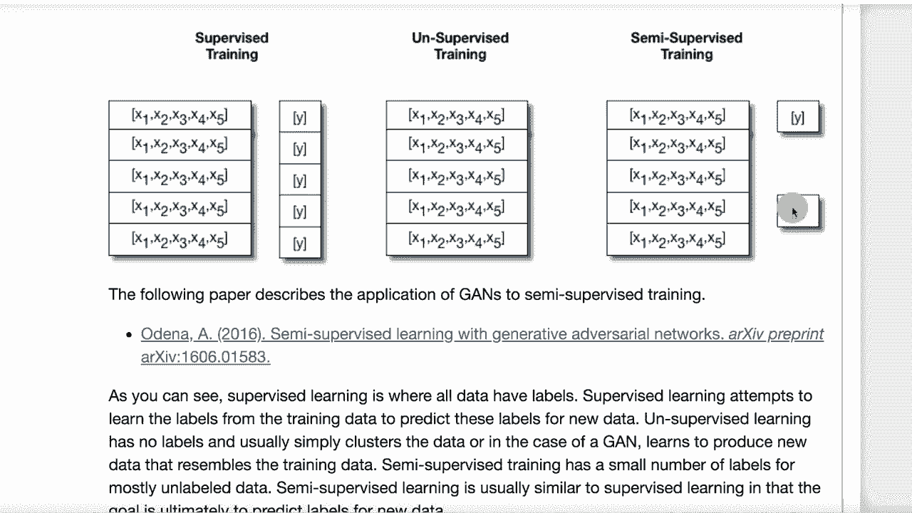
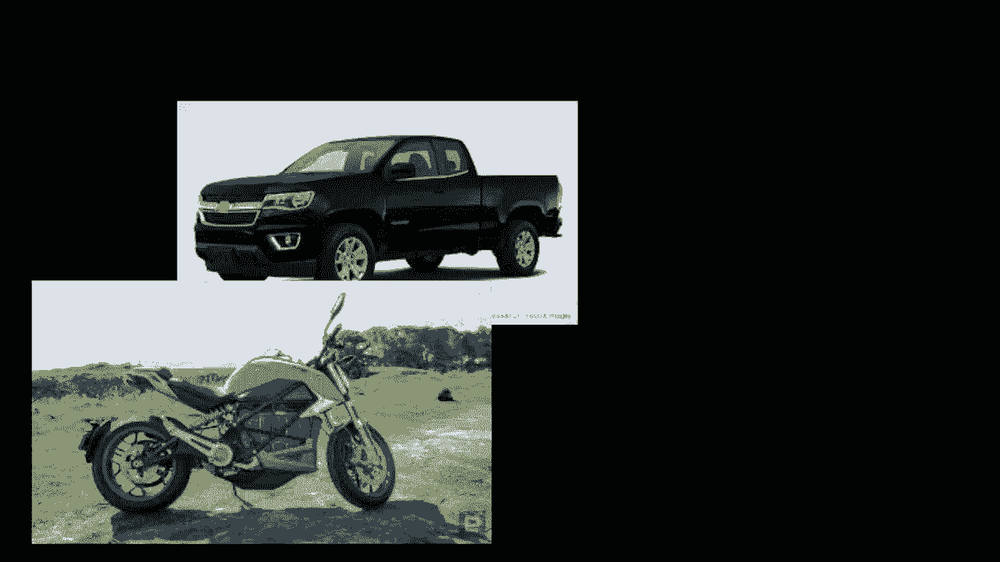
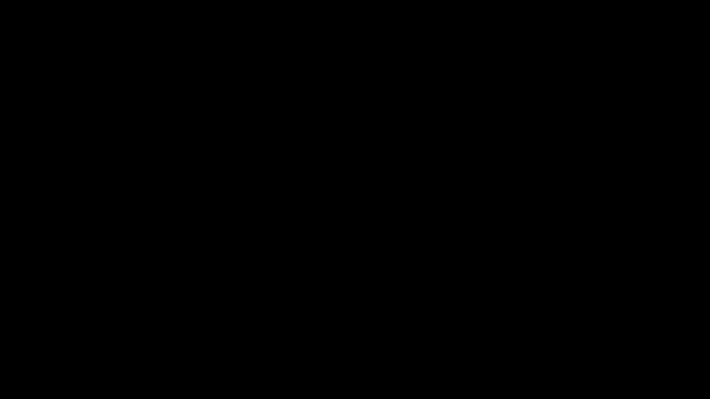
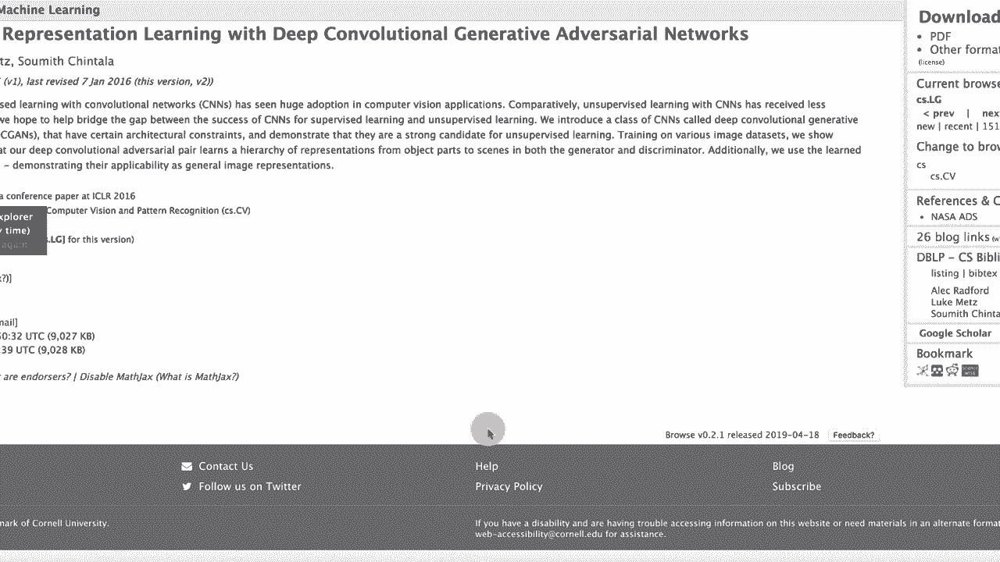

# 【双语字幕+资料下载】T81-558 ｜ 深度神经网络应用-全案例实操系列(2021最新·完整版) - P40：L7.4- 在Keras中用于半监督学习的GANS - ShowMeAI - BV15f4y1w7b8

Hi， this is Jeffine， welcome to applications of deep neural Networks with Washington University In this video we're going to look at how we can use GANs to generate additional training data for the latest on my AI course and projects click subscribe and the bell next to it to be notified of every new video GANs have a wide array of uses beyond just the face generation that you often see them used for they can definitely generate other types of images but they can also work on tabular data and really any sort of data where you are attempting to have a neural network that is generating data that should be real or or could be classified as fake the key element to having something as a GN is having that discriminator that tells the difference and the generator that actuallys the data Another area that we are seeing GANs used for a great deal is in the area of semisupervised training So let's first talk about what semisupervised training actually is and see how a GAN can be used to implement this First let's talk about supervised。

Training and unsupervised training， which you've probably seen in previous machine learning literature。 but just in case you haven't supervised training is what we've been doing up to this point。 I would say probably the vast majority of this class is in the area of supervised learning This is where you have multiple Xs in the case of tabular data or grids and other things in the case of image data but you have some sort of input coming in。 which is the X。And you know what the correct Ys are。

 you are going to train the model to produce these Y's when you have these x's because later on you're going to have x's coming in where you don't know what the Y is and that's where you want the neural network or other model to be able to give you some estimate as far as what the Y value is going to actually be unsupervised training is where we have the X's。

 it could look just like this， it would work with image data tabular or really just about anything。 but there is no Y where letting the neural network or whatever model it is and you don't typically by the way use neural networks for unsupervised training this is usually the area of things like K means。

 clustering and other things。Your classic unsupervised training is just going to take the inputs and cluster them in such a way so that similar ones are together these could be similar images。 these could be similar inputs in tabular data a variety of things semisupervised training it's actually much closer to supervised training I would say than unsupervised and this is where GAs really shine and semisupervised training you have x's just like you have in these others but you don't have a label or a Y for every single one of them you might have a small number of them by no means have the complete data set labeled traditionally what would be done is these values that were not labeled would be left out because there was no way to feed them into traditional supervised learning or you would train it on the ones that you did have Y's for with classic back propagation or however you were training that particular model then you would create predict。

Why predictions for all the missing values and then retrain the whole thing on the predictive values with the others In practice。 I never had a great deal of success with that technique。 but there is some theoretical basis for it with semisupervised training and GNs will see that there's a way that we are able to actually make use of these Now semiupervised training。 this does make sense from a biological standpoint if you think about a child who is seeing all sorts of vehicles as they go about their daily lives with their parents or whoever they're with and they're seeing all these vehicles as they pass on the street and they're not labeled。

 nobody is telling them even that that's a vehicle seeing just a barrage of images as as they grow up。 they learn edges， they learn other sorts of things they learn how to classify if something is on top of something else just by observing there's no particular labels。

eventually somebody says hey， that's a car， that's a bus that's a train that's a bicycle using that small handful of labels that they're given when somebody actually tells them what they're looking at or they verify it independently that is semi my supervised training because it is building on those years and years of having unlabeled data that they didn't know what they were looking at。

 but they knew they were looking at something and it just it gives them additional reference。 that's exactly the same thing with supervised training these values， even though we don't have Y。 they're still valuable for the neural network to be learning structure in this data as it is learning to predict the ones that we do actually in fact have the wise car so let's look at the structure for this this is the structure of a normal imagegene GA baseline so to speak where they research started we saw this before but just to quickly review we have actual images they go into a discri。

And we have the generated images that the generator。 So the cyan pieces。 Those are the two neural networks random seed values are causing that generator to generate images。 The discriminator is learning to better and better discriminate between actual and generated the generator is learning to create better and better images that fool the discriminator Now once this is all done。 you keep the generator because it generates images for you and you likely throw away the discriminator it was just there for the generator to practice against we'll see that this flips for semisupervised learning in semisupervised learning we care about the discriminator and not so much the generator we typically throw the generator away。

 This is how you would train a semisupervised classification neural network。 It's very。 very similar to the diagram that we just looked at in this case。 we're looking at how we would train it on tabular data， say medical record。 the discriminator would learn to tell。The difference between a fake medical record or whatever the generator is generating。

 this part's all the same as the previous one as is this part。 the difference is we're training it now to tell not just the difference between fake and real。 these are the real and this is fake。We're teaching it to learn classes so there's four different classes of say medical record that we're looking at maybe four different health levels we're teaching it as a classification neural network to classify between five things the four classes that we're actually interested in and is it a fake once we're done training the whole thing we now have this discriminator that can tell the difference between fake and what what the classes are we also have the generator that is able to generate these fake medical records but we can then throw away the generator and we'll use the discriminator really truly as our actual neural network now for the medical records where we don't have the why so we're missing this we still feed those in it's just now we're evaluating it not based on if it classified it correctly but just if it knew the difference between fake and real the streethouse view data set is a image data that is often used to demonstrate semisupervised game。

Lning and I have a link to Akira's example external to to this class that demonstrates this if you're interested in this sort of technology but what this does is you have data on these addresses from images that were taken on the sides of buildings and not all of those are labeled or you simulate them not all being labeled and you see that theganN is capable of learning to classify these 10 digit types even though it doesn't have labels on each of those Now if you want to do the same thing for regression it becomes very similar you have two outputs so you have a multi output neural network one is the actual regression value that you're trying to train it on and the other is the probability that it's a fake record being generated Now these I'm doing tabular as just the example again these could be medical records and perhaps the regression output would be a health level or maybe a guess。

How old the patient is or some other value， perhaps if they have a current disease or not a prediction so it' it's doing these same two things when you feed in medical records where we don't know the Y output then we want to see that this regression on the fake record when we're feeding in values where we have the medical record we don't have the Y we just want to make sure that the probability that the fake record is fairly high and that's built into the training。

 we don't so much care about what it's regressing on or what the regression output is for ones where we do have it。 we're penalizing it based on how close or how far away。 it was from the expected why from this and just like the classification one when we're all done with this we throw away the generator and the discriminator becomes the semisupervised neural network that was trained on this Now if you want to go further with this semiupervised learning technique I've given you a couple of links of articles that I。

Found useful for this There is a link to the actual house dataset set。 That's a pretty interesting dataset set to look at。 It has all house numbers above。 You can deal with it several ways。 you can deal with classifying the individual digits give thetangles the bounding rectangle of the entire set of digits if you want to so you can be classifying digits so you can be classifying the entire address。 It just depends on how you want to set up the problem The examples that I give you here we're using digit is the paper that first started looking at this on supervised representation learning with deep convolutional generative G adversarial network to in the this're going to take a look at some of the cutting edge and a very active area of research content changes often so。

To the channel to stay up to date on this course and other topics in artificial intelligence。