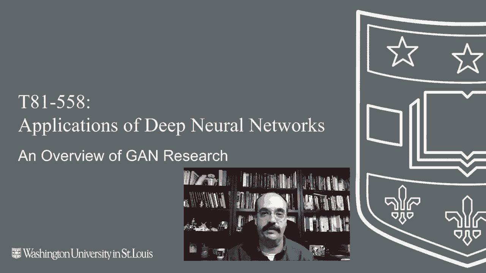
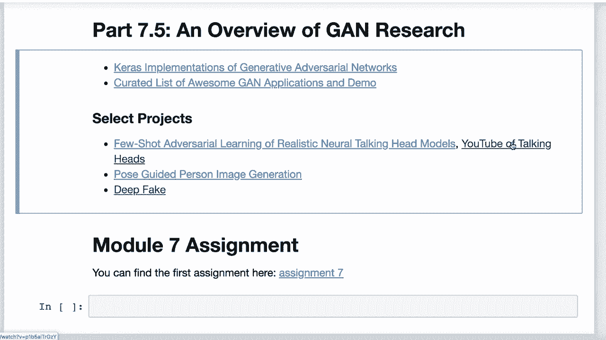
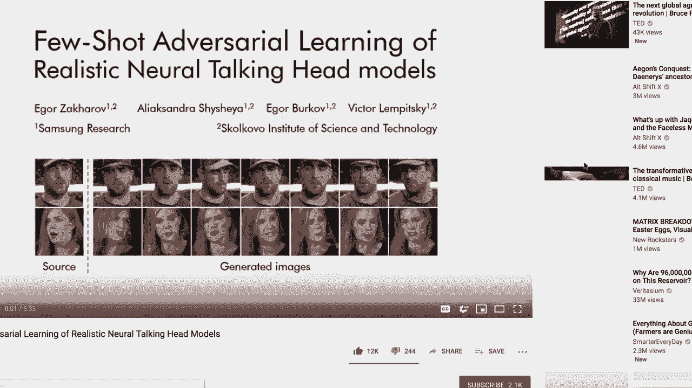
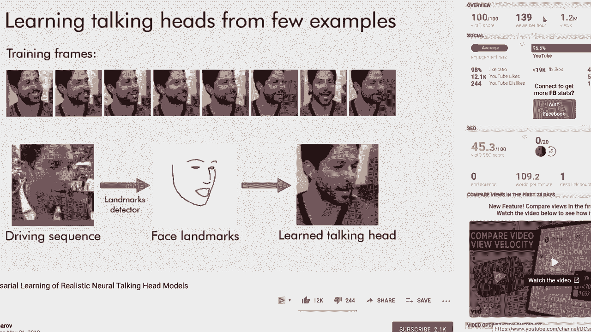
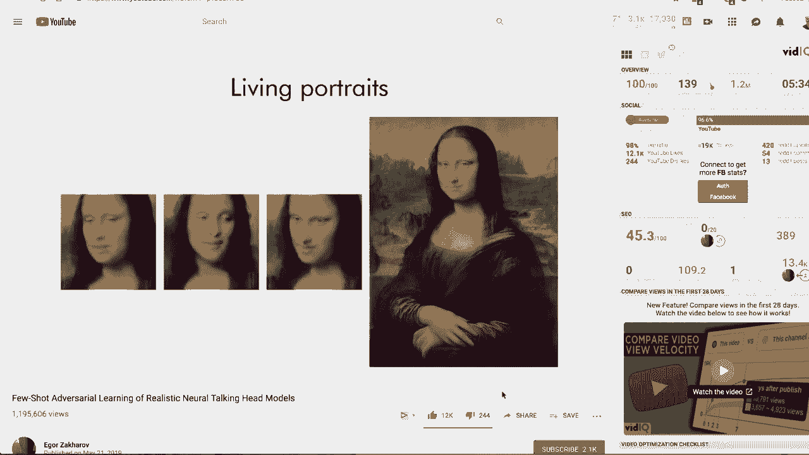

# 【双语字幕+资料下载】T81-558 ｜ 深度神经网络应用-全案例实操系列(2021最新·完整版) - P41：L7.5- 生成对抗网络(GAN)研究领域的一些新主题 - ShowMeAI - BV15f4y1w7b8

Hi， this is Jeff E and welcome to applications of Deep neural Networks with Washington University in this video we're going to look at some of the newest areas of research in GANs and see some of the neat things that can be done with this exciting type of neural network for the latest on my AI course and projects click subscribe and the bell next to it to be notified of every new video so let's look at some of the GAN projects that I find particularly interesting some of these are pure GAN some of these make use of other technologies in conjunction with GANS。

Here I give you a link to a website on Github that basically has。Kra's implementation of many of the G projects that you would find papers on。 This is a very useful site， and I've used this to get。Information for a number of the examples that I've given you in this class。

 So definitely check this out。 This is a really great Dethub repository as well。 This is a curated list of awesome G applications and demo。 This project is able to generate Chinese calligraphy fonts using a G。😊。This project is able to generate anime characters as faces。

 It's just like the regular face generatinggans that we've seen。 except that it is generating anime characters。 F aging is interesting。 It's able to progressively age a face and give you an idea of what a face would look like at older ages。 Super resolution is very interesting as well。 This is where they're taking fairly low resolution images and making them much higher resolution。

 This is very popular with upscaling on large screen televisions and also getting older video games to。😊，Output in very high resolution， a few select projects that I find very interesting just to have a look at deep fake the media has been very interested in this。

 especially with the 2020 US election coming up We're entering an era in which our enemies can make it look like anyone is saying anything at any point in time。 even if they would never say those things， someone else would。Someone。Like Jordan peelel。This is a dangerous time Now Deep fakeake works by taking source video imaging and bringing it together so that you can create an image。 create a talking head of someone that basically says whatever you you want them to in their actual voice there's a new method coming out few shot adversarial learning of realistic talking heads。

🎼This one you've seen in the media fairly recently。 They did a lot of things with the Mona Lisa。

🎼PaintWe present a system that can learn realistic talking head models。🎼Notably。 learning of a new head model requires just a handful of images here we can see that in some cases the model might be very sensitive to the geometry of the landmarks。

And most scans that you see deal really just with faces， but。

They're doing entire body guided generation。

This was a paper where they're able to generate entire bodies and also pose them according to these these points that you have here so you can now。I don't know I get the idea neural networks are trying to put human models out of a job perhaps I don't know。

 but they can now generate entire body images based on the Gs intelligence。