# 【双语字幕+资料下载】T81-558 ｜ 深度神经网络应用-全案例实操系列(2021最新·完整版) - P42：L8.1- Kaggle简介 - ShowMeAI - BV15f4y1w7b8

Hi， this is Jeff Heaton。 We to applications of Deep neural networkss with Washington University。 In this video， we're going to see an overview of Cagel。 Cagel is competitive data science。 and one of the projects in this class deals with a Cagggel competition for the latest on my AI course and projects。 click subscribe in the bell next to it to be notified of every new video。

 Kagel is a big deal in the data science world。 It sort of like the World Cup or the Super Bowl in the United States。 It is where data scientists compete with each other。 They do this to get kgel rankings。 There's several different kgel rankings。 We'll talk about that in a moment。 But what you're going to be the most interested in with Cagggel is I'm going to give you a kgel in class。

 So this is a special area of kgggel。 It's not a real fullblown kgel competition where you're competing with thousands of other data scientists。 but it's using exactly the same interface as what Kagel has。 And this lets you get used to the kle competition and to learn。😊。

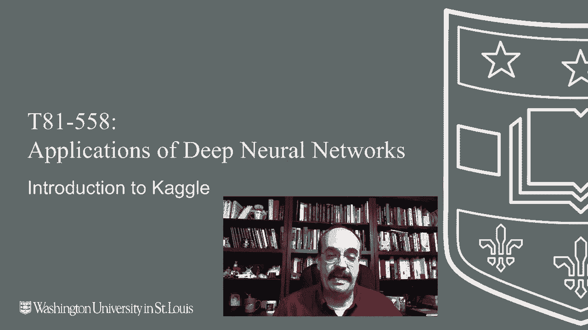

How to work with these types of dataset sets So I am going to give you an overview of Kagggel and we're gonna to see how to submit things to Cagel because one of the major projects for your grade in this class is a kaggel competition that is open to the students of the current semester and also the Internet in general there's usually a couple of people who are not in the actual class at Washington University who also compete in the Cagel competition。

 It's a lot of fun。 I sometimes even have prior students come back and recompte in the subsequent kgel competition semesters。 Some students that competed in the class kgel competition also went on to do other kgel competitions。 One student even got into the top 5% of an actual kle competition which is higher than I've ever done in Kaggel So that is cool We'll talk more about what those percentage rankings mean in a moment。 So Cagel look at this you can see the top kgel users This is just a link into the Kagle website。

Now it does put me up at the top here， but that's just because it's me I'm definitely not in position zero of Cagel。 These are some of the highest ranking data scientists from Cagggel。 you can click on some of the individual people。 it will take you to a small profile page that describes more about them Sometimes they have links to Github and LinkedIn profiles sometimes they they do not it as is the case for this guy who is the current top ranked they do sometimes on Kagggel have interviews with these people so that you can you can talk about that。

 I also have a link to the top Cagggel profile but we went to there。 This is my Cagel profile page just so you can see what I have done with this This shows your current ranking I am what's called a competitions expert that means that I've completed two competitions and gotten to bronze medals that's the minimal requirements for the competition expert The next level up for me would be kgel master and then even Kagel Grandmaster that requires getting some of these。

And gold level finishes on the how you get a bronze is essentially a top 10% win in kgggel。 our top 10% finish。 These two competitions that I probably did the best on in terms of kle。 One was a top 10%。 and one was a top 7% finish。 So that was enough to get me the competitions expert。 Now I haven't done a kgel competition in about two years。 I hope to do one of these again。

 but they do take quite a bit of time as does my day job。 So we'll see how that goes in the future。 Most kgel competition。 So we'll look at a typical kgel competition。 We'll look at the Titanic competition。 Cagggel breaks their site up into competitions。 So if you go to the competition summary page for Titanic。 This is a tutorial competition。

 You can certainly compete in this。 you can tell by the sheer number of teams in this。 there's nearly 12000。 Most of the big competitions will be 1000 or2， maybe three。 So this is certainly a very large one winning the kgel。 There's no。

Concept even of winning the kagle competition for Titanic， because it's ongoing。 There's no deadline date really for it。 They usually put the current deadline date for Titanic as the end of the current year。 You just they keep rolling it forward to the end of the next year。 The Titanic data set is the cruise ship that suffered a very disastrous fate in the middle of the Atlantic。

 It sunk。 Some people survived。 Some people did not。 You can go to Wikipedia and find out who survived and who did not。 So you can get a perfect leaderboard score on this。 So the leader board shows you of the people competing。 who is near the top and who is not。 Now。

 look， there's a lot of perfect scores。 These are accuracy。 So 1。0 means 100% accuracy on a tutorial competition like this where the results are published on Wikipedia。 The fact that these guys have 100% means they're really good at copying and pasting。 There is no way that you could get a 00% score on the Titanic without。

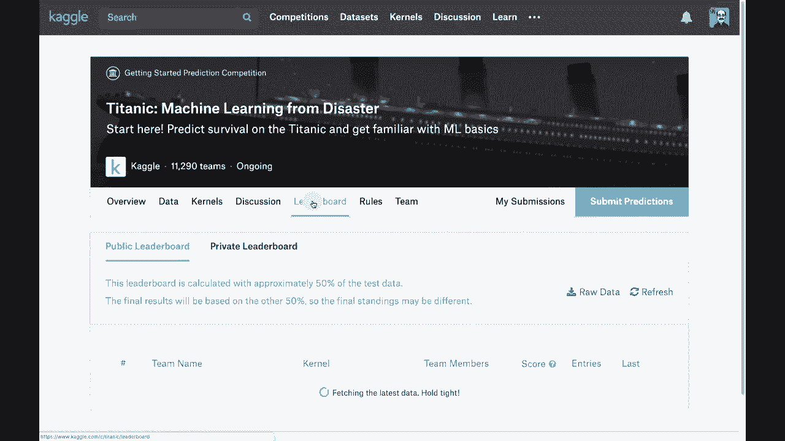

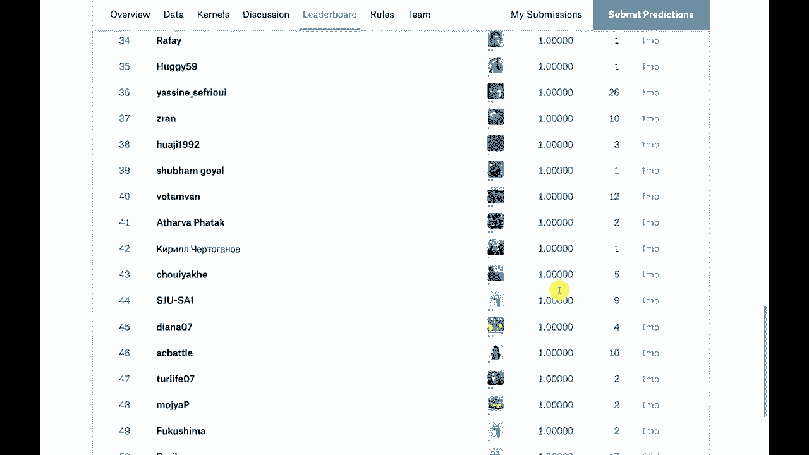

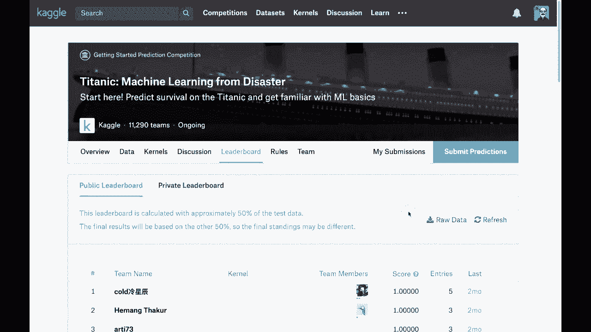

re overfitting。 I would be very surprised to see that Overfitting the Titanic is a perfect example。 There were a couple of fairly young individuals who should have female too who should have made it off of the ship but did not。 Nobody knows exactly why they did not probably got separated from their parents in the final hours of this disaster。 So that's the leader board。 The data page is also very important to you。

 I'll take you through the competition for this semester at the end of this module。 this is the data page。 and this shows you what the train set and test sets look like。 You'll also get a data dictionary， For example， did they survive。 Yes or no ticket class First second and third， The gender， the age and years， number of siblings。

 number of parents， the ticket number， the passenger fair cabin number and where they embarked from。 They were essentially three different cities that people were picked up from in Europe before the Titanics set sail across the Atlanta。 These variables are very important。 The ticket class。

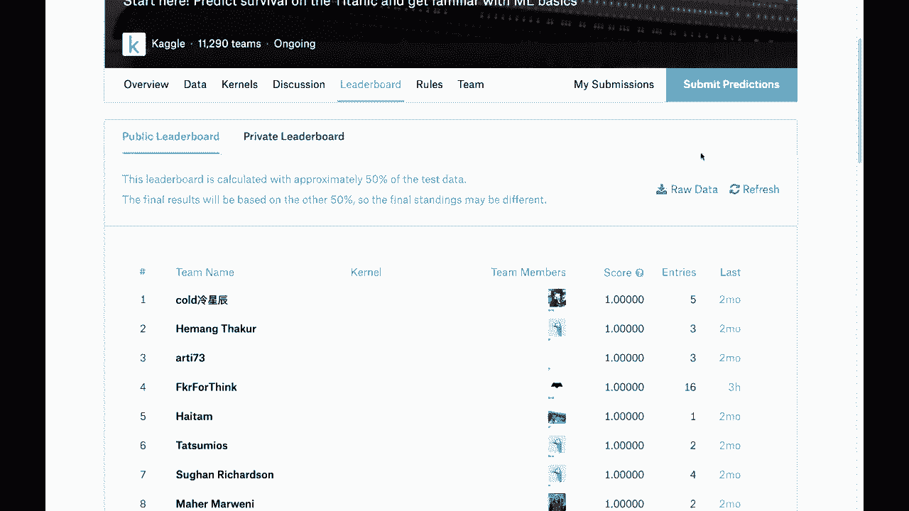

Probably the second most important one。 The gender went very much by women and children first on a disaster such as this So the most predictive variable here is where you male or were you female if you're female you have a much greater probability of surviving the second most important depends on if you're male or female if you were a female your ticket class had a whole lot to do with it secondarily maybe age male very much age was the second most important one because then you would fall under the category of children Some of the competitions you will see kernels for I won't require that you submit kernels in the class competition that we have you can see some of these are ranked fairly high in terms of how good of a kernel they are this is where you submit co So there are three different ways that you can achieve fame in kegel probably the most prestigious is simply by winning competitions are placing very high in competitions The next probably most prestigious as kernels。

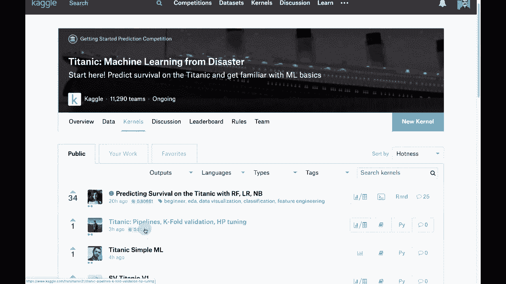

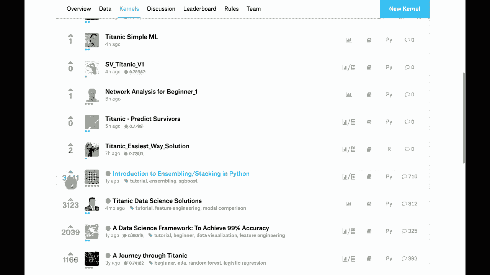

Maybe you have not necessarily won the competition。 but you have submitted a code snippet that your fellow kags have voted you very high on。 such as these introduction to ensembling stacking and Python。 That might be a great one for you to look at for this semester you could possibly adapt it to the assignment that I'm going to give you the third and another way。

 I mean， all three of these let you become kggle master kgel expert kgel Grandmaster is discussion and discussions are also very。 I learn a ton of stuff from these discussions when I compete in kggs。 The discussion points can be also ranked very high。 And if you get a lot of consistently highran discussions that you've posted that will earn you kle master status in discussions and then leader board。

 You will be allowed to compete in teams for the Caggle competition。 Here you can see three icons that means that this is a team competing。 So you'll be allowed to create teams of probably up to5。😊。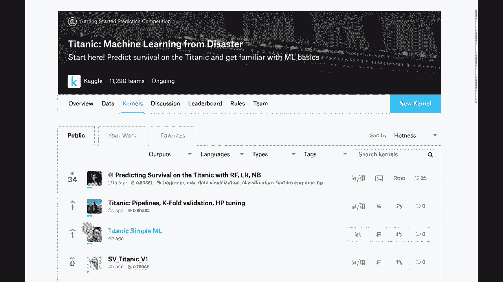

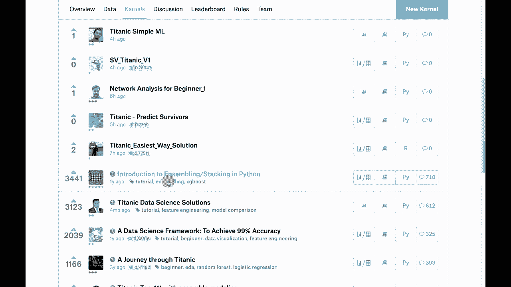

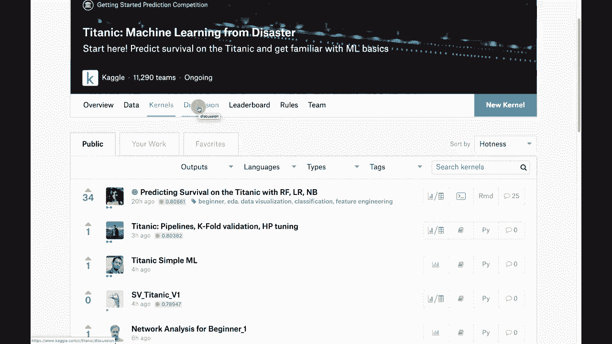

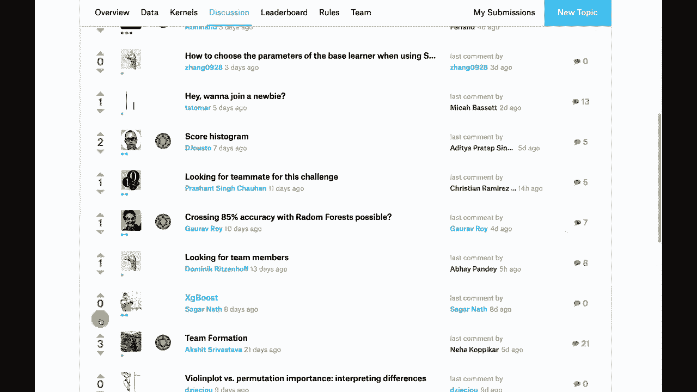

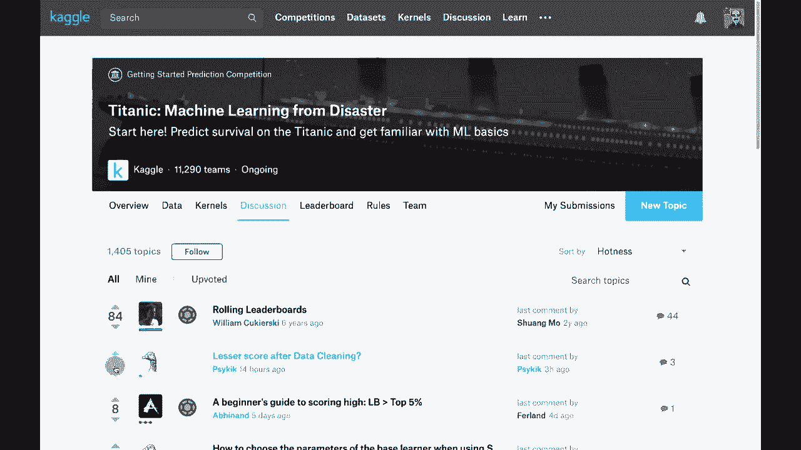

But refer to the actual video for the instructions for this semester's kle competition。 The other thing you might notice too is these little pps below them little dots that tells you how advanced of a kgler you you're dealing with So a green single one means that you are dealing with a fresh never in a competition kgler two dots means they've been in a kggel competition but have not really gone to the expert level where they've gotten two bronzes these people with three by the way。

 this is the category I'm currently in Those are people who have had bronze finishes and are at the level of kgel expert and then four would be kaggel master 5 would be kgel Grandma。 So how kgel competitions are scored is this is pretty interesting you don't typically need to actually submit your co to kagle for scoring。

 they just want your data Now there are kernelels only competitions。 I might do one of those in a future semester but not at this point So the competition。That I will give you will be a normal kal data competition。 so I'm going to have a complete data set。 I know the outcome。 I know the why for every single row in my complete data set。

 I'm going to break that into and give you a training set and a test set Probably test set will be 20% but refer to the kagal competition for the current semester to see really where I've set that to the training set I will give you the Ys as is customary the test set I will not give you the why Both of these sets will have ID columns that tell you what the row I for each one is What you'll do to get scored is you'll send in your predictions。

 your Y hats for the test data set with each ID number。 So what you submit is actually very short。 It's just I and your answer。 like submitting the answer on one of those fill in the blank kind of scanron test that they're using less and less usually you do such tests on computers these days inside of the test data set that you're submitting there are two halves to this。

There is the public leader board and the private leader board。 You will be scored on the public leader board initially。 and you won't know which set is which I don't disclose that Kegggel does not disclose that。 your answers will be based on initially the public leader board scores that you were seeing in the Titanic kggle competition。

 those are all public leaderboard scores until it actually ends once the competition ends it flips and your score is from the private leader board。 this prevents overfitting。 if you are severely overfitting your training data set。 your public leaderboard score is going to be horrible。 However。 if you overfit the leaderboard by making lots and lots of adjustments。

 just trying to edge your public leaderboard score higher and higher。You'll end up with a bit of a surprise when the private leader board happens because you will have overfit the public leader board and many of the Cagel competitors in some of these competitions have fallen drastically。

 they'll be in the top five or so on the public leader board but then the competition ends and they will be knocked down severely in the private leader board We'll see examples of this as we get into the actual assignment for the semesterster。 but you will not know your private leaderboard rank， which is what counts until the very end。

 So the public leader board is just an estimate of where you might be。 This is a graphic example of this。 You can see the original data set。 That is the one that only I or whoever is running the Cagel competition has I give you this data here。 you get the training where you have the Ys and the test where you do not but the test is secretly broken half where you will be scored separately。

 You don't know which rows or the public leader board， but I have the Y's to that。 So Kaaggel will be。ically scoring you on that and putting you into whatever bracket。 your public leader board score warrants and then at the very end。 Caggle automatically scores you on the private leader board Now preparing a Caagle submission you will take essentially this test data and you will put in your answers for all of this So for the Titanic data what it would look like is passenger I comma0 if they died one if they survive and it's a cv file that you basically upload to this I will take you through some of the Cale competitions that I found particularly interesting first of all the auto group challenge was the first kle that I ever entered and fortunately was able to get into the top 10% of that one the auto group challenge is one where you had to discriminate between several categories of product I forget how many there were exactly there's 93 features so 93 X and。

Giving 200，000 rows and you need to classify between those this was a very difficult kle competition and it was one that I ended up using a combination of deep learning and something else called XG boost very much suggest you take a look at XG boostos it's outside of the scope of this class but XG boost and something called light GBBM are very popular in kle and if you want to ensemble that together with your semester kgel assignment that will probably help you get better and higher scores for that just to look at the leader board for this one this shows you the people who were top ranked Now notice these dots below them is much higher because it are real kgel so you had real hardcore competitors competing here the yellows are kaggel Grandmas the oranges here or kgel Masters this guy was really lucky he just submitted one and got into the top 10 of that one not entirely。

Sure well， he probably submitted just this one and never competed in Kaaggel again。 So he's he's not even at the expert level， but I'm sure he could do that。 He or she。 this is the public leader board。 So if we this is actually the private leader board。 If you look at the public leader board have a look at the top people because this is going to flip a little bit。

 It didn't actually flip much。 Most of these people were right where they where they were。 So there was not much overfitting going on with this one。 Galaxy zoo was a pretty interesting one as well。 This is where XG boost really came into the limelight。 This is one where you were attempting to classify the type of galaxy that you are looking at。

 This was a computer vision one。 This is one of the earlier computer vision ones。 Kagel has a lot of computer vision ones as well as tabular data where you're dealing with rows and columns。 Most of the kagle competitions I've done with this class up to this point have been tabular。 but I will will very likely throw in。Computer vision1 at some point。

 so you' you'll hear about that when we get to the last part of this module and we cover what the current semester's competition is The practice fusion one is particularly interesting because you're given a relational database This is one from the early early days of ks only 1416 in this one This is medical data So this is one that my industry the insurance industry has looked at a number of times for various examples you're also given ICD9 codes which believe me ICD10 and IC 9 are big thing in the insurance industry predicting a biological response。

 This was a particularly interesting one。 I give you an example of this one later in the module so that I can demonstrate ensembling to you ensembling is where you use multiple models together So heterogeneous ensembling that's where you might be using a random forest together with a deep neural network compared to homogeneous ensembling which is。

Where you would be using something like a random forest that is doing ensembling completely on its own。 If you look at the data dictionary， you get a tremendous number of columns。 it has to keep loading them in fact， I think there's over a couple thousand and you actually don't even have all that many rows for this one。 So this is yeah here's the exact stats， the training set you have 3700 rows and 1777 columns that's kind of crazy but this this was sort of the point of this one and you're predicting if a biological response will happen or not。

 so it's a binary classification problem。 Some of the computer vision ones that I found particularly interesting diabetic retinopathy is very interesting。 This is using pictures of your eye called retinopathy to predict if you have diabetes or not this is another one。

 the insurance industry is obviously quite interested in。 So for $100000。 So these are for potential。Big money cats versus dogs。 This is just kind of fun。 It used to always be said AI fails at telling the difference between a cat and a dog that's by no means the case anymore。 This had pictures of cats pictures of dogs and you try to use deep learning and other techniques to tell the difference between the cat and the dog。

 look at the leaderboard。 This is accuracy So somewhere in the area of 99%。 So neural networks and other models can very much tell the difference between a cat and a dog State farm distracted driver detection。 this is an insurance industry1， and it was using computer vision。 So this is quite interesting。 This is one where there was a camera placed into test subjects cars。

 and the idea with a lot of these is you let the insurance company put some sort of monitoring device in you。 This is completely IoT Internet of things So there's something in these cars that are tracking these people and they're taking pictures of these people as they're driving。

Iea is if you demonstrate that you're a safe driver or a healthy individual whatever。 the insurance company will give you a lower premium。 These are drivers who are not so safe。 You can see she's looking at a cell phone。's looking at least out of the car but has a cell phone in hand So you would want to detect if they're doing a safe activity or a not so safe activity。 There's also time series in kgel the whale detection challenge was very interesting。

 you're looking at basically sound waves。 So processing sound files。 This is a very popular thing for time series data like LSTms and some of the new convolution temporal stuff。 we'll talk more about that as we get into time series and then other Kagel always has helping Santa's helpers and this is just a bizarre competition but it's always right around Christmas time。 you're essentially coming up with an optimal schedule for Santa so that he gets all his toys delivered over Christmas Eve this competition。

Ens up becoming quite bizarre because off these competitions for Santa will the schedules for Santa will go on for many。 many decades after Christmas。 So he ends up very， very late。 But this is an optimization problem。 A little bit outside of the area of neural networks。 But other machine learning techniques can be used for that。 Thank you for watching this video。

 In the next video， we're going to look at ensembles and how you can ensemble neural networks with other psyit learn。😊。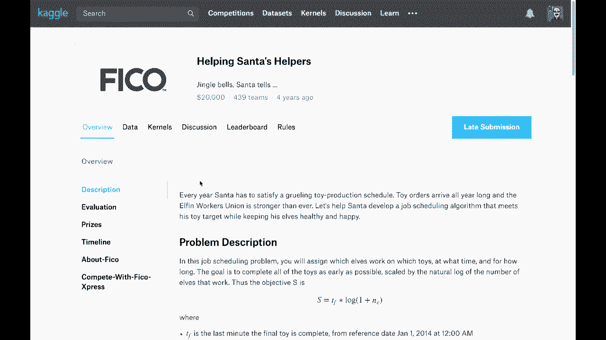

Type models to build even more predictive structures。 This is a very common technique in kggles。 This content changes often。 so subscribe to the channel to stay up to date on this course and other topics in artificial intelligence。