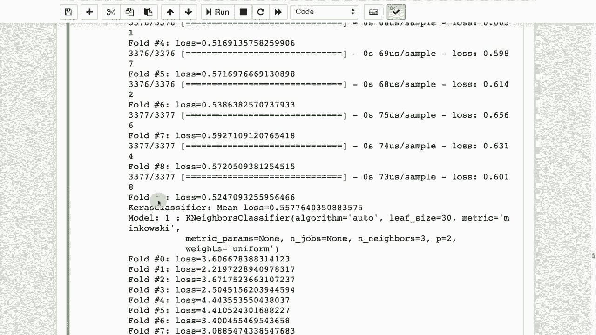

# 【双语字幕+资料下载】T81-558 ｜ 深度神经网络应用-全案例实操系列(2021最新·完整版) - P43：L8.2- 使用Scikit-Learn和Keras构建集成模型 - ShowMeAI - BV15f4y1w7b8

嗨，我是杰夫·希顿，欢迎来到华盛顿大学的深度神经网络应用。在这个视频中，我们将研究集成方法。我们将特别关注异构集成，这让你可以结合不同类型的模型以获得更强的结果。想了解我最新的AI课程和项目，请点击订阅及旁边的铃铛，以便接收每个新视频的通知。

我们将看看一些对你在本学期Kaggle比赛中非常有帮助的技巧。这允许你使用神经网络与集成。集成是Kaggle中的一个非常重要的方面。这就是你创建异构集成的地方。现在，集成是许多机器学习算法（如随机森林）内置的功能。

随机森林在自身的基础上就进行集成。它包括树，而这些树是彼此集成的。因为这里没有多种不同类型的模型，所以这被称为同质集成。现在，我们将首先评估特征重要性。这是一篇很好的论文，告诉你如何进行特征扰动排名。这是一个非常。😊。

这是一种可以用于任何类型回归或分类算法的流行技术。它不使用实际模型的任何内部。这也是一篇有趣的论文，因为里面有乔伊博士和德斯博士，作者名字的有趣之处。这些是你可以用来评估特征重要性的其他一些方法。

哪个输入是最重要的。现在主要是处理表格数据，你会看到类似于Excel中的列。如果你处理的是图像数据，特征重要性就更难以确定，并不是一个像素更重要。

说得比另一个像素更重要。这也是一篇我参与的论文，我们发布了可以与TensorFlow一起使用的代码来实现一些这些算法。这是一个仅介绍并提供基本扰动排名算法的函数。

'继续运行它，这样它就会以这种方式加载。其实这非常简单。我有一个单独的视频，不是这个课程的一部分，但我制作了一个关于扰动排名如何工作的影片。如果你想深入了解其内部工作，我会提供一个链接供你访问。

但本质上，这个过程将逐列遍历数据集并逐一打乱。我们将使用同一个神经网络来评估所有列，但我们将为每一列一次性评分。所以假设你的数据集中有10列，即10个预测变量。你想知道这10个中哪个是最重要的。

你从第一个开始，打乱这些列，你对列1进行扰动，这样列1就被随机化，这有效地摧毁了列1。但最大值、最小值、标准差、均值、中位数等仍然完全相同。所以你没有引入任何偏差，但却摧毁了一列。现在你评估误差。在那个随机化列的神经网络上生成预测。

如果列1并不是非常重要，那么分数不会大幅下降。你的准确率或日志损失，或者你使用的其他指标，如果列1非常重要，那么打乱它将真正、真正伤害你的分数。所以这就是为什么要进行扰动排名。它基本上是对我们拥有的列数进行循环。

我们复制这一列，因为我们即将打乱它，然后有效地摧毁它。但我们有一个副本，所以我们不想像龙卷风一样，它会在乡间留下毁灭的痕迹。我们想要恢复它，而不是成为龙卷风。接着我们查看是否是回归问题。如果是回归，我们会对此进行预测，并查看均方误差。

如果是分类问题，那么我们预测概率并计算日志损失。这两者都会给我们一个希望最小化的误差。我们跟踪我们的误差，然后恢复我们之前摧毁的列。我们确定最大误差是什么，然后基本上计算这些列相对于其接近最大误差的相对重要性。

最大误差，导致最大误差的列是最重要的列，因此最重要的列的重要性将为1.0，其他列会是其某个比例。我们将用鸢尾花数据集来运行这个适合的神经网络，因此我们现在有了一个适合该数据集的模型，然后我将获得完美的准确率。这在鸢尾花数据集中并不难做到，然后我将运行，你可以基本上看到重要性，所以花萼长度是预测你正在处理的鸢尾花种类的最重要列，然后它的影响急剧下降。你只会知道哪个列是最重要的，而不知道最重要列的重要性到底有多大，你只是得到这些列的排名。

你永远不会看到比1.0更高或更低的最重要列。我们也可以在回归上做到这一点。我们将使用每加仑多少英里的数据库，因为这是一个相当简单的例子。你可以将其应用于更复杂的神经网络，如果你在Kaggle上进行此操作，可能会花费更长的时间，因为你可能有20、30、40、100列，并且需要在每一列上运行。现在，在运行此后，我们可以看到哪些字段对每加仑多少英里的神经网络最重要，我们可以看到位移。

这就是立方英寸或其他发动机体积测量的最重要特征，接下来是马力、重量、年份等等。气缸将通过位移表示，所以我不太惊讶这是一个较不重要的特征，但你会注意到大多数特征在整体重要性方面相对接近。现在我们将采取一个行动。

这是Cale提供的生物响应数据集。因为我将以此作为构建集成的示例。如果我们打开这个数据集，我不会实际操作，但我有一个链接可以供你查看。它基本上有近1700列和大约3000行。

所以它有大量的列。特征重要性可能有助于移除其中一些。不幸的是，大多数都是相当重要的。我们要关注的是如何将这些组合成一个集成。这里的“这些”是指几种不同的模型，比如神经网络、随机森林、梯度提升等。所以我会继续运行这个。

这将基本上打开这些文件。我将它们保存在本地驱动器上。这些是Kaggle文件。因此我实际上不能将它们放在一个可以让你访问的地方。你需要自己从Kaggle下载它们。我只是把它们放在数据目录中。你可以把它放在任何你想要的位置。我会运行这个。

你可以在这里看到，当我打印出这个数据集的形状时，它实际上是一个相当方形的数据集，这很困难，因为列几乎和行一样多，3700行和1777列。我们继续运行这个，拟合一个神经网络并获取一些预测。这是一个分类神经网络，因为它基本上告诉我们是否发生了生物响应。

你可以看到验证的日志损失大约是0.55。日志损失是Kaggle实际用于排名的。验证准确率大约为76%。所以，这并不好，也不算太糟。我们会看看这个的特征重要性。基本上，大多数特征都在90以上。

甚至追溯到1700年代也有90年代的数据。因此它们都是重要的。这对于这个特定的任务来说非常困难。集成对获得良好的得分至关重要，特别是对参与这个竞赛的Kaggle竞争者来说。因此，我将开始介绍一些我这里的代码。

你可以利用这个来构建一个集成。你看到这里我有构建人工神经网络的代码。我将继续运行这个，因为它需要一些时间，并在实际运行时解释发生了什么。这构建了人工神经网络。我在这里给出了一个类别的数量。通常你会希望这仅仅是占位符代码。

你将需要比我在这里更多的稠密层。我还计算了对数损失多重对数损失。这是一种我们在早期模块中看到的错误计算类型。这里的拉伸代码基本上用于规范化预测的y范围。因此，它是一种平均或规范化的方式来拉伸它。

这是一种我在几个Kaggle比赛中看到的技术。我从这里一个获胜方案中复制了它。如果你在做回归或像这样的单一分类，这可能对你有用。我将使用分层K折交叉验证，基本上是确保我们的每一折在训练集中的分布是平衡的，否则你可能会引入。

不一致性，比如说在整体训练集中有20%的正样本。你希望在每个K折中也有20%的正样本。否则你的真实标签会偏离。我在之前的模块中有关于分层K折交叉验证的信息，讨论了如何进行交叉验证。这里有一个模型列表，这些模型。

这些都是你想要组合在一起的。因此，我正在构建一个克拉斯分类器的集成，基本上是构建我们上面提到的人工神经网络。随机森林分类器运行了几次，还有额外的树，这是一种随机森林，然后还有梯度提升。

我加载我的数据集，然后在这些模型上运行，并构建集成。我还有其他视频会链接到这些内容，深入讲解这背后的机制。总体上，发生的事情是构建了一个数据集，其中每个模型的预测都是一列。因此，我们有一个。

2，3，4，56，7，我们有7个这样的。你将基本上有七列，Y将是真实的😊，来自数据集，生物反应是否发生。你实际上是在所有这些上训练线性回归。因此，利用所有这些分类器的输出和预测来预测实际的输出。

你正在将这些模型用作另一个模型的输入，即集成模型来形成预测，然后我们将其混合在一起。我们使用逻辑回归来实现这一点。这是一种线性回归。我们根据此建立适合度，最后基于线性回归的输出构建我们的预测文件。

在这里，你可以看到我们基本上正在查看这些不同模型类型的所有折叠，最后它将给出你实际上会发送给Cagel的最终提交文件。感谢你观看本视频，在下一个视频中，我们将对构成神经网络的所有超参数进行调查，看看你如何更好地优化这些参数。

该内容经常变化。因此，请订阅频道，以便随时了解本课程和其他人工智能主题的最新动态。😊！
