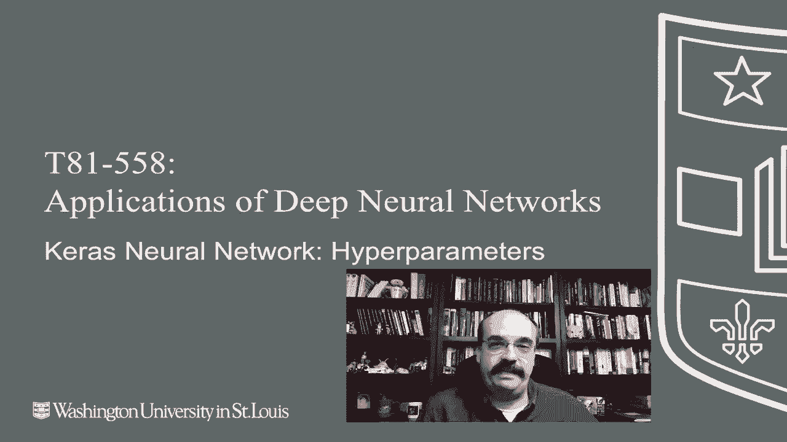
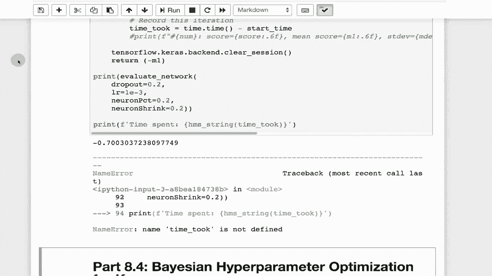

# 【双语字幕+资料下载】T81-558 ｜ 深度神经网络应用-全案例实操系列(2021最新·完整版) - P44：L8.3- Keras神经网络结构搭建细节与超参数 - ShowMeAI - BV15f4y1w7b8

嗨，我是杰夫·希顿。欢迎来到华盛顿大学的深度神经网络应用课程。在这个视频中，我们将回答一个我相信在整个学期里困扰着你的问题。你如何知道在神经网络中使用多少层？你如何知道在神经网络中使用多少个神经元？😊

这是一个足够大的问题，我们将花接下来的两个视频来讨论。有关我AI课程和项目的最新信息，请点击订阅并按旁边的铃铛，以便在每个新视频发布时收到通知。对此问题真的没有简单的答案。通过各种模块查看神经网络，你会看到我们有各种层和激活类型。

有不同的方法进行归一化，不同的激活函数，以及你可以在神经网络上调整的各种参数。神经网络自身有很多这些被称为神经网络的权重。然而，超参数并不是作为神经网络训练的一部分学习的，而是由你这个神经网络从业者来指定的。因此，作为神经网络从业者，你需要指定你想要的激活函数、正则化等所有这些内容。在接下来的部分中，我们将看到如何使用称为贝叶斯优化的方法来帮助我们微调神经网络。

但即便如此，仍然有一定程度的决定权，至少在你这边。要决定你要优化哪些超参数以及你想如何优化它们。在这一部分中，我将带你了解到目前为止我们讨论的主要超参数、层类型以及其他内容，如果你觉得我们没有涵盖到的内容，你也要知道。因此，在你构建神经网络时，Keras的层。

你会看到各种示例将不同类型的层添加到神经网络中，这里列出的是你可以在构建的序列中添加的所有层类型，最终或许放入模型中，如果你使用功能性API激活，这是一个允许你指定激活函数的层。我通常不太使用这个层，而是倾向于将激活函数作为全连接层和其他层类型参数的一部分来指定，但你可以将其分开。

激活发生在层活动正则化之后。这允许你在层之外添加L1和L2。再说一遍，L1和L2，作为活动和内核可以添加到诸如全连接层等单独的层类型中，但如果你发现将其放在层之外更方便，也可以这么做。

密集层。这无疑是表格数据的主力军。这基本上是你神经网络的构成部分，如果你处理表格数据。如果你处理图像和其他事物，仍然会有密集层。如果你处理非密集层，如LSTM层和卷积层。

你通常需要先扁平化。这是一个层类型，在将数据输入密集层之前。丢弃层允许你使用丢弃正则化。你通常指定一个相对较低的百分比，可能是5%，10%，20%。这就是在训练期间随机禁用该层中神经元的百分比。

在实际运行神经网络时，丢弃没有效果。当你计算要丢弃的神经元百分比时，这不是一个可学习的参数。你必须在构建神经网络时指定这一点。Flatten通常在密集层之前或在输出之前使用，用于将多维张量（不是向量，如矩阵和立方体）压缩为可以传递给不设计处理多维输入的层的向量。

输入层是数据进入神经网络的地方。

这可以作为参数为密集层或其他层指定。Lambda层。我实际上没有太多使用这些，但你基本上可以指定一个Python Lambda函数，对数据进行一些转换，通过掩码层。

这实际上是我没有使用过的东西，所有的确切信息我也不太清楚。但它是可用的，处理时间步。我猜这在处理递归神经网络中的LSTM时会有一些用处。对于排列也是如此，可以用于为给定模式添加一些随机性和变化。

我不太确定排列是否随机。我认为排列不是随机的。就像我刚才说的，排列是一种在层处理时改变维度的方式。这与重塑工作原理非常相似。我通常使用重塑而不是排列。我没有大量使用排列，重复向量是一种复制事物的方式。

我没有大量使用那种。重塑。我使用得很多，这让你在数据处理时改变事物的结构。😊例如，你的RGB值的顺序与神经网络预期的不同，排列可能是一个很好的选择，而重塑只是改变实际形状，而不一定过于关注顺序。空间丢弃是用于卷积层的丢弃，我没有大量使用这些激活函数。

激活函数在神经网络中是一个非常重要的话题。需要记住的是，激活函数有很多历史，神经网络存在已久，各种激活函数在这些年里被添加到网络中，其中一些在现代深度学习中并不常用。

你还会注意到我在这里有先进的激活函数。先进的激活函数是在拟合过程中实际上被修改的函数。常规激活函数仅是训练过程的一部分，但训练过程并不会影响实际激活函数内部的任何参数。

所以 softm 激活函数通常在多类分类的输出层上看到。这确保了来自神经网络的所有输出总和为一。因此，它们本质上是概率，这里没有太多调整。要么你在使用 softmax，要么你不在使用，如果你在使用多类分类。

很可能你在使用 softm。现在，很多这些来自各种被细致复制的论文，EU 是其中之一。这是我见过的指数线性单元。我在一些关于 Gs 和其他内容的论文中看到了它们，我没有太多接触这些。

我打算更多地研究这些。它们在理论上似乎确实有一些优势，可能在重缩放的指数单元方面类似于 ELU，只是通过一个数值值进行缩放，这是另一个超参数，你需要指定你想要缩放的因子。缩放因子简单地乘以 SL，因此加上这个是一个历史性的函数，我没有在后来的论文中看到它很多使用，soft sign 修正线性单元 Rlu 也是如此，绝对是深度学习的主力军，除了可能是泄漏的 re，在后面是双曲正切，使用得不多。

我在 LSTM 中看到了这些，在 RE 强劲出现之前，它们在隐层中非常受欢迎，sigmoid 也是如此。经典神经网络的隐层中常见，但在现代神经网络的隐层中不常用。然而，sigmoid 在逻辑回归输出神经网络中仍然非常常见，基本上是一个在两者之间分类的二分类器，hard sigmoid 我最近没有看到很多使用。

它的工作方式就像 sigmoid 函数，sigmoid 函数计算开销很大，因为其中有两个 EP 函数。hard sigmoid 更像是 logistic 的 sigmoid 的一种近似。因此，它在计算上可能更便宜。也许在移动设备上，这可能是个好主意。我没有深入处理这个指数。

这是另一个我没有太多接触的，但它是一个基本的 Eactation 函数。根据文档，这个函数是线性的。这在回归神经网络的输出层中使用得很多，除非你正在做一些非常自定义的事情，否则我认为你不太可能在输出层以外的地方看到它。基本上，你需要通过某个东西传递激活函数，以确保它不做任何更改。

Leaky ReLU 是其变体，它允许非常小的梯度，因此在训练过程中对梯度有一些特殊规则。这是一个非常流行的选择，我在某种程度上使用过，但在所有情况下并没有看到显著的改善。Preu，我在这方面有一些不错的结果，leaky ReLU 中有一个 alpha 项，你通常需要指定，但你可以实际上学习到这一点。因此，这是一件好事。L1、L2 和 dropout，我在深度学习中不太看到 L1 和 L2 的广泛使用，L2 是肯定的，L1 则不那么多，尤其是在视觉网络中，我认为你并不想丢弃输入，比如丢弃单个像素，所以我并不经常看到 L1 的使用。

L2 可能有一些价值，但 dropout 实际上是这些深度神经网络的主力。在我阅读的论文中，你可以利用一些贝叶斯优化来计算 dropout 百分比，我将在下一部分展示。批量归一化，我在某种程度上也在玩这个，并且越来越多地使用它，它非常方便，通常在实践中，至少我观察到，可以让我将学习率提高到过去会导致不稳定的值。因此，如果你将学习率设置得过高，通常会在一些反向传播步骤甚至前向传播步骤中导致溢出，这取决于你的激活函数，这会导致 NANs（非数字），几乎会使你的训练崩溃。因此，批量归一化对此非常有用，也是解决消失梯度问题的一种方法。

如果学习率降到零，什么也学不到。你还需要利用各种训练参数，特别是批量大小和学习率。小批量在深度学习中非常流行。因此，通常这个值是 32 或更低，而学习率通常也比较小，除非你在使用批量归一化。

但你需要在学习率和批量归一化之间进行一定的调整，以查看学习率需要多小。学习率过小会导致神经网络根本无法学习，过高则会导致神经网络迅速不稳定。

所以如果你看到神经网络的误差函数报告为 NA AN，通常是因为你的学习率太高。我几乎总是将学习率指定为 10 的负 10 次幂，因此在这种情况下是 10 的 1 次幂乘以 10 的负 3 次幂。

现在我这里的这个函数，我们将在下一部分更多地使用这些。让我们快速看看如何尝试一些超参数。我将运行这个，它会加载我想要做的分类任务。

这是使用我们之前看到的简单数据集。这评估了神经网络。现在这是使用自助法，就像我们之前看到的。splits是我们实际想要多少个自助法分割。我使用两个，这样运行相对快速，但你可以对此进行实验。

在调整超参数时，有时会有一些参数，通常不太多，涉及超参数的调整，或者几乎是超参数的平方。但这将是你在搜索时需要设置的一个参数。这是另一个。

我在这里做的基本上是允许这些值存在。我试图将非常复杂的神经网络超参数转化为数值和向量。因此，dropout将是我们一次调优的四个值中的第一个。Learn rate是神经网络的学习率。

neuron percent仅仅是我们想使用的这500个中的百分比，neuron shrink是每次该层应该收缩的值。因此我们从该神经元计数的neuron percent开始，然后每次按该值收缩。所以如果你想在下一个中使用80%，可以设为0.8。你可以看到，只要每个新层的神经元计数为25且小于10，就会持续构建。

实际评分需要几分钟，并将在下一部分中使用，因为相信我，进行贝叶斯优化时，将神经网络超参数作为一个向量是非常有价值的。你在这里放入了相当多的额外超参数，如果你处理的是视觉网络，可能还想做卷积层计数等，因此这仍在运行，我会继续，哦，刚完成，忽略那个错误，我会修复，它只是尝试记录这所需的时间，这是一个0的日志损失。

7，我们将在下一部分看到，实际上我们会调整它以降低到0.59，这样的日志损失要好得多，忽略负值，下一部分我会解释这为何必要，这样我们才能优化，因为它想要最大化这个数字，而你并不是试图最大化日志损失，而是试图最小化它。

这些是构成神经网络的超参数，可能看起来令人生畏，试图独自优化这些，我们将在下一个视频中看到，可以使用贝叶斯超参数优化，让机器学习为我们完成许多工作，这个内容经常变化，所以订阅频道以保持课程和其他人工智能主题的最新信息。
