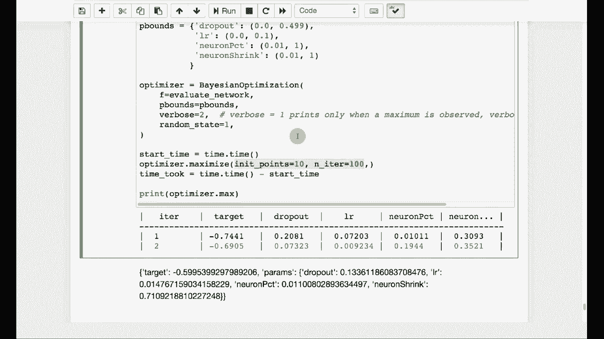

# 【双语字幕+资料下载】T81-558 ｜ 深度神经网络应用-全案例实操系列(2021最新·完整版) - P45：L8.4- 基于Keras的贝叶斯超参数优化 - ShowMeAI - BV15f4y1w7b8

Hi， this is Jeff Heaton。 welcome to applications of deep neural networks with Washington University In this video。 we're going to look at how you can use Bayesian optimization to tell you how to architect your neural network for the latest on my AI course and projects。

 click subscribe and the bell next to it to be notified of every new video Now we're going to look at Bayesian hyperparameter optimization。 believe me this is a very big thing in kagle currently， this is how you optimize hyperpara。 the hyperpara like we've talked about many times before are those things that you have to set for a particular model。 Almost all model types have hyperpara to some degree neural networks have the number of hidden layers the neuron counts if you're using batch regularization a variety of other things。

 Basically there's two sides for this。 There's parameters and their hyperpara are the weights and other things of the neural network that back propagation will adjust for you。😊。

expects you to go into the neural network and set each of the weights by hand。 They haven't done that since the 80s。 However， you do have to set your hyperparameters。 There is back propagation is not going to go in and remove layers or add layers or other things for you You're going to have to set those on your own or use something like Bayesian hyperparameter optimization Now Bayesian hyperparameter optimization is one of many。

 many， many optimization algorithms Most of these optimization algorithms work by simply taking a vector or a very long list of numbers and they adjust those numbers so that some objective function is minimized or maximized This is what back propagation does back propagation basically uses derivatives and calculus and fundamentally gradient descent to adjust those weights to minimize your error function you cannot use back propagation。

To adjust the hidden layers of your neural network or the hidden layer counts because the count of hidden layers and neuron counts is not part of the error function。 and is also not differentiable。 You can't take a derivative of how many hidden layers you have So you need to use a non-differiable optimization function on top of your differentiable optimization function。

 which is back propagation usually for neural networks。 the atom update rule。 which is a variant of back propagation。 So what we need to do is we are going to as we saw in the previous part of this module we are going to create a function that creates neural networks based on a vector that is sent to it。

 So just to briefly review what we had in the previous one we're going to go ahead and run this which is uses the simple data that I gave you previously。doesnn't really matter what we're trying to solve with with the neural network and then I'm going to run this part that evaluates the neural network。

 Now it takes it a moment to run。 So we're going to go ahead and let it run。 see the star shows that it is actually running。 You're passing it a variety of parameters that drop out the learning rate the neuron percent in the neuron shrink these last two are not standard cures or Tensorflow concepts there concepts that I am introducing here just get this to a vector So we now have a vector of four numbers that we're trying to optimize Now you may want to put well more than that in there but we will basically show you how those work。

 So the neuron count is going to be basically this neuron percent So this neuron percent is what percent of 5000 maximum neurons that we' have Now unfortunately this 5000 neurons that's a number that's something we're setting so this is a hyper hyperparameter but。

You have to set some sort of an up bound。 So it's the best I can do。 Sps is， by the way。 how many times we're evaluating this because neural networks are stochastic and you will get different results each time you try to train it So I set it pretty low。

 you might want to set it higher to actually get something better out of this So we get our neuron count and then this neuron shrink basically most neural networks set up their hidden layers pyramid styles so that you're either starting with a bunch and fewer。

 fewer， fewer or you're starting with a few and more more more tabular data usually not hard and fast。 but usually you'll start out with a fair number of hidden neurons and you shrink。 shrink shrink as you go forward。 So that's what I'm basically doing here。 I have a neuron。 I have the neuron count， and then we're going to use the neuron shrink down here where we're actually building the neural network。

 We're going to go up to as many layers as it takes so long as it's less than 10。Again。 another potential hyper hyperparameter and we're going to continue long as we have at least 25 neurons。 So what this is doing is we're basically picking the neuron percent which tells us how many neurons we're going to have overall and then the neuron shrink which tells us how rapidly it shrinks down to build that pyramid style So we might start out with a00 in the first one and then if the shrink is 0。

8 we'd shrink down to 80% of that。 so we'd have 800 in the next one and then we shrink we keep shrinking by that amount each time through and then we also have the dropout percentages and the learning rate so we're going to use Bayesian optimization to optimize all of these I did not define my hours minutes string up there that would have just told me how long this took to actually calculate so that that doesn't matter a great deal but the log loss that we got on this was negative 62 Now the reason I am using a negative。

Lo loss。 you'll see that there。 I have a negative right in there。 The reason that I have a negative here is because the Bayesian optimization wants to maximize。 You don't want to maximize a log loss。 So just flipping it around causes it to effectively minimize Now to see the part that we want to run in this section I have to set up some values here in the bounds for the Bayesian optimization。 Oh and one quick thing you do have to install the Bayesian optimizer that Pip command will install it for you if if it's not already been installed and it just tells me requirement already satisfied。

 which is good I already have it installed these bounds say that dropout can go between 0 and 0。4990。499 is already a pretty high dropout by the way， I'm going go ahead and and run this Now this can actually take a while to run So I'm not going to actually run it I'm showing you the optimal values that we got down here。

 So here we are setting the dropout range between 0 and 499 learning rate between。0。0 and 0。1。 That's probably pretty reasonable。 The neuron percent。 we are going between the full range of 1% and 100% and any value in between neuron shrink again。 the full percentage range。 So these are the four that we're trying to optimize。

 That's the whole trick to Bayesian optimization。 You need to turn this into a vector that will have all of the hyperparameter summarized。 So I'm not truly putting in every hyperparameter， like how many rows and how many neurons in each of those rows are hidden layers I should call them。

 This is now down to a single vector。 And really， you could use any optimizer that you wanted for this。 Any optimizer that does not require derivative。 So you could use things like genetic algorithms。 Neder mead。 However， the thing that is really good about Bayesian optimization is it causes your optimization function。 your objective function to be called relatively sparingly because the。

Objective function here is very expensive。 It trains a neural network。 So this could potentially go for many minutes or even many hours。 That's why Bayesian optimization is considered better than a lot of the other ones like a Mellder mead or something such as that。 it's very optimal on how many times that is actually called。

 Then you're going to construct the Bayesian optizer。 You give the function of evaluate network that we defined up there。 We pass in the P bounds。 We're going to make it fairly verbose。 I'm going to go ahead and run it so that we can see some of the results。 We won't be able to run it to entire TV as it takes a long time。

 And then we're going to So since we say verbose 2。 you're seeing it's starting to build this already。 Now you can see the first iteration already。 The log losses around 74， which is not particularly good。 After running this for a few hours。 by the way， we get to this。 when I'll explain that in a moment。

 And the random state that's just a seed。 Now this is important here。 you have the number of a knit points and the。😊，Number of iterations。 This has to do with the whole multi bandit in armed bandit optimization。 You can think of this。 the multiarmed bandit， if you've not heard of that before， it comes from the casinos。

 the slot machines。 So say you have a row of slot machines just like this you have to optimize between exploit and exploit Exp means trying different slot machines in the group because one slot machine might be more generous than the others。 Explo means once you found a pretty generous slot machine， spending your time not Exp the others。

 but pulling the arm on that slot machine and winding as much money as you can Looking back at the code。 we can see that the 10， that's the exploit。 So that's the number of points we're going to look at。 So we're going try 10 slot machines so to speak。 and then once we focus on one is pretty good。 We're going to go deep enough， we're going to exploit to 100 iterations。

 And here you can see this continuing to run。 It's going to tell you okay so the second。Iteration we locked in on a slightly better one。 This is going to result in about 110 rows because you have 10 plus 100。 And then the best one that I got when I ran it for this full amount of time was a log loss of 59 which is actually much better than I got manually optimizing those hyperparameters and I didn't even put every hyperparameter into here。 you can definitely make that vector。 you could take that vector up to maybe 10 or 20 and just come up with more creative ways to break apart and to encode those hyperparameter to encode the architecture of the neural network and here you can see basically the optimal parameters。

 we ended up liking a dropout rate of about 13 learning rate pretty low 0。01 neuron percent pretty low and not a huge neural network and shrinking by about 30% each time This could be something useful for your kaggel competition。 you might want to use。In optimization to optimize your hyperparameters。 not just for your neural network， but if you're using other model types as well Thank you for this video and next're the of for course content changes often so up to date and and artificial intelligence。

