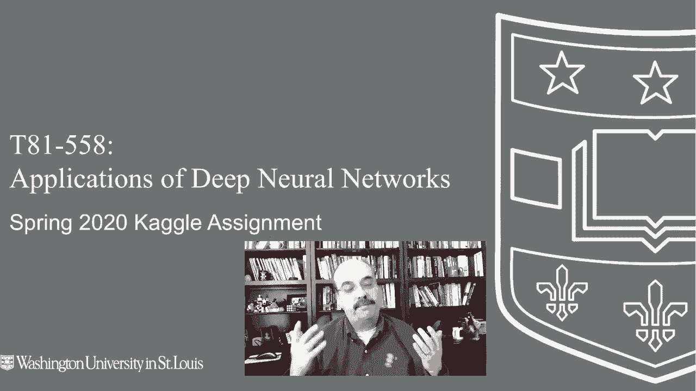
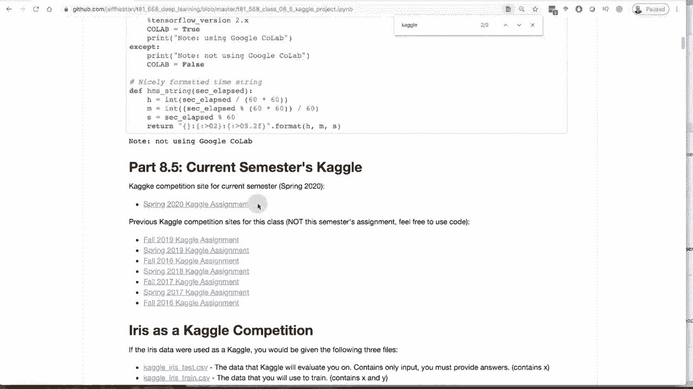
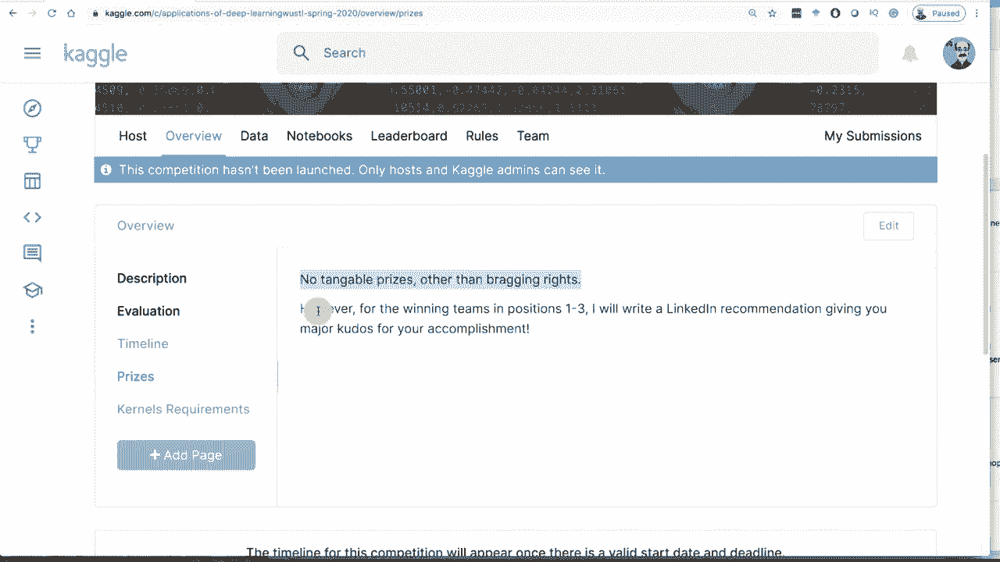
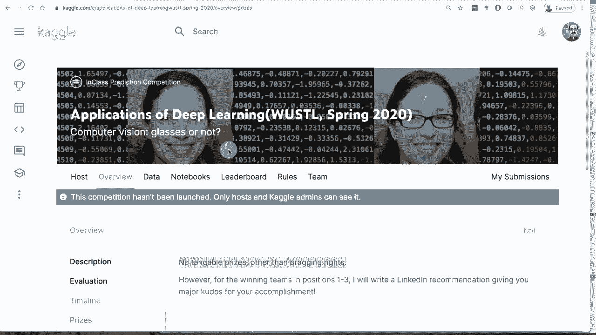
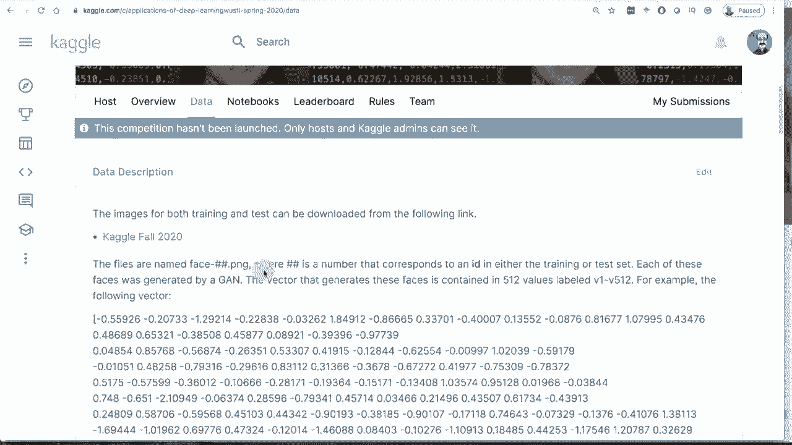
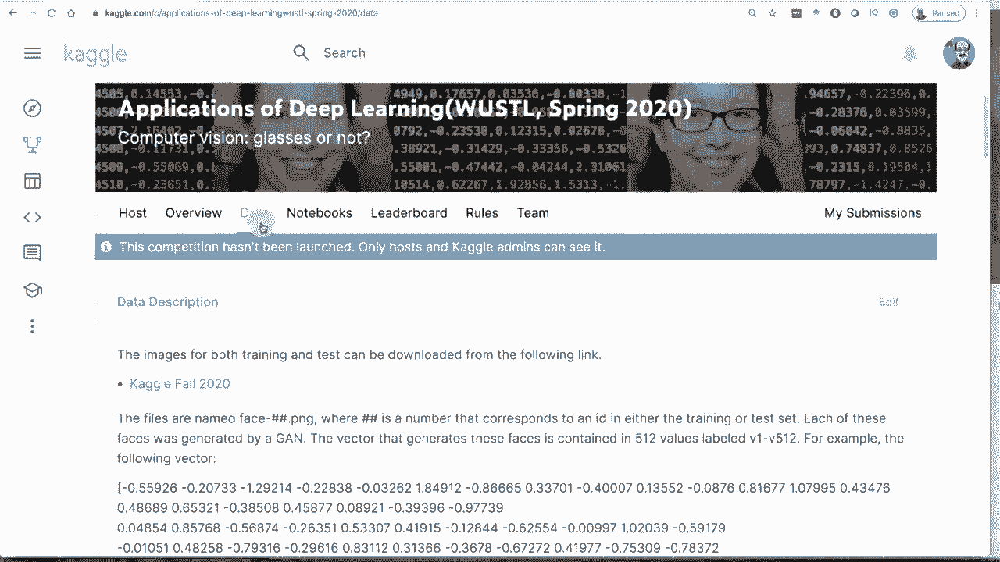

# 【双语字幕+资料下载】T81-558 ｜ 深度神经网络应用-全案例实操系列(2021最新·完整版) - P46：L8.5- 2020年春季Kaggle深度学习应用竞赛 - ShowMeAI - BV15f4y1w7b8

嗨，我是Jeff Heaton。欢迎来到华盛顿大学深度神经网络的应用课程。好吧，又到了学期的这个时候了，是我班级2020年春季Kle比赛的时间。现在，这个学期将围绕计算机视觉。这是我们第一次做计算机视觉，所以我对此感到兴奋。

我们进行了自然语言处理。上次，我觉得这是一个很棒的深度学习适用技术。这次，我们将查看脸部，并试图检测他们是否戴眼镜。现在，这些是我用Gs生成的脸。所以我们将使用Gs的潜在向量来尝试检测眼镜，以及图像本身，查看我关于Kaggle神经网络和其他AI主题的所有视频。

点击订阅按钮和旁边的铃铛，选择全部以便接收每个新视频的通知。如果你去我的GitHub仓库。T 81，5，58。Jeff Heaton用户网址已提供。你可以向下滚动并访问。😊。

我有Kle。我发誓，在页面搜索时复制让我变得懒惰。所以我通常会这样做8，5。这里总是有一个链接指向当前学期的Kle比赛。2020年春季Kle作业，我刚刚发布，你点击这个并进入。现在我的说法是这个比赛还没有启动，只有主办方和Kgel的管理员可以看到。你在这里不会看到这个，因为我将在发布这个视频时打开它，但这就是比赛。

我们这个学期正在进行一个计算机视觉比赛。它也与Gs有关。所以我给你一堆照片，在这些照片中你会看到这样的脸，我让你做的就是预测这个脸上是否有眼镜。

现在你需要小心，因为眼镜的样式多种多样，你可以有太阳镜，你可以有那种你。

甚至可以看到他的眼睛。你可以有那种可以看到他眼睛的太阳镜。你可以有厚框、薄框，或者真的很薄的框。我自己也戴这种眼镜。乍一看，你可能不会认为她甚至戴了眼镜，但如果你放大她，你会看到，确实如此。

有眼镜，只是非常，非常淡。我希望这个视频的Koc不会妨碍你看到这些，但这基本上就是我们要做的。现在，我想提到的一个事情是，对于这个比赛，你需要将代码提交给我，或者至少如果你是华盛顿大学的学生，你将把代码提交给我。而我将不再接受的一个事情。

我还问过，如果你是通过互联网加入的，你也不应该这样做。只有。😊 

测试集中大约有几千张你要提交的图片。坐在那里翻阅所有图片并标记为有眼镜或没有眼镜并不困难。利用你的大脑，使用你的生物神经网络。大家都知道你可以做到，但这其实没有太大价值。所以不要这样做。

由于数据中的噪声，你可能不会得到满分。稍后我们会讨论这个。所以让我们看看这个评估。你将使用对数损失函数进行评估。数据集基本上是这样的：如果有眼镜则为 1，如果没有眼镜则为 0。

你将发送一个概率，表示你认为他们是否戴眼镜。你将根据对数损失进行评分。所以如果你非常自信，比如说你很确信他们不是戴眼镜的人，你就写 0.12，而标签实际上是 1，这对于该个体的提交格式来说将会是相当高的损失。😊

这些文件中你会看到 ID 号码。所有训练集的编号最多到 4500。测试集从 4501 开始。规则是你可以组建最多五人的团队，不能人工标记数据，必须使用模型。所以不要只是坐在那里翻阅我的所有图片并标记它们是否戴眼镜。

没有眼镜，眼镜，眼镜。大家都知道你可以做到，如果这是一个真正的 kggle，投入大量资金的那种，我会给你提供大量带噪声的图片，所以不要这样做。如果你在 kle 竞赛中处于前位，你无论如何都得提交你的模型，如果你的模型只是硬编码的零和一，你可能不会赢得任何东西。

me2 奖项。这是一个 kle 竞赛。我是说，这是一个课堂上的 kle。因此，这不算在 ti 或排名中。除了夸耀权利，没有其他实际的奖品。然而，这更多是为了我的学生。虽然外部人士可能会进入这个位置。

我可能也会对排名第一到第三的团队这样做。我会给你写一份很好的 LinkedIn 推荐信，说明你是大约 80 人中最顶尖的选手之一。这至少是本学期 Warho 的情况。现在，对我来说，创建这些数据集的挑战在于，我从不在 Kagel 上创建仅在互联网上公开可用的数据集，那样没有乐趣，因为网上已经发布了各种代码。

有一些kggles可能对你有帮助。猫或狗可能会有点用处。有几种技术可以用来处理这些。

我会深入研究这个，可能会在学期进行中发布一些代码，给你一些提示。我不会发布任何过于强大的东西来在排行榜上获得高分。至于规则，就像我说的，不能有人为标记。现在如果你能教你的猫标记，那就不算。

所以我们从数据开始。这个比赛的数据有一个大文件，大约6GB。所以并不是特别大。这个文件里有所有的图像。如果你下载它，我来给你看看这个文件是什么样的。这是图像文件。

所以这是一个包含所有这些PG的大压缩文件。里面有相当多的文件。如果你查看所有这些文件，会发现大约有5000个。大约500。我猜这就是测试集的构成。如果你查看这些个体。

你会看到有些人戴眼镜，有些人不戴。有些人戴太阳镜，还有各种性别、种族背景和面部毛发以及帽子。这些图像中有很多不同的种类。至于如何真正分类这些，你有两种方式。你可以使用图像，或者使用gan向量。

我马上会给你展示gan向量，但我们先聊聊几种处理这些图像的方法。你可以写一个简单的分类器，告诉你这个人是否戴眼镜，你可以选择分类器的路径。

我强烈建议你使用迁移学习，利用已经学到很多特征的数据，然后在其基础上进行训练。我认为这会是最有效的方法。你也可以用Yolo来看这个，应该会很有趣。老实说我还没尝试过，但可以运行Yolo看看它是否识别出这些眼镜的部分或眼镜本身。

我可能应该先尝试那个。我不认为Yolo一定会100%锁定这个，但谁知道呢，或许Yolo就是解决这个问题的关键。但这里面有几个层次。现在让我给你展示一下训练样本及这些文件的样子，如果你下载它们。如果你去数据那里，每张图像确实都有一个对应的向量，包含512个数字，这就是你输入给Nvidia风格生成脸的内容。

这些数字生成了这个面孔，背景也是如此。现在你可能能够使用这512个数字。老实说，如果你能创建一个仅使用这些数字而不依赖图像的预测器，准确预测眼镜与否，那真的很酷。我对你如何做到这一点很感兴趣，我们甚至可以进行某种合作。

也许是中等规模的出版物或其他事情。如果你愿意，我绝对会和你一起工作。让我们看看这些文件，你可以同时使用向量和图像。现在，当你去数据页面时，它会展示文件。让我们快速看看样本。这是一个样本提交。

这是一个样本。你可以看到4500，然后对于这个样本，我预测了0.64。这是这些人中总体戴眼镜的百分比，这与一般情况相符。至少在美国，一般人口样本中大约有500人，所以绝对不要简单地给它们标记。

现在我们来看训练数据。这是训练数据。在训练数据中，这一部分很长。这是向量。这是你的潜在向量，数量为512，然后是标签眼镜0110。我生成了所有这些数据，并没有手动创建5000个个体并逐一标记。这就是潜在使用这个向量来判断谁戴眼镜，谁不戴眼镜的挑战，因为这些数据是通过我一个算法生成的。

我还有另一个视频讲解这个算法是如何工作的。如果你想认真对待这些向量，可能需要先观看那个视频，你会看到我如何创建这个训练集，以及我是如何生成GAN向量的。

这有很高的可能性是戴眼镜的人或不戴眼镜的人。现在，请注意。我说的是很高的可能性。数据并不完美。我提前告诉你这些。我原本想让你自己发现，但我会收到很多邮件，告诉我你的数据不正确，因为我看到其中有人戴眼镜，但你说他们没有，反之亦然。

我们先来看看这个。我只提取了眼镜中的ID。

现在我们同时展示了两者。我们来验证一下数据。好吧，第一人。没有眼镜，有眼镜，有眼镜。看看那两个一。没有眼镜，没有眼镜。所以连续两个没有，1，2，3，有眼镜，没有眼镜。好吧，嗯，那是第10个人。第10个人有眼镜，没有，1，好吧，可能有错误，15，没有，15是没问题的。好吧，那么19。

好吧，我翻了不少这些才找到一个。但这个是错的。所以30。它说这个人应该戴眼镜，但他们没有。所以我实际上是在做我让你们做的事情的反面。我让你们查看向量或图像，告诉我他们是否戴眼镜。

当我研究GANs并进行这项工作时，我对自己提出的挑战是尝试编写一个算法，生成一堆要么戴眼镜要么不戴眼镜的向量。我只是纯数学。没有，甚至不查看图像。我的算法相当准确。

我翻了大约30个这些，才找到一个不正确的。所以我让我的算法生成这个戴眼镜的人，但它没有做到。所以即使你建立了一个完美的分类器。你和你的队友坐在那里标注所有这些，而你本不应该这样做。但你可以自己完全用没有任何神经网络的方式输入。😊，1或0。

你仍然无法获得完美的分数，因为你用人脑可能会说这个人没有戴眼镜。我的算法假设你会。所以如果你想获得绝对最高的分数，这个挑战几乎有两个层次。第一个层次是从向量或图像中找出谁戴眼镜，谁不戴眼镜；第二个层次是如果你真的想征服噪声，那么你可能需要找出这些个体中哪些被错误分类，也许他们的向量在高维空间中彼此接近。

也许聚类会找出，我老实说不太确定，我还没有尝试去分析它。如果你观看我另一段关于潜在向量的视频。我会在本次竞赛描述链接中放一个链接。你可能会得到一些关于如何做到这一点的线索。所以理论上。

你可能在没有人工标注的情况下获得完美的零对数损失。即使你进行了人工标注，实际上你也不应该这样做。但如果你这样做了，你仍然无法获得完美的分数，因为你会有错误。我认为向量中可能有线索。我认为它们在某种高维空间中彼此靠近。

但我并不是完全确定。观看另一段视频，你会看到更多相关内容。好的。这就是本学期的竞赛，如果你有任何问题，请在反馈中留言。如果你有任何问题，请在评论中留言，祝你在本学期的竞赛中好运。希望我没有让它变得太简单。😊或者难以承受。我的目标始终是如此。

感谢你观看这个视频。此次竞赛对来自互联网的成员开放，同时也欢迎正在参加我课程的华盛顿大学学生。如果你觉得这种事情有趣，请订阅我的YouTube频道。非常感谢。
