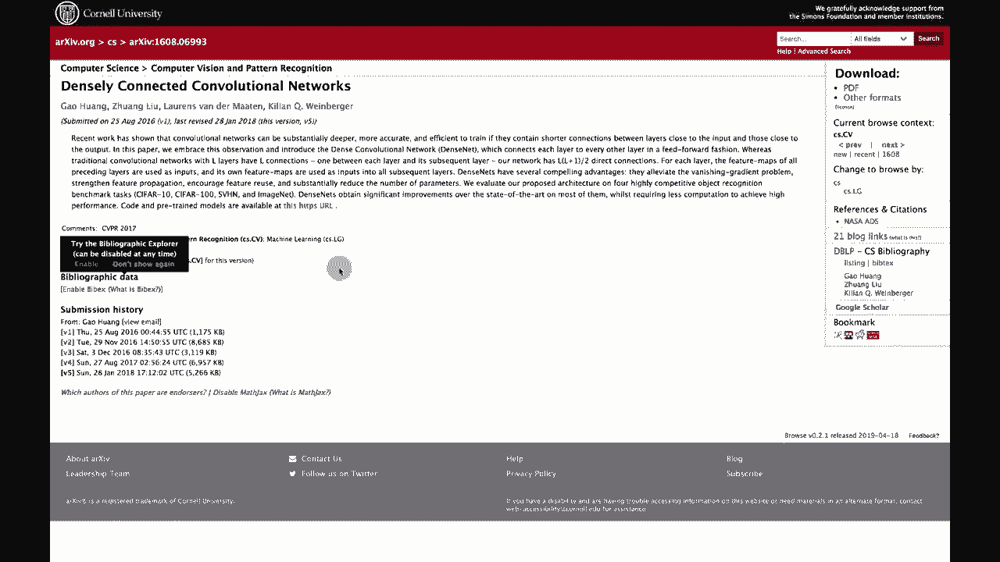

# 【双语字幕+资料下载】T81-558 ｜ 深度神经网络应用-全案例实操系列(2021最新·完整版) - P48：L9.2- 流行的Keras预训练神经网络 - ShowMeAI - BV15f4y1w7b8

嗨，我是杰夫·赫顿。欢迎来到华盛顿大学的深度神经网络应用课程。迁移学习很棒。你可以将现有学习融入到你的神经网络中。但我们从哪里获得这些神经网络？在这个视频中，我们将探讨如何找到它们。😊

这些类型的神经网络以及一些流行的网络。如果你想看到更多类似于人工智能主题的视频，请点击订阅按钮和铃铛，订阅我的YouTube频道，这样你就能收到每个新视频的通知。谢谢！Keras内置了许多可以从提供者转移的模型。

因此，了解如何利用这些资源很重要。我们会讨论它们。现在，你也可以在Keras之外找到一些模型。就像我们对Yolo所做的那样。Yolo本质上是迁移学习。我们几乎转移了整个Yolo和StyleGAN，但这为我们提供了可以实际使用的预先存在的模型，你可以根据需要自定义并进一步微调训练。

我们还将查看这两个网站。它们非常重要，这里有很多好的信息。TensorFlow模型库和带代码的论文。这两个网站有大量能够进行迁移学习的资源。😊！

你可能想在自己的项目中使用的神经网络。如果你查看模型库，可以通过星星看到一些最受欢迎的模型。你也可以订阅以获取新的模型。这里有视频，不仅仅是计算机视觉，TensorFlow显然现在非常受欢迎。

这里有很多G和其他你会看到的东西。对于这个课程，我会给你提供链接，指向我们正在转移的实际神经网络，通常我们使用的是已经内置于Kis中的模型，但如果你想在未来寻找自己的项目，这绝对是一个非常有价值的网站，而带代码的论文也很棒。

这里是那些发布了代码的论文，或者有时没有热情的论文，作者会迅速为论文编写代码并在这里发布。所以这是另一个很好的地方，可以找到你可能希望在自己的项目中转移的神经网络。

我在这里列出了所有内置于Keras中的内容，你实际上可以加载的完整列表在Keras文档中可以找到。这些是MobileNet将使用的一些，其他的一些也非常有用。MobileNet很好，因为它设计用于在移动设备上运行，因此它所需的计算能力与其他一些相比并不高。很多这些我在这里给你提供了链接，你可以点击这里的主要链接，查看实际论文。通常你需要阅读实际论文中的信息，以了解每个网络的实际用途，并获取一些额外的信息。Keras文档给出的仅是使用它所需的基本信息，但我在这里给你提供了Keras提供的链接，以获取使用这些信息的指导。现在，安装Keras时并不会下载所有这些权重。

显然，我们的汽车会是一个非常大的下载，因此当你第一次运行这些时，你会看到汽车在后台进行下载，以便从原始研究者那里提取权重。这些开发这些技术的研究者很有趣，他们并不一定具备某些公司的强大计算能力。我看到几个行业使用Yo的例子，他们尝试微调Yolo权重，以识别多个对象。我们在之前的模块中见过Yolo，但他们往往只是直接使用Yo，因为改进它是困难的，因为它做得非常好。DenseNet等很多都是尝试提供比以往更深的预训练网络。ResNet有几个不同版本，它可以提供一些非常先进的特征识别，MobileNet也很有用。

V2，那是我最喜欢的两个。你会看到我在课堂上使用这些。这让你能够使用一个为移动设备和物联网进行了广泛训练的神经网络。稍后在课程中，我们会谈到如何实际进行物联网的部署。因此，进行神经网络计算，无论是在边缘还是在云端。

这些对那会很有用。我们将在本课程的最后谈论这个。你可以在描述中看到Cf 10以及所有这些训练过的各种图像数据集。再说一次，更多的ResNets，VGG也是一个非常受欢迎的选择。我没有过多使用它，我在日常工作中并不经常做计算机视觉。

但这些都是计算机视觉的很好的起点。感谢观看本视频。在下一个视频中，我们将利用其中一些优秀的内容。😊。

开放的神经网络是为我们开发的。我们将从计算机视觉开始。这个内容经常更新，所以请订阅频道，以便及时了解本课程和其他人工智能相关主题。
