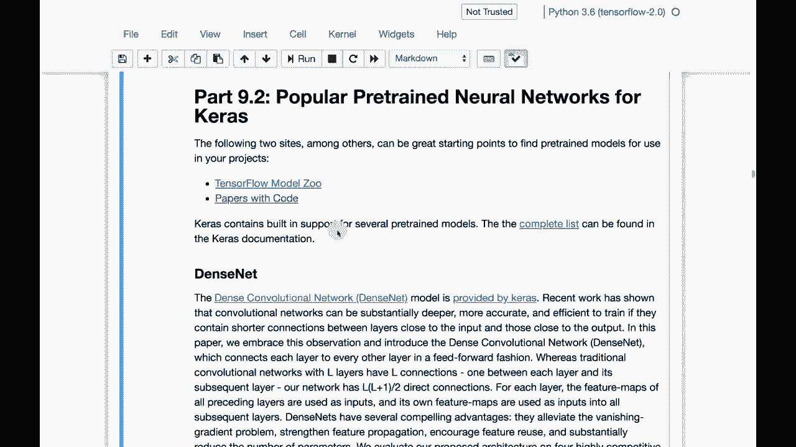

# 【双语字幕+资料下载】T81-558 ｜ 深度神经网络应用-全案例实操系列(2021最新·完整版) - P48：L9.2- 流行的Keras预训练神经网络 - ShowMeAI - BV15f4y1w7b8

Hi， this is Jeff Hton。 Welcome to applications of deep neural networks with Washington University。

 Transfer learning is great。 You can take existing learning and put it into your neural network。

 But where do we get these neural networks from In this video。

 we're going to look at how you can find。😊。

These types of neural networks and some of the popular ones。

 And if you'd like to see other videos like this on topics such as artificial intelligence。

 please subscribe to my YouTube channel by clicking the subscribe button and the bell that will notify you of every video that comes out。

 Thank you。 Kiras comes with a number of models already built in that can be transferred in from their provider。

 So it's important to know how to make use of those。 We'll talk about them。 Now。

 you can also find some models outside of Kiras。 Like we did this with Yolo。

 Yolo is essentially transfer learning。 We transferred in literally the entire of Yolo and also stylegan。

 but this gave us preexisting models to actually work with you could have custom and fine tune trained them further for sure。

 We are going to also look at these two websites。 They're very important。

 There's a lot of good information for you here。 Tensorflow models zoo and papers with code。

 These two sites have a tremendous number of transfer learning capable。😊。

Neural networks that you might want to use for your own projects。 If you look at model zoo。

 you can see by the stars， some of the ones that are the most popular。

 can also subscribe and get new ones。 There's video。

 there's not just computer vision Yo with Tensorflow obviously is very popular right now。

 Lots of Gs and other things that you will see here。 We will for the class。

 I'll give you links to the actual neural networks that we're transferring in and typically we're using ones that are already built into Kis。

 but if you want to look for projects of your own in the future。

 This is definitely a very valuable site to look at papers with code is also great。

 This is where papers that were released with code or sometimes papers without enthusiast will write the code for the paper and publish it here very quickly So this this is another great place to look at to find neural networks that you may wish to transfer in for your own projects。

 I give you a listing here of all of the。That are built into Kias that you can actually load in The complete list is here if you go into the Kiras documentation these are the ones mobileNe will be using some of these others can be quite useful as well mobilenet is good because it's designed to run a mobile devices so the compute power that it needs is not great compared to some of these other ones a lot of these I I give you the links here you can click on the main link here and it will show you the actual paper typically that this is coming from usually you will have to read information from the actual paper to get an idea of what each of the networks is actually useful for and get some of the additional information the Kira's documentation gives you just the bare essentials to actually make use of it but I do give you a link here on the provided by Kiras to give you the information that Kiraas is given you to actually use this Now all of these weights are not downloaded when you install Kira。

Obviously our Cars would be a very big download so when you run some of these for the first time you'll see Cars in the background do a download so that it can pull down the weights from the original researcher it's very interesting these researchers who develop these who don't necessarily have the extensive compute power of some companies I've seen a couple of examples of Yo being used in industry where they tried to fine tune the Yolo weights where you can recognize multiple objects we saw the Yolo in a previous in a previous module but they often simply use Yo as it is because it's difficult to improve upon because it was done really well denseensenet a lot of these are attempts to give you pretrained networks that are deeper and deeper than ever before Resnets there's several versions of Resnet that are out there and Resnet can give you some very advanced feature recognition mobilenet and mobile。

V2 Those are two of my favorites。 You'll see that I use these in the class。

 This lets you use a neural network that was trained extensively for mobile and internet of things。

 later in the class。 we talk about how to actually do an IoT sort of deploy。

 So do neural network computation。 both at the edge and in the cloud。

 And these become useful for that。 We'll talk about that at the very。

 very end of this of this course。 And you can see in the descriptions Cf 10 and all the various image data sets that these were trained on。

 Again， more of the resnets Vg G is a very popular one as well。

 I have not worked with it a great deal。 I don't tend to do a lot of computer vision in in my day job。

 but these are all very good starting points for computer vision Thank you for watching this video。

 in the next video， we're going to make use of some of these great。😊。

Open neural networks that have been developed for us。 We're going to start with computer vision。

 This content changes often。 so subscribe to the channel to stay up to date on this course and other topics and artificial intelligence。

