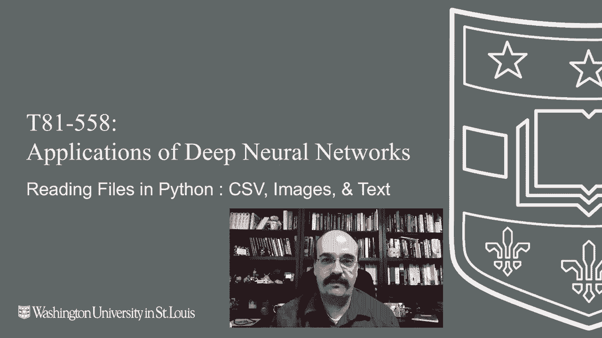
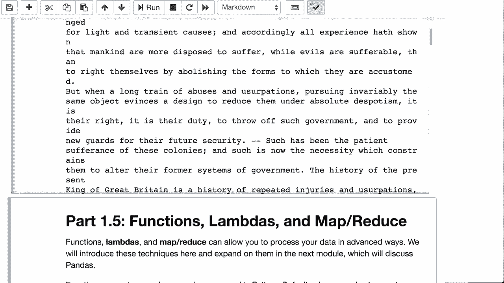

# 【双语字幕+资料下载】T81-558 ｜ 深度神经网络应用-全案例实操系列(2021最新·完整版) - P5：L1.4- 深度学习的 Python 文件处理 - ShowMeAI - BV15f4y1w7b8

Hi， this is Jeff Heaton， welcomel to applications of deep neural networks with Washington University In this video。

 we're going to look at how to handle files in Python。

 This gets us ready for doing much more complicated things with Ks and Tensorflow We'll see in particular how to deal with text files and image files because these are the primary types of files that we'll be dealing with in this course For the latest on my AI course and projects click subscribe in the bell next to it to be notified of every new video let's have a look at Python file handling In this course on neural networks we're going to deal with essentially three types of files we're going to deal with CSV files image files and text files CSv files usually of the CSv extension you can think of those as looking like Microsoft Excel files In fact on most computers you double click a CSV file in Excel will pop open。

Image files will deal mostly with P&G or JPEG， there's also GF files and others。

Images are one of the things that neural networks do particularly well so we'll see a lot of different images in this in this class and then text files have the TXT extension。

 Those are usually just raw text， and that has to do often with natural language processing other types of files that we'll see briefly in this class are JSON and H5。

These files will come from three primary locations， your hard drive。

 Now this is important if you're using Windows， you'll see paths like this。 if you're using a Mac。

 you'll see files like this。Most of you I assume will be using Google Coabab。

 so watch through the tutorial on how to read those from Google Collab。

 you'll basically have a path just like this like this that'll be close to Macintosh。

CSV files can be read with pandas。 We'll deal with pandas a lot in the next class。

 Now another thing to note here that is the way that I'm doing this。

I am giving you web addresses for most of the CSv files that will load this is on data。

heatinresearch。com。 that's my own URL。Which is unique to this class。

And I have all the data files there， this way if you're running in Google Coab or Mac or Windows or whatever。

It will work just fine。The above command loads Fisher's I data set straight from the internet。Okay。

 it's loaded， you can display the first five records of that。

And this is a very classic dataset set if you haven't seen it before。

 it is basically four measurements from flowers and it defines the species here。

 there's actually three different species at the very beginning since the file is sorted。

 you're only seeing the first iris which is sattosa This is a classic classification data where you try to use these values to classify what type of iris flower it is reading an image requires the PIL library but it works similar to reading CSV files。

 you're basically going to do this and。Run it， and it will load this image from。From this URL。

And this is one of the buildings from Washington University。Doesn't actually look like that anymore。

 thanks to all the construction， but。Or at least the grass in front of it。

But this is this is a way that you load a JPEG Now when we do some of these exercises。

 we're going to have lots and lots and lots of images。You may literally harvest the images this way。

 but you'll want to put them on a folder on your Google Drive。

 And I show you how to do that in the introduction to Google Collabab video。

 So make sure you watch that if you're using。If you're using Google Coabab and believe me。

 for some of the image processing that we'll do in this class。

 you'll want Google CoAab because it has a GPU。You can also read or stream large CSV files。

What's good about streaming them is you don't actually load the whole CSV file into memory at once if you're just reading a CSV file and calculating statistics on each row。

 you really don't need to load the whole thing into memory。

 you can simply read each row and process it。So here。I am taking the I data set。

I am opening it up for streaming， that means the whole thing is not loaded into memory at once。

 and I'm going to sum each of those four values that we saw in there。

I create a array of four zeros and lumpumpy。And I keep count of how many rows I've read。

And then I run this。And you'll see this is this is essentially the average of each of those four values。

 I am going to loop over the line， so each each line I basically have to I convert that line into we'll see more of this when we when we deal with nuumpy。

 but this is how you create a lumpumpy array。I'm taking locations zero to four only I don't want the species。

 the species is the fifth。And I convert them into floating point。

Because they're integers and because they could potentially come in as integers or strings or other values。

 I want them as floating points if the line is the right length。I skip any empty lines。

 I believe there's an empty line at the end。I sum it up。 This is a vector summation。

 so this is basically taking everything that's in that line too。 so the array。Of those four values。

 And I'm adding it to that other array that I have。 and I keep the count incremented。

 So that's a vector addition that's adding four numbers。 just like this is a vector division。

 this returns a vector or an array back， but it divides each element by count vector mathematics is very useful in this this course because we're often dealing with vectors。

 which are a low dimension form of a tensor。 So we we deal anytime that we can perform math across an entire tensor at once。

It's a great optimization。Reading a text file。This is the United States Declaration of Independence。

 this is just a text file that I was able to find that had a URL and it was a pure text file。

You can run it and it basically prints out the raw text of the Declaration of Independence of the United States of America Thank you for watching this video this concludes file handling and Python in the next video we're going to look functions Ladas and mapR content changes often so subscribe to the to stay up to date on this and other topics in artificial intelligence。

