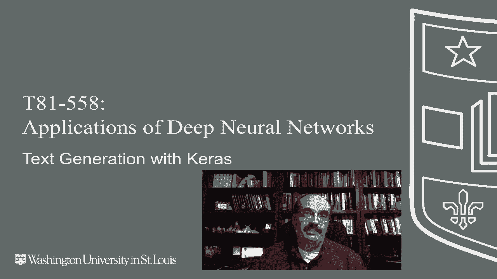
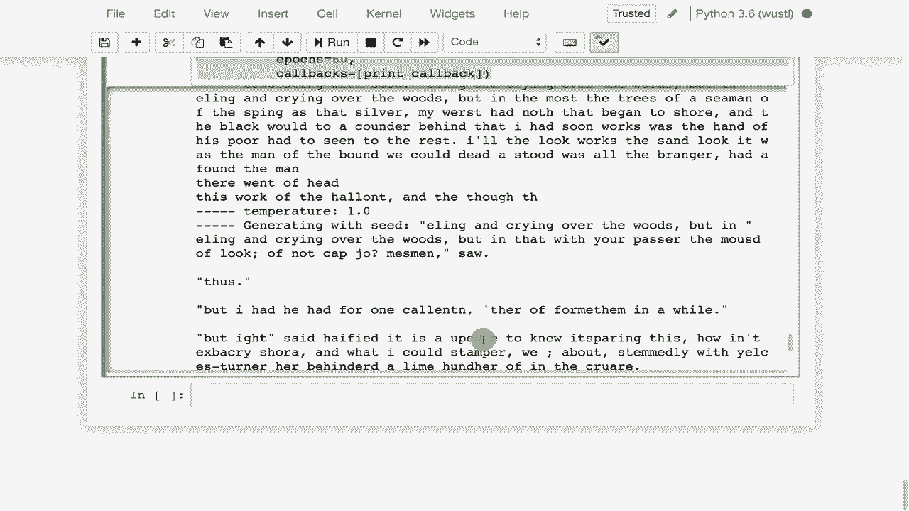

# 【双语字幕+资料下载】T81-558 ｜ 深度神经网络应用-全案例实操系列(2021最新·完整版) - P54：L10.3- 使用Keras和TensorFlow生成文本 - ShowMeAI - BV15f4y1w7b8

Hi， this is Jeff Heaton。 Welcome to applications at Deep neural Networks with Washington University In this module。 we're going to take a look at text generation using LSTMs。 We're going to see how we can create whimsical。😊，Randomized generations created from text documents。 so you could give it， for example， William Shakespeare's works。

 and it would generate Shakespeare Ask text for you。More interestingly， too。 you could give it source code and it would generate。Reasonably valid， though not compilable。 C source code based on the C code that it was trained on。Now。 this somewhat whimsical use for LSTM has gotten definitely some publicity in the last couple of years。

 it does lead into the next part where we get into using the same sort of technology to generate captions for pictures for the latest on my AI course and projects click subscribe and the bell next to it to be notified of every new video。 we're going to make use of this technology both in this part and also in the next one where we do captioning where're basically a neural network or actually several neural networks can look at an image and give you a caption for it like you might see a dog running across the grass in the picture in the neural network we'll literally write a dog running across the grass So in this part what we're going to do we're going take a baby steps so to speak and we're going to look at how a LSTM can be trained on any sort of text and it will output random nonsensical text。

Very much in that format。 Now this uses all the same technology and builds us up to doing something more useful where we're going to actually generate the captions。 but this is sort of the first step for it。 This was really popular a couple of years back。

 there is a classic sort of blog post I guess you would call it called the unreasonable effectiveness of recurrent neural networks I am going to show you this one really quickly because some of the examples here。 just the different types of text that can be generated。

 This is Andre Carpathy's blog when he was a student at Stanford University working on his PhD incidentcidentally the captioning technology that we'll be looking at in the next part was also very much pioneered by him So one of the first things that he tried to generate was there's essays by Paul Graham you can read right here basically he created the LSTM and it was able to just randomly generate this sort。

Of text。 now it's nonsensical。 this the surprised in investors weren't going to raise money。 I'm not the company with the time they're all。If you're not paying attention。 it looks like legitimate text and it even puts in captions。 and if you think about what's really going on here。

 what's really fascinating is this neural network had to learn this from scratch。 it doesn't know English。 it learned where to put apostropphes， it learned how to use commas。 it learned how to use periods at the end of sentences。 It learned how to put capital letters at the beginnings of sentences。

 So it picked up a lot of grammar on its own。 and it learns this grammar by reading text。 not by having grammatical rules， hardcoded into the program。 hardcoding of grammatical rules and parse trees were very common in natural language processing probably a decade ago。 but with the advent of neural networks and deep neural networks in recurrent neural networks like we're dealing with here。

 there's much better ways to do this。 We'll also see you also had the neural networks generate Shakespeare。 Now what's very interesting。This is if you've read Shakespeare before， it's it's plays， it's drama。 So it's actors speaking different parts。 So this is very much what Shakespeare would look like。 You have a name。 you have what that person is going to say the next name。

 what they're going to say and so on。 And the recurrent neural network was able to figure out the general format of a Shakespearean play and wrote this out。 This is not real Shakespeare， but it's meant to look kind of like Shakespeare。 aas。 I think I shall be become now there it didn't figure out something on English that would be all one word become approached in the day when little。 I mean， it's it's nonsense， but it's string together these words correctly。

 It's putting it's using the articles correctly。 It often figures out verb agreement and other aspects of this。 It usually punctuates the sentences correctly。 So this was generating Shakespeare。 The Wikipedia generation was。imIf you've ever looked at view source on a Wikipedia page。 it shows you the media Wiki markup。 So if you ever wanted to write a page on Wikipedia。

 you'd write in this form。 you put the double bracket that just means linked so this is linked to the John Claire article off in Wikipedia somewhere else。 So it's emulating the Wikipedia form， which is which is very cool and it also starts to figure out what URLs look like it has no idea what a URL was before reading this and this is not even a real page on Yahoo if you tried to go to it even back when this was generated。

 it would give you an error。 it's essentially a hallucinization of of the Record neural network。 I believe is what Andre called it in here。 It figures out other interesting parts of Wikipedia notation I found this one very interesting。 If youve worked with academic papers， particularly for publication and academic journal。And conferences， I'm sure you've dealt with latex latex is very good for mathematically rich text。

 And here the recurrent neural network was trained on a bunch of latex and was then asked to generate its own latex。 And as if you read the blog post for more detail on it。 it was mostly compileilable。 There were some errors that the authors had to fix。 but it was able to generate very mathematically looking latex， even diagrams。

 So this is all just hallucinating from the text that it's read。 So it's almost like a child stringing together words and starting to figure out English。 This is this is essentially what's what's going on。 And the next part。 we'll see how we use the same technology to really conjure up actual real English。

 And this is what late source code looks like if you've never seen it before。 This essentially generates much of this up here。 This is probably a shortened form of it。 I found this one absolutely fascinating。 They took。Source code written in C and trained the recurrent neural network on lots and lots and lots of C source code。

 And then they told it to just dream up C source code of its own。 This looks if you've not worked with C before， I mean it's very similar Java ja in its overall syntax and it's amazing how much the recurrent neural network picked up on look it's all properly tabbed。

 I mean that is that is pretty cool it's declaring variables it's doing checks now it does tend to use local variables that it's never defined So that is an issue there but it's learning how to do the pointer syntax correctly。 it's putting semicolons in all the right places it's using brackets when it needs so that's multiple lines that needs a bracket that's a single line it does not。

 So it's almost spooky how much it's really figuring out about source code it puts in comments that have random text in it it's sort of doing what what the predecessor won just higher up on the screen that was generating Shakespeare It's learning to generate random。

English text for comments。 So now let's see how we can generate text just like this。 These are just my imports。 I'm gonna go ahead and run that。 Nothing too unusual going on there。 I am going to read in a text document。 So an entire book。 We're gonna use just one book to train it on。 So it won't be perfect that it'll come up with some interesting stuff。

 We're going to use the book Treasure Island。 So Treasure Island was written some time ago。 and what's neat about this book。 It's a children's book。 but it pretty much set the stage from pirate stories thereafter。 I mean。 one leggged pirates Pirates with parrots on their shoulders。 Xmarks the spot。

 All this came from Treasure Island。 I read it as a child。 It is a very interesting book。 and I was not a big fiction reader， highly recommend if you're interested in pirate。 but let's see if we can generate Pirate stories using neural networks。 I'm going to read in the text of it。 and you can see it's coming here。 It's from Project Gutenberg。

 which is a lot of English。 maybe other languages I haven't kept up with Gutenberg。 They have the book。Text online。 So it's it's great for natural language processing projects。 I'm going to take this raw text that you saw loaded in up here and do some conversions on it。 I'm going to remove anything that is not ASciI。 So0 to 127。 By the way。

 everything I'm doing on this is very much English based。 but I have seen LSTms applied to other languages such as Chinese and Japanese and Asian languages as well。 So if you're interested in doing this sort of text generation。 you can generate this on really nearly anything。 You saw in a previous part。

 I showed just an example， not the actual code， but link to somebody's example that was generating Chinese fonts using Gs。 So I'm going to pull that in， get the process text， run this part， it tells me the corpus length。 So this is the length of that document of Tresure Island。 There's a total of 60 different characters， especially since I stripped a lot of the non ASi ones。

 and by the way， this is all very much。😊，ode here is based on one of the Kira's examples。 made a few changes to it， but this is I have the link to the to the original example up higher if you want。 you can basically run this code on just about any text I ran it on Treasure Island。 The original code was actually looking at Nietzsches a philosopher and generate additional text。

 it looks like it's fromnietzsche。 So when you run this part here。 it is using the max length of 40 that is your sequence size。 We're going to grab 40 character blocks of this text as we go through and we are going to then give it the next character。 So the 40 first character after that and it is going to use that to essentially train it。

 So given these 40 characters try to generate the next character and that's how we're going to actually generate it then we're going to pick 40 characters of real text as the seed to start。Then it'll generate the 41st character then we give it 39 characters of the seed and the 41st。

 the 41st that it had generated， then it generates to the next one so it keeps generating more and more and eventually we're out of the seed and it's all generated text because it generated the first character then second。 third fourth and so on we'll see the actual code to do the but this is basically going through the entire file breaking it into 40 character chunks with the 41st as the y step size that just means move forward three characters for each of those 40 character chunks that that you grab if you put a one in here。

 it would grab as many sequences it could because it would keep shifting it by just one character and you would get even more redundant sequences because youd get those same when I mean if you were scooting over by one you would get 39 of the same characters when you shifted。

Fward by one。 So we'll run this and that reduces Treasure Island into 132000 of these these sequences。 And if you print out one of these see that's showing you real good example of it the project Gutenberg of ebook treasure and then see a shifts over three。

 So these are all of the inputs and then it's going to be trained to predict what that next character would be。 Now we're going to vectorize it。 this changes it into the actual x and y that is going to go into there that takes a moment to run。 it's not too bad。 we're using essentially indices。 So if we did if we look at the shapes of these Those are all those sequences that you had40 is the input vector and 60 or the dummy variables for the output。

 So the output of this is basically going to be a dummy variable of those 60 characters。 remember I said there were 60 different possible characters that could pop up in treasuresure Island。 this is basically coming up with those。Then the Y shape that's very simple。 that's 132000。 but it's the same dummy variables。 So those are the expected characters So all those 60 characters that come throughout the training data as well as the output the characters are all represented as dummy variables So this is where these get a little bit wasteful I mean imagine if I had the full 255 ASI set it would be 255 dummy variables this would be insane with Uniicode and just to see the dummy variables。

 these are basically the output So one is true the rest of false that is saying thats this particular character is the next one that is expected the LSTM model itself is relatively simple。 I grab the hyperpara right from the example in Car we have one LSTM layer that has 128 I'm really not even using dropout or anything like that I've seen some examples that do make use of that and the example trained this with RMS you could probably。

This with Adam just as well。 I'm going go ahead run this so that it starts training the neural network while I'm explaining some of it because it does take it a little while to run。 you'd probably want to run this on your on a GPU on Google coab or something like that。

 Okay so here's the summary of it that largely echoes just what we just what we had there。 despite those stars it has actually already made it through these This is the sample function。 This is what actually generates the text。 So you pass it pres Pres are the output neurons。 So those are going to be the 60 values in the case of Treasure Island。

 this is going to be 60 probabilities。 So whichever of those 60 output neurons has the highest value。 that is the character that has the highest likelihood。 However。 we don't just do it thats simply we do normalize those output neurons into a softm so that their probability so they sum to 10 and then we。Have something else called temperature Now temperature is what Andrea called it in his blog post that I was showing you earlier essentially 1。

0 is going to be the most conservative。 it'll pretty much take the character with the highest probability zero will be somewhat more random we'll see the examples of whats what that's producing the zero will have more grammatical errors but we'll produce more interesting text and we we'll go we'll look at some examples in between as well you can actually set that to even higher than than 1。

0 to make it even more conservative This is essentially a softm function it's essentially doing a summation and then and ensuring that all of those probabilities actually add up to 1。0 This is the text generator So we hook this up as a callback at the end of each epoch So this is kind of useful since this takes a while for this neural network to train I think we train it for six。

Upo we can see how well it is generating at the end。 So essentially what we are doing is we display it for these temperatures。 This is 0。2 pretty liberal up to 1。2 pretty conservative very conservative and we essentially generate the seed So the seed comes from that text that we processed treasure island that seed is going to be used to prime the pump so to speak those 40 characters are the first characters that will be used to generate the next character and then it keeps going from there。

 then we're going to generate it for the next 400 characters and we build that up as the input sequence to the neural network and we predict as we predict we add whatever we generate as we predict we add the next character onto what we generate it so we keep adding more and more characters onto it and eventually the seed rolls off the edge because the first character is removed because as soon as we add a generate a character onto the end。

We have to pop something off the beginning so that it stays in the 400 range and then we print out the text as as we did。 So this will literally output the text as it is training the neural network we make that function we just looked at as a lambmbda callback so that we it can be called by Kiras as it's running and then we essentially fit it kind of like we've seen before because we have that callback。

 this is what the output's going to look like This is the very first epoch you can see it was it was training here and here is the generated text this probably got a hold of some of the media wiki but information can be found at found captain of the sound Now remember the neural network is on its first epoch it has not trained very well but look it's already figured out and the the goes before nouns usually that sort of thing This was with a very low temperature so this will be the lower quality or most least conservative if we go to the most conservative the 1。

2。Information can be found at the following still not very good because it's really just just starting。 We've done a second epoch third epoch it continues to train and it keeps showing you as it goes。ll it'll end at 60 so five of 60 we're not going to let this thing run into its entirety but we can see it is generating its own pirate stories of you this here house that's probably how the pirates would talk actually that's not gramatic I don't believe that's grammatically of you and this house and what I say of you sounds like a pirate story I'm not really good at speaking in a pirate accent IM and here you can see it's literally outputting it as it as it queries the neural network So this is text generation this is a good example of it This is not particularly useful other than showing that it can really pick up English and things in it in the next part we'll see how we can generate next part we' see how we can generate captions from images Thank you for watching this video and the next video。

We're going to look at how we can use the same technology to label pictures and to generate captions to describe what is going on in that picture。