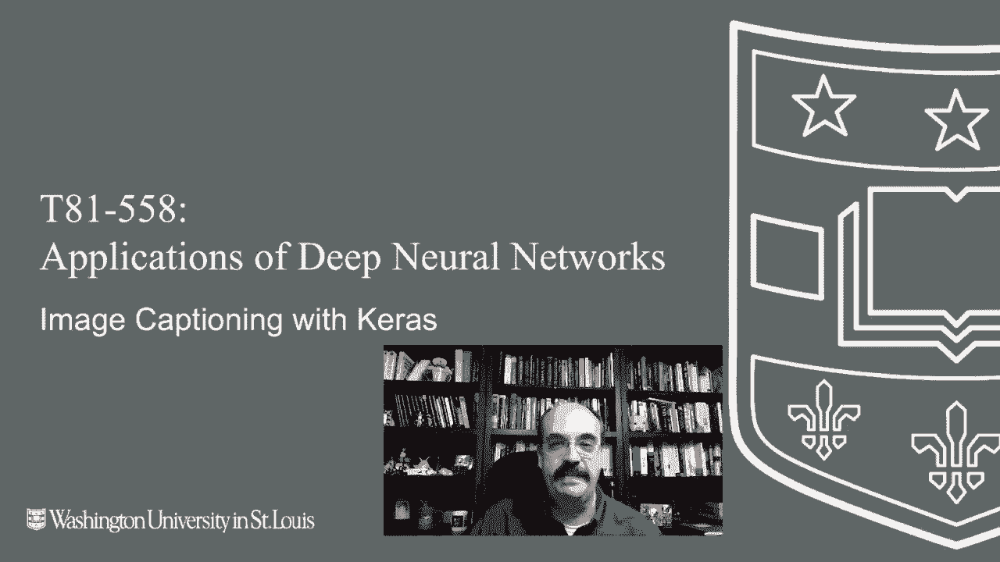

# 【双语字幕+资料下载】T81-558 ｜ 深度神经网络应用-全案例实操系列(2021最新·完整版) - P55：L10.4- 使用Keras和TensorFlow进行图像描述生成 - ShowMeAI - BV15f4y1w7b8

Hi， this is Jeff Heaton。 Welcome to applications of Deep neural networks with Washington University。

 In this video， we're going to look at an interesting combination of convolution neural networks in LSTM that allows us to caption images。

 to see several things going on in the image and describe it in a sentence for the latest on my AI course and projects。

 Click subscribe in the bell next to it to be notified of every new video。 imageage captioning。

 at least where I first saw it was with Andre Carpathy's dissertation。 Now。

 we talked about this guy before in the last section， some of the LSTM text generation came from him。

 and he did some very， very interesting work with that as well。

 So a very interesting guy researcher now works for Tesla。

 who created a lot of the code for some of this computer vision software that we're dealing with right now。

 This is an image actually from his dissertation， or at least from his website showing what the captioning does。

😊。

Typically before captioning， we would try to just classify something as say a cat。 Well。

 there's also a skateboard in here。 and there's a few other things as well door and they're just partial pieces。

 later then we got into multi-imaging classification So we'd say cat skateboard kind of like yellow Now we're wanting to actually combine that text generation that we have with the image classification。

 be able to actually write a caption for these。 Now we're going to use heavy transfer learning because this would take forever to train this thing from the ground up even with the transfer learning。

 we're going to use a relatively small image set and it's not going to be perfect。

 but it will generate captions that have some that have pretty good meaning for what they're looking at they won't be perfect。

 We'll see that when we use images like I have a set of images。

 the photos directory that's in the Github。Repository for this course that are just personal family photos that I use in machine learning。

 you've seen a number of them in this class， some of them are by dog Hickory and these are good tests for that because they're completely outside of imagenet and they're just things that I have that are pictures that I chose because I thought they are interesting from a machine learning aspect that some of them might not be as easy for these neural networks to classify Now the two things that we're going to transfer from are inception V3 and glove Inception v3 that's another one of the many imagenet trained neural networks mobilenet we've used a couple of times in this class up till now I do have it set so that you can use mobilenet instead of inception but for this one inception works better I'll get into what the actual differences when we get down to that part and then glove that is a natural language processing embedding。

We'll be learning more about those in the next module when we get into natural language processing。

 This is essentially how this is going to work。 It's actually pretty similar to the text generation that we did in the previous chapter。

 But instead of just generating random sort of nonsense sentences。

 now we're going to actually generate us sentences。

 you can see why we started with the previous part and learned how to just teach the neural networks。

 The basics of grammar and how to string things together。 And really。

 we're just guiding them to the knowledge of grammar。 We're not actually teaching them grammar。

 believe me， the early days of natural language process was obsessed with teaching the neural networks all about or preprocessing based on grammar rules and codifying the grammar rules。

 and believe me， thats that's very difficult。 Now， the idea is to use big data。

 large corpes of text and to be able to let the neural network。Learn the language for themselves。

 This is how it works。 Now， previously， what we would do when we were generating the nonsense sentences is we would put in maybe 20 characters。

 Well now we're not doing this character based。 We're doing it word based。

 We could do captions character based。 it would require potentially more training。

 and this is just simply the technique I am using at this point。

 if you'd like to try it in character based， Id definitely encourage you。

 and I'd be curious to see what results you got。 you could definitely use this code as a starting point for this。

 but since it is now word based， we are going to present a vector。

 So this this is going into the neural network。 and the individual elements are not characters。

 they're words and we have a special token word called start， this is what kicks the whole thing off。

 So instead of giving it a seed like we did before。 since we needed to generate the entire caption。

 we really can't seed it because we don't we don't know how the captions。

start so all captions start with the word start， which is and not even the real word start。

 This is just token that we're using。 And then we initially send it just start but here's the trick。

 neural networks can accept many different inputs and multiple things。

 So we're input to this is really very similar to the previous part。

 but we're putting an entire image into it too So there's two inputs that are coming in and we'll see that the Kira's functional API as opposed to sequence is absolutely necessary for this。

 So we use the model and Kira's functional API for Resnet and for a couple of other things so far in this course。

 but we will definitely be using model and functional API for this because this is a fairly complicated neural network are giving it a picture and then we gradually build this up just like we did in the previous part。

 So we pass its start。A picture of a dog running in the grass。 that's actually my dog。

 And then the neural network takes both of those。 and it returns probabilities。 And it'll say， okay。

 I think maybe the next， the next one is runs。 Now this is if we had put in a and dog here。

 So start a dog runs would be the highest probability。 Now。

 this is really long because this list of dummy variables is every single word that is in this thing vocabulary。

 we'll see the size of the vocabulary in a moment。 but a lot of dummy variables。

 So this is the overall structure of what we're going to build。

 and we're going to train this neural network。 obviously using the transferred learning so that we don't have to train this literally from scratch。

 that would be that would be Hughes always use transferred learning if you can。

 I am not going to actually run this code。 It takes this probably I would seem to remember about two hours。

3 hours。 maybe for to actually train this neural network。 So I've got it all。

Ran and the version that is up on Github should be pre-ran with this。

 Now you might see some different captions。 if you compare what you're seeing in this video to the actual website。

 because if I rerun this， this is all stochastic。 So you can get you can definitely get different results。

 And I tend to rerun these as the semester progresses as different versions of Tensorflow come out So you'll see different results。

 these are all the imports that you need。 the only thing that's somewhat interesting here is these are the start in in tokens。

 So we start it up here with the start token and it keeps adding additional words。

 So we put in just start， it would hopefully give us a then we would give a start and a it would hopefully give us dog then we give a start a and dog and it would hopefully give us runs and it continues。

 eventually it'll give us an in token。 So either we hit the wall here and run out of space。

 that'll stop us or we get a in token。 So this is how the output of the neural network can be very not fixed length。

If you need a neural network to give you a to generate a sentence or to give you something that's not fixed length。

 This is what you're typically needing to do。 You build it piece by piece by piece and let the neural network keep adding another element on it for you Epochs that's simply how many epos we're going train it for we're not using early stopping or anything like that use inception is true if you want to try mobilenet just put false in there doesn't work as well。

 I have my hours minutes string because we we time how long these things take definitely use coab for this。

 the GPU is your friend or if you have your own faster GPU definitely use that。

 You're going to need to download some data sets for this So here I have the path content my drive Now you might need to change this if you're putting your stuff in different locations。

 but you'll need to create the directories for for each of those in that folder。

 you can see from the source code they're all just named this and then you need to create a data directory that's where it's going to create the。

Output files those should all be directly off of captions。

 So unzip these these two and put them there。 By the way。

 getting a hold of the flicker8k data set for this can be a little tricky。 read the article here。

 there's some copyright questions around that one。 So its it's difficult。

 It's not difficult to get a hold of。 I can't put it into my Github repository because it it's not mine。

 So if you click that link， you can find out exactly how to get a hold of it。

 So we're going to clean this data set and begin to process it the data set by the way。

 what this data is， is it's from Flickr。 it has 8000 images and captions for them。

 So it's exactly what we need and we need to basically break this up and what we're doing here is we're cleaning up the descriptions。

 We're essentially converting them to lower。re for this null punctuation。

 These are punctuations we're removing certain punctuation。 We are essentially removing。

Very short words here。 We're removing words that do not have alpha alphabetic components to them。

 and we're gradually figuring out the length。 So we need to know what that maximum caption size is because that's going to be our sequence length。

 and we gradually build up our dictionary of these。 Then we can print out what we collect。

 So look up is essentially the number of unique words and then the number of words in our dictionary and the max length。

 the max caption length。 Then we load the glove embeddings。

 Now what the glove embeddings are is essentially vectors for each of the words in the vocabulary。

And each of those vocabulary words is going to have a corresponding vector。

 and those are the features that well put into the neural network to actually do the predictions rather than doing。

 say the index numbers or dummies。 This is much better than using a dummy variable for each vocabulary word because there's a lot of vocabulary words and that would be a lot of additional data there。

 We do use dummies for the vocabulary words on the output from the neural network。

 but we do not on the input。 The other advantage is those vectors of the words， similar words。

 the vectors will be closer to each other in Euclidean space。

 So using linear algebra where you're basically calculating distances between two vectors。

 two similar words will be fairly close in space。 we read in all of the image names。

 We're basically getting ready to load everything。 We have 6000 images in the training set 1000 in the test。

 and then we build up all of these descriptions So there。Are going to start with the start token。

 Then they're going to have the actual words of the caption and they're going to end with stop。

 So this is how we basically start and stop the captioning process as we build the sequence like we saw up in the diagram earlier。

 Now， I have the code here to use inception or to use mobilenet。

 this number in the output dimensions， that is really the reason why。

 So this turns each of the images。 So using inception， if you use inception just straight up。

 it would return 1000 probabilities because there's 1000 images in imagenet and each of those images。

 it would give you the probability that the image is one of those。

 We strip that layer off and below that is a 2048 densely connected layer。

 And we use basically those outputs like we saw earlier in feature engineering from transfer。

Learning we use that as feature engineering。 so this 2048 vector that comes out out of inception with the top top layers sheared off。

 And that's what we're doing here。 we're removing two layers。

 Those become essentially engineered features for those images。 And again。

 it it's like with glove that 2048 vector similar images should be closer together in vector space。

 notice how many of the output dimension is here。 There's not densely connected layers there because the mobile net is trying to be very compatible with mobile devices and power consumption。

 So your number of dimensions when you shear off those top layers explodes and you've got 50 That's not ideal for feature engineering because that's going to be a very sparse vector。

 at least when I've inspected on many of those will be0 and you won't get quite you just will not get as good a results as using the 2048。

 you're welcome to experiment with it though and the code should all work。

 These are the key constant。That you need to change the height and the width because different transferred neural networks are trained for different image sizes and it prints out a summary。

 This is quite long。 It's a long neural network that we transfer in。

 We're going to create the training sets。 So for each image， we need to encode it。

 and we're basically encoding the image to whatever that output dimension size is。

 Now this is what it is。 you can't change that constant and change the output size。

 So we're essentially taking the image。 we're resizing it to a standard size。

 We're not worried about keeping the aspect ratio。 The transferred neural network tends to figure that out。

 We do any preprocessing that the transferred neural network needs。 We expand the dimensions here。

 We're essentially taking the long string that these images are loaded in。

 and putting it back into the grid that a image really should be。

 Here is where we perform any preprocessing actually not up here。 that's essentially converting。

To an array and then we call the either mobilenet inception to predict。

 that's where it turns into that 2048 vector。 and then we reshape it so it's in the right size。

 essentially for prediction or for input into the neural network This is where we generate the training set This is where we call this over and over this can take some time So we actually pickle the training set after we load so we're loading all those JpeEgs or PGs or whatever that image data is and turning them into the 2048 vectors that this thing crunches them down into。

 So this is a lot of image process doesn't take necessarily a tremendous amount of time but it can take a while this is where we process the captions and we get them into a similar structure Now we have 30000 captions because there's up to five different captions provided for each image that's just the way the data is So each image is actually multiple caption which which is kind of nice We're going to get rid of。

Wds that don't occur that often。 So our vocabulary drops down to just 1651。 That helps a lot。

 And we build up two indexes。 each of those 1651 words that we're dealing with。

 which we also add to the tokens。 We have one that takes an index number and gives you a word back and a similar one that takes a word and gives you an index back。

 So you've got a double directional sort of dictionary to look these words up in。

 We do add two to the max length that accounts for this start and end token。

 And then this is what it looks like really using the data generator。

 We're going to start would just start。 It should so we're calling that neural network multiple times。

 call it would just start it adds a So this is what the training set actually looks like。

 So just one picture。 and one caption。 The idea here is this training sets going to be gigantic。

 So for each image。 This is just one image。 This is hickory。 my dog running on the grass。

 He's not in the data set， but I'm using him as an example。 for this one。

 we would have five different captions of him。 We would have maybe like。Budog runs on the grass。

 dog running all these different variants of what the caption could be But for each of these。

 this is showing just one caption。 We need to generate all the phases of it。

 We need to generate with this image and just start return A with this image start an a return dog with this image。

 start a dog return runs。 there are a lot of data in this training set。

 So we're going to use something called a generator to make it not so insane in terms of the RA requirement。

 and then you'd get your second image because the data set has 5，6000 of these， So each one of those。

 youd be you'd have to literally duplicate the image in the training set five times for each of the five captions。

 and then each of the captions gets a number of additional entry。

 So you would need to duplicate that picture get again for each of these intermediate places。

 It's a lot of data。 So we use a data generator。 The data generator is what we're going to。

not generate this big matrix like we did before to pass in。

 And essentially what's going on here is it's looping through all of the keys。

 Those are essentially all of the images that we have。

 And then for each one we're looping through all the description。 So there's five of them。

 And then we generate。 So these are percent of the dimensions we need to generate one for each picture。

 one for each description。 And then one for each combination of those words in there so that we catch all the intermediate form。

 And we're also mindful of how many photos we want per batch that's a training hyperparameter。

 The way that this works is this is this big loop is not being ran just straight out and generate。

 it would just dump a ton of data if it did。 That's what the yield command in Python does。

 This is essentially a dynamic collection that you're building。 and every time you hit yield。

 It essentially keeps this loop sort of in freeze dry eye mode。 So it just freezes it。

 And lets the program go on with what it's doing。 And then the next time this gets。

CalledIt goes right back to here and restarts the loops exactly where they were and returns。

 returns it。 These are the glove embedding so that we have those available so that we can turn those words into the 200 per word。

 You have to set that constant。 You can't change that that is fixed by glove。

 And then we essentially just build the inputs for all of those caption words that we have and look them all up。

 And you can see then essentially the shape of this。 So we're using a embedding layer。

 We have 1652 words。 and each of those 1652 words has 200 elements。

 Those 200 elements are the vectors that glove turns each of the words into so that similar words will be closer in vector space。

 This is using something called akira's embedding layer。

 We will learn more about this in the next module when you get an NLP。 that these are great。

 This lets you do this whole lookup inside of ks and let ks do it internally。

 This is what the neural network looks like。😊，So input1 is going to be your image input2 is that gradually increasing caption that you're going to send in each time。

 This is where the embedding layer comes in。 It uses the vocabulary size and it uses this embedding matrix that we had created that essentially becomes the weights of that layer we'll see that we transfer this in in a moment When we create it here we don't transfer it in。

 it's initialized with random weights， but it's essentially a matrix of this size so that it can do those lookups for you。

 it'll look up each of those words and put in the correct 200 values。

 we've got some dropout layers going on and we've got a 256 LSTM really very similar to the type of LSTM layer that we used for O text generation in the previous part we set up we basically add these to the neural network we had a final dense 256 layer and then the final output layer is going to be the vocab size because you've got dummy variables coming out of。

Essentially， then we create a model so this is using the kas functional API so that we can have the inputs。

 we can have multiple inputs， inputs one and inputs multiple inputs here when I'm talking about it is like maybe three pictures coming in or one picture in a caption or three pictures in a caption who knows however you want to set it up。

 This is the summary of our network that I just described。 This is very important。

 This is where we're basically taking that embedding matrix from glove and putting that we are just putting that right into the weights of the neural network。

 So we're overr the weights of the neural network。 and it becomes a lookup for us。

 whenever it sees word 5。 for example， itll go to the column row。

 depending on on the orientation that matrix and place that into the feature vector。

 we can pile the entire neural network for categorical cross entropy because it is a classification neural network。

 We're now going to train it the batch size of three。Do I got this from some of the original papers。

 We're basically doing it。 So we have those 10 epochs。

 We are going to do 20 epochs at this learning rate and then a final epoch。

 we're sort of decreasing the learning rate。 we could also use a scheduler for this。

 but this is pretty pretty straightforward。 Now we do save the neural network。

 If we see it already exists， we just load it。 we don't rebuild it because this part's going to take a bit of time。

 Now， when we need to actually generate the caption， this is the function that's going to do it。

 This is actually somewhat similar to the function that we had in the previous part where we were just generate random text。

 it's going to go in a range up to the max length that is going to build a sequence essentially just with the just with the start tag starting。

 it is going to pad the sequence because it has to go to the to the end。 essentially with with zeros。

 We're going to request a prediction。 Our max gets us of those。Those predictions。

 which of them is has the highest probability， because that's the word that we're going to add。

 Then we add a space to it。 If we've gotten the stop token， then we stop and we continue。

 and then finally， we split this out and return a textual string that tells us essentially what the caption was。

 Now if we call this and evaluate it。 These are some actual results。

 So you see these two people riding on a bike together。

 It says man and white shirt is standing by a woman in a blue hat。 Okay close。

 it had a decent idea what's going on。 If we look at some more of these， another inside of here。

 There is a dog being barraged by tennis balls。 dog is chasing a ball。 Okay， yeah。

 he's kind of jumping at it。 I'll buy that。 There' is a dog on concrete or maybe snow。

 Two dogs are running through grass。 Okay， new is a dog。

 black and white dogs running through the snow。 This is the most spot on one that I've seen yet of the three。

 So that's very good。 Again， these are not perfect。

Would have to expend considerably more training and probably get a bigger data set to really get these a lot a lot better。

 Look like two guys walking with some strange graffiti on the ground。

 man in black coat is standing next to women in black jacket fairly close。

 It wasn't figuring out the genders。 but it got the gender right on one guy。

 two kids playing on a trampoline。 little boy in red shirt is jumping off of a swing。 I can get that。

 maybe he's maybe there's a swing back there。 but I did rerun this a few times and it was picking up on the trampoline。

 So that's kind of neat that it can see that sometimes two women in a bikini near a shoreline。

 So group of young people。 Okay I'll buy that are climbing up rock into the water。

 So you can see it's figuring out sees rocks it sees water。

 It's neat that it's getting the grammar right into the water。

 so I mean it's putting articles in front of things like it should。

 It's a dog dog is running through grass。 So okay on these pictures that it was。Now。

 it wasn't trained with these。 These are from the same set。 This is from the test set。

 If you evaluate them on some of my photos， which are here from from Github。

 it doesn't do quite as well。 Now， this is kind of mean。

 but this is what you do to test these things out and to show the limitations。

 I am standing next to this is at a university in Florida。

 this is actually the university that I graduated with my doctorate that。 And this that's a tardis。

 if you've ever watched Doctor。 Ho， that is that's a whole thing in Dr。 Ho， But it's a phone booth。

 probably didn't have any tardiss let maybe phone booths and it' training set。 So man in black shirt。

 it's actually a blue shirt， but I blame the camera for that。 and jeans， it's seen my jeans。

 So that's cool on the street。 Okay， it probably thought these things usually occur on a street。

 but it was actually inside of a building， but that's actually pretty good。

 This is me sitting there man in black shirt。Not even close。 and tie。

 I only wear a tie if I am forced to cast drink。 I am， I'm not drinking。 This is my mother's dog。

 Two dogs are fighting in the grass。 I don't know the dog maybe a split personality going on Now I noticed in the flickr data set。

 a lot of them had people doing actions。 There's no people in here。

 This is a bed and breakfast that my wife and I visited， and we just took a picture of it。

 So it's completely just a landscape shot。 There's no workers。 there are steps here。

 So maybe this is my wife， I and my dog man in a red shirt。

 So it's talking about my wife who is not a man。 She is a woman is sitting on a stool with his shoes。

 not even close。 This is me sitting on。 I like this rock。 It's at Washington University。

 I call it the github rock because it looks pretty similar to Github with all those green squares。

 man in swim trunks。 I am not in swim trunks in the middle War shoe。

 I would might lose my job is holding drink in his hand。 Yeah it really wants me to get。

I am not in the middle of the university with swim trunks and a drink so anyway。

 these are just trying it on some of the images so up to date on this course and other topics and artificial intelligence。

