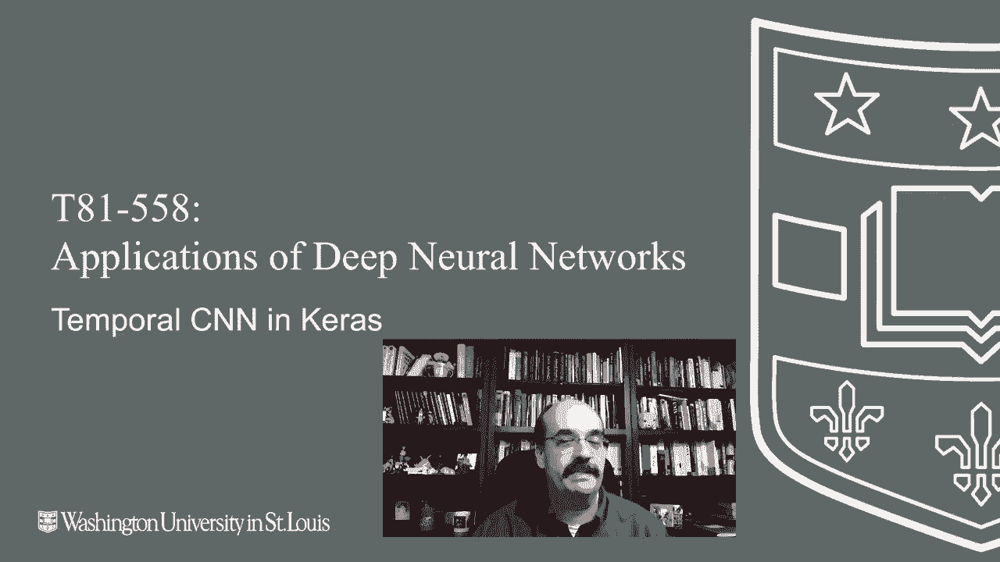
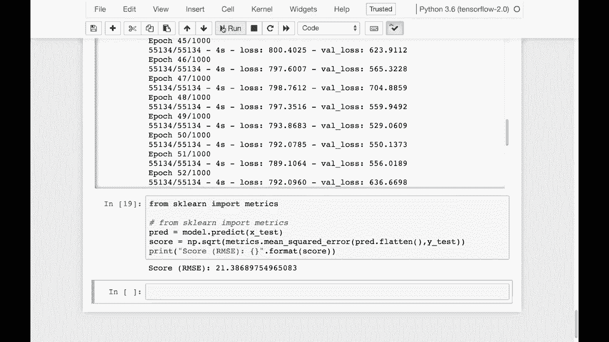

# 【双语字幕+资料下载】T81-558 ｜ 深度神经网络应用-全案例实操系列(2021最新·完整版) - P56：L10.5- Keras中的时间卷积神经网络 - ShowMeAI - BV15f4y1w7b8

Hi， this is Jeff Eaton， welcome to applications of Deep neural Networks with Washington University。

You know what？LSTMs GUs and recurrent neural networks in general are definitely losing some favor in terms of time series prediction。

 even though these were sort of the original deep learning and even traditional with Element and Jordan networks being introduced for time series。

 But guess what， convolution neural networks can do this stuff to。

 for the latest on my AI course and projects， click subscribe in the bell next to it to be notified of every new video。

 You normally think of convolution neural networks as images。

 or at least you did a couple of years ago。

CNNs are being applied to all sorts of things now。 Time series in particular and a lot of recent research is really giving CNNs the upper hand for some of the really complex time series and natural language processing things。

 So I'm going to show you how to make use of temporal CNNs Kiras doesn't have as advanced of prebuilt libraries for these as I as I would have hoped one of the best ones is I have the link to it here。

 but it's currently not available for Tensorflow 2。0。

 I suspect that'll be rectified by the time the semester starts。

 So I'll give you an update on that when we reach this point in the semester。

 So for this part what we're going to do is we're going to take those two examples that I gave you before on time series。

 So this time series sort of toy data that I have here and then。Also， the sunspots example。

 and we'll show that both of those that we did in LSTM， you can use almost exactly。The same code。

 And just swap out the CNN for the LSTN。 The data comes in in really the same format that I told you about setting up the 3D tensor for the input still applies。

 We're setting up the 3D tensor here。 And this is the same example。

 This is training on potentially a car going in front of looking at just a small sort of laser beam。

 So we can see okay， the car of color 1 is here。And so that's why the Y classifies as one。

 The car of color2 is here。 It classifies to two is here。

 I discuss this dataset set in part 2 of module 10。 If you， if you want more detail on that。

 it's just a toy dataset set to show you really how to use a LSTM except in this case。

 we've swapped out the LSTM。 We're using the con1 D。

 and that is essentially the temporal convolution that that's built into Kis。

 Now the more advanced ones of these。 and I'll update you on where that library is at when we reach this point in the semester is using something called residual。

 which is very much what we used in Resnet For now， and for this entire semester， we will use con1D。

 I'm not going to swap that out at you。On the last minute。

 because I always lock the versions at the beginning of the semester。 believe me。

 Tensorflowlow and Kias can evolve considerably in a semester。

 The stuff is moving at the speed of light。 So let me go ahead and run this。

 It's going to train just like it did with the LSTM。 And the idea is。

 I could put a car anywhere on any of these。 And it would learn that okay， two of these together。

 or maybe even three of these together。 Maybe it's a long car can be detected as a two or as a three or whatever。

 whatever color it is。 No RGB encoding at all。 Just one is one color， two is another color。 Again。

 this is a toy example。 And it looks like it has trained。 Okay， so let's try it out。

 I have the car kind of halfway off the。😊，Off the edge of the vector， but we'll run it。

 It still says that it's。one type of car。 If I moved the car， maybe it took it。

 took the picture earlier， and it was over here。 it should still return a one works very similar to the。

 to the previous。Example that was using a LSTM。Sunspots。

If you want the full description on the Sunspot data， refer back to part two of this module。

 but it's essentially the number of sunspots per month。

And we're trying to predict those because that goes up and down。

 I have the links to the data files here， because。The data file is provided by the government。

 So you need to download this and actually copy it to to your folder。 I put it in the data directory。

 but you can put it really anywhere。 I'm going to go ahead and run this。 I already have it loaded。

 This is what the Spot data looks like。're going we're dealing mainly with the the year month and looking at the Spot value。

 Now in these early years， they don't necessarily always have the value。

 And here we're trimming those values that So the early early years that are missing the observations。

 We're going to split it into test and train anything before 2000 is trained。

 Anything after 2000 is test。 We're going to convert those to sequences。

 just like we've done previously， this is just time series encoding。

 So we are dealing with sequence size of 25。 So we are breaking this up into groups of 25。

 and then we try to predict the 26th one。 And there's a lot of different groups of。

that we can pull from that data。 We can look and see what the Xtrain looks like。

 so it has those sequences in there。 the 25。 So that's how many sunspots initially so 253。

240 all these sunspots and then y is just an array and that would be the sunspot that would come after the train sequence had come in。

 This is where we build a model and train。 This does use early stopping。 I'll just fast forward this。

 So let's run an RMSE on this using the training set。

 So let's run an RC on the test set to see how well this is performing RC of 21 is actually pretty decent。

 That's the number of sunspots。 These are in the hundreds。 So it's reasonable accuracy。

 This content changes often。 So subscribe to the channel to stay up to date on this course and other topics and artificial intelligence。

