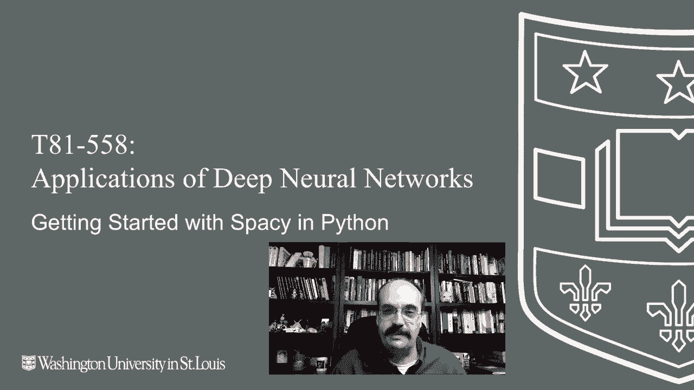
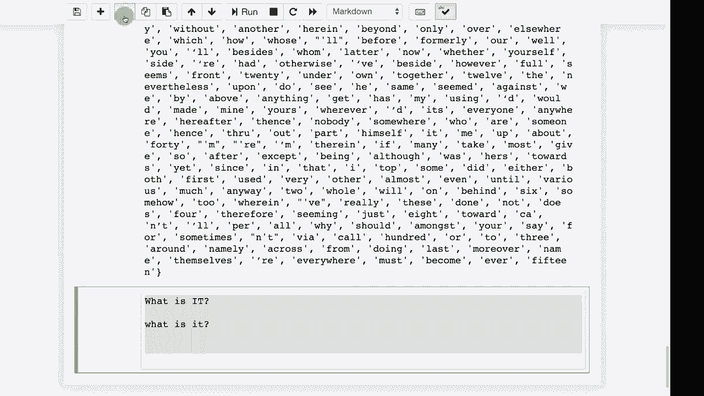

# 【双语字幕+资料下载】T81-558 ｜ 深度神经网络应用-全案例实操系列(2021最新·完整版) - P57：L11.1- Python中的Spacy入门 - ShowMeAI - BV15f4y1w7b8

嗨，我是杰夫·希顿，欢迎来到华盛顿大学的深度神经网络应用课程。现在我们将开始探讨自然语言处理，特别是汽车相关的内容。我们将首先看看一些工具，这些工具帮助我们在将数据预处理到神经网络之前进行处理。我们将讨论Spacy，这是关于AI课程的最新内容，并提醒你注意我们主要处理自然语言的内容，它涉及字符、率、故事，基本上是对其的再现。处理它的第二种方法是按词级进行，而我们确实在字幕中按词级处理过，实际上你可以将这两种技术应用于任何类型的问题，词级NLP可以很好地处理。

你可以使用Python中可用的额外库，在将这些单词送入实际的神经网络之前对其进行处理。字符级别有其优点，因为你并不在处理这些问题，因为你让神经网络自己去弄清楚英语后缀、前缀以及所有这些语法类型的表达。

一些技术对于其他技术来说更好。自然语言处理的传统方法是进行大量的语法分析。而现代的新技术几乎是端到端的，神经网络直接在原始文本上操作。

然而，你有时仍然会在词级上进行一些处理。因此，我们将看到如何使用一些Python包来处理文本中的实际单词，在将它们发送到神经网络之前。关于可用于Python的自然语言处理库，除了Tensorflow，还有几个，但是我看到的两个特别突出的是NLTK和Spacey，这在Kaggle比赛及相关文献中得到了体现。

NLTK的出现时间比Spacey更早，已经使用了一段时间。目前我都使用过这两者，我更喜欢Spacey。这就是我们在课堂上将使用的工具。它更面向对象，而且这种面向对象的方式很好，相信我。

这可能会以一种糟糕的面向对象方式实现，意味着它实际上将单词转换为个体对象，从而提供关于这些单词相当多的信息。现在，安装Spacey时，它应该在你通过模块1并完成我给你的所有Pip安装时已经安装过。

Spacey是我指定的你应该安装的包之一。然而，如果你只是安装Spacey，它是无法工作的。它需要一个词典。我建议你为这门课安装英语词典，因为这正是我们要使用的。如果你还没有安装词典，可能在运行这个模块中的代码时你没有。

你会遇到一个错误，比如要安装 spacey 字典。这是我发现的最佳命令，如果你遇到问题，你可能想要谷歌搜索它们，或者在课堂的 Piazza 或 Sla 上发帖，我会看看如果你遇到特定错误我能做些什么，同时在评论中发帖。我遇到过几乎所有可以想象的错误。嗯，这不是事实，总是会有人让我感到惊讶。

但我并不总能调试所有内容，因为我需要在我的计算机上实际运行它给你带来问题。所以相信我，如果你遇到错误，谷歌是你的朋友，只需复制并粘贴这段内容到谷歌，你可能会被引导到 Stack Overflow。你将会听到的一些术语，像这种**分词**是一个重要的概念，分词就是将句子拆分成单个单词。

这比听起来更困难。让我在这里放一个单元格。考虑一下这些句子。如果我给你这个句子：这是一个测试，那将很容易进行分词，单词是“这”、“是”和“一个测试”。所以里面有四个单词。然后你会得到更复杂的句子，比如“好的，但这怎么样？”

现在你需要决定如何进行分词。你可能不想失去那个逗号。那个逗号可能是有用的，或者你可能希望逗号消失。所以如果你把它拆分成一个单词列表，可能会变成“好的，但这怎么样？”所以你必须决定是基于空格进行拆分还是其他。然后你会遇到像这样的东西。

如果你是基于标点符号进行分词，现在将会是 u 是一个单词，S 是一个单词，a 是一个单词，你希望把它们放在一起。但是，除非你对语言有一些知识，否则你真的不知道这里发生了什么。这些看起来只会像是三个有点不连贯的字母，这就是为什么你需要为此安装字典。你还需要处理像这样的事情，好的，我通常不会对数据使用连字符。

但你可能不想把它们分成两个单词。所以如果处理带有连字符的情况。但是有时连字符确实会，比如如果你要做一个短破折号或类似的东西，你不会想把它合并为这个，因为它在句子中进行了一次突变。我觉得我会这样做。等一下，我会这样做，或者也许那听起来不错。这些是在尝试分词句子时你会遇到的一些问题，看看我在这里的示例。

这里有 U. K.。所以你想让它保持在一起。而美元符号。你可能会想去掉它，但它确实给你提供了有关那个词的信息。所以我们可以运行这个，我会告诉你 spacey 的分词是你在词级别的自然语言处理过程中最常做的事情之一。另一个常见的操作是将单词简化为其根形式。

所以“buying”会变成“by”。这样你就会失去一些信息。但如果你进行简单查找，“look”会变成“look”，其余的都是它们的基本形式。但这将其分解成一个漂亮的词组，这样你就不必自己解析和进行标记化。相信我。

别找空格，使用正则表达式并自己进行标记化。这实际上是一个相当困难的问题，需要加载字典。这样你就可以将“UK”这样的词放在一起。这也挺有趣的。我不常用这个。我更喜欢端到端的方法，不用处理英语的语法形式，比如动词、形容词等等。

这给了你空间，可以对这些词做出最佳猜测。但问题在于，它是上下文相关的。因此，词语有时可以作为名词或动词使用。这完全取决于词语的使用方式，所以这可能非常困难。这不仅仅是简单的查找。这也很有用，因为这可以让你快速弄清楚。

不同的词在数量上是有差异的。这儿还有其他一些，比如“none”。还有几个我一时想不起的，但它让你知道这个词是否像某些东西。所以“$1”就像一个数字。虽然“billion”是一个词，但在语法上也像是数字的根。如果你想更深入地研究语法，甚至可以让它为你图示句子。

所以如果你运行这个，我想要一个笔记本电脑、一个iPad和一只狗。我想看看它是否能搞清楚那个词组，结果有点成功了，它给了你一个英语句子的图示，你实际上可以将其用作可遍历的树，这样你可以在代码中使用。

我通常不使用这些，但有时看到句子的图示，尤其是复杂句子的自动图示，还是挺有趣的。顺便提一下，这些图示往往会失败，运行这个图示时，有一个常见的问题。

注意“star”仍然在这里。所以如果你尝试运行下一个步骤，打印出句子，你可能会想，为什么我的打印这么慢。嗯，是因为上面这个家伙仍在运行，因为它需要启动一个网络服务器来实际显示给你，你可以从中看出。所以最好将其断开，现在你可以运行其他的。这就是我之前告诉你的，你可以将词语还原到它们的根层次。

这非常有用。我会经常使用这个，因为这样你就不必担心像“hanging”这样的问题。所有这些都会变成“hang”，而这只是一个你可以遍历的列表，可以根据需要处理那些停用词。停用词是自然语言处理中的一个非常常见的术语，你可以在这里看到所有的停用词。

这些是英语中非常常见的词，但通常（我强调通常）价值很低。所以停用词通常被移除或降重，这只是停用词的一个列表。因此，你通常会做的事情是遍历这些。

像这样的句子并移除停用词。你在进行自然语言处理时使用相对简单的词频统计和统计分析，可能需要移除停用词。不过，我在参加Cale的自然语言处理竞赛时遇到过一个例子，我打印出了我的程序没有正确解析的句子。其中有一个句子特别有趣。

那是什么呢？嗯，是什么呢？这是公司中负责计算机和数据系统的部分。嗯，我程序做的第一件事是将所有内容转换为小写。那是什么？好吧，那是一个完全不同的问题。就像我不知道你在课堂上带来了什么新的电子设备放在我桌子上，我会问那是什么。所以仅仅把所有内容转换为小写可能会让你陷入麻烦。然后当我将那个句子转换时。

移除停用词后，它变成了这样。由于这三个词都是停用词，因此产生了一个空行。所以这是一个合法的问题，询问的是某件事情。那是什么呢？但你必须意识到这些常见的缩略语，而不仅仅是去除它们，否则每次进行转换和清理时都会丢失信息，也许那些信息并不重要。

但你必须对这些自然语言处理的事项保持警觉。

感谢你观看这个视频。在下一个视频中，我们将讨论更多自然语言处理工具，特别是Word2Vec。这个内容经常变化，因此请订阅频道以保持更新，了解本课程和其他人工智能主题。😊
