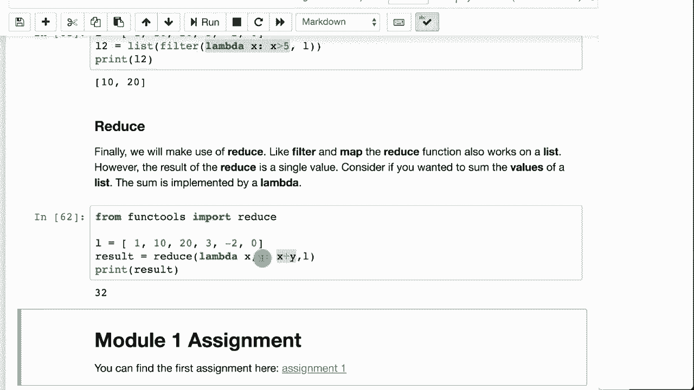

# 【双语字幕+资料下载】T81-558 ｜ 深度神经网络应用-全案例实操系列(2021最新·完整版) - P6：L1.5- Python 函数、Lambda 和 Map／Reduce - ShowMeAI - BV15f4y1w7b8

Hi， this is Jeff Heton， welcome to applications of Deep neural networks with Washington University in this video we're going to look at how to use functions and even Lambdas。

 which allows you to pass a function to a function。

This is a very powerful feature of the Python programming language that allows us to do very interesting things with our data processing。

 particularly in the next module when we start working with pandas We'll see how to use things like map。

 reduce filter and these basic operations that you do on collections making use of Lambda functions that you can pass in for the latest on my AI course and projects。

 click subscribe and the bell next to it to be notified of every new video Funs are very common in many different programming languages they allow you to take code。

And package it up as a function and not have to just duplicate it all over the place in your program source code。

Here I am creating a function called say hello， this is how you define them in Python de， say hello。

You don't need anything in the function definition to say if you're going to return something or not that。

Python knows that it's a function by the fact that you do return something or that it's a procedure by the fact that you do not return something。

 and a procedure is commonly referred to as a function that doesn't return something。

This is a procedure so it does not return anything， it takes a couple of values， arguments， speaker。

 person to greet and the greeting Now notice the equal hello up here。

 that means that it has a default value for greeting so if you don't give it a greeting。

 then it's just going to default that to hello。And we can run this。It calls it three times。

 so the first time it calls it with a speaker and a person to greet。

Second time it calls it with a speaker and a person to greet and it changes the greeting so that it's goodbye。

You can also use named arguments and this is very useful if you have a lot of arguments so that it doesn't get confusing。

 you can say okay， the speaker is Jeff， the person agreed is John and Greening and you can mix that order up。

 it does not particularly matter。And if we run this。You can see it says hello John， this is Jeff。

 goodbye John， this is Jeff and same thing for the last one。Now function。

 a true function that returns something， here you'll see that I basically pass in a string。

And what this does is it strips off， so Str removes white space from the beginning and the end of the string。

A string is basically an array。 so string 0 is going to be the first character of the string。

 I convert that to uppercase。 and then I say， hey， I want the rest of the string from one to the end because I don't say anything if I did one to2。

 it would。It would get just a portion of the string， so if we do that。

 it defines the function and you can now call it quite easily。

 I pass in hello with this white space and it gives me back hello。With the H capitalized。

Python's map function is very useful， this comes from functional programming map。

Map produce of Hadoop fame。 Now this is not dealing with big data or anything like that。

 This is simply the map function。 A map takes a list of values。

And applies a function to each of them。So here I'm going to run it。

 the list just converts the output from map into a list so that it can be displayed。

And we give it the process string， that's the function that we when applied across everything。

Across this list。So it is going to give me a list back。

 a map always returns a list and it is all of the values that came back from whatever function that you had called it against the map。

Is very similar to the comprehension that we had in Python。

 so here we are going to look at this as a comprehension doing basically the same thing。

 So here we're calling processing string for X and L Now a comprehension is a Python specific sort of thing whereas a map is common in a lot of programming languages。

I tend to use comprehensions， but others will use maps just because they can write their code so that it can be understood by more than just the Python programmers。

Because this what this comprehension here is doing is not necessarily clear unless you've worked with Python。

Filter is another functional。A sort of operator that you that you can deal with。

 a filter takes a list and filters it down to potentially a smaller list。

 could be the same size list as what came in， but this is defining a function that says is it greater than five？

And then we're taking this list where some of the values are not greater than five and we。

Process that list， so only 10 and 20 were。Greater than five。 The rest all got filtered out。

 so filter can be a very handy way to。Basically， apply a function to check to see if items should be included in the list or not。

Lambda is very handy， it's a type of function， it's an anonymous function。

Usually lambmbdas are just one line， but they can certainly be longer。

A lambda basically makes a function， a expression of sorts that you can assign right into variables。

 so here I am going to run this instead of writing this big long function it's not that long as two lines but still。

As we we write it simply as a lambmbda so that Lambda replaces the greater than five function。

 it's nameless， it has no name， it is literally just passed right into the filter function。

So if you're going to write very short functions to be passed into things like maps and reduces and filters。

This can be a very good way to write those and then reduce。

 so these other these other things like filters and maps。 you had a list in a list out。

 This is a list in a single value out。 So it is reducing the list into a single value。

 This is showing how to do a simple summation。😊，So this is the way the reduce works。

You have two values in the lambmbda， the first one。Is the accumulator that is coming through。

 And then why is the value that you're adding to that accumulator。

Thank you for watching this module on the Python programming language in the next module。

 which is a set of parts， we will see how to start to use the Pandas library that comes with Python that allows you to prepare data for tabular neural networks。

This content changes often， so subscribe to the channel to stay up to date on this course and other topics in artificial intelligence。

