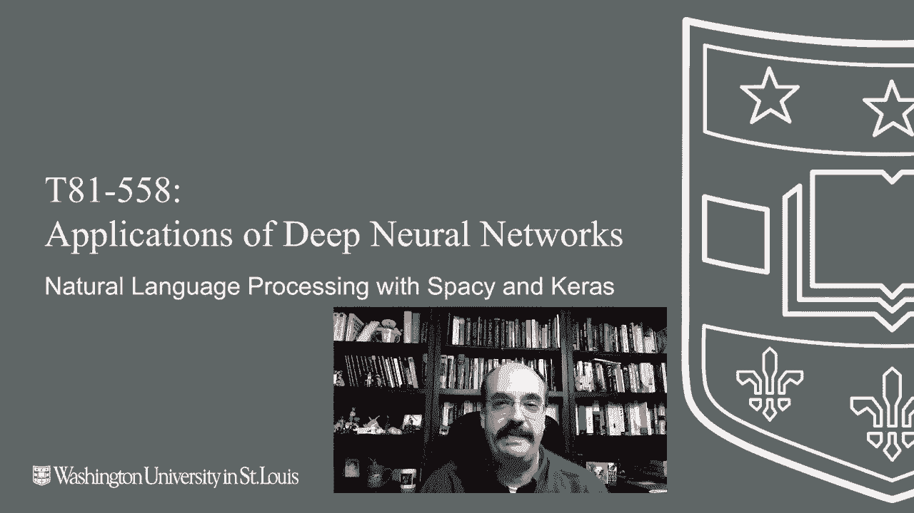
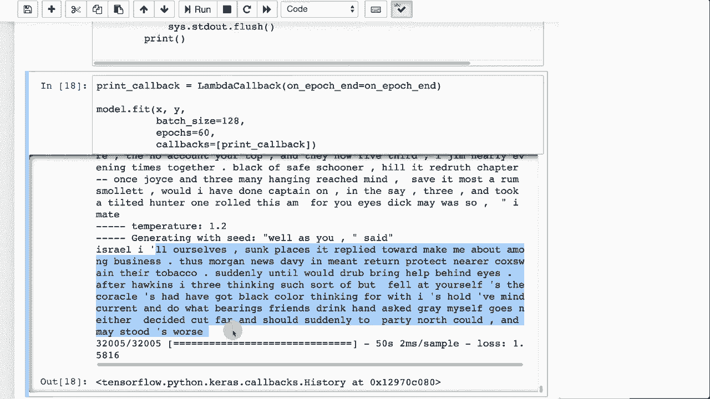

# 【双语字幕+资料下载】T81-558 ｜ 深度神经网络应用-全案例实操系列(2021最新·完整版) - P60：L11.4- 使用Spacy和Keras进行自然语言处理 - ShowMeAI - BV15f4y1w7b8

Hi， this is Jeff。 welcome to applications of deep neural networks In this video。 we're going to take a look at natural language processing in particular。 we're going to use Spacey Cars and word tove together for the latest on my AI course and projects。 click subscribe in the bell next to it to be notified of every new video previously we did text generation where we looked at treasure Island。

 and we got the neural network to generate its own pirate stories。 We're going to continue with this。 but this time we're going to use word level text generationPrevious we use character level text generation。 Now there's much debate as far as which of these two you should use。 I tend to prefer generating at the character level and going truly end to end with the neural network。

 letting it figure out grammar and letting it figure out sentence structure not really doing a lot of feature engineering on nouns and verbs and that sort of thing。 but you can certainly do word level。 And if you do word level。 then it might be useful to provide additional features to let。😊。

No if it's dealing with a noun or a verb or other things。 We won't get quite that complicated with this example。 but I'll show you how we can use this to generate text at a word by word level this is what we use for captioning。 we were generating at the word level。 Although you can certainly do captioning at the character level as well。

 So here I imported the packages and libraries that I need both for spacey and for Kis。 I'm getting the treasure island text just like I did before。 And now I am dealing with spacey So I am going to use spacey now to do the tokenization to break the treasure island text apart so that I have it by individual words。 Now， when we did character level encoding， we didn't have to do this tokenization was handled by the neural network。

 It learned what spaces were and it learned how to break the words up here since we're doing word by word。 we need to do that actual tokenization and spacey is what does it for us。 So we're essentially looping through all of the tokens so。All of the words that it finds this is just code， this first line， this is a pretty useful line。

This reduces the characters to just characters in the ASCI code 0 to 127。 so this ensures that you are dealing just with ASII characters in those words。 so that strips out a lot of the extra junk characters like this copyright symbol in this weird A that removes those from your words then we also strip off any white space because once you removes some of these。 there might be white space now that was embedded in there。

 We make sure that the tokens are not digits。And that they're not URLs。 emails or other things like that。 Now you might want to handle these， but for the simple example。 we're simply stripping them Now in the character by character。 we just let them pass it in and interestingly， the neural network would learn to generate URLs and email addresses and other things like that total number of words we had when we did that is 6421。

 we print out some of these。 Now some of these are numbers， that's a Roman numeral。 but we'll just go ahead and let it go in that won't necessarily hurt anything。 we're creating to look ups here。 a word to index。 So this would take a word like alone and convert it into a index。 Now if you want to make these more consistent you might want to sort these because then the indexes are going to always be the same。

 So for production situations， you need to think about that to make sure that these indexes are truly staying the same。 Otherwise， if you train your neural network and you change what these indexes are。 It's not going to work。Then we tokenize the text that basically goes and takes the original Tresure Island text and replaces each word with the index number。So now it's more ready to be fed into something like an embedding layer or other text translation input。

 We're going to now this is just like what we did in characters。 except we're creating sequences of words， not sequences of characters so this is essentially the same code we're dealing with word sequences of up to six words step just means that we move forward three words each time otherwise we would have a of a lot of redundancy in here because if the word if the sentences this is a test。

 the first sequence is going to be this is the next sequence you would move forward three words so you wouldn't immediately start with the second second word。The smaller you make this number， the more of repetition that you will have and then we see what these sequences look like。

 at least the first five So these are the sequences that we're training on we're training the neural network if you have this word。 this word， this word， this word， this word and this word then what is the next word then we vectorize it this is essentially just changing this into lumpy arrays so that we can actually train the neural network with it。

 this is exactly the same as from the character level encoding that we did but it is really just building these up。Sort of one by one and then also building the Y so that we have。The dummy variables coming out on the Y side so that we can predict it these we are using dummy variables。 So this is the X shape。 This makes it very evident how we're encoding this。

 So the X shape is essentially we have 32005 sequences that we generated the max sequence sizes 6。 and then we have this many values because we have dummy variables coming in。 essentially。 we have a dummy variable for each of these six。 So this is really a lot of data that we've pregenerated。 This is where' using an embedding layer could make this more efficient， but it fits into Ram。

 So I'm largely happy with it。 The y is similar。 we don't have the six here because we're not predicting sequences。 We're just predicting the next character。 So we have the same number of rows。 but now we have these dummy variables that tell us which of those 6400 words It's actually going to be。 And you can see what the dummies look like here essentially we're creating。Very small， simple LSTM。

Has 128。Nurons。And it's layer。We're going to optimize with Rs prop again。 keeping it similar to the example that I pulled in from the character encoding Now this is not a formal example from Kira's I just modified the previous example from Kiras for the LSTM generation I just modified this to actually work with words instead of characters we print a summary it's got like 4 million weights that we're training on this is the sample function this is exactly like the characterbased one we're essentially doing a softm function where the temperature determines how conservative it's going to be in terms of the sentences how willing it is to take risks so you get more creative with that is a higher number but more error prone with it as a lower number and this is essentially a softm essentially ensuring that the probabilities of all of those 66400 words that are in the vocabulary that's trying to predict for the next。

That the probabilities of each of those do sum to one because they're probabilities because we're going to take essentially the highest one。 and that is what we're going to predict as the next word。 This is very similar to the previous example。 We're calling this on Epoch end and we're essentially generating some text on each of these iterations as it goes through training。 and we can see that the text that it's generating gets better and better and better。

 We're going to generate 100 words for each of these。 We're going to build up the input sequence。 So we're going to randomly sample six or however big that input vector was for the sequence。 I think it was six words if memory serves。 Yeah， excellent was6。 So we're sampling groups of six words and we begin training。 We'll scroll down Now this is a lot。

 this was training for a while。 This is why I'm not running these for the video。 it would take quite a while。 So temperature， this is a pretty conservative temperature and this is well。the training。 you can see the pirate story that it's inventing Israel。 I ourselves sunk pieces It reply towards make me about among business。 thus Morgan news。

 Davy in mint return。 I'm not seeing really any grammatical error。 So that's really kind of cool。 Another thing that it's doing that I just find fascinating is my tokenizer。 I probably didn't spend enough time on the tokenizer。 but it's taking the I and ill。 those are two different words in the vocabulary。 That's why there's a space in here because we're putting the spaces in。

 It doesn't know what spaces are。 but it figures out that usually after an I， it'll be ill。 or it'll be S。 it's not like tacking this apostrophe S on fell or something like this。 It really is truly figuring out the sentence structure。 and that's really。 really cool and where natural language processing has really。

 really benefited from some of the deep learning technology。So this is how you would do that same text generator at the word level The word level。 I think out of the box without a lot of effort trying to optimize does produce very realistic words and sentence structure and believable text as far as pirate stories。 Thank you for watching this video on the next video。

 we're going to look deeper into natural language processing with curs and look at embedding layers。😊。

This content changes often， so subscribe to the channel to stay up to date on this course and other topics in artificial intelligence。