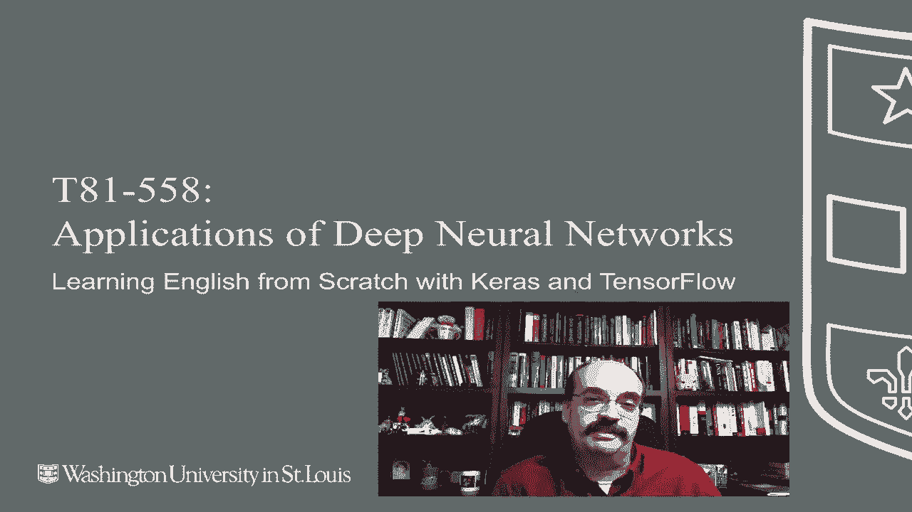
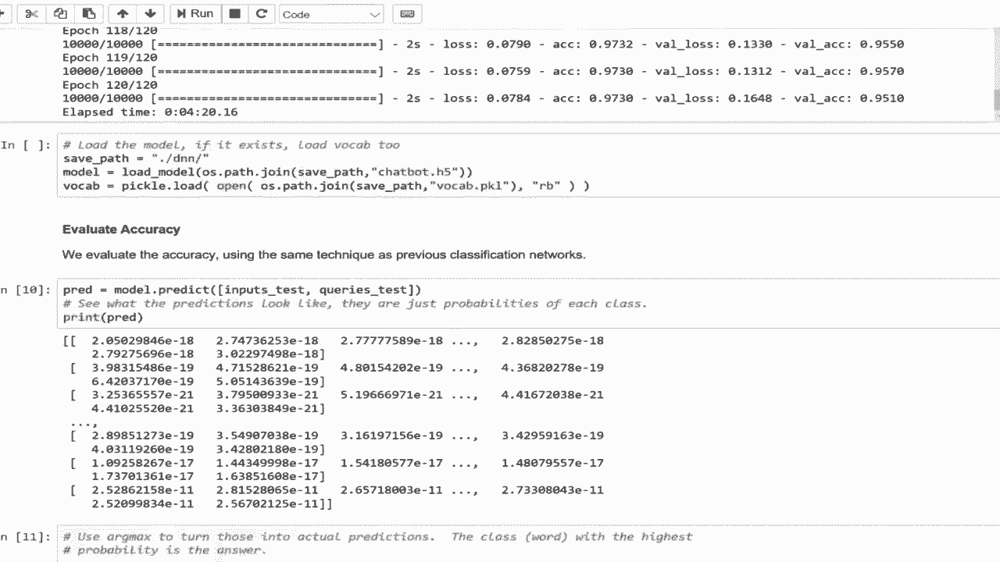

# 【双语字幕+资料下载】T81-558 ｜ 深度神经网络应用-全案例实操系列(2021最新·完整版) - P61：L11.5- 使用Keras和TensorFlow从头开始学习英语 - ShowMeAI - BV15f4y1w7b8

嗨，我是Jeffine。欢迎来到华盛顿大学的深度神经网络应用。你知道吗，也许我们人类被高估了。毕竟，AI在几小时内就能掌握国际象棋，甚至不需要人类知识的帮助。我们尝试进行自然语言处理，使用了各种高级插件，比如L T K和Space E等。

也许我们应该让神经网络从零开始学习英语或其他语言。这被称为端到端神经网络。有关我最新的AI课程和项目，请点击订阅，并点击旁边的铃铛以接收每个新视频的通知。继续前进。我们将看另一种类型的。😊

欢迎来到华盛顿大学的深度学习应用，看看我们如何教神经网络学习阅读。这是我从这两篇论文中提取的内容，同时我也使用了Kira示例中的代码，Kira的创建者实现了端到端神经网络作为cururas的一个示例，这最终可能会构建成Kira的特定层类型，以便你可以直接使用，但现在你会看到一些用于实际实现这种网络类型的底层代码，还有一个在线JavaScript演示，你也可以用来玩一玩。如果你愿意，我们将实际创建一个端到端神经网络并加以利用，这些只是一些必要的导入和工具函数，它们是根据Kira的示例创建的，我对这些进行了些许更改，使其工作得更好，并消除了一些Hatheng生成的警告，因为这些警告可能是在Kis的较旧版本上生成的。我还在最后添加了一个问答部分。

原始代码训练了网络并给出了准确率，但没有提供任何使用它的方法。所以我在最后创建了那部分。让我们继续运行它。它告诉你正在使用Tensorflow作为后端，然后我们看到它仍在运行。它需要一点时间才能完成，但在此期间，让我向你展示一下我们正在做的一些部分。

这是一个标记化的函数，它使用正则表达式分离句子中的单词，因此这会将“Bob D the apple. Where is the apple?”转换为一个数组，而不是一个大句子。这被称为标记化，它将句子标记化并为你分解。这一部分是故事，因此它将以Babbby任务格式存在的故事分解为三部分。你将会看到，它们是通过制表符分隔的，我不会详细讲解所有步骤，但基本上，它的作用是提取三个部分，其中包括“约翰走进浴室，玛丽走进卧室”的故事。

这一部分是三部分中的第一部分，第二部分是关于“约翰在哪里”或其他问题，第三部分是答案，这种类型的神经网络的答案总是一个单词。因此，你在问一个故事的问题，然后给出一个相关的问题，它会返回一个单词。重要的是要意识到神经网络的训练涉及权重，而不是学习特定的句子，因为在神经网络训练后，你会给它新的句子，它应该能够回答关于这些句子的问题，因为训练数据中包含了各种情况，比如“玛丽在浴室”和“玛丽在卧室”，这些都是特定于某个训练示例的位置，它并不是在学习这些位置，而是在学习如何阅读新故事并能对其进行回答。然后，这里我们称之为的函数会通过调用其他函数获取故事，这些函数刚才提到的解析故事，并将故事以向量格式返回，这可以传递给神经网络进行处理。

对故事进行向量化，我将展示这具体是怎样的。但本质上，它的作用是提取所有的句子、故事，计算有多少个独特的单词，然后进行向量化，并转换成纯数字形式，每个单词都有一个数字索引来替换，我们稍后会看看它是如何工作的。这段代码基本上下载数据，所以我们从AWS获取数据并下载到这个GZ文件中，然后提取出我们想要的部分，我们正在进行10K挑战。

这是一个较小的数据集，虽然仍然相当大，但它让我们能够在电脑上运行。我要指出的是，我通常运行这些示例的电脑使用的是AWS实例，正如我之前讨论的那样，我基本上访问我的网站，你无法使用那个URL，因为它是我的AWS实例，这会让我产生一些费用，虽然不多，但我通常使用的是8GB的内存。

实例化这个课堂环节，因为有相当多的内容，我实际上使用了一个16GB的内存。如果我使用的是更大的数据集，我会需要更高的内存，可能在一台8TB的计算机上运行。因此我们来运行这个部分，我会继续运行这一部分，因为我已经运行了之前的部分。它正在提取挑战的故事，并且现在我已经运行过了，它已经下载了它们。如果你是第一次运行这个，它可能需要下载这些。

让我运行这个，让你看看数据实际上是什么样子的。所以这是一个故事，玛丽搬到了浴室，约翰去了走廊，玛丽在哪里，答案是浴室。这里还有另一个故事，而且将会有多个句子。玛丽搬到了浴室，约翰去了走廊，丹尼尔回到了走廊，桑德搬到了花园，丹尼尔在哪里？所以它需要读取这些并找到他最后说他搬到的位置，并用不同的方式描述它。

回到“搬到”和“去”的问题。所以它确实需要学习读取这些训练示例。我需要再次强调，神经网络并不记得玛丽在浴室。这仅仅是这个特定句子的独特性。还有一大堆这样的句子，大约有10000个供其训练，答案总是一个单词，因此它学习读取这样的句子。最终我们会看到，我们可以为它编造自己的临时故事，它会读取并回答一些内容，但我们会看到它有一些非常重要的局限性。所以首先我们需要构建词汇，这是这个程序一个非常重要的限制。我们将运行它，让我给你看看那是什么样子。它非常快速地构建词汇。它对所有这10000个训练故事和1000个测试故事进行了处理，所以我们将在这些上进行训练，并在这些上进行测试，看看它能学会多好地读取。它提取了一些非常重要的极值，这些将会被隐含或施加在训练的神经网络上。我们有22个独特的单词，这将是词汇，如果你查看所有那些句子。

玛丽搬到浴室，所有那些单词，你会发现有多少个独特的。只有22个独特的单词。当你添加更多单词时，这个神经网络变得非常非常占用内存，因为这些基本上变成了虚拟变量，所以这是一个很大的限制。但是如果你给它更多的内存和计算机，确实有示例可以学习更大的词汇。最大故事长度是68，所以我们将基本上创建一个输入，由68个单词和22个虚拟变量组成，那就是嵌入，另一个输入是问题，因此查询或问题的最大长度是4个单词。

因此，这个神经网络的输入将成为故事，最大为68个单词，旁边是22个虚拟值，查询长度是四个单词，旁边也是22个虚拟值。因此，它实际上变成7268加上4乘以22个虚拟值的输入。你可以看到，如果你开始添加额外的单词，这个会迅速变得很大，这就是词汇的样子。

现在这个神经网络需要一些时间来训练，在我运行的这个较快实例上，它大约需要四分钟进行训练，但在计算核心较少的较慢实例上，这可能会花费更长时间，因此我们希望保存这个神经网络。我们还希望保存这个词汇表，因为我们需要查找。这是基于映射的，而Python中的映射顺序是可以改变的，因此你不能保证将东西放入映射后总是会有相同的大小。这是查找表，它告诉我们零对应的是句号，二对应的是丹尼尔，依此类推。当我们对这些进行向量化时，它会将这些词转变为查找值，例如玛丽是4，玛丽会变成4，移动15，所以它会变成415等等。因此，为了构建训练集，让我继续执行这部分，它告诉你输入将会是什么样子，所以你有一个10000乘以68的输入向量，一个10000乘以4的输出，然后答案将是词汇大小，让我给你展示一些单独的训练元素。

这显示了故事，所以你会注意到我们始终保持这个长度相同。68是所有故事中单词的最大长度，并且进行了填充。填充是在左边，所以开头是全零，然后是你在这里得到的实际单词。现在一个重要的事情是要展示这些零，填充的工作方式，我们必须在最后进行调整。这是一个非常重要的部分，我会在最后给你展示，但请注意我们有21个单词，如果你数一数这两个东西，如果你在关注，你可能会看到22个独特的单词，所以数学不太对劲。我们有的额外值实际上是空值。所以null 0实际上是映射中的第一个值，但实际上这个值加1，所以0会变成1，依此类推。我们看到我们必须在最后进行调整，但这就是我们这里有零的原因。因此那些实际上是空值，然后我们进入查找的实际值，问题也是如此。现在这个问题的最大长度是四。

所以我们现在没有零填充，我们需要编译神经网络，因为Keras本身不支持端到端的神经网络，基本上必须在这里创建计算图，至少在某种程度上。我将向你展示这看起来有点像什么，我们不会真正深入所有细节，我需要带你看整篇论文才能了解，但我们基本上创建了三个编码器，其中两个用于句子，然后两个用于从句子中提取事实，然后将这些事实与问题编码在一起，试图构建答案。所以你需要两个用于输入的编码器，而你还有一个用于问题的编码器，输入维度变成词汇大小，以便构建那些占位变量，输出维度基本上是下一层中的值的数量。然后我们将这些全部结合在一起，最终汇聚到一个LSTM中，我们使用了dropout正则化。

在整个过程中，它最终进入了答案的softmax，这基本上是对词汇中哪个是答案的分类。最后，我们创建模型并训练或编译它，我们并不训练。这个部分运行得非常快，基本上创建了神经网络，神经网络现在已经构建并编译。这是我们将实际训练它的地方，我们将使用32的批量大小和120的epochs。现在这一点非常重要。

我们将保存神经网络，因为构建这个网络需要一段时间，我们不想就这样丢弃它，所以我们保存神经网络。我从原始示例中添加了这段代码，他们没有保存神经网络，但我们将其保存为H5文件，这是一种二进制文件。我还将词汇保存为pickle文件，pickle是Python中的标准序列化格式，我报告了经过的时间。所以我将继续运行这个，并加速处理。

但实际上完成这个过程可能需要4到8分钟，你可以看到时代正在快速推进，并且它正在处理训练集。训练集包含100个元素，所以它只是继续进行。使用任何形式的提前停止，它将在120时停止，好的，还不错。使用这个更快的AWS实例大约需要四分钟。这个代码我不会执行，神经网络已保存，聊天机器人已保存为H5格式，词汇也保存为pickle文件。如果你正在运行这个并且已经保存了聊天机器人和pickle文件，你基本上可以只运行这部分，而不是训练，我们将评估准确性。注意，我们的做法与之前的代码非常相似，只是看输入，由于计算图早期的结构方式，输入有所不同。

输入实际上是两个向量，一个是输入，另一个是查询，所以输入是故事，玛丽去了走廊，等等，查询是问题，比如玛丽在哪里，我们将运行它并打印出预测结果，这就是我们之前看到的典型概率。你现在会看到我们并没有看到所有的值，但每一行基本上显示的是你拥有的22个词汇的概率。

这些词是答案。现在你可以看到，如果你使用一个合适大小的词汇量，比如20000个词，这种类型的网络的输入会变得非常非常大。因此，就像之前一样，我们将取这些的arg max，现在的arg max基本上是每个的索引，所以这显示词汇单词12是期望的答案，9是期望的答案，151215，并不是所有的词汇列表中的词都经常是答案。你肯定能看到某些数字比其他数字更常被选中。我们也可以打印出我们的最终准确率，95%实际上非常好。现在我想告诉你如何进行临时查询。我从汽车中复制的原始示例没有显示准确率或告诉你如何分解这些向量，因此这些都是这个类添加的。如果你碰巧查看我上面链接的原始示例，他们也没有告诉你如何进行临时查询，我认为这是最酷的部分。你训练了这个伟大的神经网络，它学会了如何阅读，所以你想尝试测试。

所以我在这里给出的是字面上的原始文本。它会输出其词汇量。它在提醒你。记住，我只知道这些词，我告诉它玛丽去洗手间了。约翰去了花园。等等。玛丽在哪里，我运行临时查询。这是我添加到程序中的一个区域，所以你会看到玛丽去了花园。约翰去了花园。这是一个简单的例子，我只是随便编造的，然后我问，玛丽在哪里。

他们都在花园里。所以如果我运行这个，它会说花园。我可以把它改成玛丽去了洗手间，它会更好地改变示例或答案。一个实时演示，洗手间好，玛丽旅行了，根据英语系统，"旅行"可以有几种拼写方式。他们使用两个L，所以我必须使用两个L，但这没关系，它仍然理解约翰去了花园。

你可以在这里添加其他人，我可以添加丹尼尔，我们把玛丽移到走廊，然后我们可以运行它，而它并没有重新训练神经网络，而是使用已经学会阅读这些句子的神经网络来回答问题。

我也可以改变查询，比如问丹尼尔在哪里，它会为此进行调整。让我试试。现在让我给你展示一些效果不太好的事情。如果我说丹尼尔去了比赛，那就超出了词汇范围。因为在字典中找不到，所以会崩溃。我老实说还没有尝试这个，但我想试试。我只是好奇它会怎么做，它是否有时间的概念。如果我说丹尼尔去了走廊。

玛丽去了洗手间。丹尼尔去了卧室。丹尼尔改变了他的地点，他曾在走廊，然后去了卧室。如果我问它这个问题会发生什么？它很聪明。它能理解，因为如果我改变这个，丹尼尔在走廊，他去了洗手间，然后它会为另一个更新。

如果你考虑编写一个传统程序来做到这一点，你需要解析这些内容并保持某种状态，以了解每个人的位置。神经网络只是弄清楚如何做到这一点，并且它会随着后续答案的出现而覆盖这些状态。我敢打赌，训练集中有一些示例教它这一点，教它最后一个答案是正确的。你可以调整训练集，以便第一个答案是正确的。

基础信息，它会学习到你也可以在这里加入“最初”这个词，并为“丹尼尔去了走廊。玛丽去了洗手间。丹尼尔去了卧室。”进行训练。问丹尼尔最初在哪里，它很可能会学会知道那是该人最初所在的位置。我还想尝试一些其他的事情，问它桑德拉在哪里，她在这个故事中根本没有出现。

所以它不能说我不知道。它说她在花园里。如果我必须打赌，让我实际上去打印它的预测。那么这就是概率，除了我将其切换到最大值，所以我只打印出概率，几乎是它的置信度。所以它显示出是的，它相当确定，90%的置信度是我在这里看到的最高概率。如果我必须猜测，它在说桑德拉在花园里，因为在训练集中，她最常待的地方可能就是那里。

我不知道，我需要验证那个假设，但这真的是一个相当酷的技术。你可以轻松地玩这个，并训练它学习你自己的句型。你可以做一些事情，比如丹尼尔最初提到的那样。你只需生成适当的训练数据，它就会真的学会阅读你提供的那些句子。句子越复杂，神经网络需要的规模就越大，所以神经网络的架构我没有详细展示，而是直接说到你需要将大小从32增加，然后在这些密集层中，现在只是在做一个密集层，词汇大小就是输入到softmax的内容，但你可以创建一些额外的密集层和正则化层。事实上，作者甚至指出你可能需要添加这些。因此，这显示了你如何基本上从零开始教神经网络阅读，它的能力有限，词汇量也小，但在16GB的计算机上运行四分钟，这实际上还不错。感谢观看视频。

接下来的模块我们将探讨强化学习，这个内容变化频繁，因此请订阅频道以便及时了解本课程和其他人工智能主题。
