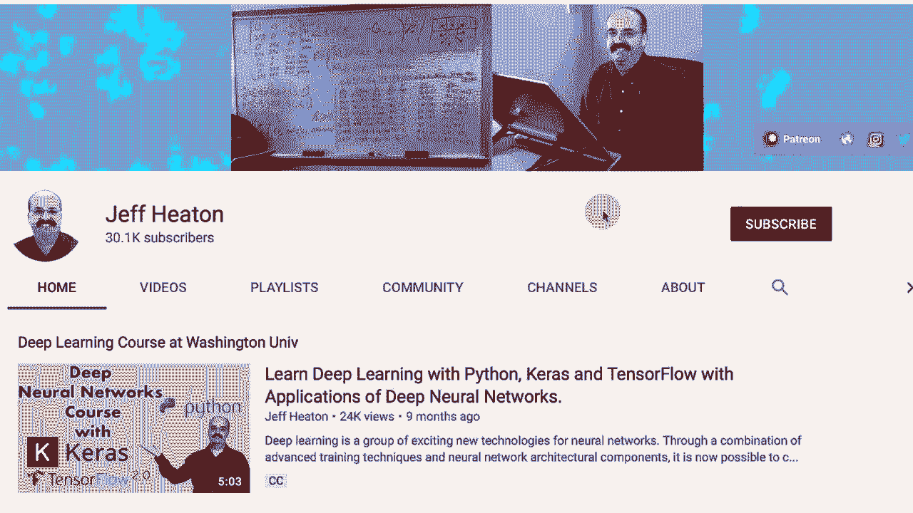
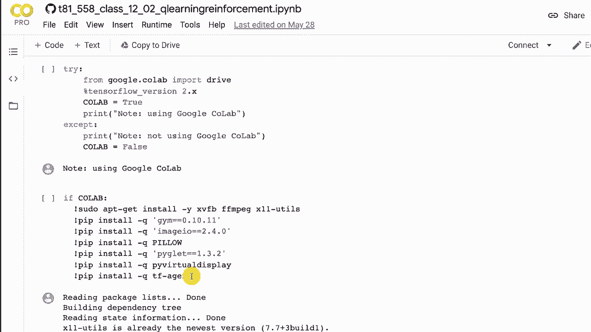
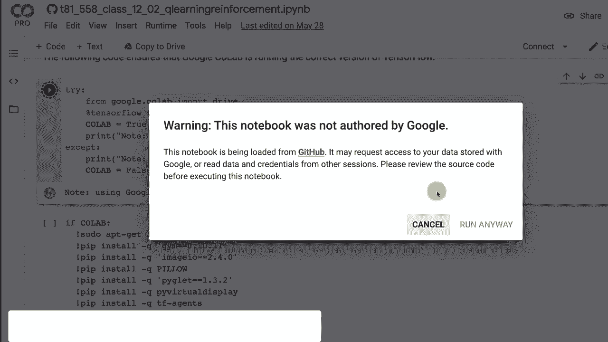
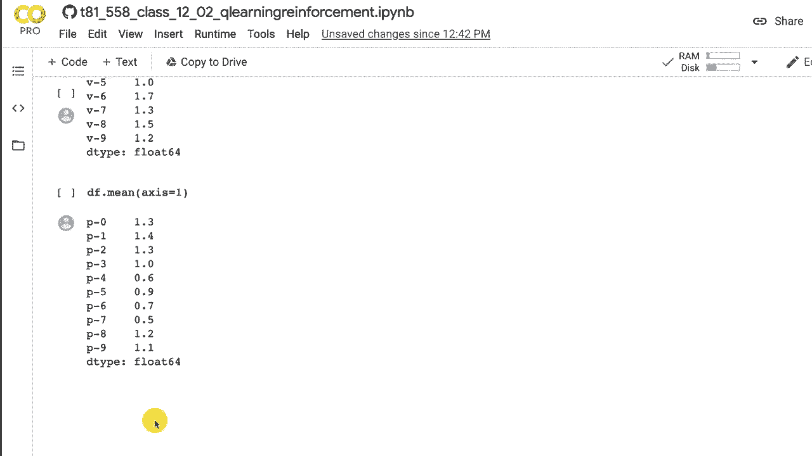

# 【双语字幕+资料下载】T81-558 ｜ 深度神经网络应用-全案例实操系列(2021最新·完整版) - P63：L12.2- 用于游戏学习的Q-Learning算法简介 - ShowMeAI - BV15f4y1w7b8

嗨，我是杰夫·海顿。欢迎来到华盛顿大学的深度神经网络应用。在这个视频中，我们将基于使用 G。我们在上一个视频中看到了 Open AI gym。现在我们将对其应用 Q 学习。我们将看到如何利用机器学习构建一个基本的查找表，以展示环境可能作用于的任何状态应采取的行动。然后我们将继续展示深度神经网络如何成为一个非常复杂的表的表示，从而无需逐个存储每种组合。

这标志着深度 Q 神经网络的开始。想要查看我关于 Cale 神经网络和其他 AI 主题的所有视频，请点击订阅按钮和旁边的铃铛，并选择全部以接收每个新视频的通知。那么让我们看看 Q 学习。我将在 Google coabab 中运行这个。这实际上并不需要 GPU。这里的代码甚至没有设计用来利用 GPU。

😊。

我将给你一个基于 Python 的表格 Q 学习查找实现。这实际上就是 Q 学习的工作原理。在下一部分中，我们将扩展这个并且实际使用 Kra 的 TF agents 在深度学习中实现这一点，然后完全超越这一点，使用更复杂的环境，比如一个 Atari 游戏。这里是 Google Coab 的设置，我们肯定要使用 Tensorflow 2。

这里有一些额外的代码，如果你在运行 coabab，它将会执行，因为截至录制这段视频时，coab 并不包含 TF agents 和一些我想要的其他功能，这样我才能在浏览器中直接展示视频。TF agents 提供了一种非常好的方法，可以在环境渲染时仅从单一图像中捕捉快照并展示给你，还有其他方式。

绕过这个，但是TF代理使得这一切变得很简单，除此之外我们在这个视频中不使用TF代理。我们将在下一个视频中使用TF代理。我将继续运行这一部分。它会显示使用Google Colab，一旦这个部分真正运行，我就会运行这部分以安装我希望拥有的所有库，这可能需要一些时间，所以我们会快进。在Q学习中，有几个术语我会在我们进行时提到，所以现在了解这些是有好处的。代理可以想象成一个视频游戏，尽管在本章的最后部分我们将做一些不是视频游戏的事情，但代理是你的玩家，即在环境中进行游戏的计算机玩家。环境是代理存在的宇宙，环境有状态，随着代理的互动，环境的状态会变化，而代理通过与环境的互动来与之互动。

首先，在这个视频的这一部分，看看环境的状态。环境状态只是一个数字向量，告诉我们小车的位置或速度等信息，但当我们进入Atari时，环境实际上是一个网格，就是视频屏幕，游戏正在进行，一步是通过环境的一个周期，所以你采取一个动作，就像向上移动。

向下移动，向左移动，向右移动，然后看看这对环境产生了什么影响。一个完整的执行某个动作并查看结果的周期就是一步，所有步骤直到你完成目标或被杀死，或者模拟结束，这叫做一个回合，这就像是一场视频游戏的游玩。一轮是一个训练构造，它可以是一些回合，具体取决于你如何配置，然后终止状态是导致游戏结束的步骤。

你赢了，生命用尽，类似的情况。所以Q学习基本上建立了一个表，以便在这个环境中的每个状态给我们指示哪个动作将是最有奖励的，因为在这个过程中，你在每一步结束时会获得奖励，这告诉你这一步的有效性。有些游戏意味着在最后才会给你奖励。

只有在你想要的时候才会到达最后的终点。那些可能会有点难以优化。但Q学习仍然可以做到。这几乎就像你完成四年学位课程，最后要么获得文凭，要么不获得。如果没有，谁知道你做错了什么。但这就是我们让计算机经历的折磨。

所以我们将使用一个叫做山地车的东西。这是一个经典的强化学习“你好，世界”类型的东西，本质上就是山地车。现在如果你在这里运行这段代码，我不会运行它，因为它已经渲染了。但这会向你展示你所指定的环境的一个帧。

我正在指定山地车。如果我输入太空侵略者，它将绘制太空侵略者。所有小外星人都在下来被击毁。所以这就是山地车的工作原理。这个游戏的想法是你的山地车本质上可以提供向前的推力。因此你实际上只有三个可以采取的行动，其中一个行动是无动作。

然后另外两个动作要么是向这边加速上坡，要么是向这边加速上坡。诀窍是你的车子力量不够，无法上坡。试着直接冲上去。我稍后会给你展示。你并不太成功。所以你需要做的是冲上坡，尽可能往上走，然后你会回滚，但你会在这个坡的一侧积累一些势能。

然后你加速，直接冲上去。😊 再往上。通常你可能会在两次尝试中完成。但想法是利用来自另一个山丘的势能，保持你的动量，从而一路到达这里。因此，你可以施加左侧的力量，或者不施加力量，或者施加右侧的力量。这些数字指定了这些离散动作的方式，Q表的工作原理是你只能施加离散动作。因此这三件事情是没有像施加最大左侧力量或施加一半力量的情况，像你的汽车一样，当你按下油门时，全力加速给你完全不同的结果，而轻轻踩下则是另一回事。这在Q学习中是可能的，但你需要使用一些特殊的技巧和其他东西。

当我们进入使用深度神经网络的深度Q学习时，我们会详细讲解这个，但通常假设这些是离散动作，但连续动作也可以，只需为这些使用不同的算法。在本模块的最后部分我们将讨论。

看看深度神经网络的一个应用，深度Q网络，而不是一个游戏。它确实采取了连续动作。现在，山地车环境。基本上你所拥有的就是这辆车的位置。我相信零就在这里，然后是负值和正值，还有速度。

它的速度有多快，这也是正值或负值，这些都是连续的值。因此，你往这边走的速度或往那边走的速度，负值与正值。现在这是使用一些代码，允许你实际可视化并看到它上升，我没有上次视频中的代码。让我来运行这个。因此，我将运行它，它给你提供几个函数来显示视频，实际上可以在网页浏览器中查看视频，这很方便，因为很多时候你需要一个GPU，你可能想在Google Colab上运行这些以利用免费的GPU，但如果你本地运行，也可以在浏览器中显示。

😊，通常会弹出并展示给你。那么现在让我来运行它。这是一个非常顽固的山地车，试图将最大加速度施加到右侧。所以它就是全力以赴地往右推。试图攀登山峰，最终力量不足。现在你看到的这个输出。

你可以看到状态。因此状态显示了汽车的位置，它的速度有多快。它达到完全速度并有所波动，这有点随机。然后这是位置。你可以看到它基本上越来越往山上走，在某个时候，确实就在那附近，它开始滑回下来。一幅图胜过千言万语。所以如果你看这个。

这就是它的作用，试图，试图是谁的希腊人，把圆石推上山？如果我没记错的话是西西弗斯。这基本上是一个不可能完成的任务。现在，我用传统编程的方法。我编写了一个车来解决这个问题。对于这样的简单情况，是的。我可以写一个完全确定性的程序，只需给它一些规则。

规则基本上是我将要观察的状态。我只关注状态，不会关注速度。我不在乎。我只想知道状态的位置。如果这个位置大于零，就这样。

然后我将向这个方向推。如果车是往这边走，我将向这个方向推，尽量让它尽可能地往这一边走，以积累尽可能多的势能。这个程序其实非常简单。如果位置，状态的第一个元素大于零，我就施加。

推向右边。否则，我施加零，即推向左边。一是完全没有动力。我认为没有任何刹车施加，但我们真的不需要刹车来实现我们的目标，或者让发动机减速。所以我们在这里运行它。我们看到相同的步骤。注意没有奖励。

这就像试图完成你四年的大学，而你唯一得到的反馈是你毕业了还是没有。但我们会一直到最后，最终，哦，我没有展示最后的步骤。所以你甚至看不到你最终得到的奖励，当这个东西获胜时。但让我们看看我编程的汽车是如何工作的。

你可以看到它变得更成功并且赢得了比赛。好吧，那是一个硬编码的规则。想象一下，如果特斯拉的工程师坐在那里，试图考虑到你在实际驾驶汽车时可能出现的每一种情况，那将是相当痛苦的。而且这根本行不通。你永远也想不到所有的事情。我的意思是，这几乎是一个 A1 B 世界，像是平坦的世界，因为我不能真正向上或向下移动。

我只在左右移动。因此，强化学习的工作方式是我们有代理和环境。代理在环境中采取一些动作。然后从中有两个输出。一个是下一个帧的状态，另一个是你从这个动作中获得的奖励，针对山地汽车。

你只有在成功并且完全上山时才能获得奖励。现在，我会简要提一下，因为在强化学习中，有时如果环境不一定给你奖励，你可以通过设计自己的奖励来获得更大的效果。这可能是做一些事情，比如说，好的。

我会给它一个奖励，可能是因为它比以前上山更进一步之类的。所以用你作为人类的思维和启发式，实际想出一些中间奖励，以便给它更好的结果。现在这条线表示训练发生并且进行调整。然后下一个状态进入代理，继续进行。

它继续，一直继续，现在，这个方程是 Q 学习通常的表示方式。如果你之前没见过很多这种方程，它看起来有点复杂和疯狂，但其实没那么糟。我想带你逐步了解它的各个部分，因为这实际上相当重要。因此，Q 学习的工作方式是保持那个表格。

所以，为环境可能处于的每一个状态准备一个表格。在这种情况下，这是所有可能位置和所有可能速度的网格，因为这就是你拥有的两个状态，以及状态 T。这意味着所有这些状态。因此，在这个问题中，S 实质上是一个数组，保存这两个值，针对你可能采取的每个动作。因此，在那个网格中的每个不同状态。

你可以采取三种动作。所以这实际上是一个立方体，网格上的每个值本质上是三种动作以及你在那里的预期奖励。所以这实际上是说，值将会被改变。

本质上将会被添加。所以这个旧值，几乎就像编程中的那样。a 等于 a 加上某些其他值加上子 delta a 等于 a 加 1。如果整个事情是一个。所以这里的整个部分就是我们计算的 delta，我们要改变的 Q 值。这在机器学习中非常典型。我甚至不知道我学习过多少算法具有完全相同的格式。

就像神经网络中的权重，权重等于权重加上梯度乘以学习率。学习率用于缩放它。如果没有这个学习率，那么这个整个大的值就会在各个地方翻转这些 Q 值。这样会是一个过于激进的变化。就像学习算法对它所学到的每一个小新事物都超级兴奋，以至于完全覆盖了之前学到的大部分内容。

所以你的 alpha 是你的学习率。我在这个示例中使用的学习率是 0.1。因此，我们要计算的这个 delta 的十分之一就是我们要应用的。他们称之为时间差。我直接从维基百科上拿的这个方程。现在你得到了一个奖励。所以让我们看看这个奖励，因为一切都依赖于奖励实际上是如何发生的。

我喜欢把这些方程看作是块，然后把块撕开。所以在这个乘以学习率的 delta 内部，实际上有两个部分。注意这个旧值。那是你在这里添加的相同旧值。你可以做一些代数简化和消去，而不需要那个。

但这只是写成这样的方式。基本上我们希望整个东西是一个 delta 被添加到这个。因此我们必须减去旧值，这样基本上这是我们的新值。这是旧值，所以这两者之间的差异。我们希望得到这个新值。因此我们需要从中减去旧值，以便看到幅度的变化。

然后我们用学习率进行缩放并添加它。因此让我们看看新值，因为那是有趣的部分。这只是设置 delta。我们需要知道我们希望改变多少。所以这是我们最终想要达到的理论新值。因此，奖励。

Re 是重要的。奖励是我们因应用当前状态和行动而获得的。因此我们在更新当前状态下我们所采取的任何行动的 Q 值。奖励，基本上，奖励就是我们将要获得的未来价值的估计。所以表中的那些值。它们告诉你在特定状态下每个行动的奖励。

通常你只是采取那些动作中的最高一个。但我们想要评估现在不采取的另外两个动作，我们想要得到最终将获得的奖励。所以我们所做的就是在应用完动作后，无论获得了奖励与否，然后我们采用这个折扣因子，这个值设为0。

95，因此我们正在基于该动作进入的下一个状态，考虑95%的最大Q值。所以不论该动作导致的是什么新状态。我们查看该新状态的Q值，并取这些动作Q值的最大值。

所以这是一个最大值的估计，正如它所说的，这是下一步的**最佳未来奖励**。你不一定想直接应用这个，因为那样的话思维就太过于未来了，而此时此刻是相当重要的。我们刚刚得到的奖励是在这两者之间的平衡，但这是一个非常常见的设置，我使用的是95%。

所以我们在很大程度上考虑了这两者。因此，这就是这个方程如何工作的。我想带你逐步了解，因为这是机器学习中一个非常常见的格式方程，我给你描述了这些值的含义。

我们刚刚经历了所有这些。所以让我们看看Q学习的汽车。Q学习的汽车基本上会学习以类似于我给你的**预编程汽车**的方式进行操作。关键是它是由一个对重力、坡度或其他任何事物没有概念的机器学习的。它只是和汽车玩，直到最终获得奖励，并将其分配到行动中，最终得到一个相当好的程序。

这就是Q学习的汽车。它正在计算离散状态，这只是将位置放入这10个桶中的一个。这是在运行游戏。所以虽然我们还没有完成，但这基本上是一个非常重要的部分，需要理解。这个是epsilon的使用。Epsilon是一个值。1意味着让汽车完全不规则地移动，0意味着让汽车完全按照Q表移动。

5意味着做得有点一半一半。这个epsilon值一开始是非常随机的，然后我们在前进过程中逐渐减小，使其越来越接近零。最后，在最后部分，它完全从Q表中执行，并完全依赖于Q表。随机性迫使它探索并尝试激进的新想法。

然后一旦你锁定了一个相当好的整体技术，机器学习就可以接管并细化模拟，这与其他蒙特卡洛技术非常相似。我们通过调用环境获得奖励。将状态转化为离散值。我们检查是否达到了目标位置，如果达到了我们就完成了。

然后我们更新Q值。这是之前提到的大的Q值方程，用Python写的。接着我们将状态切换到我们移动到的新状态。这基本上是在运行游戏。这是游戏的一个步骤，所有这些都是超参数。学习率是算法的学习率。

我们更新Q值的速度。我之前告诉过你，这就是95%。我们想运行多少回合，多久更新一次。我把这个设置为每一千次离散网格大小。只使用10，因此两个山之间的整个左右区域有效地被划分为10个值，以保持Q学习的离散输入。

这就是关键学习通常是如何运作的。我们可以让Q学习在连续值上工作，但这涉及到后面章节中我们会看到的其他算法。这是我之前提到的epsilon衰减。因此，我们加载山车环境。我们设置epsilon变化，以便它最终能够在我们想要的回合中衰减到0。

我们将循环，直到回合结束。当我们每隔1000次显示一次时，它会告诉你发生了什么并运行一个游戏。只有在本地运行时，你才能看到游戏。我们统计成功次数并运行它。因此，你可以从前一千个回合中看到。

完全没有成功。我们在4000次之前没有任何成功。在很多情况下，由于没有反馈，它唯一真正的能力是尝试随机方法。最后，它取得了一些成功。这就是epsilon衰减的原因，因为我们希望随机性开始消失。

一旦它开始学习以精炼所学内容，你可以看到在这千个回合中，它最终是完全成功的。然而，环境中有很多随机性。因此，它还没有完全学习。我喜欢让它继续，直到它达到相对一致的成功，如此处所示。

你可以修改这个，使得代码实际上查看这个并根据回合的一致性停止。然而，你面临的问题是，你增加了总回合数，然后epsilon的衰减效果就不好了。

因为在开始时你不知道自己要走多深。现在运行它。我们可以在这里看到它运行，并且它表现得不错，虽然没有预编程的卡车好，但它确实运行了。现在让我们深入探讨一下Q学习的内部，看看这里发生了什么。我可以导出表格。速度和位置都被离散化。我们必须离散这两者。否则。

我们如何构建一个表呢？这里将有无限的值。现在，当我们进入深度 Q 学习时，我们可以轻松处理这两个连续值。然而，如果我们想要连续的动作，深度 Q 学习确实需要一些额外的算法，基本上我们可以将加速器应用到一半或三分之三的地方，或者类似的情况。现在，看看这个网格，这并没有告诉我很多，首先。

我觉得速度在这个问题中甚至不是一个很有用的输入。当我编写我的预编程汽车时，我只使用了位置。因此，我所做的是取这些值的平均值，这样我可以一次查看一行和一列，因为正如我所说，对于这个问题，我并没有看到速度的真正价值。你可以看到，当我取平均值时，这些值对齐了，你可以看到它几乎学习到了一个梯度，它学习了特别的这个是我更感兴趣的。

它正在学习如何在一个方向上应用更多，而在另一个方向上则较少，上面与下面的比较。现在，上面这最后两个有点异常，但这也可能是因为它已经达到了既定目标，已经撞上了山顶，此时它的行为可能并不重要。这就是 Q 学习，Q 学习是基于表格的，我们将在深度学习中更深入地探讨这个问题，在那里我们可以更好地处理连续值。

St，以及在动作方面。感谢您观看这个视频。在下一个视频中，我们将探讨如何将这个表扩展到深度 Q 学习，这样我们就不必逐一表示每种组合，而是让神经网络学习如何进行泛化。
