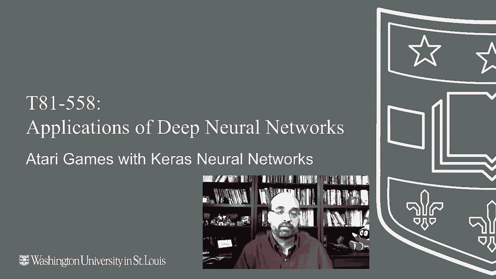
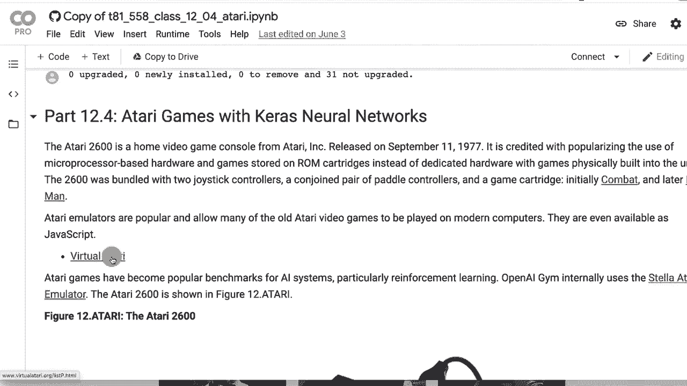
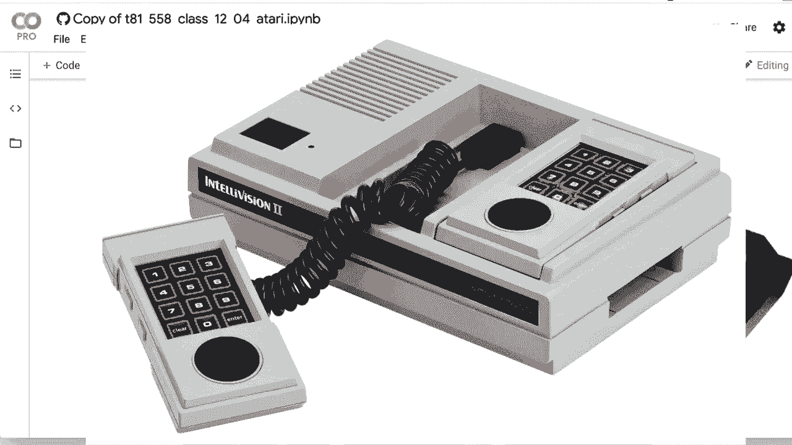
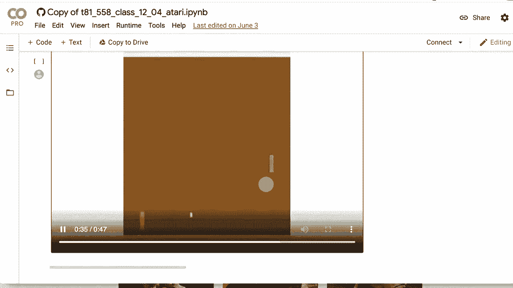

# 【双语字幕+资料下载】T81-558 ｜ 深度神经网络应用-全案例实操系列(2021最新·完整版) - P65：L12.4- 使用Keras TF- Agents的Atari游戏 - ShowMeAI - BV15f4y1w7b8

Hi， this is Jeff Heaton。 Wecome to applications of Deep neural networks with Washington University。 In this video， we're going to continue learning about deep reinforcement learning。 and we're going to see how to apply a Tf agentsbased program to Atari。 We're to look at how to play the pawong game。 However。

 the same technique can be used for just about any Atari game。 And then in the next part。 we're going to look at something that's not a game and see how we can apply deep reinforcement learning to a financial simulation。 to see all my videos about Cale neural networks and other AI topics。 click the subscribe button and the bell next to it and select al to be notified of every new video。

 So let's look at one of the most common uses for things like deep reinforcement learning。 At least the examples that most people get into。 even if they don't get into actually applying this to problems of their own。 And that's Atari games。 Now， in the next module， I'm going to show you how to actually adapt this to a problem of your own design。😊。

And will create something in reinforcement learning that is not open AIG。 But for now。 let's do the obligatory Atari example。 Now I had to build most of this sort of from scratch there is not a lot of TF agent examples of Atari games out there So I worked on this a fair amount to get it working going open this in Google coab because I would like to use a GPU so be deadly。

 deadly slow if you don't use a GPU Now what I'm going to suggest is go ahead and do a run all because there's a lot of code in here and you'll run into an error。 hopefully they fix this by the time you're watching this video but at the time you would get an error basically as you you would run through this part here where you install all of the necessary software and I'll update this as things change because things constantly change with machine learning and then as soon as you went down to here and tried to do all。

These imports， you would get an error if you're getting an error in this import block， do a runtime。 restart and then run all again。 Reing the runtime does not erase the installation that happened up here。 Basically the reason you get that error is because once you P installed TF agents。 it updates the version of protocol buffer that is installed on your computer and Tensorflow itself needs a restart of the Python environment or it's gonna to give you an error at that point。

 Hopefully as time progresses Google coab。 I'm really hoping they will install Tf agents just out of the box。 I assume they will。 it's a Google product。 It's just a new product relatively new。 So let's talk about how we will do this。 We're gonna still use a Dqn a deep Q learning network。 This is all based on virtual Atari， which is a completely unrelated project a machine learning。

 It was just a emulator so that you could play old Atari 2600。

Gams now I am somewhat old， but this is before really even my time。 There are 2600s。 This is called the Atari 2600 out there when I was pretty young。 but this was kind of the older game system out there。 I did play PAman on this back in the day。 which which was kind of fun。 I was more into a system that came out around this time called in television a little bit later than the Atari 2600。

 and then of course， my absolute true love the Commodore 64。 So this is the specs for an Atari 2600。 It's not an advanced machine by any stretch。 Your play field resolution is 40 by 192 pixels。 Now they do some creative coding to sort of stretch that out。 but you're able to basically just feed that right into convolution neural network。 Also。

 the amount of memory in an Atari is not huge。 So it's measured in killbyte。

It's not not megabytes， actually I think it's less than a kilobyte so you can push the active memory that the games are running on into the well the video you would push into a convolution neural network the 160 by 192 that's the resolution I think you're normally dealing with but you can actually look at the instate memory of the game and use that for the state space and there's a lot of information in there and that can be used the agent can learn to cheat too because some of the memory might be being utilized for the opponent play so the computer controlled the NPCs in the game So we do all the imports hyperparameters i tuned this a lot to get it to work for pong also did some with breakout and space invadersve got you've got to play with these values and get them working for whatever game you're going to do the number of iterations that。

Is doing nearly a quarter of a million of them here。 So that is I typically ran this thing all night。 It takes a while to train， even with a GPU。 And I'm also doing 10 collection steps per iteration。 replay buffer size， that didn't make too much of a difference， but this learning rate。 this 10 value here and the number of iterations。 Those are the guys that I was really tuning to try to get better results。

 I did not mess with the shape of the neural network that could also help you as well。 The stuff does take a lot of time and not just your time compute time to try out your different hyperparameter tunings。 So for an Atari environment， we're using pong， you can see some of the other games I was playing with here as well。 Pong's relatively simple。 It is basically two paddles bouncing a ball between themselves。

 Now pong was before my time。 I never really got into pong whatsoever。 That would probably be I mean。 that would be the 1970s。A little before I got into into video games mid80s is kind of when I got into a lot of this stuff。 So the frame skip rate， you're not going to look at every single frame that is coming through in the Atari This is just things to make the computation time reasonable if you are processing every single frame that's going it's going take a lot of processing time there is a wrappper that TF agents gives you to load the Atari games I definitely recommend you do this because it builds in some of the preprocessing that is necessary or not necessary。

 but it really helps your neural network be able to learn quickly because the idea is I mean look at is the color information really telling you all that much and this is the little panel that's going to go up and down the computer the NPC the computer control player by the way。

 NPC is non-player character I guess I get that from the MMOGs theOOGs this is the opponent score。This is your score and technically the neural network is looking at everything。 I don't know that it's getting a whole lot from the scores。 but that is potentially something that it uses as well。 maybe tries harder when it sees it losing。

 I don't know I'm kidding it probably doesn't it probably learns that those scores are pretty pretty unimportant So we load the Atari environment we are using a separate one for training and evaluation just so that if you run an avval step in there that you're not changing the state of the training which could be confusing that would be。

Oh， that would be like having an an alcohol blackout almost。 you time would skip forward。 but you would not know what happened。 Probably a bad example of what's going on there。 But it works for me as a visual。Now， the agent， this I got from TF agent's example。 This is just a wrapper around the normal agent。 You can see that we're dividing each of the state values。

 but by 255。 What you're doing there。 Basically is converting that 0 to 255 RGB values into a floating point value between 0 and 1。 and the neural network deals with that a little bit better。 Most of the examples have done that。 I usually do that when I'm dealing with image data。 don't feed 0 to 255 into a convolution neural network。

 It can deal with it okay but it really likes those smaller values better。 This information here is important。 these are actually hyperparameter。 I did not try tuning these too much。 I just took example values。 but here these are the fully connected layers。 So these are the dense layers。

 Most convolution neural networks have dense layers at the very， very end。 So we have just a single layer of 512。 You could add multiple。Ones there， if you want。 And then the convolution layers。 This is the channel count 32。 scanning an8 by8 with a stride of4。 That's basic convolution information。 And then several of these。

 It don't really provide a way to put a max pooling layer in there at least that I've seen but this has worked relatively well。 I did not try tuning this to too much。 or at all， really。 then you build up the Atari Q network that we had up there。 So this is the wrapper for the neural network。 I have more text that describes kind of what I did because this this example I did literally literally build from scratch except for that Q network wrapper that I found We're gonna use an RMS prop optimizer。

 the learning rate and other things here are very important。 Those are hyperparameters that you'll want to tune。 we use a global steps so that we have the counter for how far we've gone with training。 And here is where we create the DQ N agent。 DQ N is good when you have。

actionction space or discrete action space where it has individual values and not some continuous range of numbers In the next part。 the next video， we will see how to deal with a continuous range action space。 You use a close a close relative to the DQN neural network I use the same evaluation that I got from TF agents。 this is a method that I copied a function that I copied basically what it's doing is 10 evaluation steps and it calculates the average reward over 10 steps。

 Atari games are stochastic。 They have random numbers。 The same strategy won't necessarily work for two games in a row。 but they figure if you played it over 10 games's that's gonna be reasonable replayplay buffer we're using pretty much the same type of replay buffer that I've used in the other Tensorflow T agent examples There's nothing too crazy that you need to do here for Atari I use exactly the same random collection code that I've used in a couple。

Of examples so far。 and this is code that I got from the TF agents examples works quite well for that。 This is exactly the same training。 the agent code that I used in previous examples。 Nothing needs to really change here。 It's pretty boiler plate。 some initial setup。 and then we're going to loop through the number of iterations and we're going to see this is where that steps for iteration。

 So setting this to 10。 each iteration。 we're going to collect 10 steps and use that to train the neural network to build to the data that we randomly sample from that we're training the data。 the data collection Here you can see it is it is working very hard training Now negative 20 negative 21。

 I think it actually is is the worst you can possibly do if you're just if you're doing bad at pong everything you're not hitting anything you're shooting like stormtroopers。 you're sending you're not hit you're not sending it through the other guy he's sending it right back to you。

So I was very depressed with that when I was learning and working through this no matter what I would try。 I would get like negative 21 straight down， down down。 It'd be four hours later， negative 21。 but as I started to adjust things。 I was able to get this to improve considerably and you can see this is a decent training run。 I'm fairly happy with it。 It got above zero you can do much better than this。

 This is a pretty average run that I have here。 and I'll show you what what mine looks like。 it does score points， it does much better than the random agent。 but you could definitely refine this if you wanted to spend a lot of time optimizing those hyperparameter and throwing compute at it visualization。 you can see pretty good progression upward probably more iterations would help me and then you can see the video here I'm let it play It's good but not great Oh I scored scored one。

 score2 I'm ahead even I'm behind So it's playing accept well。 I never really got too much into pong to play this on my own so I don't know how。How good I would particularly be doing here， but it's， it's definitely losing overall。 But if you try the random agent， oh， it's， it's catching up， this is awesome Am I am my head， Yes。

 so this is。It's it's definitely got some skill。 It has definitely learned some things from from this game and is。 is now ahead。 So I'm not going look at the whole three minutes that I captured。 Who knows。 Maybe it maybe it really， really gets better。 but let's look at the random agent And you'll see that the reinforcement learning that I took some time optimizing really does make it different。 I mean， it's getting killed。 It scored one。 I mean， a broke clock is right twice a day， right。

 So that's that's it playing，s， it doesn't take nearly as many minutes。 that's a good example right there。 Like how， how long does it stay playing before you hit end of game。 I mean， like when I， when I would go to arcades back in the 80s。 How long would my $2 worth of quarters last that my mom had given me in in my case。

 usually about5 minutes， I was not that good at video games ever。 really like centipede。 That was probably my favorite Dragon's layer was probably the worse。 You had to spend， I think。 an entire dollar and I would get killed in like a minute。

Thank you for watching my video and in the next one we're going to look at how to do the same sort of thing only with a financial simulation。If you find this kind of thing interesting， please subscribe to my channel。 Thank you very much。