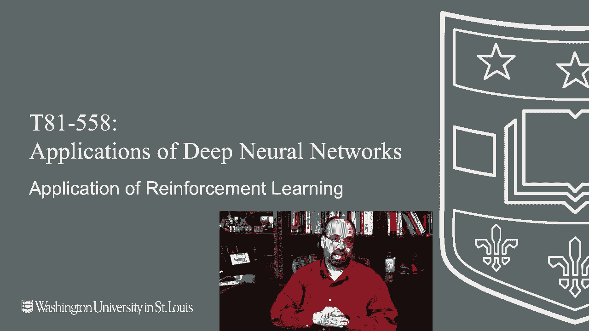
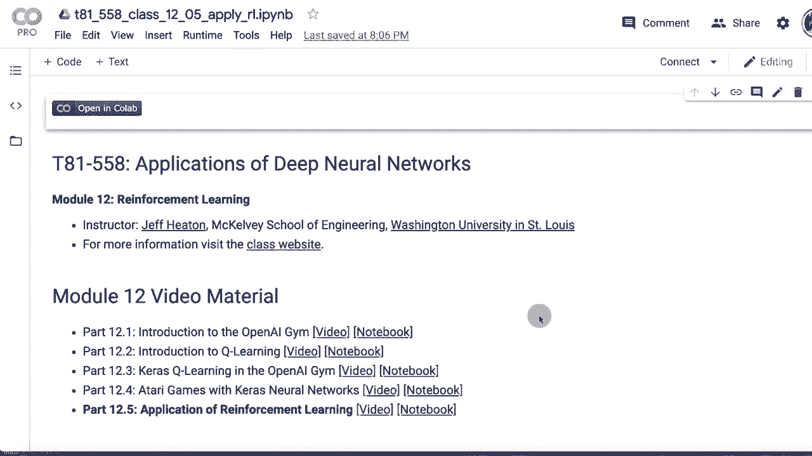
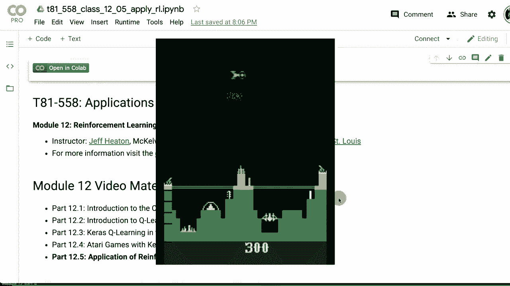
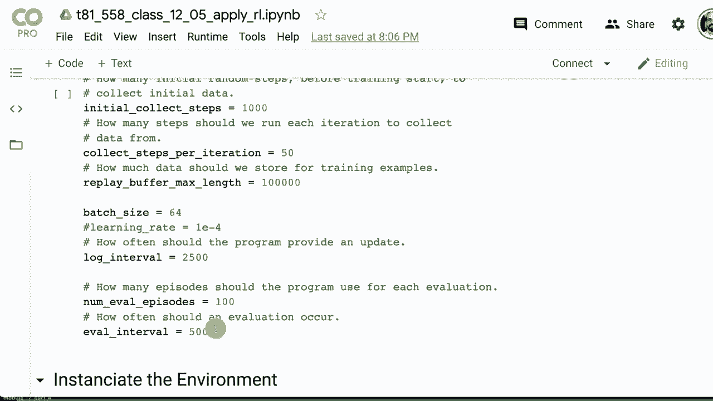
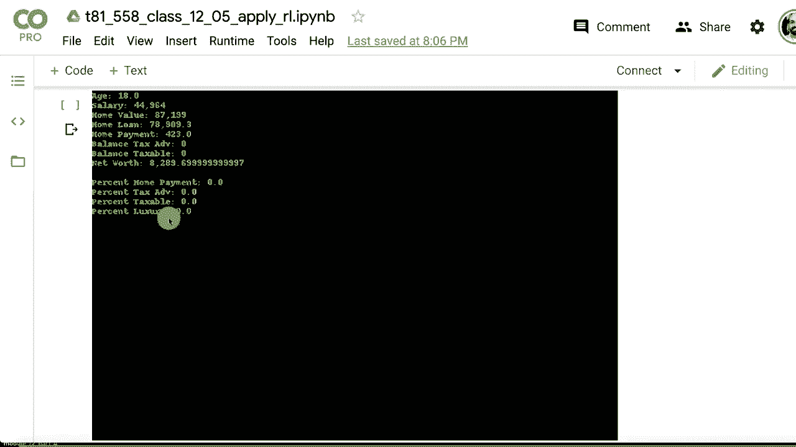
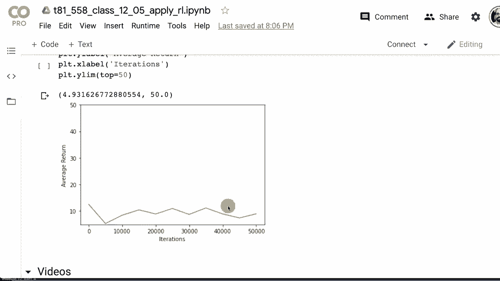
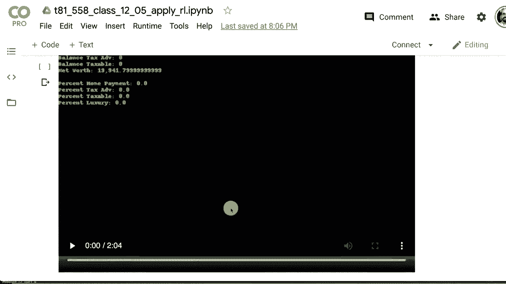
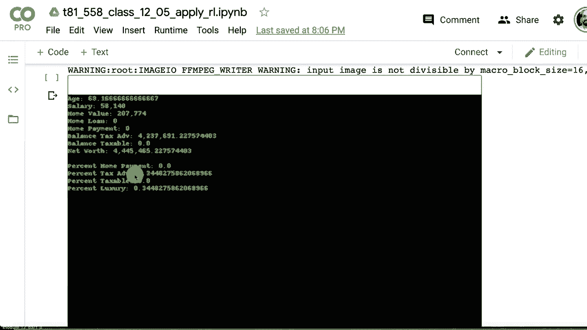

# 【双语字幕+资料下载】T81-558 ｜ 深度神经网络应用-全案例实操系列(2021最新·完整版) - P66：L12.5- 非游戏TF-Agent的强化学习 - ShowMeAI - BV15f4y1w7b8

嗨，我是Jeffine，欢迎来到华盛顿大学的深度神经网络应用课程。所以强化学习，你见过的大多数演示可能让你玩某种Atari游戏，或者把山地车开上山，或者平衡一个杆子之类的有趣事情。

我没有看到很多实例来说明如何将这一点实际应用于不是Atari游戏或者某种物理模拟的东西。在这个视频中，我将向你展示如何使用TF agents将强化学习应用于你自己设计的问题。

现在，强化学习超出了正常分类和回归的范围。实际上，这是一种你不断对某种环境执行动作并获取反馈的过程。我将在本节中展示的例子是如何创建一种金融模拟。我们将关注净财富的积累和个人理财。

这实际上是一个相当简单的金融模拟。这并不是为了指导你在现实生活中如何进行任何形式的真实投资，但它展示了如何将一些不是视频游戏的东西放入可以被解决和处理的上下文中。强化学习，你可以设计一个代理，真正学会如何做到这一点，看看我所有关于Cale的视频。

对于神经网络和其他人工智能主题，请点击订阅按钮及旁边的铃铛，并选择全部以便接收每个新视频的通知。那么现在，让我们尝试将强化学习应用于一些不仅仅是在OpenAI gym或Atari游戏中的东西。

我将从零开始创建这个问题。现在这并不是我将要应用的最深奥的问题。这个演示的真正目的是向你展示如何创建自己的环境，并将深度强化学习应用于其中。我们还将查看连续动作空间，并了解如何处理一个或多个数值动作。

像是你想把油门踏板踩多深，比如在车里，或者刹车要用多大的力，因为你可以同时进行这两项。对于我将要整合的这个例子，它将是一个个人理财的金融示例。😊

让代理成为一个试图投资和为退休储蓄的人，这将是一个相当简化的例子，他们可以选择把钱放入一个像美国IRA这样的税延账户，或者选择一个应税账户，并且有一定的限制，你只能在那个税延账户中放入这么多钱。你也可以选择，你是想为你的房子付款，还是想提前还清抵押贷款。

所有这些事情都是一步一步的动作，实际上对强化学习非常有利。如果我只是想让计算机查看一份股票列表并给出最佳投资分配，那更像是传统的神经网络。因此，我们将完全创建一个自己的环境。这是在TF Agents中的一个面向对象的类，以下是规则：你必须确保完成这些事情，否则将无法使用你的新类。它必须是Jim环境的子类，然后你必须。

实现一个种子函数，使你的环境能够被设定。如果你给它一个常量种子，那么你应该得到恒定的结果。你需要实现一个重置函数，基本上是重新启动你的环境，这通常是强化学习算法执行的操作。

它总是回到起点并重置，从头开始。这并不是特别关键，但你需要实现一个渲染函数。这绘制了模拟的一个帧。现在我们在这里做的是财务模拟，我保持得相当简单。我们只是向一个窗口输出文本。类似的步骤是一个函数，它会带你经历每一步，你对该步骤应用一个动作，然后你会看到环境的变化，我们稍后会讨论环境是什么。

你还需要注册你的环境，我们也可以看到用于此的代码。这样TF Agents才能在你想要启动时找到你的环境。因此，这里是将要生成的模拟。现在这是一个非常简单的模拟。

这只是为了向你展示如何让自己的环境启动和运行。我曾想简单地创建一个迷你视频游戏或类似的东西，但我可能会把这个留到未来的示例中。不过，已经有足够多的例子来做到这一点。我想要一些我们在进行财务模拟的东西，做个人理财有点像老迈尔顿·布拉德利的《人生游戏》，而且不要与康威的《生命游戏》混淆，那是另外一回事。

所以你的起始薪资在4万到6万美元之间，你有一个开始时的房贷，所以你必须买房，我把它简化为是1.5到4倍的起始薪资，所以也许你非常保守，或者有点疯狂，这里是看这个人可能负担得起多少房子，他们需要根据在房地产购买上花费的疯狂程度调整策略。房贷始终是一个30年固定利率的摊还贷款，固定的月供。

如果你不按时付款，坏事就会开始发生。支付高于房屋月供的金额会更快地偿还贷款，低于月供的支付会导致错过付款。当你达到某个付款次数时，我记得我设置在15次左右，他们会收走你的房子。你不会失去价值，但他们会在拍卖中出售，你会损失。

我认为你的一半资产可以分配在奢侈消费之间，而在这个游戏中这对你没有任何帮助，房屋支付无论高于还是低于支付金额，以及一个应税和一个税收优惠的储蓄账户。如果你在奢侈品上花费更多或更快乐，并因此活得更久，因此你有更长的时间投资，我不知道。可能这是一个有趣的转折，我可能会将这个生命游戏再深入一点，并在课程之外做一个单独的视频，看看一个相当复杂的金融模拟。因此，状态由以下值组成。

这是程序在查看以确定它应该做什么。人的年龄（月数），薪水。现在薪水相对于通货膨胀缓慢增长，没有晋升机会或其他类似的东西。所以这是一个相当简单的模拟。房屋价值，这将相对于通货膨胀增加。这是所需的房屋支付。

这基本上会保持不变，唯一会改变的情况是当你还清房贷时，它会变为零。这是税收优惠的账户余额，这类似于美国的个人退休账户（IRA），然后是应税账户，这类似于标准的货币市场储蓄账户。

它确实给你一些收益，实际上比货币市场的收益要好。因此这假设你可能将其投资于一个独立的经纪账户，自我管理的经纪账户，至少在美国他们称之为这样。然后是行动。因此，行动是浮动的，因为我们在做一个连续的行动空间。不像之前。

代理在这四个中输入一个数字。然后我对它们进行归一化，使它们的总和为1，以便得到百分比。所以如果你在所有这些上输入11,111，它将归一化为每个25%。所以这只是让你选择希望将工资的百分比分配给房贷、税收优惠储蓄账户、正常应税储蓄账户和奢侈品。现在这并不保证你能将所有这些百分比投入，因为这里有各种事情发生。

你的工资确实需要缴税。所以这会减少你可能仍在分配用于房贷的工资总额。但你可能已经还清了房子。因此，你在这里投入的任何价值基本上都会被忽略。它只会变成0。你可能在把工资投入应税账户或储蓄账户之前就已经用完了工资。此外，你只能在税收优惠账户中投入有限的金额。

至少在美国，这对IRA来说是一个难题。每年你可以投入的金额是有限的。每年你可以投入到401(k)的金额也是有限的，所有这些都有各种影响，我也尽量把一些放进去。

我为税收优惠账户设定的限额类似于401(k)。所以这里是程序，或者说是类。这是一个面向对象的类。它继承自gym环境元数据，你必须为显示呈现它，我几乎遵循了gym中大多数类的做法，每秒一个视频帧，绝对不是高端视频游戏，按任何标准来说，它将以RGB形式显示。

我们的状态元素数量是7，前七个是这些，几个是我添加到输出中的计算值，仅用于调试目的。你会发现，当你创建一个复杂环境时，会花很多时间调试环境，而不是直接连接到TensorFlow代理。所以这里是这些位置。

因此，状态本质上是一个向量。向量中的第一个元素是年龄，接下来是工资，依此类推。这也是我放入的另一个常数，以便于归一化。我将所有美元金额归一化为百万，尽管工资远远小于这个，它仍然是百万的一小部分。

这有助于保持这些数字不会大于神经网络可能想要处理的数字。这些是我为通货膨胀、利率、税率设定的值。其中一些是归一化的，或者说是除以12，因为它们是月度值。这是支出。你没有选择，你必须支付支出，那是你的食物、衣物。

水、电、网络连接和所有关键费用。然后是你的薪资范围的低值和高值，起始年龄和退休年龄，或者说是你去世的年龄。这是构造函数，我设置了verbo模式，默认的fall设置将ver most模式设为true，这只是导致我的程序打印出一些日志信息，以便你可以帮助调试。我定义了动作空间。

动作空间在0和1之间。重要的是你要定义这个空间，以便强化学习算法能够理解这些范围，并可以分配随机数和其他内容。这就是观察空间。我在这里设置了低值和高值。它可能会超过200万，可能会限制在那儿，最好将其设置为4、10或类似的值，但无论如何，这就是范围。

我们继续进行种子和重置，我设置了日志为空，日志是我自己的东西，基本上就是给我提供一些信息，以便我可以稍后将其转换为pandas数据框，从而进行调试，确保模拟在按我想要的方式运行。这是我编写的一个方便的函数，它计算个人的净资产，查看房屋价值。

仍然欠在房屋上的本金，所以你从房屋的价值中减去你所欠的金额，这样就得到净资产的一个组成部分，然后我们也加上税收优惠账户和应税账户的价值。我在这里做得很简单，主要是在账户里节省税收，而不是在取出时。

不像美国的RothRA。这是我们评估动作的地方。所以记得我说过，这四个返回的动作值只是数字。我不能强迫它们都必须总和为1.0（100%）。所以我在这里要做的是应用一些这个，我会查看家庭支付，如果接近0，我将进行计算，这就是总额，他们在这些所有请求了一个数字。

我需要将这些数字转换为百分比。所以我将它们相加，然后将每个值除以这个总金额。现在我不想导致除以零的情况。如果总金额降到或接近0，我就将这些全部返回为0。

这算是一种错误情况，但在评估不良策略时确实会发生。所以我们必须迅速将这些全部设为0，否则我们就将它们全部除以，这就是我们如何将其标准化为总和为1.0，然后返回这四个值。这些是真实的百分比，在我们将这些较大的数字转换为百分比后，TF代理给出的结果。

这是步骤函数。基本上，它执行模拟，所以我们有了行动。我们将使用传入的行动值，并将其传递给我们刚才看到的评估行动函数。我们还会分开状态向量中的值，这样我就不需要不断查找哈希映射，这会很烦人，因此我们首先处理支出。那是你必须支付的某个百分比，像互联网连接这样的必需品。

至少对我来说是这样。不过，食物、水等这些东西。我们首先处理税收优惠存款账户。我们首先处理这个账户，因为你在一年内对存款金额有限制。如果你开始超出这个限额，那么你就会被减少，直到不能再存。这就像401计划。

有公司配对。我们计算个人欠缴的税款，扣除住房付款。因为我们使用了摊销，所以这有点复杂。因此，我放入了摊销公式，使得你基本上拥有持续减少的利息支付和持续增加的本金支付金额。如果你有逾期付款，你就麻烦了，我们会将其统计起来。

如果逾期付款超过15次，他们将会止赎你，止赎基本上是他们把你的房子卖掉。你将损失20000元的费用，这只是为了卖掉房子所造成的麻烦，因此你将损失相当可观的金额。你不希望这样发生。否则，如果只是正常的逾期付款，你将根据付款金额收取10%的滞纳金。

不要基于本金价值收取10%的滞纳金，否则那将是可怕的。然后我们更新房屋价值以反映付款情况。我们将存款放入应税账户，并确保计算投资回报。投资回报大致相似，我们会随机稍微调整一下。

就像我们随机调整通货膨胀金额一样，这在游戏中增加了一些随机性。这使得游戏更具挑战性，但强化学习在处理随机数字方面非常擅长。我们处理年度事件，因此每当我们到达第12个月时就会发生每月事件。没什么特别的。我们只是让代理人老去一年。是时候退休了。我的意思是，他们在80岁时退休。

我想我可能应该说这更像是他们去世时的情况，我让每个人在同样的时间点退出。 但同时这个人工作到80岁，所以这又是一个简化的模拟器，然后我们归一化并结束。 所以在这个状态中，我将每个状态值除以百万的倍数，这样就会得到更小的值，并且这使得神经网络处理起来更容易。通常你不想把大额百万美元的数字丢进神经网络，这样效果不好。我们进行年度计算时，基本上是在计算投资回报率或通货膨胀率，我们在其中添加一些随机性，给他们薪水增加，按照通货膨胀的规定增加房屋价值，等等。这个是重置的，重新开始，可以说我们将计数器重置为0，所有这些值重置为0，以便从头开始。

我们在这些范围之间生成随机薪水。 我们计算这个随机房屋的倍数，介于1.5和4之间。 我们计算抵押贷款金额，以便知道本金的数量，那个著名的摊销公式，然后我们把这些都设置到状态中。 渲染相当简单。 Rler使用Pillow，所以基本上是返回一张图像，将所有这些值以绿色字体在黑色背景上显示出来。

我们稍后会看看那是什么样子，并打印出来。 到那时，你就有了一个环境。 现在你需要注册你的环境，以便能看到它，我把这个称为简单的生命游戏，而不是康威的生命游戏，我有点想起老牌桌游《生命》。

好的，让我们测试环境，确保它能正常工作。 我实例化并创建它，就像这样，我做一个重置，这里我只是玩生命游戏，用固定的值。 所以在这里，我基本上是在偿还房屋贷款并投资到税收优势账户，这实际上是一个非常好的策略，我没有做到这一点。

模拟器没有复杂到足以让深度强化学习学习大量内容。 但光是这点就表现得相当不错。 你可以看到到最后它生成了约800万美元的净资产，所以这很好。 另外，请记住这不是通货膨胀调整后的数值，因此在80年后这可能就没那么好。 我稍微调整了一下超参数，以使其学习相对较好。

你确实可以在这里做更多的工作。 我改变的主要内容是我们进行50000次迭代，并且在每次迭代中进行50次收集步骤。 所以这实际上运行了多少集，以便每次都有足够的数据来处理。批量大小为64。我们每2500次记录一次，每5000次评估一次。

如果我们只想渲染环境以便看到它，这就是我们环境的样子。这看起来是这样的。稍后我们会观看视频，看到这个人老到80岁时的状态，以及他们在做什么。我们创建了两个环境，以便同时评估和训练它。

互相踩踏。现在我们不再使用DQN。之前我们使用了深度Q学习网络，深度QN的问题在于它只支持离散动作空间。所以想象一下一个操纵杆，控制上下左右。

不是你施加的压力有多大，我们有这四个账户，我希望能够给这四个退休账户提供不同的金额。因此，我们需要使用一种新的基于神经网络的强化学习类型，称为DtPg算法。

深度确定性策略梯度算法，我不会深入讲解这个算法的工作原理，如果你想阅读原始论文，可以在这里找到。我自己还没有实现过这些，但它们在连续动作空间的强化学习中效果很好。这就是它的结构，你的环境是。

让你恢复你的状态，即X。那个状态进入评论者和行动者。所以这里有两个神经网络在发挥作用。这有点像对抗生成网络，基本上有一个神经网络生成图像，第二个则是在判断那些图像是否真实。这是相似的。

你有两个对抗性神经网络，行动者和彼此的真正对抗者。实际上，行动者在这种情况下返回浮点数，这些就是你将得到的动作。

像之前的深度Q网络之所以无法处理连续值，是因为你需要一个漂亮的表格，在每个动作中都有一个潜在的值。我们现在做的是输入当前状态，行动者返回想要采取的动作步骤，以及评论者。

评估行动者在选择连续值时的表现。因此，你选择这四个连续值，而不是选择哪个账户。你选择的是这四个连续值。这些连续值如何最大化最终奖励，这基本上就是行动者-评论者强化神经网络的工作原理。时序差分误差也很重要。这是时间差分误差，它只是看行动者对未来奖励的估计与环境实际给予的未来奖励之间的差异。

这就是目标函数试图最小化的内容。这两个神经网络的超参数，我们创建这两个神经网络，然后我们先创建演员，然后创建评论员，再将这两者结合成DDPG代理，初始化它，我们基本上就准备好了。

我们将使用之前例子中使用的相同指标。在这里，我们取一定数量的回合，并查看这些回合的平均回报。我们进行初步数据收集，就像之前的例子一样。我们必须通过模拟器运行几次。

在这种情况下，进行一千次，并根据这些动作和实际奖励获取一些样本环境变化。这就是我们将开始训练神经网络的内容。而且，这段代码与我在之前强化学习示例中展示的相同。这一例子的主要点是如何创建你自己的环境。

现在我们将再次训练代理，这与之前的代码相同。顺便提一下，这段代码的变化非常小，以至于你实际上可以替换掉我的简单生命游戏，放入山地车连续环境，这是他们在健身房里的一个连续环境，它也能正常工作。它会训练连续山地车。

所以回到这里，我们在训练代理。它完成了所有请求的迭代。😊。收集请求的数据量，这是输出。如果你想逐行查看我的TensorFlow代理学习的以前例子，它会准确地告诉你这是如何工作的，但这只是一个循环，遍历并打印出结果，因为它在训练，这个过程最多达到50000步，结果的可视化看起来像这样。所以它学习得非常快，然后达到一个平台，这对它来说不是一个很难的优化问题。如果我们播放这些视频中的一个，你基本上会看到它在计数21122，并且你可以看到它学会了应用。

这个代理实际上很无聊，它只是在房子被没收后放弃，然后就去投资于税收优惠储蓄。它没有弄明白这一点的限制，可能应该把剩余部分放在应税账户里，随着你重新训练它。

它学习。

不同的方法，所以我运行了几次。有一些更智能的代理在训练，这个还可以。我是说它在增加净资产，但你可能会因为出售而降到零。我确实用租金或者其他方式击中了它，但无论如何，它在创造你的。

