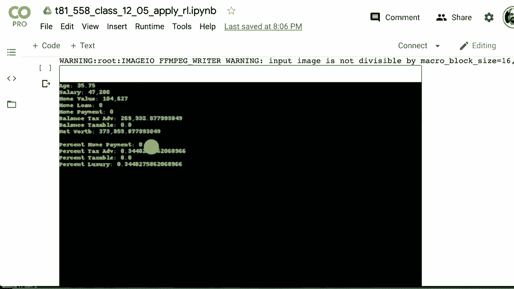

# 【双语字幕+资料下载】T81-558 ｜ 深度神经网络应用-全案例实操系列(2021最新·完整版) - P66：L12.5- 非游戏TF-Agent的强化学习 - ShowMeAI - BV15f4y1w7b8

Hi， this is Jeffine and welcome to App of Deep neural Networks with Washington University。

So reinforcement learning， most demos that you've seen of this probably lets you play some sort of Atari game or run a mountain car up a hill or balance a pole or something fun like that。

What I haven't seen a lot of examples of is how to actually apply this to something that is not an Atari game or is not some sort of physics simulation。

What I'm going to show you in this video is how to actually apply reinforcement learning using TF agents to a problem of your own design。

 Now， reinforcement learning is outside of the area of normal classification and regression。

 really it's something where you're constantly performing actions on an environment of some sort and receiving feedback for this。

The example that I'm going to show in this section is how to create sort of a financial simulation。

 We're going to look at net wealth building and sort of personal finance。

 This is really a pretty simple financial simulation。

 This is not meant to guide you and real life or how to do any sort of real financial investing。

 but it shows you how to actually put something that is not a video game into the context that it can be solved and worked with with。

Reinforcement learning， and you can design an agent that can actually learn how to do this to see all my videos about Cale。

 neural networks and other AI topics， click the subscribe button and the bell next to it and select all to be notified of every new video So now let's try to apply reinforcement learning to something that is not just in the open AI gym or an Atari game or something like that。

 I'm going to create this problem literally from scratch。

 Now it's not going to be the most profound problem that I'm going to apply this to。

 It's really the idea of this demonstration is to show you how you can create your own environment and apply deep reinforcement learning to it。

 We're going to also look at the continuous action space and see how you can deal with having one or more actions that is a number。

 like how how far do you want to press down the accelerator pedal。

 say in a car or how hard to apply the brakes， because you can do both of those at the same time。

 For this example that I'm going to put together。 It's going to be a finance kind of personal finance example where you are。

😊。

Letttting the agent be a person that is trying to invest and save for retirement it'll be a pretty simplified example where they can choose between putting their money in a tax deferred account like a United States IRA or they could choose a taxable account and there's limits you can only put so much in that tax deferred account you can also choose do you want to pay for your house you want to pay the mortgage off early。

 all these kind of things So these are kind of step by step by step actions that are really conducive to reinforcement learning if I just wanted to the computer to look at a list of stocks and give me the best allocation for investing that would be more like a traditional neural network so we're gonna create an environment entirely of our own This is a class in TF agents an objectoriented class here are the rules you've got to make sure that you accomplish these things or you won't be able to use your new class It has to be a child of Jim environment then you've got to。

Iplement a seed function that allows your environment to be seeed。 if you give it a constant seed。

 then you should get constant results。 You need to implement a reset function that basically starts your environment over again is this is done often by the reinforcement learning algorithms。

 It's always turning back the clock and hitting reset and starting from the beginning This is not as critical。

 but you need to implement a render function。 This draws one frame of your simulation。

 Now we're doing a finance simulation here。 and I kept it pretty simple。

 We're just outputting text to a window。 same sort of thing step is a function that will take you through each step in the you apply an action to that step and then you see how the environment changes and we'll get to what the environment is in a moment。

 you also need to register your environment and we see the code to do this as well That's so that Tf agents can actually find your environment when when you want to spin it up。

 So here's the simulation that。Going to produce Now this is a very simple simulation。

 This is just to show you how to get your own environment up and running。

 I was tempted to just create my own mini video game or something like that。

 but I might save that for a future example。 but there's already enough examples of doing this I want something where we're playing a financial simulation doing personal finances is like the old Milton Bradley game of life a bit not to be confused with Conway's game of life which which is something else。

 So you have a random starting salary between 40k and 60k dollars you have a home loan that starts out so you have to buy a home's I'm keeping it simple that is 1。

5 times and four times you're starting salary so maybe you are very conservative or maybe kind of went nuts so this is looking at how much how much house this person can potentially afford and they'll need to adjust their strategy depending on how crazy they went on real estate purchases The home loan is always an amortized 30 year fixed loan with a fixed monthly payment。

If you don't make that payment， bad things will start to happen to you Pay higher than the homes monthly payment pays down the loan quicker Pay below the monthly price results in missed payments When you reach a certain number of payments。

 I think I set it around 15。 they take your house away You don't lose the value but they sell it at auction and you lose。

 I think half of your equity。 you can allocate income between luxury purchases。

 which in this game does absolutely nothing for you home payments either above or below the payment amount as well as a taxable and a tax advantage savings account。

 It might have been really interesting that if you spent more on luxury or are happier and you lived longer therefore you got longer to invest I don't know。

 might have been an interesting twist on this I'll probably take this game of life thing a bit further and do a separate video on it outside of the course where we look at a fairly complicated financial simulation So the state the state is composed of the following values。

 This is what the program is looking at to determine what it should do。

The age of the person in months， the salary Now the salary goes up slowly relative to inflation。

 no chances for promotions or anything like that。 So it's pretty simple simulation。 the home value。

 This will increase relative to inflation。 This is the required home payment。

 This will stay the same mostly the only time this will change is when you pay off your home then it goes to zero。

 This is the account balance for the tax advantage。 This is similar to a United States IRA account。

 individual retirement account。 and then the taxable account。

 This is similar to just a standard money market savings account。

 It does pay you some actually pays you pretty good interest compared to what a money market would do。

 So this assumes you probably have this invested in a independent brokerage account。

 selflf-directed brokerage account。 least that's what they call them in in the US。 then the action。

 So the action is floating point because we're doing a continuous action space。 Unlike previously。

 The agent puts a number into each of these four。 And then I normalize them so that they some。

To to one to get percents。 So if you put 11，111 on all of these。

 that would normalize out to 25% into each。 So this is just letting you pick your percents that you want to devote of your salary to the home loan to the savings tax advantage account to the normal taxable savings account into luxuries。

 Now this doesn't guarantee that you'll get all of these percents in there because there's various things going on here。

 you do have to pay tax on your salary。 So thatll decrease the salary sum you might still be allocating money towards your home loan。

 but you might have paid your house off。 So any value that you put in here is basically ignored。

 It's just going to go to0。 You might have run out of of salary before you can even put it into the taxable account or the savings account。

 Also， you can only put so much in the tax advantage account。

 at least in the United States that's sort of on the trick with IRAs。

 There's a limit to how much you can put in there per year。

 There's a limit to how much you can put into your 401 any year， all these all these。

Of ramifications and I try to put some of those in there as well。

 The limit that I actually put in for the tax advantage account is similar to4 and K。

 So here is the program。 or at least the class。 This is a object oriented class。

 It inherits from gym environment metadata you must just present that for display I went with pretty much what most of the classes in gym go with one video frame per second Def not a highend video game there by any stretch and it's going to display in RGb form。

 The number of state elements that we have are 7 and it's the first seven of these a few of these are calculated values that I do add to the output just for debugging purposes。

 you'll find that when you create a complex environment you'll spend a lot of time just debugging the environment before you even get around to hooking it up to Tf agents So here are the positions。

 So the state is essentially a vector。 The first element in the vector is age than salary and so on and so forth。

 This is also another constant I put in there for a million' see that。That for normalization。

 I normalize all the dollar amounts to millions， even though salary is much。

 much smaller than that it's still a fractional piece of a million。

 that helps to keep these numbers from bigger than what the neural network would necessarily want to deal with。

 These are the values that I put in for inflation interest tax rate。

 Some of these are normalized to're not normalized but divided by 12 because they're monthly values。

 this is expenses。 you have no choice you have to pay the expenses that's your food clothing。

 water internet connection net， all the criticals。 Then your salary range low and high starting age and retiring age or essentially age that you die at。

 This is the constructor I set verbo mode default fall setting ver most mode to true just causes my program to print out some logging information so that you can help debug it I define the action space。

 The action spaces between  zero and1。 It's important that you define this so that the reinforcement learning algorithm no。

What those ranges are and can assign random numbers and other things as well。

 This is the observation space。 I set the low and high values there。

 It can potentially go higher than2 million it might be clipping it that might be a good idea to put that to maybe4 or10 or something like that but anyway that's the ranges there。

 we go ahead and seed and reset I set the log empty the log is my own thing that is basically just giving me information that I can convert into a pandas data frame later so that I can debug and make sure that the simulation is doing what I actually wanted to do This is a handy function that I wrote the calculates the person's net worth looking at the home value。

 the principal amount still on the still owed on the home so you subtract the amount that you owe on the home from the value of the home and that that gives you that component of the net worth and then we add in the worth also as far as the tax advantage account and taxable again I'm making a very simple here you mainly save the taxes going into the account not so much coming out。

Not like in the USA RothRA。 This is where we evaluate the action。

 So remember I said that these four action values that you get back。 They're just numbers。

 I can't force that they necessarily all sum up to 1。

0 for 100% So what I'm going to do here is apply some of this I'm going to look at the home payment if it's approach 0 I am going to calculate so this is the total this is the total amount so they requested a number on all of these。

 I need to convert those numbers to percent。 so I sum it up and then I'm going to divide each of these by this total account Now I don't want to cause a division by zero。

 So if the total account has fallen below or is approaching0 then I just return these all to 0。

 this is kind of an error situation， but it does happen when bad strategies are evaluated。

 so we have to just quickly set those all to  zero and we're done otherwise we divide them all this is how we normalize it into something that sums up to 1。

0 and then we return these four values and these are。

Real percents After we've converted these larger numbers， the TF agents gives you into percents。

 This is the step function。 What this is doing is basically performing the simulation so we've got the action。

 We're going to use the action values that were passed in and pass it to that evaluate action function that we just saw。

 we're going also break apart the values that are in the state vector so that we have then I don't want to constantly be looking into a hash map that would be annoying so we deal first with expenses。

 that's that certain percent that you have to pay that's necessities like internet connection。

 at least it is to me。 But yeah， food water， those kind of things。

 This deals with first the tax advantage deposit account。

 We deal with that one first because you are limited in how much you can put into that in a given year。

 if you start to exceedcc to that then it just decreases you so that you cannot。 This is like a 401。

 there is a company match。 We calculate how much tax the person owes deduct that the home payment。

Kind of complicated because we are using amortization。

 so I put in the amortization formulas so that you basically got that continuously decreasing interest payment and continuously increasing principal payment amount。

If you had a late payment you're in trouble and we count that up。

 if it gets more than 15 late payments， they will foreclose on you and forecloing。

 basically they just sell your house off。 you lose 20000 in fees that they just charge for the trouble of selling your house and then so you lose a considerable amount。

't you don't really want to go there。 Otherwise， if it's just a normal late payment。

 you're charged a $10% late fee based on the amount of your payment。

 not a 10% late fee based on the principal value or house that'd be horrendous。

 And then we update the house value to reflect the payment。

 we make the deposits into the taxable account and we make sure to credit investment returns。

 the investment returns are pretty similar， we do randomly vary those a bit。

 just like we randomly vary the inflation amount， this just put some randomness into the game。

 which makes it harder but this is also what reinforcement learning is quite good at doing dealing with the random numbers。

 we deal with yearly events So every time we're at month 12 monthly events。Not too much there。

 We're just aging the agent by one。 It's a time to retire。 I mean， they retire at 80。

 I guess I probably should have said that this is more like when they died or something I'm making everybody quit at the same amount。

 but also the person works right up to 80 so again this is a simplified simulator and then we normalize and finish up So for the state I'm dividing each of these state values your accounts by multiples of a million that gets it into much smaller values and it makes it easier for the neural network to deal with usually you don't want to be throwing in large multimillion dollar numbers into a neural network that just doesn't work that well when we perform the yearly we are basically counting the investment rate or the inflation rate we're adding some randomness into that we give them the salary increase we increase the home value by the amount that inflation dictates and so on this is reset it starts it over're reborn so to speak we set the late count to0 all all these values to zero so that we are starting over from。

Geting we generate a random salary based on between those ranges。

 We calculate that random house multiple between 1。5 and 4。

 We calculate the mortgage amount so that we know the amount of the principal and there's that famous amortization formula and then we set this all into the state。

 Render is pretty simple。 Rler is using pill so it's returning an image basically just display all of these values in a green font with a black background。

'll see what that looks like in a moment and print those all out。

 And that's it at that point you have an environment Now you need to register your environment so that you can see it and I call this just simple game of life again not conway's game of life I'm kind of thinking of the old board game life。

 All right so let's test the environment， make sure that it works。

 I instantiate it and create it just like this I do a reset and all I'm doing here is just playing the game of life so to speak with fixed values So one in one I am basically paying off the home loan and investing into the tax advantage account which is actually a very good strategy I didn't quite make this。

Simulator complicated enough that there is a tremendous amount for the deep reinforcement learning to learn。

 but this alone performs quite well。 You can see that it generates a net worth of about $8 million at the end。

 so thats that's good。 Also remember that's not inflation adjusted So over 80 years that might not be quite quite as good。

 hyperpara。 I adjusted these a little bit to make it so that it it learns relatively well。

 You could definitely do some more work here。 The main thing that I change is we do 50000 iterations。

 and we do 50 collection steps on each of those iterations。

 So that's how many episodes are actually run just so that we have enough data each time to work this on。

 batch size is 64。 We log every 2500 and we evaluate every 5000 Now。

 this is what our environment looks like if we want to just render it so that we can see it。

 this is what it looks like。 And later we'll look at the video and we can watch this person age to 80 and see what they're doing。

 We create the two environments so that we can both evaluate this and train it and not。

Step on each other。 Now we are using not a DQN。 We had a deep Q learning network before the problem with a deep QN。

 It's not a major problem， but in this case it is， is that the DQN only supports discrete action space So think of a joy stick forcing it up down left right。

 not how hard you're pressing it we have these four accounts and I would like to be able to give a variable amount into each of these four retirement accounts。

 So to do this we need to use a new type of neural networkbased reinforcement learning called a DtPg algorithm。

 deep deterministic polyc gradients I won't go too deep into how that algorithm actually works if you want to read the original paper on it。

 It's here it's I have not gone through and implemented one of these myself but they do work quite well for continuous action space reinforcement learning This is what the structure of it sort of looks like your environment is。

Giving you back your state， which is X。 that same state goes into the critic and the actor。

 So there's two neural networks at play here。 This is kind of like agan where you have basically one neural network that's generating images a second one that is discriminating telling it if those images are real or not This is similar。

 you've got two adversarial neural networks you've got the actor the really adversarial of each other。

 What it's really doing is the actor is returning in this case for the game of life it would return for floating point numbers and those are the actions that you're going to get。

 The reason a deep Q network like that like we had before could not do continuous values is you need this nice table where you have where you're potentially getting a value for every single one of those actions。

 What we have now is we feed in the current state and the actor return the step that wants it to take the action and the critic。

Evaluates how well the actor did on picking continuous values for the action。

 So you're picking those four continuous values for the accounts。 You're not picking which account。

 you're picking the four continuous values。 How well those continuous values maximized the eventual reward and that's basically how actor critic reinforcement neural network works。

 The TD error is important to。 That's the temporal difference error So that's just looking at how different was the actor's estimation of future reward versus what the environment actually gave it back as the future reward。

 That is what the objective function is trying to minimize These are the hyperparameters for these two neural networks we create those two neural networks and then we create the so we create the actor first。

 and then we create the critic and then we put both of those together into the DDPG agent initialize it and we're basically ready to go。

 We're going to use the same metric that we've used in previous。les I've given you。

 This is where we take a certain number of episodes。

 and we look at the average return over those episodes。 We do our initial data collection。

 just like previous examples。 We've got to run through the simulator a couple of times。 and actually。

 in this case a thousand times and get some sample environment changes based on these actions and actual rewards。

 That's what we will begin to train the neural network on。 And again。

 this is the same code that I showed you in previous examples that we've done a reinforcement learning。

 The main point of this example is how to create your own environment。

 Now we're going train the agent again， this is the same code。 And by the way。

 this code changes really so little that you could actually switch out So up here。

 you could switch out my simple game of life and put in the mountain car continuous which is a continuous environment that they have in the gym。

 and it would work just fine。 It would train the continuous mountain car。

 So back down to here where we're training the agent。 It goes through all the iterations requested。😊。

Coects the requested number of data and this is the output。

 If you want to go through line by line on these my previous examples on Tensorflowlow agents learning is shows you exactly how this works。

 but it's just a loop going through and printing out the results as as it trains and this is going up to 50000 steps the visualization looks like this So it learns it really quite quickly and then reaches a plateau and this is not that hard of an optimization problem for it to learn the videos for this if we play one of these you'll see basically it's counting up their aging 2122 and you can see it learned to apply。

 this is a pretty boring agent actually it just gives up on the house。

s it be confiscated and then it just goes into investing in the tax advantage savings it doesn't quite figure out that there's a limit to that it probably should have put the rest in the tax textable and as you retrain it。

 it learns。

Different approaches so I've run this a couple of times。

 there are smarter agents that trains this one this one's okay。

 I mean it's building up the net worth and you can went to zero because it sold it I do hit them with rent or something like that but anyway is creating your。

