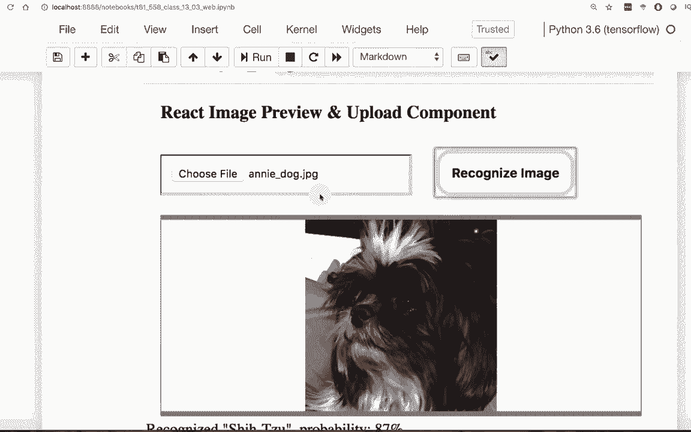
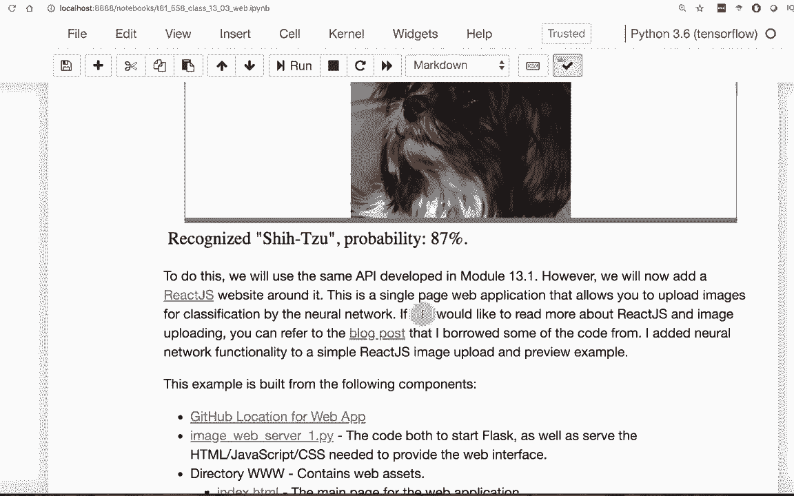
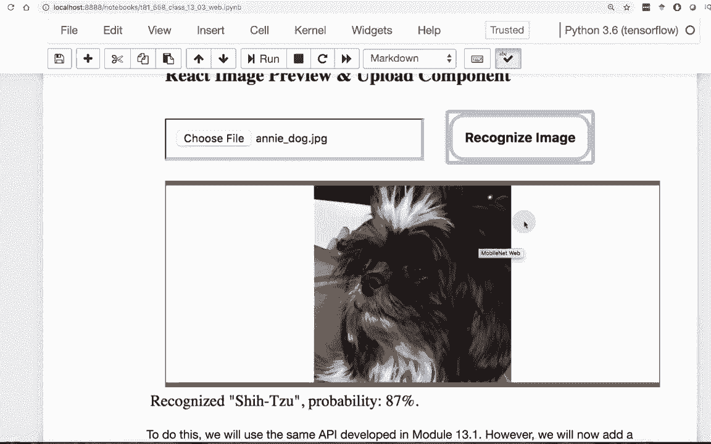
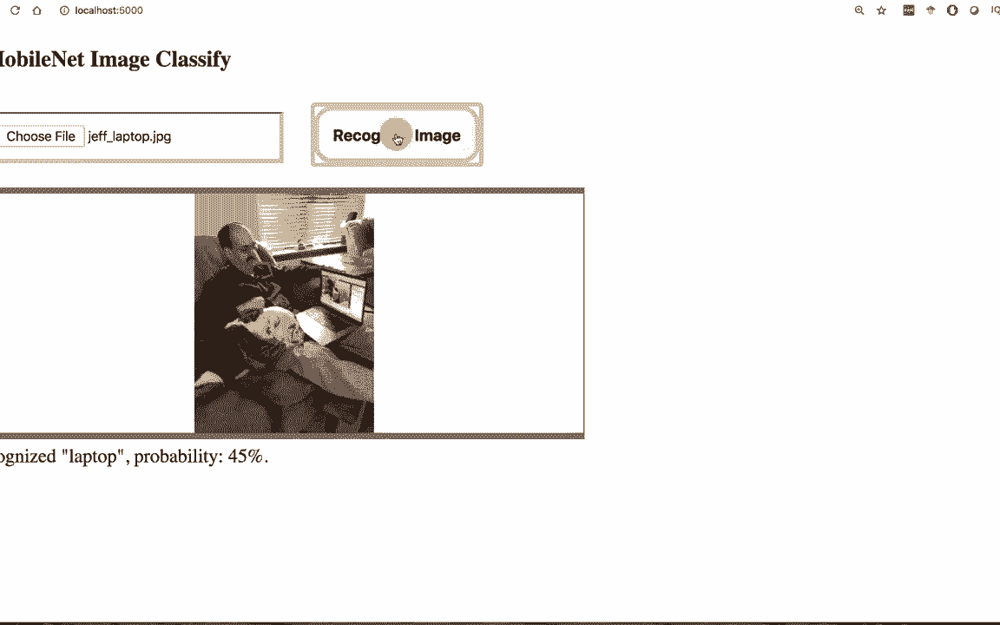

# 【双语字幕+资料下载】T81-558 ｜ 深度神经网络应用-全案例实操系列(2021最新·完整版) - P69：L13.3- 在Web应用程序中使用Keras深度神经网络 - ShowMeAI - BV15f4y1w7b8

Hi， this is Jeff Eaton。 welcomel to applications of deep neural networks with Washington University。 In this video， we're going to see how to deploy your neural network orsyit learn model into a web application For the latest on my AI course and projects。

 Click subscribe in the bell next to it to be notified of every new video。 So now we're going to see how to actually make a web application in the previous part。 we saw how to create a flask web service that allowed us to expose our neural network as an API。 This is the first step to really creating a web application that allows you to interact with your model。

 you're going to basically create the web application and you're going to take data from the user form that request is an API。 sendend it to yourself to that same flask container that we just created and then present that back to the user。 The end application is shown here as a screenshot essentially in the notebook for this class。 see。😊。

Exactly how to run that and we'll try it with an image Now the way that we're going to do this is we're going to use something called react JS and react is essentially a frontend framework that allows you to represent graphical user interface elements There's been a ton of these over the years like JQury and Ar many iterations of Ar there's all kinds of them there's even some newer ones called view and others This is just the one that I am using that seems to be a pretty good one。

 it's an attempt to get you somewhat away from the document object model that a lot of these were previously built on like JQury I won't get too deep into that that's more web development of which I am definitely not an expert but I do enough web development to allow my artificial intelligence creations to be seen from websites I do give you a link to a blog post I also borrowed some of the structure of this from a nonAI example and react but it was really just to upload an image and then took that and went。

Further to do image recognition。 Now， you'll notice there is not much here on the notebook for this web application。 That's because you're not going to run it from the notebook。 So you won't be able to run this from coabab or from your notebook。 we're gonna go to the terminal in a moment and actually run it。

 but let me show you the main files that are contained here。 First of all。 we'll look at the web server itself。 This is a python file。 This is running actually in flask。 So this is what's going to actually drive it。 This is an exact copy with additions from the flask API that we created to first wrap that image classifying neural network mobilenet。 So essentially what we're going to do here。 This is all just like before。

 but I'll review it in case you're jumping in at this point。 We are going to now this is new。 We're going to expose the Www directory。 So this becomes very web server e so。We're going to put our CSS files and any graphic files or just other static files like HTML that we need everything in this web application is static because the only dynamic part is truly the API so react is basically building up that JSON request that we saw and sending it over so that we can get this image classified。

 everything else is the same you could use the same exact API that you had from the earlier one and have it serve both external applications trying to access it and actually the web application that we're creating here So this is a real power of this type of development it's called API first So basically you design your APIs and then you do a static sort of level on top of it where we are essentially presenting the data and getting the results back in the past and。

development you would typically post something that directly from a form that request would go to a CG or something that would actually handle it and rerender the entire page for you the newer style for this very much is you have the frontend code the frontend ja collect that and send it to the same sort of an API that an external application would make use of and we're mapping in things like other things so that we can get the the default。

 the index HTML and other things we set up the post。 This is we're going to actually query the neural network we display errors like if you don't send an image that's going to be an error and we get the image out of the packet that is being sent to us and we essentially try to classify it so we're going to we get the file name we make sure that it's a secure file name that you're uploading the type of file that we expect and then we're going to essentially。

Open the image Now it's important we're not actually saving the image anywhere。 we're actually streaming it right from the HttP to the neural network。 so we're not like creating a temp file or anything。 We are going to expand the dimensions so that we so it's in the shape that the convolution neural network is expecting and then this code here is very useful。

 I did not put this in the previous version I'll probably copy it at some point so you might see it in the previous version this is essentially just truncating the alpha channel so you should have a red green and blue if you're dealing with an image that has transparency and it has an alpha channel that can freak out the convolution neural network because that's a fourth channel so this just make sure that there is no actual transparency or alpha channel being uploaded to you as well we ask for the actual prediction and we decode the predictions the decoded predictions let us know what it actually is like a car or a boat and。

What percentage we're going to get the top5。 And we send those across。 Now。 the front end might only display the top one or the top two or something like that。 but we're sending all five there for the front end to decide what it's doing。 And we form this basically into a Json packet and send it across same Json packet that we dealt with in the previous parts。

 So this all is exactly the same that we saw。 This is how you build an API around your neural network。 Now， let's see how we actually make this interface into。The web application。 So you've got the style and the script Js。 I'm not going to explain the style and the index dot HTML all that much。 These are really pretty minimalistic。Since Re is building everything completely up。

 All that this really has is the title for it in the HTML。 Everything else will be built up dynamically。 So let's just look at the script file because this is what is going to actually handle building up the request sending it to the API and dealing with the GI elements This is all client side jascript So it's running in the user's browser just to show you some of what's going on here。

 there's really three parts to this。 The constructor is this part it is basically keeping what state needs to be stored in the react Js program Now react Js deals with state so that it no so that it can redraw the entire page anytime needed and the state determines essentially what state it's in Now we need to know what file was uploaded and the image and then whatever message we're generating on that image because we want to put a message below the image handle。

This happens when you click the button to actually upload the image。 We essentially let whatever default was going to happen on that event and now we actually get the data from the image we're going to send the image right from the user upload directly to the API which will then send it directly to the neural network。

 Everything is stream so that we have no intermediate temp files needing to be created or anything messy like that。 We're going to build up the HttP request that we're going to actually send it over and we are going to essentially just post the image right across。

 This is very simple。 I mean， we are just literally taking the image and dumping it onto the API endpoint。 It's important that we have this image here because that's the Hml form element that the image is actually being embedded into if you call this image。

Then we wouldn't find it so you could upload multiple images at the same time if you needed to send several those across once we send this。 we essentially assign a callback function。 JavaScriptscript is very reactive so that means you don't block you really cannot block and wait for something to finish so essentially we're going to tack this function on which is going to wait for that post to finish and then we immediately exit now when we get the result back from that onload we check to make sure the status is correct if the status was not good then we reject the promise so to speak the callback and say that we did not get a good result from that and we're going to return the status text from the HGDP and we log it so that we know that we see what we got we're going to get the probabilities I do round the pro so that we don't have all these annoying trailing decimal places and then we essentially build the message that we have now the。

One thing in react is we are not just modifying some onscreen DOm element。 We're literally changing the state so that the next time that we render which is down here that is going to render all of these elements Now normally you would probably use JSX for this then you would have nonstandard ja is it would literally have tags intermixed in there since this is not a tutorial on react I left that out and basically did just standard Java script code but this could all look very HTML like if you use JSXEssential what I'm doing is rerendering all of these and however the message comes back is this is the key point here we are going to rerender that message underneath the image that the user uploaded and by the way the image when the user does actually upload done by this handle image change that's where we actually give the pre preview of the image that the user is selecting and once you。

You have this all you can send the request and get it back from your API that contains your neural network The key to all of this is right here where it is actually invoking the HB request and getting your results back you're dealing essentially with two programming languages you're dealing with JavaScript which you need to deal with on the front end and you're dealing with Python and you're dealing with Python so let's go and run it so that we can see what that looks like what you see running here is essentially the notebook that I had we don't really need the notebook so this is this is going to fail out behind me I'll go into that Python directory that I provide and you can see image web server one so we'll go and run that and we run it takes a moment to start up definitely allow your firewall to route it through now you can see that we are running on HtDP and port 5000 so let's go ahead and run this execute it from the web and there is our。

Web applications， so all these GUI elements that was from those react elements that I went through。 I'm not going to give you a react Js tutorial on how you literally build something like this but it's a very minimal amount of code that I had in there so you can definitely read up on some of the links that I gave you if you want to learn more about web development There's already a ton of channels and other things out there。

 I definitely will not be delving too deep into web development and we'll go to the photos from my class website different。 we'll do me working with a laptop now we're not doing multiple images like Yolo so if there's multiple images in here one's going to just dominate over the others at least as best it can So that's me a dog on a laptop this would be great for Yolo but we'll recognize the image and yeah it likes the laptop better than me and the dog can't blame it but laptop 45%。

This content changes often， so subscribe to the channel to stay up to date on this course and other topics in artificial intelligence。