# 【双语字幕+资料下载】T81-558 ｜ 深度神经网络应用-全案例实操系列(2021最新·完整版) - P7：[讲座] 在 Mac OSX M1 中安装 TensorFlow 2.5、Keras 和 Python 3.9 - ShowMeAI - BV15f4y1w7b8

嗨，我是 Jeff Heaton，欢迎来到华盛顿大学的深度神经网络应用。在这个视频中，我将向你展示如何设置一台 Mac，特别是一台较新的 Mac，M1 系列，搭载苹果的硅芯片，而不是 Intel。使用 Keras 的 TensorFlow。

深度学习课程所需的一切。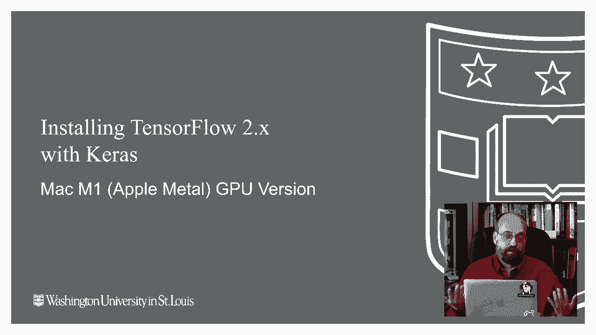

🎼如果你有一台 Windows 计算机或一台较老的 Intel Mac，我有其他视频链接在描述中，建议你查看其中一个，过程有几个步骤，其实并没有那么复杂。我想解释一下你在此过程中会遇到的 miniforge 和 Minneconda 版本之间的一些区别。此外，如果你不想在计算机上安装实际软件，你可以通过 Google Coab 完成整个课程。如果你看过我其他一些视频，你会知道我使用 Minneconda 和 Anaconda 的频率相当高，这两者都是由同一组开发的 Python 平台。

你可以在几乎任何平台上使用它，无论是 Windows、Mac 还是 Linux。在这个视频中，我将向你展示如何使用 miniforge，miniforge 对我来说是一个新事物，它也支持多种平台，但我主要是在 Apple M1 上使用它。我建议尽量完全依赖 miniforge，而不必安装 Anaconda，因为如果你想使用 Anaconda，你需要同时安装这两者，如果你使用 Anaconda，你不会 necessarily 或者实际上根本不会。

能够访问苹果在这台计算机中内置的 GPU 加速。因此在这台机器上，我将向你展示如何安装 miniforge，它将仅仅是 miniforge，而不是 Anaconda。我实际上在我的 Mac 上同时运行这两者，如果你对如何并排运行它们感兴趣，我可能会做另一个视频。

让我知道。但是关键是 miniforge，如果你查看他们的理由，会强调支持各种 CPU 架构，包括 Apple M1。让我有点恼火的是，我不能通过 Minneconda 运行所有东西，必须在我的 Mac 上有两个完整的 Python 实例。

但他们就是想这样做，所以我们去我的课程网站，上面有各种关于如何操作的说明。我将带你通过一个我基于他人开发的过程，这与这里你看到的一些方法稍有不同，但我认为这是一个相对简化的过程，可以让你为我的课程安装所需的一切。如果你去 T81 深度学习，然后进入安装，那里有各种文件，因为他们不断更新这些平台，而我课程的安装说明自 2020 年初我发布第一个版本以来已经发生了很多变化，我不喜欢在旧的 YouTube 视频中留下失效链接，所以他们链接到各自的版本。

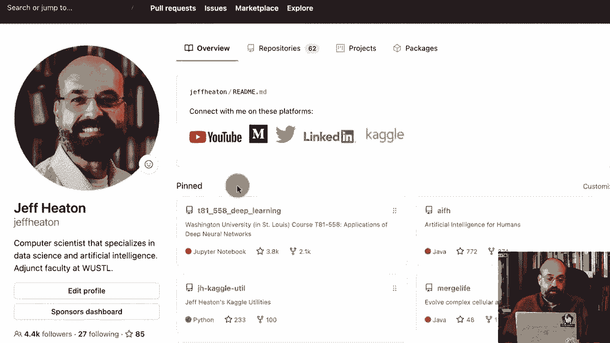

这个视频将使用 Tensorflowlow 安装 Mac Metal。2021 年 7 月，如果我对这个文件进行了一些修改，没有严重破坏视频的情况下，我会在这里放一个新版本的链接。如果没有破坏性更改，我可能会直接修改这个文件。所以这些是说明。我基本上谈到了如何处理多个版本和 miniForge。

我建议先安装 miniForge，我喜欢用 homebrew 来完成这个。我要告诉你如何安装 Homebrew。这与如果你习惯使用 Linux 的 yum 或 Appgi 类似。如果你想的话，它就像 Apple Store 的命令行版本。

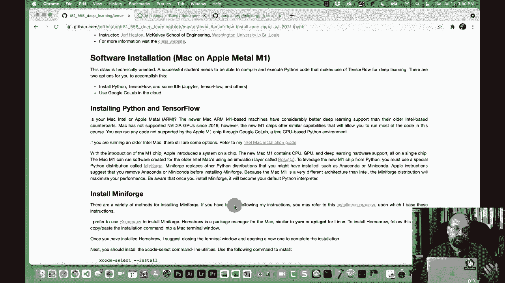

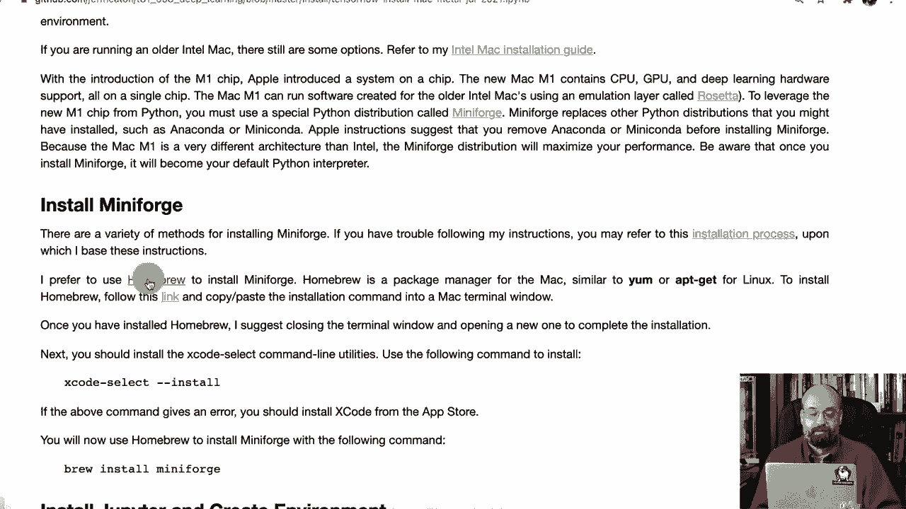

为此，如果你去 Homebrew 的首页。这个命令就是安装命令。这就是所需的全部，所以我们复制它，然后打开一个终端。我实际上在这台 Mac 上还没有安装 Homebrew。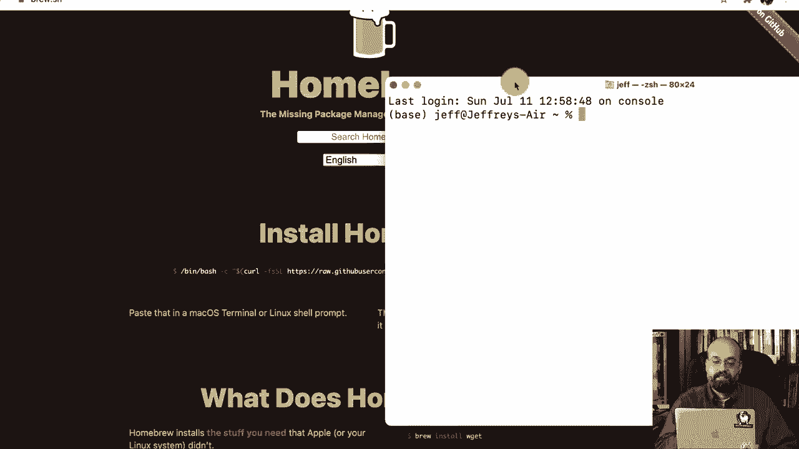

我刚买了这台 Mac，已经贴上了我的贴纸，所以我想这台电脑现在是我的了。不会再退回去了。我们继续把这个粘贴到这里。然后我们按下回车，它将运行。所以它显然需要以 root 身份运行。

所以我将输入我的密码，安装将开始，它还会安装 Xcode 命令行工具。你在 Mac 上需要很多东西，非常有用。如果你进行一些其他更手动的安装过程，你需要单独安装这个。所以我将继续按下回车键。

现在正在安装 Homebrew。我们就快进吧。顺便说一下，我可能需要在这台电脑上贴更多的贴纸。有建议吗？请在评论中告诉我。好吧，我还在继续等这个。让我再讨论一下其他一些注意事项。Apple Metal。

这几乎是苹果等同于Nvidia Kuda的内容不会在我课程中运行。我会说它能运行大约90%。但是我有一些高级代码，例如，Gs使用了。😊。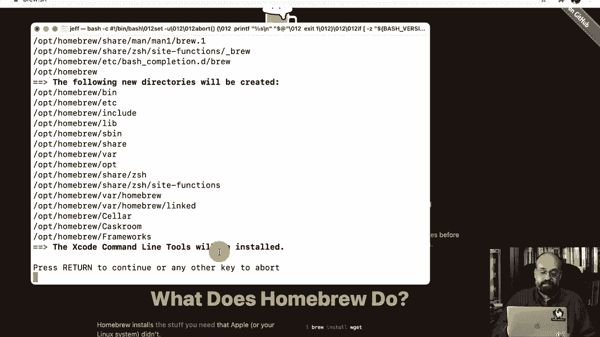

有两件事特别需要注意，一个是Pytororch，Pytorch目前在M1上运行起来要困难得多。目前有一些尚未解决的问题，希望这些能尽快改善，但我们在本课程中使用的stylegan to ADA实际使用了Kuda代码，这是一种C99类型的代码，实际上定义了自定义内核，所以显然这与Apple Metal并不兼容。你当然可以用Apple Metal编写这段代码，但Stgan2 AD就是没有那样写，因此在更高级的机器学习中，如果是自定义编写的内核，Mac M1非常出色，Metal也很棒，但其生态系统远没有Kuda大，所以兼容性也不会像那样好。现在本课程所需的一切。

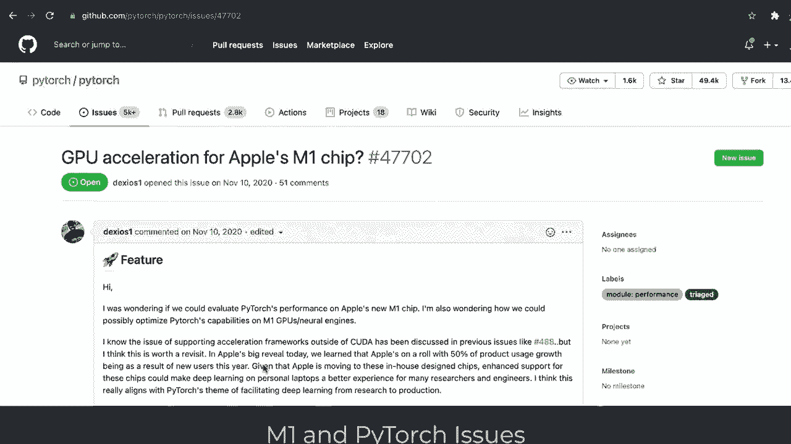

在coab中可用，所以我建议如果你要在美国运行，就像我说的。这大约90%到95%的内容都能正常工作，但其中一些将无法工作。你对制作一个展示在Apple M1上什么能工作、什么不能工作的视频感兴趣吗？至少在我的经验中。请在评论中告诉我。另外。

这个视频是否帮助你安装？如果有的话，请给它点赞。非常感谢。让我们继续快速前进。我真的不喜欢那些让你输入相同密码几次的过程，这会让你无法在不监视每一步的情况下让它们运行。

😊，好的，所有这些都完成了，这是一个重要的步骤，你应该将homebrew添加到你的路径中。顺便说一下，这假设你正在使用Z shell。否则，某些内容可能会有所不同。Mac过去使用ba shell，但目前他们使用Z shell，除非你特别更改，否则情况就是这样，去运行它，它已被修改，运行这个只需重新加载shell。

我会退出终端并启动一个新的终端，因为我并不完全信任所有东西都会像应该的那样重新配置。现在我应该可以从命令行使用breww命令，我可以使用。所以这很像yum或appgi之类的东西。让我们回到我的说明中。所以我们安装了homebrew，按照了说明，他们还推荐安装这个，我认为基本上是通过brew完成的。

但我会继续执行那个，已经安装了，所以我们没问题，然后我们要执行brew install mini forge，有多种方法。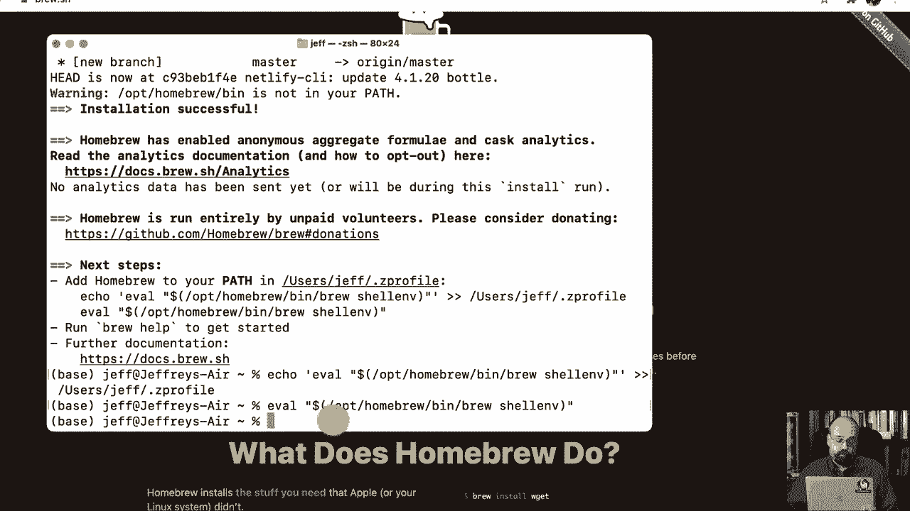

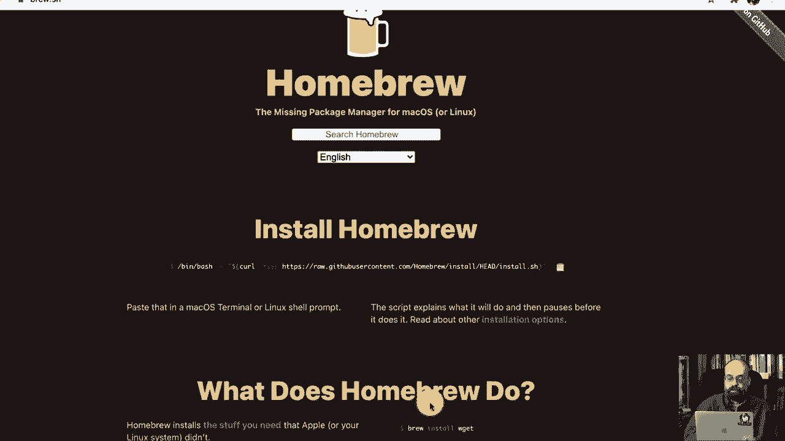

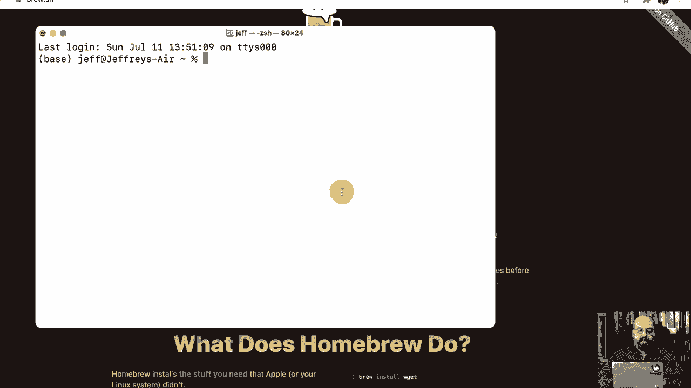

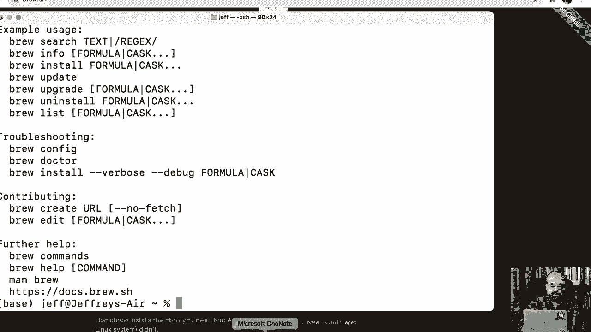

要做到这一点，你还可以下载一个 shell 命令。你可以在上面的安装过程中看到它，所以如果这对你不工作，你可能也想尝试这个，但我将复制这个，从这里运行它。所以这将利用 brew，并且它将安装 miniForge。我能想到这个可能失败的唯一原因是，如果 Apple metal 的新版本和 miniForge 的新版本不完全兼容。如果我遇到这个问题，我会确实发布一些信息，届时你需要请求安装一个非常特定版本的 miniForge。我们将快速前进，经过所有这些独特的基础，展示你当前所处的环境，我们现在在基础 Python 环境中。

如果我执行 which Python，将会验证这一点。所以看，我们正在运行来自 mini Forge3 Ben 的 Python。接下来的步骤是安装 Jupiter，Jupiter 是你在本课程中执行大部分代码时使用的 IDE，你也可以使用 Jupiter labb 或 Pchar。我们将继续执行这个，这已经安装好了，所以很方便。

现在我将让你做的事情。通常你需要安装几个东西。你需要安装 TensorFlow，然后是金属插件。我还准备了一些我喜欢在课程中安装的便捷机器学习库，它们都是通用的。我认为即使你不参加我的课程，安装它们也不会有什么坏处。

你可以在这里看到所有内容。Psychit Learn、pandas，都是非常标准的东西。你需要这个 TensorFlow Apple Yaml 文件，然后你会执行这个命令。我已经将其加载到我的系统上。所以我会进入我存放它的地方，因为我在我的课程上进行了克隆，你可以在那里看到 YaAml 文件。如果你不需要我课程的所有材料，只需下载 YaAMl 文件。

我那里有一个链接，确保在执行这个命令时你在同一目录下，你将需要我刚提到的 YamL 文件。如果你不需要我所有的课程材料，只需下载 AL 文件。我已经将我的课程材料加载好了，就在那儿。我将执行这个 Conda 环境创建命令。它将创建一个安装了所有这些包的 Tensorflow 环境，以及 Tensorflow 和金属插件，这将让你使用 M1 Mac 的 GPU 能力。我们将快进这部分，这通常需要一点时间。现在我们将进行下一步，即 Conda 激活 Tensorflow，这也在我的说明中，然后就这样。

现在我们在TensorFlow中，我将安装和连接`conda`。这让我可以将我创建的TensorFlow内核链接到Jupyter，它会完成所有这些步骤。是的，我们会快进。好的，我稍后会告诉你那是什么，我们需要在这里执行这个命令，这实际上是要链接它。你可以在Jupyter中安装多个这样的环境，这也是我常常这样做的。

对于我正在进行的不同项目，我不尝试创建一个包含所有所需的Python安装，因为这样会变得繁琐，我会失去追踪。我倾向于为每个项目创建一个环境，或者根据我在做什么，通常为每个项目创建一个Docker镜像。好的。

我们将进入它，现在它已经链接到Jupyter了。所以现在我们将继续运行Jupyter Notebook，这是下一步。在我的说明中。现在我们在Jupyter Notebook中，将创建一个新的笔记本，或者我可以直接加载之前运行的文件，如果你下载了它，但我将直接创建一个新的。

TensorFlow 39环境，这是我们刚刚创建的环境。选择这个环境非常重要，否则你可能没有安装TensorFlow。所以我们回到这里，将复制并粘贴这段代码，这会告诉你是否一切正常。这是你交叉手指的时刻。我将运行它，这需要一点时间。

我们将快进。你可以看到这里出现的三个，这是Apple Metal的一部分，这是一个好兆头。显示GPU可用是更好的兆头。所以我们完全安装好了，准备就绪。如果你想检查一下，加载任何使用TensorFlow的代码，就像你通常那样，训练ResNet会是我的材料中的一个很好的例子，继续运行它。

你会看到它启动。Metal设备设置为Apple M1，这都是很好的兆头。如果你查看活动监视器并看到GPU的使用百分比，那就可以了。启动需要一点时间，所以如果你一开始在GPU使用百分比上没有看到任何东西，不要惊慌，它可能也在下载中。所以我们在EpoC2 GPU上显示88%的使用率，这实际上是一个不错的迹象。

如果你正确看到这一点，恭喜你，GPU已经正常工作。感谢观看这个视频，请订阅我的频道，跟随课程，或者如果你是我的学生，欢迎参加课程，我们这个学期将一起享受深度学习的乐趣。

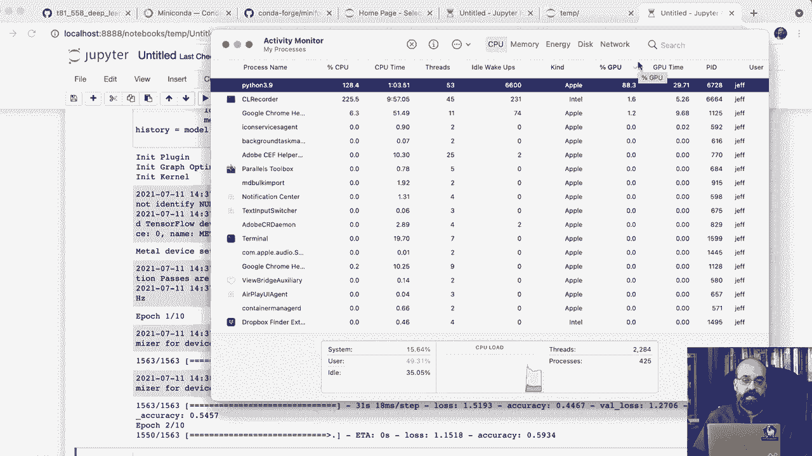

感谢观看这个视频，如果这个视频对你有帮助，请给视频点个赞。
