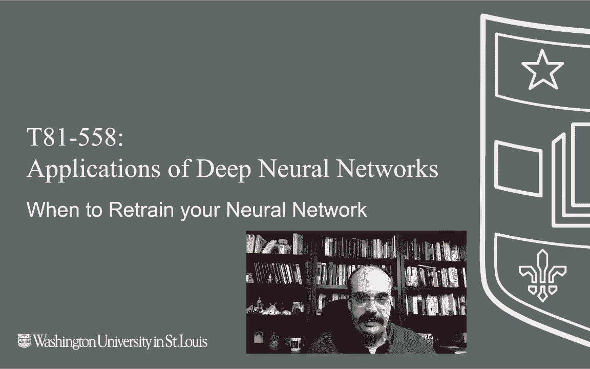
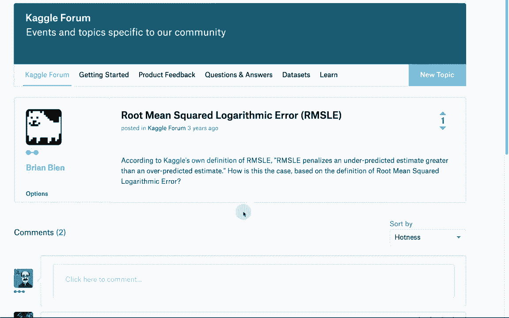
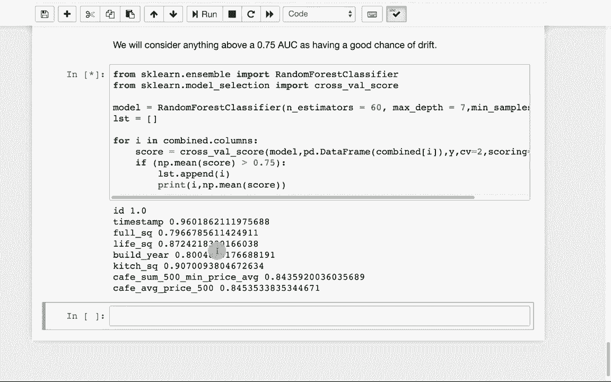

# 【双语字幕+资料下载】T81-558 ｜ 深度神经网络应用-全案例实操系列(2021最新·完整版) - P70：L13.4- 何时重新训练您的神经网络 - ShowMeAI - BV15f4y1w7b8

Hi， this is Jeff Heaton。 Welcome to applications of deep neural Network with Washington University。 In this video， we're going to take a look at how， you know when this neural network that you've moved into production is perhaps not being as efficient as it had been in the past。

 We're going to look at model drift and what to do about it For the latest on my AI course and projects。 Click subscribe in the bell next to it to be notified of every new video continuing along with our topic of deployment in this module。 We're going to look at when we should retrain a neural network。 Now。 if you just have a data set like the auto Miles per gallon or the Iis or any of these sample data sets that you download and work with。

😊。

You're not going to know really when you need to retrain your model。 For example。 the miles per gallon data set that we've worked with a number of times it has stats on cars that help you determine what the miles per gallon is。 most of the data from this data set is from the late 1970s and early 1980s。 Yes。 you almost certainly need to retrain that model from modern data。 but for that closed data set。

 the model is as good as it's ever going to get。 The problem is that as time marches on changes occur in the distributions of your data。 and your incoming new data that you're trying to get real scores for is different。 And this is a very common problem that you need to deal with as you develop models that are going to be used in real business ongoing applications。 I work in the life insurance industry， and I'll give you an example of it for this。

 So as your data for an individual So we're trying to determine what the risk of ensuring。Individual for life insurance is， so that's the risk essentially of them dying mortality risk we often call it if the person is really fairly average in terms of the input data that you're giving on they're not a smoke or their average height their average weight or average build your neural network is going to tend towards giving predictions that are really pretty average for this person Well average tends to change as you look at health trends over the years。

 mortality is improving more and more people tend to be living towards advanced years。 the advanced year is still relatively in the same range that it has been for a while。 but more people are living to that high end of that range and also smoking is declining all these things together。 change over time and this affect with the ground truth so to speak is that your neural network predicting towards so as this ground truth moves you need to potentially retrain your neural network with newer data every。

F years look at how you determine when this is happening。 Now。 when you will see this in a closed dataset。 So a dataset where you are given the data and you're never going to see any new data for this ever again。 That's not a realistic situation in business when you're doing this in the real world。 Usually you're building a model because you expect new data if you didn't expect new data。

 why would you build the model in the first place， predicting closed data sets is interesting。 but it lacks a lot of practical application Now， the only time when you will use these techniques on a closed data is where you have a defined test and training set。

 Some of the data sets that we've seen， particularly some of the academic ones。 they define what your training set looks like and what your test looks like。 So you want to look at has any shift occurred between your training in your test。 This is often done in kle。 So let's look at this diagram here。

 This is a diagram that appears I gave。source to it。 it's from a paper written specifically on looking at data and covariance shifts。 These are to names for this sort of phenomenon， somewhat different。 but the green。 the learned function。 So this is using a very linear model。

 So you'll have a lot of bias in this becauses very linear model， but that's okay the true function。 So what really it should be learning is this red。 but look what happens essentially over time。 And unfortunately， the test samples occur a little bit later in time than the blue training samples。 So you learn the function on the blue dots。 But the reality is and even the true function you don't have much representation of it over here。

 you have no representation at all hardly here。 So you're going learn this very linear function。 Now there's definitely some noise。 nothing's right on the linear function hardly。 But nonetheless this is trying to minimize your residual so that the distances between every dot and the line is about averaged。the dots above and the dots below。 But then when you get out here。

 you get to a different part of this function。 for some reason in time。 usually it's some variable that you're simply not capturing or you can't capture。 now the trend is more this direction so you probably need to collect more data and reffi it and use a nonlinear model so that you can get this curvature built into your model and get more predictive data。 because if if you look at where this red line is now going， who knows is it going continue down。

 maybe it's going to retake this shape here。 And if it does。 then our first model would not be so bad。 but you need probably something to look at that new segment in time that the ground truth has now shifted for。 So how do we measure this drift。 I give you a whole bunch of different techniques for this。 I'm not going to go through every one of these in the course。

 but just to give you an initial sort of literature review of those those are some of the ones to potentially look at this is a particularly good paper。ifying view and data shift This tries to look at really all of these and come up with the commonalities of those。

 Now to look at this since it's difficult really for me to do a inclass example where we're getting a training set and then collecting new data and continue thought about doing this with the autompG data and we might get into this So we're going to use a Cagel data and we're going to analyze and see how different the distributions of some of these predictors change between the training set and the test set this becomes an important consideration when you're competing and a Cagel。

 So we're going to use the sharebank Russian housing market data set just to show you that kgle it is essentially looking at can you predict Real price fluctuation in Russia's volatile market if you look at the data They give you a whole bunch really of input values here。

 they scroll across。 So those are all the columns in the distributions。 We're going to be looking at those there are。Hred total columns。 So it's got a lot of columns that you're dealing with。 I always like to go to the overview and see what the evaluation is。

 They're using RMSLE RMS logithmic error。 This is it's a regression error。 It's not a real common one。 And I had to go to the Cagel forms actually to find this The link on the competition actually results in a 404 page not found According to Cagel on definition from this RMSL penalizes under predicted estimate greater than an over predicteddicted。

 So its it's like RMS more log scale and then really not going to deal with it a great deal because we are just looking at the shift between the train in the test。 So we won't even really look at the target。 So the evaluation for this cale is really not important for the example that I'm going to give you Now you will have to download this data because it comes from Cale。

 I can't just build it into the course getthub。 So I'm going to run this。 I already had my。

Train and test loaded。 I'm literally pulling it right out of the downloads directory on my math。 That's a temporary location for me， but it does what I what I wanted to do。 There's a lot of examples on this particular kggle of how to preproces the data I do a fairly basic preprocessing So if it's an object type that means that it's some sort of a category So I am going to fill Ns with the mode or the most common value。 if it's an integer afloat then we're going to fill in the media media is good to use over mean because medium is less sensitive to outliers。

 Then we're going to go through and label and code essentially all of the categorical So we're not creating dummies we're actually label encoding them so that we end up with a integer value specifying what location they are。 I won't get into why that was actually chosen， but these were the common encodings that were used in this particular competition。

 I believe they shied away from dummies because they were simply too many dimensions。 So we'll run this so those two functions are defined or that one function is defined and then we'll preprocess the data。We're going to drop the target because we're not trying to predict at this point next。 we're going to calculate something called the chaoss statistic。 Now， when I first heard this。

 I thought of chaos statistic like COS。 but this is the chaos Ks statistic It is essentially looking at how similar are the distributions between two things。 So let's just do a sanity check。 If I just run this one。 I am saying what is the chaos statistic between the kitchen square feet and the kitchen square feet。 So what is the chaos statistic between itself。 So P value， it has to be below a certain threshold。

 So this is not below 0。05 This is very high。 So this means that it's very unlikely that there are any differences between these two distributions。 Yeah， because they're the same And then the statistic here。 negative0 math majors always love negative zeros， but computer scientists have them。 So this is 0 there is no difference between the two values and sense the P value is is very high that。

Means the null hypothesis really cannot be rejected in this case Now let's look at the same column。 but we're looking at the column in the training set versus the test set。 Now the chaos statistic is a little different。 our P value is very low0 and the statistic shows us that there's a 0。25 difference between them So this is interesting that the distribution of the kitchen square feet is quite different between the training set and the test set。

 the next thing we're going to do is essentially run this on all the columns so we'll run a chaos statistic on everything willll only report the times where the p value is less than 0。05 and the case statistic is greater than 0。1 Now the statistic this is somewhat tied to the units of the measurement so you have to look at these really relative to everything else in the values that you're actually measuring and as it runs through you can see this works better if I shrink the font size but then it's harder to read but the show。

All of the columns and the ones that had substantial enough differences。 Next。 we're going to look at how to detect the drift。 Now。 this is a very interesting technique that I've seen in a number of kggles。 What we're going to do is simply sample the training test set into smaller sets。

 we're going to take these data sets and essentially add in another column that you have down here that tells us where they came from。 We're going to see if we can fit a model， a random forest in this case that can predict when all the data are jumbble back together。

 can it predict or an individual item， if it came from the test set or the training set。 If these are truly uniform random sampled value So there is no difference between the training set and the test set。 we simply divided it that way， you should not be able to predict where an individual row came from if you can predict it。 then theres there's differences in the distributions there that really help it to lock on。

What set it actually came from。 Let's go ahead and just run this so we can see sort of what it looks like。 We're gonna label the two data sets。 We're going combine them together and re randomdomize them。 Now we need to break out the X and Y so that we're ready to train。 This is a classification。 So we're using area under the curve。re considering anything above 0。75。 that's not a real good AU。

 but it's a good enough A you that it's breaking that it's getting onto something that it can really determine what that is。 We're going to use each of the columns so that we can evaluate the errors differently。 we can see how good each of those columns is it actually predicting it。 So we're using the columns one by one to form that prediction。 And as we start to run this。

 we'll see different ones that really vary。 Now some of this really make sense。 The I you're not going to be using the I anyway to predict the I is ever increasing。 So yeah。 it's going to be very different between the train and test set。 same thing for timets。 especially if they were taken。At different regions in time。

 So the fact that the timestamp is that different， is that predictive means that it's probably not uniformly sampled across the full time frame and we see the other values here that are also quite able to be predicted if they're in the training versus the test set this can be very useful information in a kle that you know how to balance this to some degree。

 but it's also very useful if you were collecting new data coming in。 you don't need the outcome。 you do not need the target for your new data， you can compare it to your original data set and see if a random forest is able to predict if it's old data of its new data。

 if the random forest can predict with decent accuracy like 87 Auc here。 then the underlying data has probably shifted and you need to retrain your model。 This content changes often。 So subscribe to the channel to stay up to date on this course and other topics in artificial intelligence。

