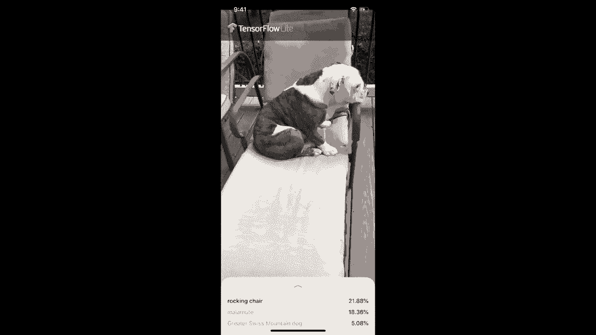

# 【双语字幕+资料下载】T81-558 ｜ 深度神经网络应用-全案例实操系列(2021最新·完整版) - P71：L13.5- 用于IOS开发的TensorFlow Lite - ShowMeAI - BV15f4y1w7b8

Hi this is Jeff Haton， welcome to applications of Deep neuralural Networks with Washington University in this video I am going to talk about how to create a neural network on the edge so on an iOS device in this case。This means that the scoring or the usage of that neural network will actually be on a mobile device to see all my videos about Cale。

 neural networks and other AI topics， click the subscribe button and the bell next to it and select alt to be notified of every new video This is often called artificial intelligence at the edge because you think of the cloud and then you think of the devices that are around the edges of the cloud that is cell phones and other devices such as that。

The idea is we may not want to actually perform the neural network scoring up in the cloud because you might have your phone looking at your photos or other things that you want to stay on your phone and either due to privacy restrictions or just transfer restrictions。

 you don't necessarily want the cloud to do everything。Now in this video。 I'm going to talk about using Tensorflow light and an iOS device。 I'm sure I'll get requests for Android and other things like that。I don't really specialize in mobile app development。

 so I'm probably going to stick just to iOS unless I get a lot of requests for something else。 but for the purposes of this course。We're going to keep it just a one mobile device。 I'm going to use a cross platform。Version of Tensorflow， Tensorflow light。 which is available on a number of these。 So that increases the odds of you being able to transfer this knowledge to other platforms if i is not your thing。

 And the reality is， if you're creating any sort of a very popular app。 you're probably going to port it to both i and to Android。And I don't remember if Microsoft currently has a third platform for that or if they've finally given up on that or where they're at。 But those are the two main ones， Android and iOS， and I happen to own iOS hardware。

 So that's the one I'm going to do。And this is the app that we're going to create。 You can see it recognizing a few things here。 We'll get more into this later。 Okay。 so let's build a iOS app now like I said you can do this in other ways you can do this for Android and then also I'm using Tensorflowlow light since the course is mainly focused on Tensorflow Also Tensorflowlow light is crossplat you can use this for Android So if you do want to do this in Android it's not a complete loss you just need to learn the specifics to that but the code will be largely the same the neural network code will be but the actual app developer stuff like accessing the camera and other things would be completely different So they have a example application you're seeing it here。

They show you some of the iOS specific code like here is how you actually access the camera and get the images one by one。 We're going to send those images to。Tensor flow light so that we can get them classified and we're also transferring in a neural network that's already been trained on images。

 You very rarely do actual training on a cell phone there's really not much out there that would help you to actually do this you'd have to kind of custom code it yourself but really you don't train on a cell phone you use the cell phone just for classifications youd consume all the power if you are actually training on it because you wouldn't have terribly optimized code Now I'm showing you here basically this is some of the other code that they have that is。

Actually querying the neural network like model， the model data。And this is actually querying it。 So I will be the first to tell you， this is Swift， and I am not real familiar with Swift code。 So this is why I'm completely using the Google Tensorflow light application that they provided in the examples。 This is in a repository that contains a lot of other examples。 So here we're going to。😊。

The actual Tensorflow examples， you can see it's part of the much bigger TensorFlow set of examples。 this link took us right into the image classification for iOS。Like you see here。 you could go higher in this。So when we check this out。 we're going to have to check out literally the entire Tensorflow collection of examples。

 which contains a fair amount。 Now here are the prerequisites you need a device that has that version of ios or higher which should not should not be difficult unless you're dealing with something really old you need Xcode 10。0 above Auto Mac， you have to use a Mac to develop i and I already have that install so I'm not going show how to install Xcode it's pretty straightforward you do need a valid Apple developer I。

 This is tied to your actual Apple ID that you would use to access iTune store and other things like that it does not cost any money if you do pay money that is to give you and it's a small relatively small I think it's 100 or so yearly fee that lets you actually publish your apps to the store but to do this example。

Run that application that I showed you before I'm not a paying Apple developer reason I don't really need that ability I have I don't sell things on the Apple store at least at this point in the future who knows you do need the Xcode command line utilities I think I already have those installed but I'll run that command just to be sure that I don't have those already in there you will that basically just gives you command line tools that are necessary to be able to actually。

Run the code that is used with those and cocopods so cocopods is used that's kind of like Pip for coa applications so that's going to install Tensorflow light for us so you have to install so let's go ahead and run the Xcode select so that we make sure that we have those I already have those installed as you can see there so go ahead and run that see if you need it now we're going to install the cocopods cocopods。

 like I said is sort of like Pip that's going to let you actually install for Sw the Tensorflow light package so let's copy that and we'll run it don't want to do the bash command along that they have there so just run it without bash you do have to enter your password for this and it takes some installation I'll fast forward through this that's installed Now this note here is very important this just means you can't run it on the simulator you're going to have to run it on an actual iOS device because it requires a camera。

Okay now we're going to clone that repository。 We're going go through this whole build and run part。 make sure not to copy the bash part of this。 I check these out usually to this project directory that I just moved into and it pulls in all of the Tensorflow examples。

 Okay， now that those are done。 I'm going do this in two separate parts。 They have two commands kind of merge together here。 First。 I'm going to do the C command and move into the appropriate part of those examples。 Okay。 now we're in the actual ios example。 and now I'm going to do the pod install。

 This will install Tensorflow light。 This is kind of like a Pip install。 in Python。 Okay that's installed。 Okay， now we're going to switch into Xcode to carry out these next few steps。😊，Okay， so let's do this first step here。Go into Xcode。And now。 before you set up your development team like they're talking about there。

 you have to do this sort of at two levels。 First， you just have to tell Xcode that you have a Apple developer I。 and to do this。 you go into preferences and you click on accounts。 Now I have no accounts here currently。 That's because I deleted mine so that I could demonstrate this。 But you click plus， and we're going to use an Apple I So my Apple developer I is tied to my normal Apple I that I buy stuff in iTunes with。

So I'm going to click continue。And then it wants me to enter this， which is just my email address。This is a email address that that I use mainly for this。 So I do have this blocked out。And then you click next。And it wants to know your password。Obviously。 I'm blocking this out but it blocks it out too。Wonder if it'll make me do2 FA。

No two factor authentication for me。So it's， it's done with that。 So I will go ahead and close this window。So now the next thing you want to do is the steps that we had said open up the project configuration for the project now。You just double click it and opens it opens here。So go to signing and capabilities。And we are going to essentially here。It requires a development team。And that's me。

 That's the Jeff Heaton personal team。Now， this is actually the next step that they tell you about in the。In the Google thing here， this identifier has to be something completely unique。So， I am going to。Switch over and do that。So let me go up to here though this is the one here。 They suggest adding your initials。 So we'll put JH there and try again。Oho， now we're happy。

 So let's。Let's do that。 Now， the next thing that they are saying to do in the instructions。Here is to。With an ios device connected， go ahead and run it。 So let me get my iPhone。 Okay。 you can tell that my iPhone is connected because it's wanting to run iTunes。 which I don't want to run。 We'll go back to X code。And now we attempt to run it。 I usually。

Now I don't use Xcode a lot， and I have to admit I find it very cumbersome， but I'm guessing the big。

Arrow is the thing to run something。By the way， it ran in in a simulator。 This is what you want not to do。 So let me show you。How to do that correctly。

If you do run that， just go ahead and stop it。And it should kill off。The simulator。Now，2。Run this properly。 You want to click on where it has this and。That's the， that's my。 that's my test iPhone that I use for this。Now I should be able to click the big arrow and hopefully this will work。Okay， it needs this password。 Let me go ahead and provide that。Okay。

 I swear every time that I use X code， I feel like this is an intelligence test that I am sadly failing。 but。I think all the good user interface people that work at Apple just。Take the day off when they do Xcode。 But what you've got to do here is enter your user Id。You can't do a allow。 You have to do always a why they even put that button on there。 Who knows。

If you two try to do allow， it's just going to ask you that again and again， like I was doing there。Now， it launches your app。 Now， this is yet another little thing that you have to do。 Now。 I understand this application security is a big deal。 So you have to basically。Tell your iPhone to trust it。 So I'll show you the steps。

So they even give you the instructions here for to do this， you actually go to settings。Dvicice management， and allow that。Okay， I've now told it to trust that application。 So it's。 it's trusting。 And then I should be able to run that again。 But the app is already installed on my。

IPhone。😊，Okay， so now I'm switching into my iPhone。Now the first thing we need to do here is actually go to settings。And then it's under the general tab， it's a lot of stuff under general。And then you want to go to device management。AppleDevelop。And basically up here previously had trust this app instead to delete this app。 so you will probably see a trust this app， I've already trusted it。I'm recording this part actually separately。Once you get through all of that。You are here and you can see the TF classify。Now let's just experiment with it for a little bit。

 so we're now seeing the world through my iPhone and really it thinks I'm a mask or bathing cap thats that's it。 but we'll try down a couple of items that I have so it is figuring out the coffee mug pretty easily。It's figuring out the soccer ball。The famous red stapler。That's a Bobled。 Yeah， that's sad。Ash can parking meter， gas pump， okay， it can't figure out the soap bottle and this a really weird frog that I have here。

It thinks as a screwdriver。The frog is actually holding a cell phone and。Nope。 it just does not figure that out either。So let's see， what other things can we potentially classify？

Its a chair。Rocking Sha， its， I guess you could rock with that if you really， really wanted to。Bobsledd， let's see if it recognizes Hickory。Rocking chair， rocking chair， American Stafffordt。 French Bulldog， Hickckory。 I think you're French。Nothing against French。 but he's an English bulldog。Oh， hickory， I am sorry。

 I promise I will reprogram this to recognize English Bulldogs。

Thank you for watching this video， this is how you developed a simple application using a neural network on iOS using Tensorflowlow light。If you would like to apply this knowledge to other platforms。 definitely take a look at the TensorFlow light webpage。 which will point you in the direction for those other platforms。

