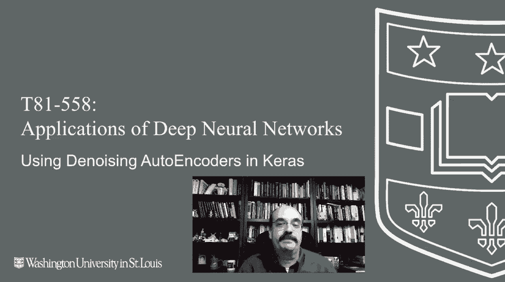

# 【双语字幕+资料下载】T81-558 ｜ 深度神经网络应用-全案例实操系列(2021最新·完整版) - P73：L14.2- 在Keras中使用去噪自动编码器 - ShowMeAI - BV15f4y1w7b8

Hi， this is Jeff Heaton， welcome to Application of Deep neural Network with Washington University。

In this video， we're going to look at auto encoders or specifically auto dennoine encoders。

 These are auto encoders that can be used to rebuild。

Data that's been obscured by noise for the latest on my AI course and projects。

 click subscribe and the bell next to it to be notified of every new video。 So for auto encoders。

 we're going to first look at function approximation。

 We've been doing function approximation before its' pretty much regression。

 but I am going to define a function to do the approximation to chart it。😊。

And now I am going to create a simple neural network that has essentially the sine function。

 We're going to try to predict the sine wave。 If I run that， it is going to train。

 and we're essentially just training it on on the sine function being passed in how fast forward this while it trains。

 Allright， it's complete。 You can see it it's tracking it really pretty well。

 Now I put some noise into the expected just so that it's not exactly perfect。

 You can also see the actual in the predicted that pretty， pretty close， really， Next。

 we'll do multi output regression。 Multi outputput regression is critical for a autoencoder。

 Essentially， what's happening is you have your inputs just like before input 1 input 2 input 3 input 4。

 but you can have multiple output neurons。 Now for an autoencoder。

 usually the number of inputs matches the number of outputs。 Let's just go ahead and run this one。😊。

Which is attempting to train it on both the sine and the cosine simultaneously。

 I'll go in fast forward this until it gets done。 Okay， it completes the RMS E looks pretty good。

 You can see some of the predictions and expected。 So it is learning sine and cosine。

 at the same time。 which is， which is amazing。 Well， not really。 I mean， neural networks。

 multiple output regressioning is really a pretty common thing。 You don't see it a lot， though。

 in other types of machine learning model。 Now， let's do a simple autoencoder。

 And notice the autoencoder， we have five inputs we have five outputs。

 Whatever number of inputs you have should be the same number of outputs。

 And what we're essentially doing。 This is kind of fascinating。 This is what autoencors do。

 We're putting in。😊，Essentially， random numbers here。And we are training it。

 expecting that we get the same numbers out as we put in originally。

This teaches the neural network to use just these two hidden layers。

 these two hidden neurons here to essentially compress。

All the inputs down into just two number of values。

 So here we'll just train that same shape1 that we had before。 It trains very quickly。

 And you can see I'm basically passing in 0，1，2，3，4，5，8，9。

 And it's essentially returning close to the same thing，0，1，2，3，4，5，6，7，8。

 and in a quite get that one， correct。 Often， these autoenrs are used on images。

 So let's go ahead and load some images in that we can make use of。

 I'm showing you basically here how we created an autoencor to encode this image of Washington University。

 Now， if you look at the definition for this。😊，It's essentially reducing through a hidden layer of one。

 So it's teaching it to very highly compress this so that just one numeric value can represent it。

 Now， of course， the hidden layers above and below it will' have some knowledge of the image。

 So that's where you can basically put it into something so small and still get meaningful output out of it。

 Let's load a number of images and standardize them。 We're going to make sure that all the same size。

 There's other standardizations we could do。 We could also make sure that the amount of light matches。

 which currently it does not。 And now we are going to try to predict those。

 So we essentially loop through these are 1 28 by 128。😊。

We are compressing them down to that size and passing that value as the input and the output。

 trying to get the output from the neural network to look just like the training data。

 I'll fast forward here at this point。 And here you can see it's able to reconstruct the images just based on these vectors coming in。

 Now， let's look at a denoisising。Auto encoder。 These are very interesting， so。

Let's run one and we'll see that we can add noise to an image。 I've just put random boxes in there。

We can essentially train it Now。 normally， an autoencor。

 you put in the input and you expect the same output out of it。

 But here we're going to be putting input with these squares obstructed and expecting to get as close we can as the original image。

 This teaches the autoencors to remove noise。We can run it and watch the output。

 These images that are slowly flashing by。 They had all those pixels removed with boxes。

 but yet they're still coming out pretty well。 And then we'll train the neural network based on those noisy images that we created and we'll run it through 10 sort of random trials。

 Here you can see with noise and without noise。 It's doing pretty good taking that away。

 You'll notice some distortions。 If you zoom in on where the the boxes are。

 But this is kind of how that works。 You can see it。

 it's really able to do well at removing the noise。 This is an auto noising。

 This is an auto denoising autoencoder。 Now， autoencors can do all kinds of things。 We will see。😊。

In the next part， how we can make use of them。To detect anomalies。

 So input is that is different than what we've seen before。 this content changes often。

 so subscribe to the channel to stay up to date on this course and other topics in artificial intelligence。

