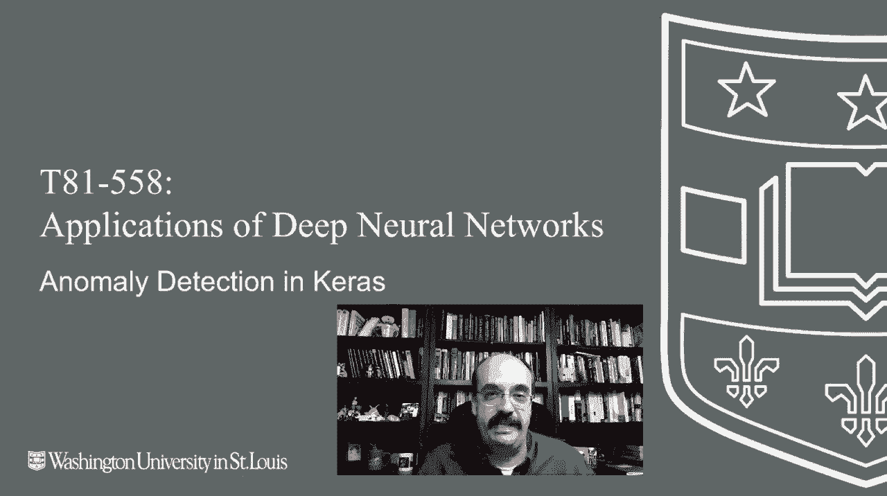

# 【双语字幕+资料下载】T81-558 ｜ 深度神经网络应用-全案例实操系列(2021最新·完整版) - P74：L14.3- 使用自动编码器在Keras中进行异常检测 - ShowMeAI - BV15f4y1w7b8

Hi， this is Jeff Heaton。 Wecom to applications of deep neural networks with Washington University。 In this video， we're going to look at anomaly detection。 How can you detect something that is not the way it should be。This has great application in computer security， but in other fields as well。

 We'll have a look at that in this video for the latest on my AI course and projects。 click subscribe and the bell next to it to be notified of every new video。 So now let's look at a use of autoencors。 We're going to see how an autoencor can be applied to anomaly detection。 I have a link to a couple of other tutorials on the internet that talk about various ways to do anomaly detection in Kes。

 Some of these might be useful to you。 The approach that I'm using here is using an autoencor and looking at the error of the autoencor to determine if the data are unusual compared to the previous data that we've seen。 We're going to make use of something called the KDd99 data set。

 We'll use this in two parts of this course。 We'll use it to create an intrusion detection system in the next part。 This is an older dataset at 2019。😊。

is now going on 20 years old。 So this is this is an older security data。 It's got enough columns and whatnot that it is useful。 I don't know that I would base anything on current research。 meaning trying to create systems that detect current intrusion detections or current anomaly detection based on 20 year old data。

 but it is a good sort of hello world for security， and it's not trivial。 It's a decent amount。 It's not big data by any stretch of the imagination， but it's useful。 So we'll see it here。 It's good for examples。 I wouldn't use it for current research。 That means said I see papers published with it frequently， but of of varying quality。

 I don't include it with the Github repository because it's decently large。 but this command here will allow you to download it I'll go ahead and run this。 it lets you know where you download it to fearing coab。 You may need to put it on your。riive somewhere I'll try to put specific instructions for coabab in here。 So now we've got the data。

 And I displayed the first five rows。 You can see what this looks like。 This is network type data。 This was created in a simulated environment for a competition K kind of an early tagle and doesn't show all the data。 There's quite quite a bit of it。 But what I am going to do is let's take this data and grouped by the outcome。 So these are the outcomes buffer overflow FTP right guess password。

 Those are all different types of attacks that were simulated in this。 Some of these are still attack types today。 Some of these are probably pretty uncommon 20 years later。 definitely be be aware of that normal is one we're particularly interested in because that means nothing is happening。 So we're going to train it that the normal or well normal and the others are the anomalies。

 So we're going to train a neural network to detect。Things that are not like normal。 We're going to do this completely with a autoencoder。 I create two functions to help us preproces this， one that encodes the z scores and one that encodes dummy variables。 and this is my preprocessing form。 You can see there's a lot of columns here。

 and I'm encoding basically in Z scores and dummies。 Those are the only two transformation types that I'm doing So I'm keeping things relatively simple。 and we drop any Ns。 rows that have Ns。 There's not really that many。 and you can see the rows here。 You can clearly see the effects of the Z scores。 Now。

 what we're going to do is create a mask that has the normal and the attacks。 that way we're able to segregate this data。 We're going to drop the outcome because we're not really training on the outcome。 that's essentially the target。 really， this is unsupervised learning once you get it separated into into these two groups。 such as the nature of autoenderrs。 We'll go ahead and run that。 and you can see。

Normal counts about 97 k attacks are much more common in this dataset set。 We separate it out so that we have the x for the attack and the x4 normal and then we're going to break this into a train test split we're breaking normal up is we're going to use normal to evaluate it。

 we're going to see if the normal looks like normal data to it9 anomaly Now we're going to use an autoencoder for this and we've talked about autoencors before。 but just so these videos somewhat stand alone just to give you a quick overview of this。 an autoencoder is essentially a neural network that has sort of a skinny hidden layer structure。 the idea is you have a number of inputs now you're going to have all the Kdv99 inputs for this particular one you do have the bias neurons like you do in most networks and you have an output count equal to the input count。

 and what we're going to do is basically train the auto encoder so that。It is able to produce the same input as output Now that seems useless。 but that is teaching it essentially to do feature reduction and simplification so it teaches it to take all of these inputs。 these five inputs are 100 as we will have probably with KDD99 and represents them as just the two numbers being output to the hidden one and hidden2 Now all the weights leading into here are the encoding weights and these are the decoding weights so those are what it learns。

For how to decompress it Here， we're going to build our autoencoder。 We are going to have a little more complicated autoencoder than here。 So we're going to have essentially 25，25，3。 We still have this very thinning area but we have a little bit of sort of an hourglass。 So it's almost like we have three hidden layers here to actually give us our compression capabilities。

 So I'm going to go ahead and run this。 It will actually fit it。 So it's going to take it a little bit to fit this neural network。 I will fast forward this part。 Okay， it's trained just to explain sort of the theory of what's going on here。 We trained this just on the normal data。 and it is being trained un superupervised。

 So we're not even giving it the outcomes。 There'd be no point to give it the outcomes because they're all normal。 So the outcome would be the same。 Since it's learning to compress to reduce the dimensions。 the way the dimension reduction or compression in general works。By using patterns to represent common portions of the data。

 So it's simplifying it that will only work on cases where the data coming in is pretty similar to that。 Now， I'll give you a perfect example of a unintended anomaly detector。 Now。 cell phones are a lot better about this。 but earlier cell phones。 the way that they would compress is they knew a lot about the human voice that would normally go through there so they used the ranges that the human voice was normally in。

 they only compressed it and degraded quality in such a way so that it would not be annoying for human voices you'd still recognize the voice you would still be able to understand it。 However， if you tried to play music through a cell phone or other other tones that the compression algorithms simply were not designed for。

 they would not be reproduced as well。 there would be static and other distortions in that。Becauseuse those different tones other than what the compression algorithms were built for are different。 They're anomalies。 and the cell phone detected the anomaly。 Not rather designed for。 It's just an example， but it detected the anomaly by distorting it。

 That's what we're going to see here。 We'll put data into the input and look at how similar the data is in the output to the input。 because the autoencor is meant to be a straight pass through， but it compresses in the process。 So it compresses and then expands。 and we want to make sure that we're not seen too much distortion in that process。 because if we are， then the data coming in are probably different。

 then the data that this was originally trained for。 Now we saw earlier in this course that you could use chaos statistics and other things to determine if your data have changed to the point that your neural network might need to be retrained。 This is another great way to do this。 Anomaly detection and detecting。If your data is sufficiently like the training data to know when to update your neural network are all very similar。

 let's go ahead and run it and do just that test。 So let's run this cell now and we'll see the results。 first I'm going to ask it to predict on the normal test and then I'm going to score it basically seeing how well these predictions lined up to the normal test that it was trained on。

 so we're literally seen。 So if you look at it here。 the two in sample now the ens samplele normal attack。 this is essentially the data that it was trained on。 So you have to take that with a green assault。 these are normal data that were not part of the training set。

 but you can see that the RMSse for both of these two is right around 0。3 notice the RMSE is higher for attacks because they are anomalies and these are all pretty simple。 We're doing predictions on the X normal test and then we evaluate the error based on the same thing。 So we're seeing how well can this。To flow through the auto encoder with minimal distortion。

 the more distortion you see， the more likely it's an anomaly this content changes often so subscribe to the channel to stay up to date on this course and other topics and artificial intelligence。