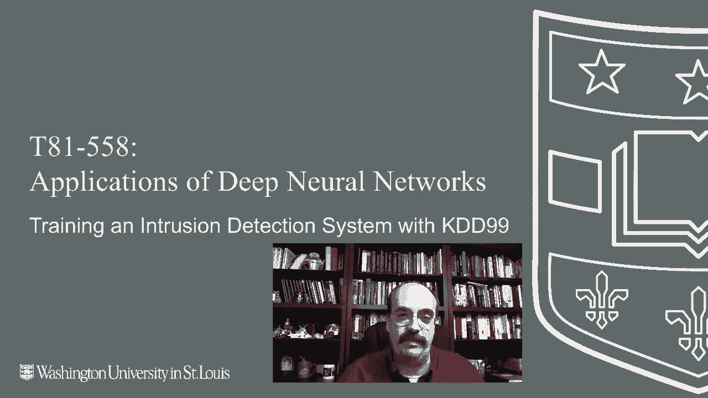
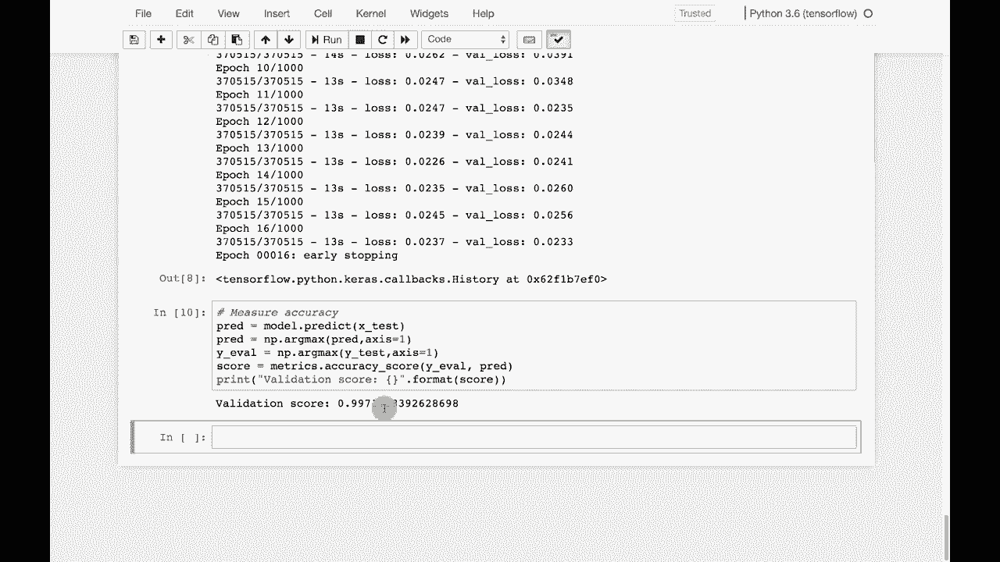

# 【双语字幕+资料下载】T81-558 ｜ 深度神经网络应用-全案例实操系列(2021最新·完整版) - P75：L14.4- 使用 Keras 训练入侵检测系统(KDD99) - ShowMeAI - BV15f4y1w7b8

嗨，我是 Jeffy，欢迎来到华盛顿大学的深度神经网络应用。 在这个视频中，我们将查看入侵检测系统，以及如何使用 KDD 99 数据集来实际训练其中一个，了解我 AI 课程和项目的最新动态。

点击订阅和旁边的铃铛，以便收到每个新视频的通知。我们将看看如何构建一个入侵检测系统。要做到这一点，我们需要一个数据集。我们将使用与异常检测相同的数据集。这是 KDD 99 数据。我会简要重新介绍这个数据，以便这些视频可以按任何顺序完成。

但这是 1999 年的数据。所以它已经 20 年了。请对此有所了解。这是一个很好的安全示例数据集。我不会在上面训练任何当前的安全检测系统，因为 20 年来攻击的性质可能已经有所改变，这真是年内的低调说法。

也许，但我们要做的是去。

继续读取 KDD 99 数据集，我们在这里完成了。我不能将这个数据直接构建到类中，因为我不拥有它，所以如果你在使用 Google Colab，你确实需要下载它。你可能会将它加载到你的 G 驱动器中。这些都是我们将要使用的数据列。让我继续运行这个。它会显示前几行。

你可以看出这是一种非常 TCPI 互联网类型的数据。我们可以运行我给你的这段代码，帮助你分析它。这只是让我初步了解这些数据，以便我知道如何编码它。好的，这里是这个的分析。我发现这对我查看的数据集非常有用。

你可以基本上看到像协议类型这样的内容。它显示了 57% 的 ICmpP，TCP 是 38% 等等。这让你对拥有多少相似值有了一个了解。这在创建分类变量与连续变量时为我提供了指导。因此，像下方的源字节为 0%。所以，0% 的重复真的没有看到任何真实的重复。

所以它无法在其他数据中找到分类值。一旦我有了这个。我继续使用我为异常检测展示的同样两个函数。我们将使用 Z 分数和虚拟变量来编码。因此，我确定为分类的所有值。

我将对所有连续值进行虚拟编码，我将编码 Z 分数。现在，如果你处理的是需要高准确度的东西，这通常只是第一步。你会在编码和特征工程上更加创新。因此，这基本上创建了特征向量。现在我准备在它上面实际训练神经网络了。

我正在训练它来预测结果。结果要么是正常，要么是可以发送的多种不同类型的攻击。现在我们使用的是分类交叉熵。因此我甚至在尝试预测攻击类型。它正在训练网络。我将快进这一部分。这个组我将展示我们可能获得的结果。

所以这些都是不同类型的攻击，例如Smurf在那时非常流行。😊。正常情况有97,000个，因此正常案例相当多。一些攻击类型非常罕见，比如pearin和spy。但这些基本上是我们现在试图分类的内容，现在神经网络已经训练完毕。我们可以测量它的准确性，准确率非常高，0.997。现在。

这也是使用KDD99数据集时需要记住的另一件事。它已经存在了一段时间。获得良好分数并不困难，因为数据在这些不同类别中分隔得非常好。一旦这个数据集经过研究并真正理解后，值得注意的是，即使在2019年，你仍然会看到一些论文讨论。

在这个特定数据集上达到99%的准确率就像是任何具有研究意义的东西。这在很大程度上是一个用于入侵检测和其他安全特征的示例数据集，至少在2019年，所以一定要意识到这一点，但它确实为这些类型的技术提供了很好的示例。此内容经常更改，因此请订阅频道以便及时了解本课程和其他人工智能主题。

