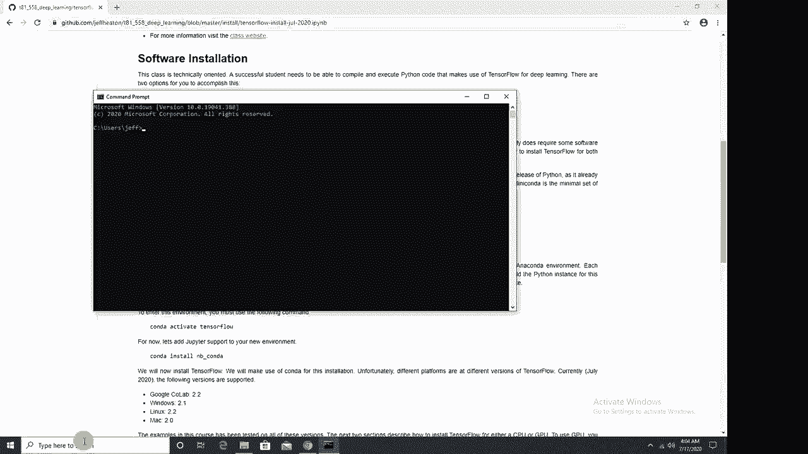
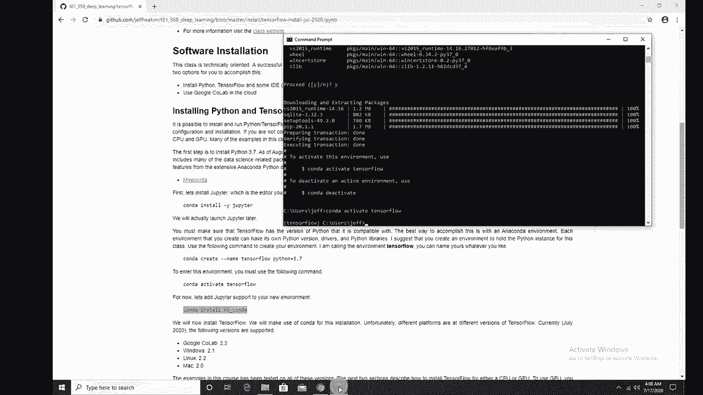
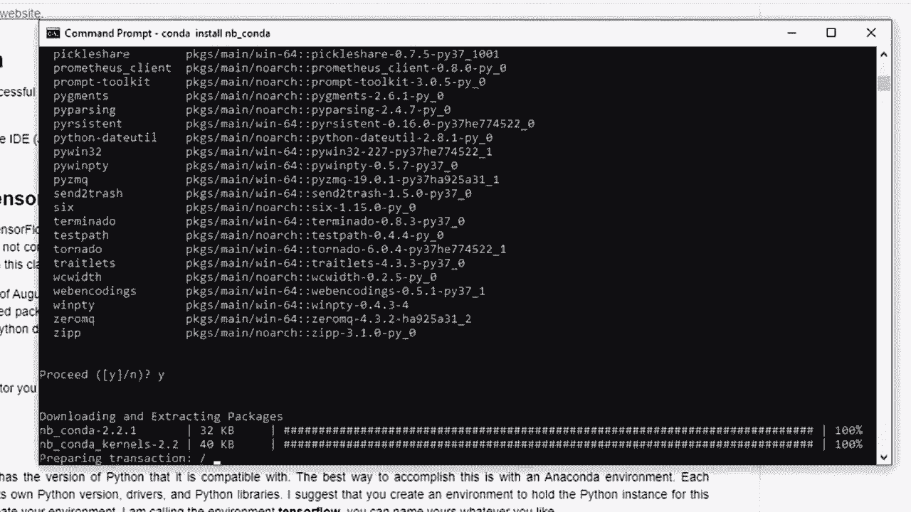
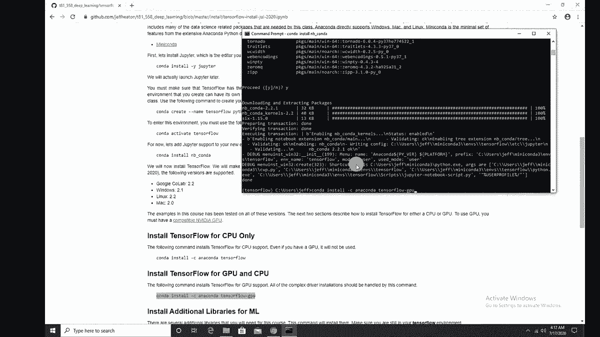
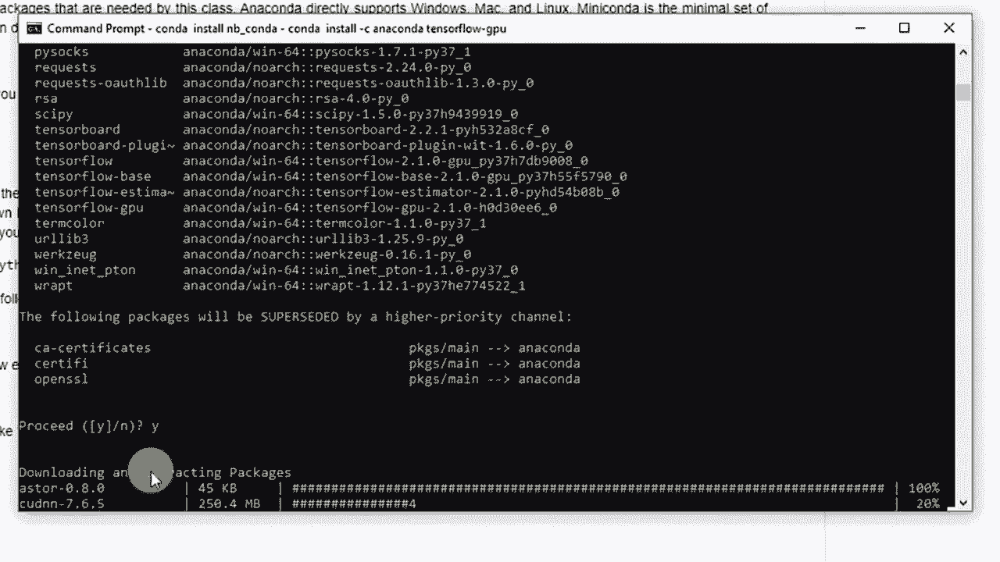
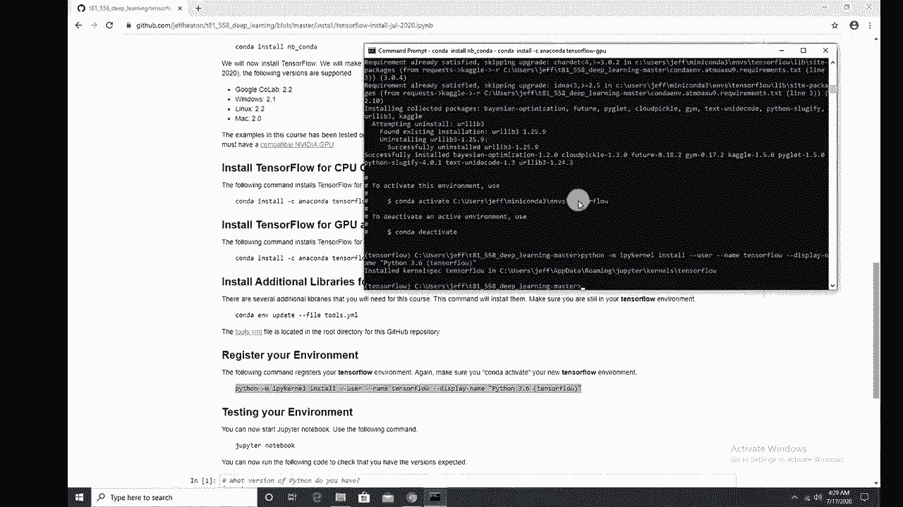

# 【双语字幕+资料下载】T81-558 ｜ 深度神经网络应用-全案例实操系列(2021最新·完整版) - P8：[讲座] 使用 CONDA 安装 TensorFlow／Keras CPU／GPU版本 - ShowMeAI - BV15f4y1w7b8

Hi， this is Jeff Heaating。 Welcome to applications of deep neural networks with Washington University。 So to get going in this class， you need to be able to run the examples。 run your assignments and get them running。 It's working in Python。 So you're using Tensorflow with Kis in Python。 You can install this all onto your own computer。

 And in this video， I talk about how to do this to see all my videos about Cale neural networks and other AI topics。 click the subscribe button and the bell next to it and select alt to be notified of every new video。 If you don't want to install a lot of software on your computer。 maybe you're not as technical with dealing with the command line。 Then I recommend Google coab。

 Either way， you're gonna have access to a GPU， which is a graphics processing unit。 Now。 you may not have a GPU that's compatible on your actual computer needs to be Nvidia。😊。

And it needs to be one of the later ones。 you can Google the capabilities of the GPU in your actual machine and find that out。The GPU is， it's a card basically there。 I'm using a Titan which is fairly high end one in this computer。 but I recommend you maybe try this on your computer， try it and coab， see what works best with you。In this video， we're going to see how to install Python with Tensorflow and Kes on your computer。

 I'll cover both how to do it with a GP and just straight up CPU。 due to some advances in Anaconda Python。 Those two processes are really pretty similar。 Okay。 let's start with the installation process。 Okay， I'm going to show you now how to install the。Fileles that you need to actually use TensorFlow for either the CPU or the GPU will cover both。

 and this allows you to run the class examples for my applications of Deep neural networks class。Even if you're not following along with my class， this will get you a Conda environment set up so that you are in a good place to actually begin working with TensorFlow and Ks。

Now I'm starting with a brand new fresh install of windows。 So that's why it's saying activate windows。 I do actually pay for Windows。 It's just when I install it for just something that I'm going throw away within a day。 I usually don't activate。 I don't want to confuse the the Microsoft activation server。

 which it would probably figure out okay So this is a clean build， I do have Chrome installed。 I am mostly familiar with Chrome。 I'm not that familiar with edge。 So I want to not be tripping over unfamiliar software。 and that really doesn't matter to the install。 What we're gonna do is if you search for Jeff Heaton and Github。

 you can see my Github here and the files and instructions that you need are here。 And if you go to T 8 to1 applications of deep learning。 This is it go ahead and go into well while you're here at the main page。 go ahead and click code and download a zip。 You can also use。

Clone， depending on how sophisticated with get you are。 But this will work just fine。 So downloads that zip file while that's downloading。 I am going to go ahead and go into the install folder that I have set up here。 I've got a couple of these here。 if there is a newer one here。

 Probably try to find the YouTube video that goes along with that because this does change。 this is the July 2020 version， I will try to keep that one there as long as possible。 I'll only rerecord the video or create a new file of that。 if it changes so much that this video is just no longer relevant。

 But I tend to rerecord this at least once a year。 Google always makes some sort of change to how this goes that that causes me to rerecord So we'll go ahead and open this one。Essential what I'm telling you to do here is install minconda。 you can use Anaconda if you prefer Ananaconda has every package and its brother known to man。Installed， I tend to like to be more minimalistic， but this is a personal thing。

 You can install whichever one you desire。 But let me go ahead and go to the Mincona link。 I'm opening in another browser so that I can get back to it。 We're gonna install Python 3。74 Windows。 The Mac installation is really mostly the same as this video。 I'll probably record a Mac specific version of this video。 at a later time。 Okay。

 we're going to use Python 3，7 and 64 B。 If you happen to have a 32 B machine。 Tensorflowlow is not gonna work anyway。 use Google coab。 Also。 if you're just not a software installation person。 You're more of just a coder。 not not a command line hacker。 Google coab is great and highly recommend。

 So let me get this downloading。 It should be pretty quick， but I'll fast forward through it。 Okay。 once you've got that， go ahead and run it。 I just double clicked it。Click next。 agree。 I prefer to install it really just for me。 I don't tend to have multiuser computers。 but and that directory is fine。 It's under my user directory。 Always remember where it is。

 because you may end up going there to adjust things later。 I do vary from the default on this one。 I prefer to add it to my path environment。 You can use the Ananaconda prompt as well。 Both of them should work without changes to these instructions。 The only case where this might mess you up is if you have other software on your machine that is dependent on a version of Python they previously installed and changing that global path is going to force them to use this new version that you're installing。

 So be aware of that。 I'll click install。 The Ananaconda installation will take much longer than the Minneconda installation。 So this should go through pretty quick。 All right， and we're pretty much there。 So click next。 and I don't need tutorials， and I don't need to learn more about Anaconda。All right。 so now that's installed。Before we get too far with this， that file that you've downloaded。

 I've got a couple of files in here from different things I was experimenting with on this build。 but you can ignore those。 This folder here， which is what you downloaded from my get repository。 I'll go ahead and open that Im to just drag it to the desktop for now needs to unzip it。 and I'll go to my user directory。

And just copy it into there。 So now I've got it ready to go。 These are all of the class examples that give you a few files to test it and other things。 There's really just two files that you actually need。 You can， you can download those as well。 if you don't want to download the whole thing。 So you successfully installed them in a Conda。

 Now you need to open a command prompt CD。 This might work in Powerhell， too。 I'm not that familiar with Powerhell。 And I'm just going to do Conda install。 minus y Jupiter。 We'll go in fast forward through this。 This might take a bit。

Okay， Jupiters installed。 Now what we're going to do is create a Conda environment。 An environment holds all of the Python libraries and everything that you need for a particular project。 You get a base environment that you start out in。 I tend to just use that just to run Jupiter and I use the underlying environments to for each of the custom configurations that I need for various projects。 The other thing that's great about these environments is you can automatically install the GPU drivers that you need。

 and it just greatly simplifies the installation。 and it prevents collisions。 You might have an old environment that is using old coupa drivers。 a new environment that's using newer ones， and it just really takes a couple of hours off your installation time。 So I'm going go ahead and create a new Connda environment。

 I'm just going to copy this and paste it into here。 Now the important things are Tensorflow。😊。Is the name of the environment。 you can call it whatever you want to。 Just make sure you change it in the subsequent command so that everything lines up。 and then this is the version of Python that we're using 3。7。

 The versions of Tensorflow that I am using for the fall 2020 semester that I'm setting this up far require or at least can use Python 3。7。 I will up this in the future as I modify these instructions each semester。 But for now it's Python 37。 So I'm installing this。 say yes， we'll fast forward through this。 It's pretty quick。 Okay， it is done。 So now we're gonna do Conda。

Actate the command that I have here is the same that they're suggesting here。 so conda activate。Tensorflow。And press enter， notice your prompt changes。 You're now in Tensorflowlow。 Now a lot of these commands that I have down here require that you be in this Tensorflow environment that you created。 whatever you happen to name it and won't work if you're not。

 so make sure that if you're finishing this over a couple of passes that you always go back to kind of activate Tensorflow。

And a very common error that people always ask me about is you'll get a DLL error。 And if you get that， it's usually because you're not in the environment。 So now let's run this Conda install N Bconda。 This just gives you some needed tools so that you can link this new environment to Jupiter notebooks。 Jupiter notebooks are basically the editor we're using on this course。

 I'll fast for this and it's done。 Now we're ready to install Tensorflow。

Now as of the recording of this video， we're right around the Tensorflow 2。0 to 2。2 version。 The platforms that we're dealing with in this course are Google Coab 2。2 Windows 2。1 Linux 2。2 and Mac 2。0 General， I found that Mac is the most behind as far as what Conda has released for Tensorflowlow versions。 and Linux Linux and Google Coab stay practically neck and neck are the more current ones。Now。

 if you're using Windows 10， you can actually install a Linux subsystem in your Windows environment and actually install the couta drivers to go in conjunction with that。 I'm going to do a separate video on that。 If you're a relatively advanced installation。

 not afraid of the command prompt user。 you may want to do that。 I think that is sort of the best environment in Windows， but I will soon have a video on that。 and I'll link it in the description。But we're doing Windows。 So as of the writing of this。 Windows is 2。1 of Tensorflow that Conda supports。 Now you can use CPU only or GP and CPU GPU is great if it just magically works if it doesn't magically work。

 You've more got to install the drivers and everything and get couda and co DN and all these various things working cross your fingers and hope that this works if you are doing it for GPU。 If not， I have another more handson video showing how to literally install all the drivers。

 that might be an option， but I will be honest with you installing all the GPU drivers can be a headache。 and there's various other options for using the GPU like Docker images。 I'll probably do videos on those in the future。 I do have a GPU on this machine， I have a Titan RtX。 So I am going to go ahead and use this command， but if。W to install this just for CPU。

 use this command。 If you want to be really fancy， set up two environments。 And that's what I actually have on my work machine 1 for CPU 1 for GP。 And then you can switch between them。 So I'm just gonna paste that in there。 by the way。 quick way to paste is just right click。 Make sure you're in your Tensorflow environment and run it。

 potentially if things are going to go wrong。 This is this is a good place for them。 maybe to go wrong。 So if you do get an error here， go ahead， copy， paste it and Google it。 You'll probably find something on stack overflow And hopefully that will guide you。 You can always post it to the comments here。 and maybe somebody will have an idea。

 I'm going go ahead and say run。😊。

I haven't seen everything that can possibly go wrong， so I may or may not be able to help you。 but if it's something I've seen， I will post a reply in the comments and also look in the comments。 see if anybody has had the same issue as you and got a response from somebody possibly me。 We're going fast forward this。 This takes a little while。

All right， no errors。 So that's good。 Now， the next thing we're going to do。 we're going to install some additional libraries that my class needs， but these are all very common。 I I suggest maybe using this as a starting point。 They're located in this tools do Yaml file。 and that is inside of that zip file that we downloaded earlier。

 or you can just download that file directly if you don't want to download everything。 And you can see it right there。I am going to basically copy this command。So。 and then paste it into here。 again， make sure you're still in your tensorflow directory。 If you've closed your dos prompt and reopened it， then you might not be there。

 So we'll go and run this。 This takes it a little while to install these。 This is installing things like psyit learn and other other things that we need for the class。 I'll go ahead and fast forward through this。 Okay， and we're done。 You don't need to reactivate it。 just ignore what it sent there。 so long as you're still in Tensorflow or whatever you named it。

 you are fine。 Now， this is a very important command here。 If you don't do this。 you won't see your new environment in Jupiter， and you won't be able to use it。 So we're going to run this command here。 Now， if you run this command。 and you get an error like it can't find the Iy and kernel。

 That means that you forgot probably to run this conda install and beconnda。 I get that question from time to time。 So just so you're aware of that。 gonna paste that into there。 This happens quick。 So it's done。嗯。Now， what we're going to do is we're going to run Jupiter notebook。 Now， on Windows， it is very， very important that you start your Jupiter notebook in the environment that you're planning on using。

 It's a little silly that in Jupiter notebook， you can pick between all these environments。 but you have to have started in that one。 So it's， it's almost redundant on Windows。 But nonetheless， this is how Windows works。 There is a github issue open about it。 So maybe they'll fix it at some point。

Then I'm going to run Jupiter。Notebook。By the way， if you try to run this from outside of Tensorflow。 don't you don't do the Conda activate Tensorflow， you'll get a DLL error。 I'll demonstrate that actually， since it is a very common error that that people get。 So I'm going to run Jupipyter notebook。 It's going launch a web browser。

 and I'm going to go ahead and open up Class1 overview。 Now in you do need to select I called it Tensorflowlow here， if you called it something else。 you need to doda kernel change kernel and pick the one that you that you have。 which is which is right here。So we'll go ahead and actually。

 it looks like my instructions named this 3。6。 even though we are using 3。7。 So I'll update that。 that's just a label。 It does not matter。 But I'll do kernel restart and run all And it's gonna run this part here。 which is critical that tells you the version that you're running of everything。 So Python 377。 So yeah， I need to update my label there， which is easy enough。

 And then the key here is the Tensorflow version as of this video， 2。1 is the latest that you can get on Windows unless you literally install everything kind of from scratch without kind of helping you。 which is which is not horrible， but it's doable。 notice GPU is available。 So I've successfully installed this for GP。 if you installed it for a CPU。

 it'll say GP is not available。 So this this is how you get this up and running for GP or not for CPU。 Now let me show you a very。

Common error。 Hopefully you're not getting this error。 but I just want to show you some of the most common things that can go wrong。 Now。 if nothing's going wrong， you're done， please subscribe and hope this was helpful for you。 Now。 if you're if you're getting other errors， here's one of the most common ones。I'll do Conda。

Completely like you're just starting up， believe me， I make this mistake all the time。 and I go into the course files and I don't do a con to activate。 I just go Jupiter notebook。Now。 in Mac and Linux， this will， this is fine。 There's no issue here。 But in Windows。 this will cause an issue。 So I'm going to go into class 1 overview， just like I did before。

 And I'm going to do kernel， restart and run all and notice the error that I get here。 By the way。 this is the error that you would probably want to copy and paste and Google on。 But DLL load error。

It just means you did not activate your environment prior to running this。 So， just be aware of that。

Thank you for watching this video。 Now this seems like a hairy process that maybe you've tried and didn't work that well。Feel free to use Google coab for the class assignments and examples。 It really works quite well。 I test everything with Google coabab。 So you should be fine。 If you find this kind of thing interesting， please subscribe to my YouTube channel or give me a like if this video helped you out。

 Thank you very much。😊。