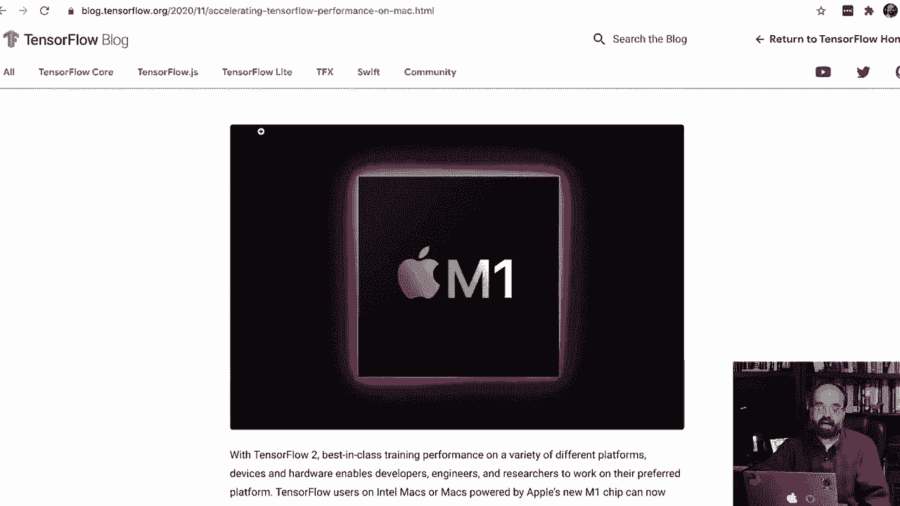

# 【双语字幕+资料下载】T81-558 ｜ 深度神经网络应用-全案例实操系列(2021最新·完整版) - P9：[讲座] 在Mac OSX中安装TensorFlow 2.4、Keras和Python 3.8 - ShowMeAI - BV15f4y1w7b8

嗨，我是Jeffheat，欢迎来到华盛顿大学的深度神经网络应用课程。让我们安装TensorFlow Kiura的Auto Macintosh。

🎼现在这将仅使用CPU，实际上在Mac上无法使用GPU进行Tensorflow，除非付出极大的努力。Mac不支持Nvidia GPU，而且Tensorflow早已停止对Mac的GPU支持。M1 Mac有一些非常新的功能，使用Apple开发的ARM芯片，这非常新，我还没有经历过，目前我没有M1 Mac，但这可能是我未来会更深入探讨的内容。如果有人有M1 TensorFlow的经验，请在评论中分享，我很想听听你的结果。那么，让我们开始吧，我建议你下载并安装Minconda。这在Mac上是可用的，获取你能找到的最新版本，3838就是这样。

我们将安装TensorFlow，因为它支持Macintosh上的该版本。我将获取Pkg，这比bash安装要简单一点，bash与在Linux上的安装方式相似，所以你可能想走这条路，但说明会稍有不同。如果你愿意，可以安装完整的Anaconda，我倾向于选择更简约的方式，只安装我需要的软件包，这样我知道我安装了什么。如果你想安装Anaconda，那当然也可以，你只需访问Anaconda页面，下载它。我将打开刚刚下载的包文件，点击继续，继续许可证，我同意安装类型，我将让它安装到默认位置，这对我来说完全没问题，点击安装，它需要我进行身份验证。

现在正在进行安装。这可能需要一点时间，所以我会快进。好的，安装完成了。我会继续点击并将其移到轨道上。所以现在我回到之前的安装说明。我将打开终端。现在Mac已经从bash切换到Zsh。如果你输入P，它会显示你在Zsh上。如果你不在Zsh上，可能想要切换到那。还有其他文章介绍如何做到这一点。如果你买了最近的Mac，它会已经在Zsh上，但请注意，这可能会给你带来一些问题。还要确保你有最新的Python版本，输入Python --version 3。

如果你得到的是其他版本，而你使用的是包安装器，并且如果你在27这个古老版本的Python上（Mac自带的版本），重新启动希望能有所帮助，如果没有，那你需要更新路径，网上有关于如何做到这一点的文章。

但实际上，Python Minconda应该会自动为你安装这些，所以我将运行`conda install -y jupyter`，这会为我安装Jupiter notebook。我会快进，这有时需要一点时间。好的，我们有了Jupiter，接下来的部分是基本上使用我提供的Tensorflow YML文件，我们将下载那个文件。我将打开它，你可以在这里看到，如果我稍后更新了一些内容，这可能会有所不同，但我还没有需要重新录制视频。所以我将把它放在我用户的Jheaton目录中，你将把它放在你的用户目录，这并不是最好的地方，但这个例子可以工作。我建议你完成后删除它。这里我是用户Jayheaton，或者你可能是其他人，我将返回并执行这个命令，复制它，这个命令可能会有所不同，我不认为我会更改这个命令，但总是复制并粘贴，不要直接从YouTube复制。接下来我将运行这条命令，这将为我创建一个Tensorflow环境，这样我就可以在那个环境中拥有不同的版本。

Python比我在主机环境中实际拥有的版本更多，这样可以很好地组织一切，避免在安装其他Python包时意外损坏Tensorflow环境。因此，我们正在安装它，这将让我们获得Tensorflow，至少在2021年1月录制时，它会给你Python 3.8和Tensorflow 2.8.5。

4是我们当前学期课程使用的版本。现在这通常需要一点时间。所以我会快进。好了，现在我们可以激活这个环境，运行`conda activate Tensorflow`。每次你启动Jupiter notebook时，记得执行这个操作，以确保你在那个环境中。

我已经激活了，现在我将执行安装，这让我能够将这个环境添加到Jupiter notebook中，这可能需要一点时间，所以我会快进。继续，是的，快进，这很重要。我们将注册环境。

否则它将不会显示。Jupiter，所以我将复制整个长命令。我不想手动输入。确保你在 Tensorflow 文件中拥有 3A 的任何版本，我会更新这些，但请在这里复制粘贴，因为这可能会在今年晚些时候或更久以后是更新的版本。我通常能用大约一年的时间，有时在录制这些视频前会有六个月的时间。我将保持这个节奏，现在我们将测试 Jupiter，我会给你一些代码，我们将想在 Jupiter 中尝试。我将进入 Jupiter notebook，它会在我的浏览器中启动 Jupiter notebook。我要创建一个新的 Python 3 Tensorflow，你可以看到它在那里并且应该正在运行，你不应该看到内核失败或类似可怕的事情。我将复制这个代码，我们将运行，这在第一次执行时可能会花一点时间，所以我会快进，这太棒了，Kara 的 2。

4 Python 3。8 和 Tensorflow 2。4 所以这就是我非常关注的。GPU 不可用。但嘿，这是一个 Mac，GPU 很棒，但在 Mac 上，无论是笔记本电脑还是台式机，这其实都不是一个可用的选项。请关注这个视频和频道，以便与本课程保持同步，继续你的深度学习之旅。

