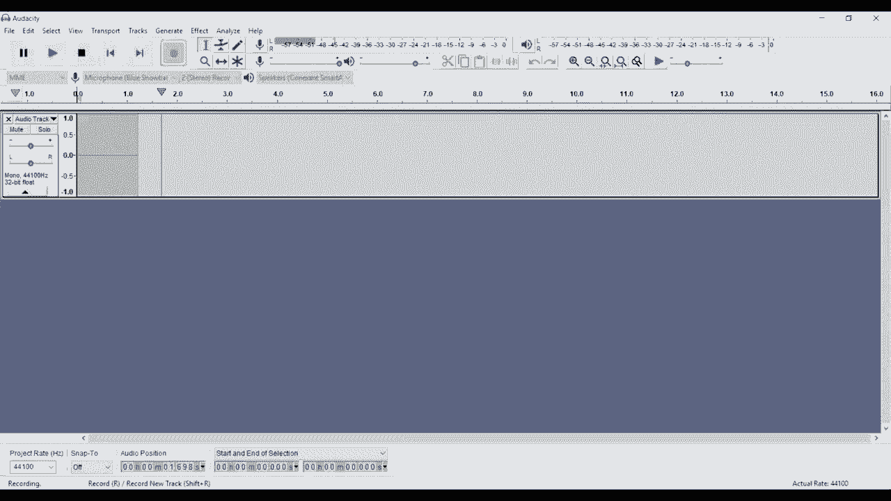

# 【双语字幕+资料下载】Tebleau操作详解，照着实例学做图！数据科学家的必备可视化工具，简单快速做出精美图表！＜实战教程系列＞ - P1：1）Tableau 基础知识 - ShowMeAI - BV1iq4y1P77U

Hi， folks， and welcome to another episode of Tableau in two minutes。 Today。 we're going to be doing something a little bit different than what we normally do。 and we're going to be walking through the basics of tableableau。 That is how you can go from opening the program for the very first time all the way through to creating a very basic dashboard。

 really， to give you an overview of how everything works in a sort of framework to hang your hat on and hang new information on as you watch other videos either on this channel。😊，Or on other channels。 So the first thing you get when you open up tableableau is this screen。

 This gives you some options to connect to data over here on the left hand side。 depending on which version of tableableau you're using， whether you're using Tableau public。 tableableau professional or tableableau personal。 These will vary somewhat。 obviously Tableau public has the most limited set of options。

 particularly when it comes to connecting to data that might be on a server。 you'll also be able to see any recent files that you've opened。 So if you have been working with other tableableau files they'll be listed out。 the thumbnails in this big view in the middle， I don't have any。😊，You may see some。 You may not。

 depending on how many times you've opened the program before and what sort of things you've done with it。The very， very。Esiest way to connect to data is to connect to data either via Microsoft exc or via a text file。You can use both of those options up at the top here。 We're going connect to some data using Microsoft Excel。 The process for a text file is very。

 very similar。 I am going select。The tableau superstore sales data set。We're going to go ahead and open that up， and you'll see that when we do open that up。 that brings us to a new page where we can define the data that we want to import into our workbook。 There's three sheets on the left hand side。 These are three sheets within the sample workbook within this superstore workbook。

 We're going to drag orders。Across to this pane right here。 And that's gonna import all of the data on the orders sheet into our workbook。If we wanted to。 we could also drag across people。And then we could use that as a join。 People actually has the number of sorry， the the region。

 along with the person responsible for leading that region。 And you can see that just by clicking on this join right here。 we can define how we want that to join。 We could even add。Returns in there as well。 If we wanted to do that。 again， this is joining by this order I D number。

 Those two are set up automatically because this is a sample data set It's designed to be easy to use These set up automatically。 If you wanted to change one of these fields， you can see right here。How you would change the field that you're joining on。 These joins work just like。Just like sequel joins。So you have an inner left， right and a full。Out to join。

 Don't worry too much about that if you're just getting started。 but I wanted to let you know that the flexibility is there。Once we have all this data。 we probably want to explore it。 So the first thing we're going to do is go down here where it says go to worksheet。 and we are going to click on sheet 1。 This view is where we're going to create every individual visualization。

 It's where we'll do a lot of the heavy lifting when it comes to building any sort of tableau workbook。 Any sort of tableau dashboard。 A lot of the work is done in this particular sheet。 So let's take a a quick tour， as it were， of all of the different areas of the screen。Over on the left hand side， we have all of our data items that are part of our data set。

 They're divided into two categories。 We have dimensions， and we have measures。 Dis are items that are typically categorical。 So， for example。 category that's going to be the category of product in our superstore data set。Measures are typically numeric， and they are things that we would add， subtract， divide， et cetera。

 These are normally the things that we want to display。 and we want to display how these change relative to one of these things， right？ So we want to know。 might want to know how many。How much money we have sold in a particular category of， of product。You'll notice also that these have different colours when you hover over them。

 that colourable colour will carry through as we drag them out onto our sheet here。 blue coloured items are disc。Green coloured items are continuous。 Most。 they align with the way the dimensions and measures are set up， but it's not always true。 So you have to well watch out for that。 You can do different things with continuous than you can do with discrete。

 So they all have a place。But they are。 They do work a little bit， a little bit differently。Moving out to away from the list of our fields here。 we have a number of different things that we will call shelves。 So we have the pages shelf。 the filter shelf， column shelf， the row shelf。And what's called the Marx card。

 which has a number of different shelves in it。 So we have the colour shelf， the detail shelf。 et cetera， et cetera。 And then we have， obviously， our visualization up here。 which will build up as we begin to move things out from our fields。Into。Our main page and onto each of these shell。 We'll talk a little bit about what each of these shells does as we go through。

Theseai。As we go through this， this exercise。So the first thing to do is is just to create a really simple visualization。 So let's take two different items。 We'll take product category。 as we talked about。 We'll drag that onto the row shelf。 And you can now see that our rows are defined by the category of our product as three categories。 Fni office supplies and technology。 Then let's take sales。

 and let's click and hold and drag sales out to the column shelf。 And you can see that now Tableau has automatically created a bar chart for us。😊，Which is good。 That works very well in this case。 Tableau is usually pretty smart about the type of visualization that you want to create with a particular set of dimensions and measures。If you wanted to change the type of chart， you can go up to the show me option here， and you can。

Click any of these options to try and look at how your data will be displayed with different types of visualization so we could try this highlight table。Could try stacked bars。Could try a bubble chart。You could try a tree map。Really low。 the best choice for this data is this is this bar chart。 So we are actually gonna leave it like that。For the moment。And。We're going to add a filter。

 So the way filters work is filters limit the amount of data that flows into your visualization so that we could look at this instead of looking at this。 for example， for all regions。 we can look at it for just one specific region。So to do that。 take filter， drag it out onto the filters shelf。 And then we have this window that pops up。 which allows us to select which regions we want to look at。

 We're going to select all for the moment。And then we're just going to click okay。 And you'll see the data didn't change because we're including all of them in our region。 If we wanted to change that。We can click on region， click editit filter， and then maybe exclude。The south and the west， from our filter。I'm moving this out the way so you can see And then watch these bars when we click。

 O。The bars change， and the scale changes in this case， because we have fewer。Data points， or sorry。 fewerer sales， because we're only looking at two out of the four regions。The other thing you can do with this is you can show it on this visualization。 So if we go ahead and click show filter， then you can see over on the right hand side。

 we get this filter box and you can click through different options。F filtering。And watch how the visualization changes with that。 So super useful if you're gonna have to change this a bunch of times and you want the data to update on your sheet。 you want an easy way to do it without having to click through all of these different sub menus to get to edit the filter。Once we've done that。We might want to take our visualization here and add it to a dashboard。

 So to create a new sheet or to create a new dashboard， we have these options down here。 We can create a new sheet， create a new dashboard or create a new story。 Sties we're not going to cover today。 They're a little bit more complicated。 Probably a little bit more in depth。 What we really want to focus on is the the bones of tableau。

 which is building worksheets up into dashboards。 So we have our first workshe。 We just built it。😊。So let's go ahead and create ourselves a dashboard。 Now， the dashboard view， as you'll see。 is a little bit different。 First of all， we have this。Tab， the dashboard tab。 where we can define the size of our dashboard。 We can add sheets to our dashboard。

 We can add objects that will help us define the layout。 We can show how we want to do the layout and we can choose whether we want to show the title or not。And then we have a second tab， which is the layout tab。 and this is where we're going to be able to fine tune how things are laid out within our dashboard。

 so you'll see we already have some containers on there。We don't actually need any of these containers I'm to delete them in just a second。 but you can see as we add sheets， they will appear in this hierarchy and we'll be able to move them around in order to make our dashboard as visually appealing as possible。 So to start with， as I said， we're just going to clean this out。So we' just cleared out everything。

 You can tell we've cleared out everything because we have this option for drop sheets here。We're going to take our first sheet that we created， and we're going drag it out。On to the dashboard here。 And you can see that it does several things。 First of all。 it drops the sheet along with a title and the bars and everything else。

 And it also has dropped our filter。 Our region filter up here because that region filter is displayed on the sheet。 It will be displayed on the dashboard。 If you want to remove any of these。 you can remove them so we could remove them both。By clicking the delete button。And then we go back to having。An empty dashboard。 The other thing you can do is you can drag it out。

 but hold down the shift key。 When you drag it out and hold down the shift key。 that creates what's called a floating layout。 So before this sheet was locked。To the full size of the dashboard and everything that came in would sort of tile itself together。 If you think of the way tiles are laid out on a bathroom floor。

 we would be aligning things like that。 sort of like a snap too grid or anything like that。 if you've used it in in other image processing programs。 This changes it so that now everything's floating so I can move this around to wherever I want。This is the way I typically start all of my dashboards with everything floating。That way。

 I can sort out where I want things approximately positioned。 And then if I want to put them into the grid， I can build the grid up as I begin to add interesting elements to my dashboard and I decide which ones I want to keep and which ones I want to get rid of。

Once you have everything in a floating layout， it can be quite challenging sometimes。 particularly if it's a complicated layout to put things in exactly the right place or to rearrange things or to say。 hey， I wonder what it would look like if I just moved this piece over here or if I moved it to the other side。 So super useful to start off with everything。Laid out nicely。

 The other thing I'm going to do is I'm just going to change this size Right now， we have a range。 So it has a minimum size and a maximum size， and it will float based on a screen。 I like to set it to a specific size。 So we're going to set it to a fixed size。 And then we're going to set it just to a。Browser sized window。

 And you can see that as we resized the dashboard， all of the elements within the dashboard resized proportionally。 it worked。 in some cases， it didn't work in the case of our filter。 So we're going to have to extend that a bit。 So that's something to be aware of。 It's worth picking the size first， then beginning to arrange all of the items within the dashboard。

 If you pick the size or you try and change the size significantly once you have everything laid out。 that's going to be quite challenging to maintain。So this dashboard is not particularly interesting。 right， because we only have one element on it at the moment。 What we want to add is a second element。That will allow us to look at how the two things interact with one another。

 So right now we are looking at sales by category。 So another thing that we might want to look at is sales by time。 So to add that， we're going to go ahead and we're going to use the button to create ourselves a new sheet。I am going to drag this sheet to rearrange items here behind the dashboard。 The reason I'm going to do that is because I want all of my sheets organized so that I have first sheet on the dashboard。

 second sheet on the dashboard。 then the dashboard。 If I was creating a second dashboard in the same workbook， I would do the same thing。 So I would have another sheet， another sheet and then another dashboard out to the right hand side。You can see that we've got a second blank sheet。Let's go ahead and drag sales out。 And this time。

 we're going to take sales to the road shelf。 And you can see it's automatically created as a bar chart because that's the best way to display sales。 but。What we're going to do is we're going to drag order date。Out to our columns shelf。 And I want to point out two things。 Number one， it has changed the type of graph that we have from a bar chart to a line chart。 because a line chart makes more sense when we have a date and order date is the data type is date。

 You can see that from the little calendar icon next to it here。 Secondly。 order date has come across as a year。 We have more detail behind order date。 order date goes all the way down to a single date。But when you drag it out。 it's gonna default to a year。And we can expand that。By clicking on the plus sign。

It goes to year to quarter to month， and then eventually out to the day。We can remove individual portions of this if we didn't want one by dragging it off。 and we'll do that in a second， but we can also contract it just by clicking on the plus。 sorry clicking on the minus sign， and that will pull everything back together。Now。

 I like it displayed at the month level。 I think that makes sense for this particular data。 but I don't like the fact that we're dividing it。With lines between each quarter。 So I'm going to go ahead and take quarter out。 So now we have the year and the month of our order date without the quarter in there。And as you can see。We have it displayed。Over time， by month。For the last four years。Excellent。

 looks good to me。 I like that。 Let's add it to our dashboard。 So I'm gonna go back to our dashboard。😊，You see， we have a second sheet here。 When you hover over it， it's going to give you a preview。 that's very helpful。 I'm going to drag that out。I'm going hold shift， rather。And I'm gonna drop it onto my dashboard。And then I'm going to expand it out to be nice and big。

And then。You can see now。That we have both the sales， and。The sales by category and the sales over time defined on the same graph。 Now。 these two things currently are independent of one another。 So this is showing us all of the sales over time。 And this is showing us， sorry。

 This is showing us the sales for each individual category for all of the time that we have。 whereas this is showing us the sales by month。For all categories。Good information。 But it would be helpful if we could have these two interact with one each other。 one another so that we had a better sense of what was going on。

 So the first thing is that when we change this region filter。It changes this sheet。But doesn't change anything to do with this sheet。So to fix that。We're going to go back to our bar chart。 I just clicked on the sheet at the bottom here。We're going to go up to our filter。And we're gonna go to apply to works sheetets。

And we have a few options。 Now， what this will do is this will take our region filter。 and then it will apply it across。All of our workshes， some of our works sheetets。 we can select which works sheetets。The two options for all of the worksheets are all items using this data source or all items using related data sources。 which is obviously including this data source。 For the moment we're just going to use all items using this data source。

 related data sources are a little bit complicated。 We won't get too deep into that today。 but just know that you can apply a filter across as many data sets as you have related。ACouple of things change。 first of all， if you hover over it。 it says that it also applies to sheet number two， which is the sheet we created with our line graph。

 and you can also see that we have this little sort of database type icon next to the filter。So this filter will now apply to multiple sheets or our two sheets。 rather。 if we click on sheet2。 you can see that we have the filter up here on the top left。 And if we go back to our dashboard and we start changing things， you can see that now。

Things change If we take all of them off， they both go clear。 So both things are changing in parallel。That is excellent。One other thing that we might want to do is have some contextual filters。 So one very helpful way to explore data is to be able to see something curious and then click on it。

 for example。We seem to have a spike in September 2014。 We have this spike in March of 2017 and this spike in September of 2017。 Wouldn't it be helpful if I could see how that spike broke down between product categories。 just by clicking on it。What tableau allows you to do that。This little item that looks like a funnel。

Go ahead and click on that。What that will do is that will set this sheet。 sheet number 2 to act as a filter for all of the other sheets on the dashboard。When we click on it。 I can now click on September of 2017， and you can see how the sales have changed between the categories looking just at September。 We can look just at March。 You can see how that changes。We can look again just at September 2014。

 You can see how that changes if you wanted to pick a specific year。You can click on the whole year。So we can click on 2017， we can click on 2016。We can click on different things。 I can control， click。On a number of months and see how every time I click on something。 it's changing this visualization at the top to show us what is。

Going on with just the highlighted data points。 When I want to click off everything。I can just click anywhere else。 clears everything。 And then we go back to our total。It would be helpful， too， if we could do the same thing with sheet 1。 If I wanted to see the trends in technology or in furniture， I can't do that at the moment。

 I can only see the trends for the total， so。Again， we're going click Use filter。And you can see that as we click on each of the product categories。It changes this time series graph at the bottom。 Again。 we could click on two if we wanted to changes this time series graph at the bottom to reflect what's happening in both of those two categories。

Now， there's a number of other refinements that we could make to this particular dashboard。 So let's go ahead and just make this a bit smaller。Maybe a bit bigger。 There we go。Move it down a bit。 We would probably want some sort of title。So we can create that by taking this text object。Again， dragging it up。

 I'm holding down shift so that I get a floating box。And it's gonna give me an option to enter the text。We just enter a sort of generic title at the moment。Again， if I want to edit it。 I can double click on it。I can change the font size。Make it nice and big。

 Drg it all the way out across the top。 And there I have a nice big。Title。 we also want to make sure that we give our visualization some descriptive titles。 So I just double clicked on sheet number one。 and you can see the default title for one of our sheets when it comes on a dashboard is the sheet name。Sometimes that's helpful。 Sometimes it's not。 So typically， we want to change it or add something。

 In this case， sheet 1 is the sales by category。 So we'll just call it sales by category。And apply it。And then click， Ok， You can see we now have a descriptive title for our first visualization。Let's double click on the second one。 This is sales by month。And now we have a descriptive visualization， or sorry。

 descriptive title for our second visualization。And fundamentally。 what we have is a very simple sales dashboard that we created in really just a few minutes。Using some basic tableau principles。Armed with this information。 I hope you're able to go out and explore tableau。 We have obviously many more advanced videos。

 If you wanted to get on to how to do certain things。 how to put a lot of information onto a dashboard， how to work with different data sources。 So check out our channel。 subscribescribe to our channel。 We have information on all that sort of stuff。 there's a link to this workbook that we just created。

 and to the data set， this sample data set in the video description。 So go ahead and download those and check those out。 if you wanted a little bit more information。😊。And obviously， as I said， if you like what you hear then click like or if you have any questions。 please leave the questions in the comments and we look forward to seeing you on other videos in the future。

😊。

